# ReviewComments_Plots
SLW  
July 21, 2017  

Load Packages


```r
memory.limit(10000000000000)
```

```
## [1] 1e+13
```

```r
setwd('Z:/ROBLAB1 coredata-databases/1 Samantha DATA Folder/PROJECTS/DNAmProfiling_PE_IUGR_2017')

##Read in phenotype data
Cox_des<-read.csv('CoX_Samples_2017.csv',header=T)
for (i in 1:nrow(Cox_des)){
  Cox_des$Row[i]<-paste(substr( Cox_des[i,"Sentrix_Position"], start=1, stop=3))
}
 Cox_des$Row<- as.factor(Cox_des$Row)
str(Cox_des)
```

```
## 'data.frame':	48 obs. of  14 variables:
##  $ ParticipantID       : Factor w/ 48 levels "COX_10134","COX_10170",..: 37 11 9 15 35 25 21 6 34 45 ...
##  $ Pheno               : Factor w/ 9 levels "Cont-preT-AGA",..: 8 7 1 1 1 1 1 7 8 3 ...
##  $ GRP                 : Factor w/ 4 levels "EOPE","LOPE",..: 2 2 3 3 3 3 3 2 2 4 ...
##  $ Cluster             : Factor w/ 4 levels "C2","C3","E1",..: 1 1 1 1 1 1 1 2 2 2 ...
##  $ IUGR                : Factor w/ 2 levels "No","Yes": 1 1 1 1 1 1 1 1 1 1 ...
##  $ Sex                 : Factor w/ 2 levels "F","M": 2 2 1 2 2 2 2 1 1 2 ...
##  $ GA                  : int  37 36 30 31 32 32 33 37 37 39 ...
##  $ BW                  : int  2875 2860 1380 1820 1780 2080 1960 2620 2570 3835 ...
##  $ BW_SD               : num  -0.48 0.01 -0.13 0.41 -0.31 0.5 -0.42 -0.81 -0.93 0.78 ...
##  $ Chronic.Hypertension: Factor w/ 2 levels "No","Yes": 2 1 1 1 1 1 1 1 2 1 ...
##  $ Maternal.Ethnicity  : Factor w/ 7 levels "Asian","Black",..: 3 3 1 3 3 3 3 3 5 3 ...
##  $ Sentrix_ID          : num  9.98e+09 1.00e+10 9.98e+09 9.98e+09 1.00e+10 ...
##  $ Sentrix_Position    : Factor w/ 12 levels "R01C01","R01C02",..: 8 2 10 10 6 10 1 3 7 11 ...
##  $ Row                 : Factor w/ 6 levels "R01","R02","R03",..: 4 1 5 5 3 5 1 2 4 6 ...
```

```r
 Cox_des$Sentrix_ID<-as.factor( Cox_des$Sentrix_ID)
 Cox_des$GA<-as.numeric( Cox_des$GA)
 Cox_des$BW<-as.numeric( Cox_des$BW)

##As IUGR is not fully represented in all 6 row positions, I group rows into levels 1,2,and 3 on the microarray
 Cox_des$row_grouped<-revalue(Cox_des$Row,c("R01"="1","R02"="1","R03"="2","R04"="2","R05"="3",
                                   "R06"="3"))
 Cox_des$row_grouped<-as.numeric(Cox_des$row_grouped)
rownames(Cox_des)<- Cox_des$ParticipantID

##Loading in DNAm Data- DNAm measured on the Illumina 450K array
load('CoxCohort.fnorm_Jan2016.RData')
Cox_Data<-exprs(PROJECT.fun)
Cox_Data<-as.data.frame(Cox_Data)
dim(Cox_Data)
```

```
## [1] 442028     48
```

```r
#colnames(Cox_Data)
##typo error was made-need to change CPX to COX 
Cox_Data$COX_9801<-Cox_Data$CPX_9801
Cox_Data$CPX_9801<-NULL
Cox_Data$COX_11387<-Cox_Data$COX_11378
Cox_Data$COX_11378<-NULL
Cox_Data<-as.matrix(Cox_Data)

all(colnames(Cox_Data)==rownames(Cox_des))##FALSE
```

```
## [1] FALSE
```

```r
Cox_Data<-Cox_Data[,order(colnames(Cox_Data))]
Cox_des<-Cox_des[order(Cox_des$ParticipantID),]
all(colnames(Cox_Data)==rownames(Cox_des))##TRUE
```

```
## [1] TRUE
```


```r
load('PROJECT.fnorm_Jan2016.RData')
Roblab_Data<-exprs(PROJECT.fun)
dim(Roblab_Data)##102 samples
```

```
## [1] 441093    102
```

```r
Roblab_des<-read.csv('Design_matrix_WPR_2016_ConSplit.csv', header=T)
rownames(Roblab_des)<-Roblab_des$ParticipantID
dim(Roblab_des)##102 samples
```

```
## [1] 102  30
```

```r
all(colnames(Roblab_Data)==rownames(Roblab_des))##FALSE
```

```
## [1] FALSE
```

```r
Roblab_Data<-Roblab_Data[,rownames(Roblab_des)]
all(colnames(Roblab_Data)==rownames(Roblab_des))##TRUE
```

```
## [1] TRUE
```

```r
##removing replicate samples
rm<-c("PL21","PL21r","PL64","PL64r1","PM139","PM139r1","PM72","PM72r")
Roblab_Data<-Roblab_Data[,-which(colnames(Roblab_Data) %in% rm)]
dim(Roblab_Data)
```

```
## [1] 441093     94
```

```r
Roblab_des<-Roblab_des[-which(rownames(Roblab_des) %in% rm),]
dim(Roblab_des)
```

```
## [1] 94 30
```

```r
Roblab_des$group<-droplevels(Roblab_des$group)
#str(Roblab_des)

##Double check that the columns of the data match the rows of the phenotype data
all(colnames(Roblab_Data)==rownames(Roblab_des))##TRUE
```

```
## [1] TRUE
```

```r
##Inputting sample position on the chip into the phenotype data
for (i in 1:nrow(Roblab_des)){
  Roblab_des$Row[i]<-paste(substr(Roblab_des[i,"Sentrix_Position"], start=1, stop=3))
}
Roblab_des$Row<- as.factor(Roblab_des$Row)
#str(Roblab_des)

##Row grouped- as IUGR is not fully represented in all 6 row positions
Roblab_des$row_grouped<-revalue(Roblab_des$Row,c("R01"="1","R02"="1","R03"="2","R04"="2","R05"="3",
                                   "R06"="3"))
Roblab_des$row_grouped<-as.numeric(Roblab_des$row_grouped)
```


```r
validatedhits<-read.table('Cox_Roblab_PersistentHits_Betas_Pval_GeneName_2017.txt')
  
##Subset data
Roblab_Data599<-Roblab_Data[which(rownames(Roblab_Data) %in% (rownames(validatedhits))),]
Roblab_Data599<-t(as.data.frame(Roblab_Data599))
Cox_Data599<-Cox_Data[which(rownames(Cox_Data) %in% rownames(validatedhits)),]
Cox_Data599<-t(as.data.frame(Cox_Data599))

##Roblab
Rob.pca <-prcomp(scale(m2beta(Roblab_Data599), center = TRUE, scale = FALSE))
summary(Rob.pca)
```

```
## Importance of components%s:
##                           PC1     PC2     PC3     PC4     PC5     PC6
## Standard deviation     1.6175 0.70569 0.45886 0.38574 0.31861 0.30126
## Proportion of Variance 0.4904 0.09336 0.03947 0.02789 0.01903 0.01701
## Cumulative Proportion  0.4904 0.58378 0.62325 0.65115 0.67018 0.68719
##                            PC7     PC8     PC9    PC10   PC11    PC12
## Standard deviation     0.26904 0.26083 0.23464 0.23013 0.2252 0.21851
## Proportion of Variance 0.01357 0.01275 0.01032 0.00993 0.0095 0.00895
## Cumulative Proportion  0.70076 0.71351 0.72383 0.73376 0.7433 0.75222
##                           PC13    PC14    PC15    PC16    PC17    PC18
## Standard deviation     0.20949 0.20593 0.19715 0.19613 0.19228 0.18639
## Proportion of Variance 0.00823 0.00795 0.00729 0.00721 0.00693 0.00651
## Cumulative Proportion  0.76044 0.76839 0.77568 0.78289 0.78982 0.79634
##                           PC19    PC20    PC21    PC22    PC23    PC24
## Standard deviation     0.18356 0.17766 0.17523 0.17319 0.16952 0.16785
## Proportion of Variance 0.00632 0.00592 0.00576 0.00562 0.00539 0.00528
## Cumulative Proportion  0.80265 0.80857 0.81432 0.81995 0.82533 0.83062
##                           PC25    PC26    PC27    PC28    PC29   PC30
## Standard deviation     0.16510 0.16053 0.15938 0.15688 0.15582 0.1532
## Proportion of Variance 0.00511 0.00483 0.00476 0.00461 0.00455 0.0044
## Cumulative Proportion  0.83573 0.84056 0.84532 0.84993 0.85448 0.8589
##                           PC31    PC32    PC33    PC34    PC35    PC36
## Standard deviation     0.15167 0.14855 0.14780 0.14690 0.14298 0.14132
## Proportion of Variance 0.00431 0.00414 0.00409 0.00405 0.00383 0.00374
## Cumulative Proportion  0.86320 0.86733 0.87143 0.87547 0.87930 0.88305
##                           PC37    PC38    PC39    PC40    PC41    PC42
## Standard deviation     0.13991 0.13744 0.13497 0.13399 0.13139 0.13005
## Proportion of Variance 0.00367 0.00354 0.00341 0.00337 0.00324 0.00317
## Cumulative Proportion  0.88672 0.89026 0.89367 0.89704 0.90028 0.90345
##                           PC43    PC44    PC45    PC46    PC47    PC48
## Standard deviation     0.12962 0.12669 0.12561 0.12519 0.12311 0.12179
## Proportion of Variance 0.00315 0.00301 0.00296 0.00294 0.00284 0.00278
## Cumulative Proportion  0.90660 0.90961 0.91256 0.91550 0.91834 0.92112
##                           PC49    PC50    PC51    PC52    PC53    PC54
## Standard deviation     0.12078 0.11967 0.11793 0.11748 0.11624 0.11522
## Proportion of Variance 0.00273 0.00268 0.00261 0.00259 0.00253 0.00249
## Cumulative Proportion  0.92386 0.92654 0.92915 0.93174 0.93427 0.93676
##                           PC55    PC56    PC57    PC58    PC59   PC60
## Standard deviation     0.11408 0.11230 0.11132 0.10961 0.10924 0.1082
## Proportion of Variance 0.00244 0.00236 0.00232 0.00225 0.00224 0.0022
## Cumulative Proportion  0.93920 0.94156 0.94388 0.94614 0.94837 0.9506
##                           PC61    PC62    PC63    PC64    PC65    PC66
## Standard deviation     0.10713 0.10571 0.10553 0.10431 0.10256 0.10141
## Proportion of Variance 0.00215 0.00209 0.00209 0.00204 0.00197 0.00193
## Cumulative Proportion  0.95272 0.95482 0.95690 0.95894 0.96092 0.96284
##                           PC67    PC68    PC69    PC70    PC71    PC72
## Standard deviation     0.10022 0.09846 0.09762 0.09669 0.09592 0.09545
## Proportion of Variance 0.00188 0.00182 0.00179 0.00175 0.00172 0.00171
## Cumulative Proportion  0.96473 0.96654 0.96833 0.97008 0.97181 0.97351
##                           PC73    PC74    PC75    PC76    PC77    PC78
## Standard deviation     0.09406 0.09272 0.09147 0.09099 0.08891 0.08744
## Proportion of Variance 0.00166 0.00161 0.00157 0.00155 0.00148 0.00143
## Cumulative Proportion  0.97517 0.97678 0.97835 0.97991 0.98139 0.98282
##                           PC79    PC80    PC81    PC82    PC83   PC84
## Standard deviation     0.08538 0.08446 0.08365 0.08301 0.08178 0.0800
## Proportion of Variance 0.00137 0.00134 0.00131 0.00129 0.00125 0.0012
## Cumulative Proportion  0.98419 0.98552 0.98684 0.98813 0.98938 0.9906
##                           PC85    PC86    PC87    PC88    PC89    PC90
## Standard deviation     0.07910 0.07855 0.07778 0.07711 0.07599 0.07358
## Proportion of Variance 0.00117 0.00116 0.00113 0.00111 0.00108 0.00101
## Cumulative Proportion  0.99175 0.99291 0.99405 0.99516 0.99624 0.99726
##                           PC91    PC92    PC93      PC94
## Standard deviation     0.07155 0.06962 0.06829 7.183e-16
## Proportion of Variance 0.00096 0.00091 0.00087 0.000e+00
## Cumulative Proportion  0.99822 0.99913 1.00000 1.000e+00
```

```r
##Plot
# create data frame with scores
scores = as.data.frame(Rob.pca$x)
scores<-scores[order(rownames(scores)),]
Roblab_des<-Roblab_des[order(rownames(Roblab_des)),]
all(rownames(Roblab_des)==rownames(scores))##TRUE
```

```
## [1] TRUE
```

```r
Path<-as.data.frame(Roblab_des$group)
rownames(Path)<-rownames(Roblab_des)
all(rownames(Path)==rownames(scores))##TRUE
```

```
## [1] TRUE
```

```r
scores<-merge(scores,Path,by='row.names')
rownames(scores)<-scores$Row.names
scores$Row.names<-NULL
scores$Path<-scores$`Roblab_des$group`
scores$`Roblab_des$group`<-NULL

##Pathology colour
(v.grp.col<-as.vector(scores$Path))
```

```
##  [1] "PreT" "PreT" "PreT" "PreT" "PreT" "EOPE" "EOPE" "LOPE" "LOPE" "IUGR"
## [11] "PreT" "PreT" "PreT" "PreT" "PreT" "PreT" "PreT" "PreT" "PreT" "PreT"
## [21] "PreT" "PreT" "IUGR" "PreT" "IUGR" "PreT" "Term" "Term" "LOPE" "EOPE"
## [31] "LOPE" "EOPE" "Term" "Term" "IUGR" "EOPE" "IUGR" "Term" "EOPE" "IUGR"
## [41] "Term" "EOPE" "Term" "Term" "PreT" "Term" "PreT" "PreT" "Term" "EOPE"
## [51] "Term" "PreT" "Term" "Term" "LOPE" "IUGR" "Term" "Term" "IUGR" "Term"
## [61] "IUGR" "LOPE" "EOPE" "LOPE" "Term" "EOPE" "EOPE" "LOPE" "EOPE" "IUGR"
## [71] "EOPE" "LOPE" "LOPE" "IUGR" "EOPE" "EOPE" "LOPE" "LOPE" "LOPE" "LOPE"
## [81] "LOPE" "EOPE" "EOPE" "LOPE" "EOPE" "LOPE" "Term" "PreT" "EOPE" "EOPE"
## [91] "Term" "EOPE" "LOPE" "EOPE"
```

```r
(v.grp.col<-gsub("Term","#696969",v.grp.col))
```

```
##  [1] "PreT"    "PreT"    "PreT"    "PreT"    "PreT"    "EOPE"    "EOPE"   
##  [8] "LOPE"    "LOPE"    "IUGR"    "PreT"    "PreT"    "PreT"    "PreT"   
## [15] "PreT"    "PreT"    "PreT"    "PreT"    "PreT"    "PreT"    "PreT"   
## [22] "PreT"    "IUGR"    "PreT"    "IUGR"    "PreT"    "#696969" "#696969"
## [29] "LOPE"    "EOPE"    "LOPE"    "EOPE"    "#696969" "#696969" "IUGR"   
## [36] "EOPE"    "IUGR"    "#696969" "EOPE"    "IUGR"    "#696969" "EOPE"   
## [43] "#696969" "#696969" "PreT"    "#696969" "PreT"    "PreT"    "#696969"
## [50] "EOPE"    "#696969" "PreT"    "#696969" "#696969" "LOPE"    "IUGR"   
## [57] "#696969" "#696969" "IUGR"    "#696969" "IUGR"    "LOPE"    "EOPE"   
## [64] "LOPE"    "#696969" "EOPE"    "EOPE"    "LOPE"    "EOPE"    "IUGR"   
## [71] "EOPE"    "LOPE"    "LOPE"    "IUGR"    "EOPE"    "EOPE"    "LOPE"   
## [78] "LOPE"    "LOPE"    "LOPE"    "LOPE"    "EOPE"    "EOPE"    "LOPE"   
## [85] "EOPE"    "LOPE"    "#696969" "PreT"    "EOPE"    "EOPE"    "#696969"
## [92] "EOPE"    "LOPE"    "EOPE"
```

```r
(v.grp.col<-gsub("PreT","#7fd071",v.grp.col))
```

```
##  [1] "#7fd071" "#7fd071" "#7fd071" "#7fd071" "#7fd071" "EOPE"    "EOPE"   
##  [8] "LOPE"    "LOPE"    "IUGR"    "#7fd071" "#7fd071" "#7fd071" "#7fd071"
## [15] "#7fd071" "#7fd071" "#7fd071" "#7fd071" "#7fd071" "#7fd071" "#7fd071"
## [22] "#7fd071" "IUGR"    "#7fd071" "IUGR"    "#7fd071" "#696969" "#696969"
## [29] "LOPE"    "EOPE"    "LOPE"    "EOPE"    "#696969" "#696969" "IUGR"   
## [36] "EOPE"    "IUGR"    "#696969" "EOPE"    "IUGR"    "#696969" "EOPE"   
## [43] "#696969" "#696969" "#7fd071" "#696969" "#7fd071" "#7fd071" "#696969"
## [50] "EOPE"    "#696969" "#7fd071" "#696969" "#696969" "LOPE"    "IUGR"   
## [57] "#696969" "#696969" "IUGR"    "#696969" "IUGR"    "LOPE"    "EOPE"   
## [64] "LOPE"    "#696969" "EOPE"    "EOPE"    "LOPE"    "EOPE"    "IUGR"   
## [71] "EOPE"    "LOPE"    "LOPE"    "IUGR"    "EOPE"    "EOPE"    "LOPE"   
## [78] "LOPE"    "LOPE"    "LOPE"    "LOPE"    "EOPE"    "EOPE"    "LOPE"   
## [85] "EOPE"    "LOPE"    "#696969" "#7fd071" "EOPE"    "EOPE"    "#696969"
## [92] "EOPE"    "LOPE"    "EOPE"
```

```r
(v.grp.col<-gsub("LOPE","#000199",v.grp.col))
```

```
##  [1] "#7fd071" "#7fd071" "#7fd071" "#7fd071" "#7fd071" "EOPE"    "EOPE"   
##  [8] "#000199" "#000199" "IUGR"    "#7fd071" "#7fd071" "#7fd071" "#7fd071"
## [15] "#7fd071" "#7fd071" "#7fd071" "#7fd071" "#7fd071" "#7fd071" "#7fd071"
## [22] "#7fd071" "IUGR"    "#7fd071" "IUGR"    "#7fd071" "#696969" "#696969"
## [29] "#000199" "EOPE"    "#000199" "EOPE"    "#696969" "#696969" "IUGR"   
## [36] "EOPE"    "IUGR"    "#696969" "EOPE"    "IUGR"    "#696969" "EOPE"   
## [43] "#696969" "#696969" "#7fd071" "#696969" "#7fd071" "#7fd071" "#696969"
## [50] "EOPE"    "#696969" "#7fd071" "#696969" "#696969" "#000199" "IUGR"   
## [57] "#696969" "#696969" "IUGR"    "#696969" "IUGR"    "#000199" "EOPE"   
## [64] "#000199" "#696969" "EOPE"    "EOPE"    "#000199" "EOPE"    "IUGR"   
## [71] "EOPE"    "#000199" "#000199" "IUGR"    "EOPE"    "EOPE"    "#000199"
## [78] "#000199" "#000199" "#000199" "#000199" "EOPE"    "EOPE"    "#000199"
## [85] "EOPE"    "#000199" "#696969" "#7fd071" "EOPE"    "EOPE"    "#696969"
## [92] "EOPE"    "#000199" "EOPE"
```

```r
(v.grp.col<-gsub("IUGR","#fa7200",v.grp.col))
```

```
##  [1] "#7fd071" "#7fd071" "#7fd071" "#7fd071" "#7fd071" "EOPE"    "EOPE"   
##  [8] "#000199" "#000199" "#fa7200" "#7fd071" "#7fd071" "#7fd071" "#7fd071"
## [15] "#7fd071" "#7fd071" "#7fd071" "#7fd071" "#7fd071" "#7fd071" "#7fd071"
## [22] "#7fd071" "#fa7200" "#7fd071" "#fa7200" "#7fd071" "#696969" "#696969"
## [29] "#000199" "EOPE"    "#000199" "EOPE"    "#696969" "#696969" "#fa7200"
## [36] "EOPE"    "#fa7200" "#696969" "EOPE"    "#fa7200" "#696969" "EOPE"   
## [43] "#696969" "#696969" "#7fd071" "#696969" "#7fd071" "#7fd071" "#696969"
## [50] "EOPE"    "#696969" "#7fd071" "#696969" "#696969" "#000199" "#fa7200"
## [57] "#696969" "#696969" "#fa7200" "#696969" "#fa7200" "#000199" "EOPE"   
## [64] "#000199" "#696969" "EOPE"    "EOPE"    "#000199" "EOPE"    "#fa7200"
## [71] "EOPE"    "#000199" "#000199" "#fa7200" "EOPE"    "EOPE"    "#000199"
## [78] "#000199" "#000199" "#000199" "#000199" "EOPE"    "EOPE"    "#000199"
## [85] "EOPE"    "#000199" "#696969" "#7fd071" "EOPE"    "EOPE"    "#696969"
## [92] "EOPE"    "#000199" "EOPE"
```

```r
(v.grp.col<-gsub("EOPE","#02c0fa",v.grp.col))
```

```
##  [1] "#7fd071" "#7fd071" "#7fd071" "#7fd071" "#7fd071" "#02c0fa" "#02c0fa"
##  [8] "#000199" "#000199" "#fa7200" "#7fd071" "#7fd071" "#7fd071" "#7fd071"
## [15] "#7fd071" "#7fd071" "#7fd071" "#7fd071" "#7fd071" "#7fd071" "#7fd071"
## [22] "#7fd071" "#fa7200" "#7fd071" "#fa7200" "#7fd071" "#696969" "#696969"
## [29] "#000199" "#02c0fa" "#000199" "#02c0fa" "#696969" "#696969" "#fa7200"
## [36] "#02c0fa" "#fa7200" "#696969" "#02c0fa" "#fa7200" "#696969" "#02c0fa"
## [43] "#696969" "#696969" "#7fd071" "#696969" "#7fd071" "#7fd071" "#696969"
## [50] "#02c0fa" "#696969" "#7fd071" "#696969" "#696969" "#000199" "#fa7200"
## [57] "#696969" "#696969" "#fa7200" "#696969" "#fa7200" "#000199" "#02c0fa"
## [64] "#000199" "#696969" "#02c0fa" "#02c0fa" "#000199" "#02c0fa" "#fa7200"
## [71] "#02c0fa" "#000199" "#000199" "#fa7200" "#02c0fa" "#02c0fa" "#000199"
## [78] "#000199" "#000199" "#000199" "#000199" "#02c0fa" "#02c0fa" "#000199"
## [85] "#02c0fa" "#000199" "#696969" "#7fd071" "#02c0fa" "#02c0fa" "#696969"
## [92] "#02c0fa" "#000199" "#02c0fa"
```

```r
v.grp.col
```

```
##  [1] "#7fd071" "#7fd071" "#7fd071" "#7fd071" "#7fd071" "#02c0fa" "#02c0fa"
##  [8] "#000199" "#000199" "#fa7200" "#7fd071" "#7fd071" "#7fd071" "#7fd071"
## [15] "#7fd071" "#7fd071" "#7fd071" "#7fd071" "#7fd071" "#7fd071" "#7fd071"
## [22] "#7fd071" "#fa7200" "#7fd071" "#fa7200" "#7fd071" "#696969" "#696969"
## [29] "#000199" "#02c0fa" "#000199" "#02c0fa" "#696969" "#696969" "#fa7200"
## [36] "#02c0fa" "#fa7200" "#696969" "#02c0fa" "#fa7200" "#696969" "#02c0fa"
## [43] "#696969" "#696969" "#7fd071" "#696969" "#7fd071" "#7fd071" "#696969"
## [50] "#02c0fa" "#696969" "#7fd071" "#696969" "#696969" "#000199" "#fa7200"
## [57] "#696969" "#696969" "#fa7200" "#696969" "#fa7200" "#000199" "#02c0fa"
## [64] "#000199" "#696969" "#02c0fa" "#02c0fa" "#000199" "#02c0fa" "#fa7200"
## [71] "#02c0fa" "#000199" "#000199" "#fa7200" "#02c0fa" "#02c0fa" "#000199"
## [78] "#000199" "#000199" "#000199" "#000199" "#02c0fa" "#02c0fa" "#000199"
## [85] "#02c0fa" "#000199" "#696969" "#7fd071" "#02c0fa" "#02c0fa" "#696969"
## [92] "#02c0fa" "#000199" "#02c0fa"
```

```r
# plot of observations
Roblab_pca<-ggplot(data = scores, aes(x = PC1, y = PC2, label = rownames(scores))) +
  geom_hline(yintercept = 0, colour = "gray65") +
  geom_vline(xintercept = 0, colour = "gray65") +
  geom_text(colour = v.grp.col) +
  ggtitle("PCA plot of Discovery cohort samples")+
  theme_bw()

#legend("bottomleft",c("Term","PreT","LOPE","IUGR","EOPE"),fill=c("#696969","#7fd071","#000199","#02c0fa"))

##Cox
Cox.pca <-prcomp(scale(m2beta(Cox_Data599), center = TRUE, scale = FALSE))
summary(Cox.pca)
```

```
## Importance of components%s:
##                           PC1     PC2     PC3     PC4     PC5    PC6
## Standard deviation     1.5633 0.55463 0.36250 0.31467 0.28638 0.2841
## Proportion of Variance 0.5723 0.07204 0.03077 0.02319 0.01921 0.0189
## Cumulative Proportion  0.5723 0.64434 0.67512 0.69831 0.71751 0.7364
##                            PC7     PC8     PC9    PC10    PC11    PC12
## Standard deviation     0.27135 0.24838 0.23207 0.21924 0.21599 0.21240
## Proportion of Variance 0.01724 0.01445 0.01261 0.01126 0.01093 0.01056
## Cumulative Proportion  0.75366 0.76811 0.78072 0.79198 0.80290 0.81347
##                           PC13    PC14    PC15    PC16    PC17    PC18
## Standard deviation     0.20955 0.20117 0.20013 0.19327 0.18837 0.18299
## Proportion of Variance 0.01028 0.00948 0.00938 0.00875 0.00831 0.00784
## Cumulative Proportion  0.82375 0.83323 0.84261 0.85136 0.85967 0.86751
##                          PC19    PC20   PC21    PC22    PC23    PC24
## Standard deviation     0.1814 0.17628 0.1728 0.16779 0.16489 0.16184
## Proportion of Variance 0.0077 0.00728 0.0070 0.00659 0.00637 0.00613
## Cumulative Proportion  0.8752 0.88249 0.8895 0.89608 0.90245 0.90858
##                           PC25    PC26    PC27    PC28    PC29    PC30
## Standard deviation     0.15677 0.15624 0.15034 0.14779 0.14694 0.14364
## Proportion of Variance 0.00576 0.00572 0.00529 0.00512 0.00506 0.00483
## Cumulative Proportion  0.91434 0.92005 0.92535 0.93046 0.93552 0.94035
##                           PC31    PC32   PC33    PC34    PC35    PC36
## Standard deviation     0.14119 0.13978 0.1371 0.13491 0.13123 0.12926
## Proportion of Variance 0.00467 0.00458 0.0044 0.00426 0.00403 0.00391
## Cumulative Proportion  0.94502 0.94959 0.9540 0.95825 0.96229 0.96620
##                           PC37    PC38    PC39    PC40    PC41    PC42
## Standard deviation     0.12480 0.12431 0.12098 0.11897 0.11607 0.11476
## Proportion of Variance 0.00365 0.00362 0.00343 0.00331 0.00315 0.00308
## Cumulative Proportion  0.96985 0.97347 0.97689 0.98021 0.98336 0.98645
##                           PC43    PC44    PC45    PC46    PC47      PC48
## Standard deviation     0.11252 0.11204 0.10685 0.10623 0.09976 6.942e-16
## Proportion of Variance 0.00297 0.00294 0.00267 0.00264 0.00233 0.000e+00
## Cumulative Proportion  0.98941 0.99235 0.99503 0.99767 1.00000 1.000e+00
```

```r
##Plot
# create data frame with scores
scores = as.data.frame(Cox.pca$x)
scores<-scores[order(rownames(scores)),]
Cox_des<-Cox_des[order(rownames(Cox_des)),]
all(rownames(Cox_des)==rownames(scores))##TRUE
```

```
## [1] TRUE
```

```r
Path<-as.data.frame(Cox_des$GRP)
rownames(Path)<-rownames(Cox_des)
all(rownames(Path)==rownames(scores))##TRUE
```

```
## [1] TRUE
```

```r
scores<-merge(scores,Path,by='row.names')
rownames(scores)<-scores$Row.names
scores$Row.names<-NULL
scores$Path<-scores$`Cox_des$GRP`
scores$`Cox_des$GRP`<-NULL

##Pathology colour
(Coxv.grp.col<-as.vector(scores$Path))
```

```
##  [1] "LOPE" "EOPE" "LOPE" "EOPE" "EOPE" "LOPE" "EOPE" "EOPE" "PreT" "EOPE"
## [11] "LOPE" "LOPE" "Term" "EOPE" "PreT" "EOPE" "EOPE" "EOPE" "Term" "LOPE"
## [21] "PreT" "EOPE" "EOPE" "LOPE" "PreT" "LOPE" "EOPE" "PreT" "EOPE" "EOPE"
## [31] "EOPE" "EOPE" "LOPE" "LOPE" "PreT" "Term" "LOPE" "Term" "Term" "Term"
## [41] "Term" "EOPE" "EOPE" "EOPE" "Term" "EOPE" "EOPE" "Term"
```

```r
(Coxv.grp.col<-gsub("Term","#696969",Coxv.grp.col))
```

```
##  [1] "LOPE"    "EOPE"    "LOPE"    "EOPE"    "EOPE"    "LOPE"    "EOPE"   
##  [8] "EOPE"    "PreT"    "EOPE"    "LOPE"    "LOPE"    "#696969" "EOPE"   
## [15] "PreT"    "EOPE"    "EOPE"    "EOPE"    "#696969" "LOPE"    "PreT"   
## [22] "EOPE"    "EOPE"    "LOPE"    "PreT"    "LOPE"    "EOPE"    "PreT"   
## [29] "EOPE"    "EOPE"    "EOPE"    "EOPE"    "LOPE"    "LOPE"    "PreT"   
## [36] "#696969" "LOPE"    "#696969" "#696969" "#696969" "#696969" "EOPE"   
## [43] "EOPE"    "EOPE"    "#696969" "EOPE"    "EOPE"    "#696969"
```

```r
(Coxv.grp.col<-gsub("PreT","#7fd071",Coxv.grp.col))
```

```
##  [1] "LOPE"    "EOPE"    "LOPE"    "EOPE"    "EOPE"    "LOPE"    "EOPE"   
##  [8] "EOPE"    "#7fd071" "EOPE"    "LOPE"    "LOPE"    "#696969" "EOPE"   
## [15] "#7fd071" "EOPE"    "EOPE"    "EOPE"    "#696969" "LOPE"    "#7fd071"
## [22] "EOPE"    "EOPE"    "LOPE"    "#7fd071" "LOPE"    "EOPE"    "#7fd071"
## [29] "EOPE"    "EOPE"    "EOPE"    "EOPE"    "LOPE"    "LOPE"    "#7fd071"
## [36] "#696969" "LOPE"    "#696969" "#696969" "#696969" "#696969" "EOPE"   
## [43] "EOPE"    "EOPE"    "#696969" "EOPE"    "EOPE"    "#696969"
```

```r
(Coxv.grp.col<-gsub("LOPE","#000199",Coxv.grp.col))
```

```
##  [1] "#000199" "EOPE"    "#000199" "EOPE"    "EOPE"    "#000199" "EOPE"   
##  [8] "EOPE"    "#7fd071" "EOPE"    "#000199" "#000199" "#696969" "EOPE"   
## [15] "#7fd071" "EOPE"    "EOPE"    "EOPE"    "#696969" "#000199" "#7fd071"
## [22] "EOPE"    "EOPE"    "#000199" "#7fd071" "#000199" "EOPE"    "#7fd071"
## [29] "EOPE"    "EOPE"    "EOPE"    "EOPE"    "#000199" "#000199" "#7fd071"
## [36] "#696969" "#000199" "#696969" "#696969" "#696969" "#696969" "EOPE"   
## [43] "EOPE"    "EOPE"    "#696969" "EOPE"    "EOPE"    "#696969"
```

```r
(Coxv.grp.col<-gsub("EOPE","#02c0fa",Coxv.grp.col))
```

```
##  [1] "#000199" "#02c0fa" "#000199" "#02c0fa" "#02c0fa" "#000199" "#02c0fa"
##  [8] "#02c0fa" "#7fd071" "#02c0fa" "#000199" "#000199" "#696969" "#02c0fa"
## [15] "#7fd071" "#02c0fa" "#02c0fa" "#02c0fa" "#696969" "#000199" "#7fd071"
## [22] "#02c0fa" "#02c0fa" "#000199" "#7fd071" "#000199" "#02c0fa" "#7fd071"
## [29] "#02c0fa" "#02c0fa" "#02c0fa" "#02c0fa" "#000199" "#000199" "#7fd071"
## [36] "#696969" "#000199" "#696969" "#696969" "#696969" "#696969" "#02c0fa"
## [43] "#02c0fa" "#02c0fa" "#696969" "#02c0fa" "#02c0fa" "#696969"
```

```r
Coxv.grp.col
```

```
##  [1] "#000199" "#02c0fa" "#000199" "#02c0fa" "#02c0fa" "#000199" "#02c0fa"
##  [8] "#02c0fa" "#7fd071" "#02c0fa" "#000199" "#000199" "#696969" "#02c0fa"
## [15] "#7fd071" "#02c0fa" "#02c0fa" "#02c0fa" "#696969" "#000199" "#7fd071"
## [22] "#02c0fa" "#02c0fa" "#000199" "#7fd071" "#000199" "#02c0fa" "#7fd071"
## [29] "#02c0fa" "#02c0fa" "#02c0fa" "#02c0fa" "#000199" "#000199" "#7fd071"
## [36] "#696969" "#000199" "#696969" "#696969" "#696969" "#696969" "#02c0fa"
## [43] "#02c0fa" "#02c0fa" "#696969" "#02c0fa" "#02c0fa" "#696969"
```

```r
# plot of observations
Cox_pca<-ggplot(data = scores, aes(x = PC1, y = PC2, label = rownames(scores))) +
  geom_hline(yintercept = 0, colour = "gray65") +
  geom_vline(xintercept = 0, colour = "gray65") +
  geom_text(colour = Coxv.grp.col) +
  ggtitle("PCA plot of Validation cohort samples")+
  theme_bw()
```


```r
##Roblab
Roblab_Data_t<-t(Roblab_Data)
Rob.pca <-prcomp(scale(m2beta(Roblab_Data_t), center = TRUE, scale = FALSE))
summary(Rob.pca)
```

```
## Importance of components%s:
##                            PC1     PC2     PC3     PC4     PC5     PC6
## Standard deviation     10.8622 9.39014 8.14736 6.99946 5.89876 4.91979
## Proportion of Variance  0.1114 0.08328 0.06269 0.04627 0.03286 0.02286
## Cumulative Proportion   0.1114 0.19471 0.25740 0.30367 0.33653 0.35939
##                            PC7     PC8     PC9    PC10    PC11    PC12
## Standard deviation     4.76279 4.30291 3.93066 3.89556 3.82422 3.75942
## Proportion of Variance 0.02142 0.01749 0.01459 0.01433 0.01381 0.01335
## Cumulative Proportion  0.38081 0.39830 0.41289 0.42722 0.44104 0.45438
##                          PC13    PC14    PC15    PC16    PC17    PC18
## Standard deviation     3.6529 3.58747 3.44859 3.34742 3.31347 3.30705
## Proportion of Variance 0.0126 0.01215 0.01123 0.01058 0.01037 0.01033
## Cumulative Proportion  0.4670 0.47914 0.49037 0.50096 0.51132 0.52165
##                           PC19    PC20    PC21    PC22    PC23    PC24
## Standard deviation     3.23523 3.16645 3.14088 3.11295 3.08344 3.07070
## Proportion of Variance 0.00989 0.00947 0.00932 0.00915 0.00898 0.00891
## Cumulative Proportion  0.53154 0.54101 0.55032 0.55948 0.56846 0.57736
##                           PC25    PC26    PC27    PC28    PC29    PC30
## Standard deviation     3.06225 3.00590 2.96556 2.96150 2.93818 2.91546
## Proportion of Variance 0.00886 0.00853 0.00831 0.00828 0.00815 0.00803
## Cumulative Proportion  0.58622 0.59475 0.60306 0.61134 0.61949 0.62752
##                           PC31    PC32    PC33    PC34    PC35    PC36
## Standard deviation     2.89495 2.87150 2.85752 2.83273 2.82391 2.80842
## Proportion of Variance 0.00792 0.00779 0.00771 0.00758 0.00753 0.00745
## Cumulative Proportion  0.63544 0.64322 0.65093 0.65851 0.66604 0.67349
##                           PC37    PC38    PC39    PC40    PC41    PC42
## Standard deviation     2.77440 2.75856 2.75525 2.72974 2.72489 2.70690
## Proportion of Variance 0.00727 0.00719 0.00717 0.00704 0.00701 0.00692
## Cumulative Proportion  0.68076 0.68795 0.69512 0.70216 0.70917 0.71609
##                           PC43    PC44    PC45   PC46    PC47   PC48
## Standard deviation     2.69820 2.67973 2.67118 2.6627 2.65397 2.6225
## Proportion of Variance 0.00688 0.00678 0.00674 0.0067 0.00665 0.0065
## Cumulative Proportion  0.72297 0.72975 0.73649 0.7432 0.74983 0.7563
##                          PC49    PC50    PC51    PC52    PC53    PC54
## Standard deviation     2.6039 2.58921 2.58487 2.57293 2.56469 2.55743
## Proportion of Variance 0.0064 0.00633 0.00631 0.00625 0.00621 0.00618
## Cumulative Proportion  0.7627 0.76906 0.77538 0.78163 0.78784 0.79402
##                           PC55    PC56    PC57    PC58    PC59    PC60
## Standard deviation     2.54992 2.54575 2.51873 2.51410 2.50663 2.50225
## Proportion of Variance 0.00614 0.00612 0.00599 0.00597 0.00593 0.00591
## Cumulative Proportion  0.80016 0.80628 0.81227 0.81824 0.82417 0.83009
##                           PC61   PC62    PC63   PC64    PC65    PC66
## Standard deviation     2.48444 2.4771 2.47426 2.4569 2.45031 2.44922
## Proportion of Variance 0.00583 0.0058 0.00578 0.0057 0.00567 0.00567
## Cumulative Proportion  0.83592 0.8417 0.84749 0.8532 0.85886 0.86453
##                           PC67    PC68    PC69    PC70    PC71    PC72
## Standard deviation     2.43110 2.41922 2.40568 2.40442 2.38471 2.37879
## Proportion of Variance 0.00558 0.00553 0.00547 0.00546 0.00537 0.00534
## Cumulative Proportion  0.87011 0.87564 0.88110 0.88656 0.89194 0.89728
##                           PC73    PC74    PC75    PC76    PC77    PC78
## Standard deviation     2.37214 2.35907 2.35220 2.33982 2.33157 2.32958
## Proportion of Variance 0.00531 0.00526 0.00523 0.00517 0.00513 0.00513
## Cumulative Proportion  0.90259 0.90785 0.91308 0.91825 0.92338 0.92851
##                           PC79    PC80    PC81   PC82    PC83    PC84
## Standard deviation     2.32757 2.31665 2.30800 2.3008 2.29414 2.29039
## Proportion of Variance 0.00512 0.00507 0.00503 0.0050 0.00497 0.00495
## Cumulative Proportion  0.93362 0.93869 0.94372 0.9487 0.95369 0.95865
##                           PC85   PC86    PC87    PC88    PC89    PC90
## Standard deviation     2.27469 2.2548 2.24493 2.23592 2.22681 2.17547
## Proportion of Variance 0.00489 0.0048 0.00476 0.00472 0.00468 0.00447
## Cumulative Proportion  0.96353 0.9683 0.97309 0.97782 0.98250 0.98697
##                           PC91    PC92    PC93      PC94
## Standard deviation     2.16886 2.13557 2.12908 5.672e-14
## Proportion of Variance 0.00444 0.00431 0.00428 0.000e+00
## Cumulative Proportion  0.99141 0.99572 1.00000 1.000e+00
```

```r
##Plot
# create data frame with scores
scores = as.data.frame(Rob.pca$x)
scores<-scores[order(rownames(scores)),]
Roblab_des<-Roblab_des[order(rownames(Roblab_des)),]
all(rownames(Roblab_des)==rownames(scores))##TRUE
```

```
## [1] TRUE
```

```r
Path<-as.data.frame(Roblab_des$group)
rownames(Path)<-rownames(Roblab_des)
all(rownames(Path)==rownames(scores))##TRUE
```

```
## [1] TRUE
```

```r
scores<-merge(scores,Path,by='row.names')
rownames(scores)<-scores$Row.names
scores$Row.names<-NULL
scores$Path<-scores$`Roblab_des$group`
scores$`Roblab_des$group`<-NULL

##Pathology colour
(v.grp.col<-as.vector(scores$Path))
```

```
##  [1] "PreT" "PreT" "PreT" "PreT" "PreT" "EOPE" "EOPE" "LOPE" "LOPE" "IUGR"
## [11] "PreT" "PreT" "PreT" "PreT" "PreT" "PreT" "PreT" "PreT" "PreT" "PreT"
## [21] "PreT" "PreT" "IUGR" "PreT" "IUGR" "PreT" "Term" "Term" "LOPE" "EOPE"
## [31] "LOPE" "EOPE" "Term" "Term" "IUGR" "EOPE" "IUGR" "Term" "EOPE" "IUGR"
## [41] "Term" "EOPE" "Term" "Term" "PreT" "Term" "PreT" "PreT" "Term" "EOPE"
## [51] "Term" "PreT" "Term" "Term" "LOPE" "IUGR" "Term" "Term" "IUGR" "Term"
## [61] "IUGR" "LOPE" "EOPE" "LOPE" "Term" "EOPE" "EOPE" "LOPE" "EOPE" "IUGR"
## [71] "EOPE" "LOPE" "LOPE" "IUGR" "EOPE" "EOPE" "LOPE" "LOPE" "LOPE" "LOPE"
## [81] "LOPE" "EOPE" "EOPE" "LOPE" "EOPE" "LOPE" "Term" "PreT" "EOPE" "EOPE"
## [91] "Term" "EOPE" "LOPE" "EOPE"
```

```r
(v.grp.col<-gsub("Term","#696969",v.grp.col))
```

```
##  [1] "PreT"    "PreT"    "PreT"    "PreT"    "PreT"    "EOPE"    "EOPE"   
##  [8] "LOPE"    "LOPE"    "IUGR"    "PreT"    "PreT"    "PreT"    "PreT"   
## [15] "PreT"    "PreT"    "PreT"    "PreT"    "PreT"    "PreT"    "PreT"   
## [22] "PreT"    "IUGR"    "PreT"    "IUGR"    "PreT"    "#696969" "#696969"
## [29] "LOPE"    "EOPE"    "LOPE"    "EOPE"    "#696969" "#696969" "IUGR"   
## [36] "EOPE"    "IUGR"    "#696969" "EOPE"    "IUGR"    "#696969" "EOPE"   
## [43] "#696969" "#696969" "PreT"    "#696969" "PreT"    "PreT"    "#696969"
## [50] "EOPE"    "#696969" "PreT"    "#696969" "#696969" "LOPE"    "IUGR"   
## [57] "#696969" "#696969" "IUGR"    "#696969" "IUGR"    "LOPE"    "EOPE"   
## [64] "LOPE"    "#696969" "EOPE"    "EOPE"    "LOPE"    "EOPE"    "IUGR"   
## [71] "EOPE"    "LOPE"    "LOPE"    "IUGR"    "EOPE"    "EOPE"    "LOPE"   
## [78] "LOPE"    "LOPE"    "LOPE"    "LOPE"    "EOPE"    "EOPE"    "LOPE"   
## [85] "EOPE"    "LOPE"    "#696969" "PreT"    "EOPE"    "EOPE"    "#696969"
## [92] "EOPE"    "LOPE"    "EOPE"
```

```r
(v.grp.col<-gsub("PreT","#7fd071",v.grp.col))
```

```
##  [1] "#7fd071" "#7fd071" "#7fd071" "#7fd071" "#7fd071" "EOPE"    "EOPE"   
##  [8] "LOPE"    "LOPE"    "IUGR"    "#7fd071" "#7fd071" "#7fd071" "#7fd071"
## [15] "#7fd071" "#7fd071" "#7fd071" "#7fd071" "#7fd071" "#7fd071" "#7fd071"
## [22] "#7fd071" "IUGR"    "#7fd071" "IUGR"    "#7fd071" "#696969" "#696969"
## [29] "LOPE"    "EOPE"    "LOPE"    "EOPE"    "#696969" "#696969" "IUGR"   
## [36] "EOPE"    "IUGR"    "#696969" "EOPE"    "IUGR"    "#696969" "EOPE"   
## [43] "#696969" "#696969" "#7fd071" "#696969" "#7fd071" "#7fd071" "#696969"
## [50] "EOPE"    "#696969" "#7fd071" "#696969" "#696969" "LOPE"    "IUGR"   
## [57] "#696969" "#696969" "IUGR"    "#696969" "IUGR"    "LOPE"    "EOPE"   
## [64] "LOPE"    "#696969" "EOPE"    "EOPE"    "LOPE"    "EOPE"    "IUGR"   
## [71] "EOPE"    "LOPE"    "LOPE"    "IUGR"    "EOPE"    "EOPE"    "LOPE"   
## [78] "LOPE"    "LOPE"    "LOPE"    "LOPE"    "EOPE"    "EOPE"    "LOPE"   
## [85] "EOPE"    "LOPE"    "#696969" "#7fd071" "EOPE"    "EOPE"    "#696969"
## [92] "EOPE"    "LOPE"    "EOPE"
```

```r
(v.grp.col<-gsub("LOPE","#000199",v.grp.col))
```

```
##  [1] "#7fd071" "#7fd071" "#7fd071" "#7fd071" "#7fd071" "EOPE"    "EOPE"   
##  [8] "#000199" "#000199" "IUGR"    "#7fd071" "#7fd071" "#7fd071" "#7fd071"
## [15] "#7fd071" "#7fd071" "#7fd071" "#7fd071" "#7fd071" "#7fd071" "#7fd071"
## [22] "#7fd071" "IUGR"    "#7fd071" "IUGR"    "#7fd071" "#696969" "#696969"
## [29] "#000199" "EOPE"    "#000199" "EOPE"    "#696969" "#696969" "IUGR"   
## [36] "EOPE"    "IUGR"    "#696969" "EOPE"    "IUGR"    "#696969" "EOPE"   
## [43] "#696969" "#696969" "#7fd071" "#696969" "#7fd071" "#7fd071" "#696969"
## [50] "EOPE"    "#696969" "#7fd071" "#696969" "#696969" "#000199" "IUGR"   
## [57] "#696969" "#696969" "IUGR"    "#696969" "IUGR"    "#000199" "EOPE"   
## [64] "#000199" "#696969" "EOPE"    "EOPE"    "#000199" "EOPE"    "IUGR"   
## [71] "EOPE"    "#000199" "#000199" "IUGR"    "EOPE"    "EOPE"    "#000199"
## [78] "#000199" "#000199" "#000199" "#000199" "EOPE"    "EOPE"    "#000199"
## [85] "EOPE"    "#000199" "#696969" "#7fd071" "EOPE"    "EOPE"    "#696969"
## [92] "EOPE"    "#000199" "EOPE"
```

```r
(v.grp.col<-gsub("IUGR","#fa7200",v.grp.col))
```

```
##  [1] "#7fd071" "#7fd071" "#7fd071" "#7fd071" "#7fd071" "EOPE"    "EOPE"   
##  [8] "#000199" "#000199" "#fa7200" "#7fd071" "#7fd071" "#7fd071" "#7fd071"
## [15] "#7fd071" "#7fd071" "#7fd071" "#7fd071" "#7fd071" "#7fd071" "#7fd071"
## [22] "#7fd071" "#fa7200" "#7fd071" "#fa7200" "#7fd071" "#696969" "#696969"
## [29] "#000199" "EOPE"    "#000199" "EOPE"    "#696969" "#696969" "#fa7200"
## [36] "EOPE"    "#fa7200" "#696969" "EOPE"    "#fa7200" "#696969" "EOPE"   
## [43] "#696969" "#696969" "#7fd071" "#696969" "#7fd071" "#7fd071" "#696969"
## [50] "EOPE"    "#696969" "#7fd071" "#696969" "#696969" "#000199" "#fa7200"
## [57] "#696969" "#696969" "#fa7200" "#696969" "#fa7200" "#000199" "EOPE"   
## [64] "#000199" "#696969" "EOPE"    "EOPE"    "#000199" "EOPE"    "#fa7200"
## [71] "EOPE"    "#000199" "#000199" "#fa7200" "EOPE"    "EOPE"    "#000199"
## [78] "#000199" "#000199" "#000199" "#000199" "EOPE"    "EOPE"    "#000199"
## [85] "EOPE"    "#000199" "#696969" "#7fd071" "EOPE"    "EOPE"    "#696969"
## [92] "EOPE"    "#000199" "EOPE"
```

```r
(v.grp.col<-gsub("EOPE","#02c0fa",v.grp.col))
```

```
##  [1] "#7fd071" "#7fd071" "#7fd071" "#7fd071" "#7fd071" "#02c0fa" "#02c0fa"
##  [8] "#000199" "#000199" "#fa7200" "#7fd071" "#7fd071" "#7fd071" "#7fd071"
## [15] "#7fd071" "#7fd071" "#7fd071" "#7fd071" "#7fd071" "#7fd071" "#7fd071"
## [22] "#7fd071" "#fa7200" "#7fd071" "#fa7200" "#7fd071" "#696969" "#696969"
## [29] "#000199" "#02c0fa" "#000199" "#02c0fa" "#696969" "#696969" "#fa7200"
## [36] "#02c0fa" "#fa7200" "#696969" "#02c0fa" "#fa7200" "#696969" "#02c0fa"
## [43] "#696969" "#696969" "#7fd071" "#696969" "#7fd071" "#7fd071" "#696969"
## [50] "#02c0fa" "#696969" "#7fd071" "#696969" "#696969" "#000199" "#fa7200"
## [57] "#696969" "#696969" "#fa7200" "#696969" "#fa7200" "#000199" "#02c0fa"
## [64] "#000199" "#696969" "#02c0fa" "#02c0fa" "#000199" "#02c0fa" "#fa7200"
## [71] "#02c0fa" "#000199" "#000199" "#fa7200" "#02c0fa" "#02c0fa" "#000199"
## [78] "#000199" "#000199" "#000199" "#000199" "#02c0fa" "#02c0fa" "#000199"
## [85] "#02c0fa" "#000199" "#696969" "#7fd071" "#02c0fa" "#02c0fa" "#696969"
## [92] "#02c0fa" "#000199" "#02c0fa"
```

```r
v.grp.col
```

```
##  [1] "#7fd071" "#7fd071" "#7fd071" "#7fd071" "#7fd071" "#02c0fa" "#02c0fa"
##  [8] "#000199" "#000199" "#fa7200" "#7fd071" "#7fd071" "#7fd071" "#7fd071"
## [15] "#7fd071" "#7fd071" "#7fd071" "#7fd071" "#7fd071" "#7fd071" "#7fd071"
## [22] "#7fd071" "#fa7200" "#7fd071" "#fa7200" "#7fd071" "#696969" "#696969"
## [29] "#000199" "#02c0fa" "#000199" "#02c0fa" "#696969" "#696969" "#fa7200"
## [36] "#02c0fa" "#fa7200" "#696969" "#02c0fa" "#fa7200" "#696969" "#02c0fa"
## [43] "#696969" "#696969" "#7fd071" "#696969" "#7fd071" "#7fd071" "#696969"
## [50] "#02c0fa" "#696969" "#7fd071" "#696969" "#696969" "#000199" "#fa7200"
## [57] "#696969" "#696969" "#fa7200" "#696969" "#fa7200" "#000199" "#02c0fa"
## [64] "#000199" "#696969" "#02c0fa" "#02c0fa" "#000199" "#02c0fa" "#fa7200"
## [71] "#02c0fa" "#000199" "#000199" "#fa7200" "#02c0fa" "#02c0fa" "#000199"
## [78] "#000199" "#000199" "#000199" "#000199" "#02c0fa" "#02c0fa" "#000199"
## [85] "#02c0fa" "#000199" "#696969" "#7fd071" "#02c0fa" "#02c0fa" "#696969"
## [92] "#02c0fa" "#000199" "#02c0fa"
```

```r
# plot of observations
Roblab_pca<-ggplot(data = scores, aes(x = PC1, y = PC2, label = rownames(scores))) +
  geom_hline(yintercept = 0, colour = "gray65") +
  geom_vline(xintercept = 0, colour = "gray65") +
  geom_text(colour = v.grp.col) +
  ggtitle("PCA plot of Discovery cohort samples")+
  theme_bw()

Roblab_pca
```

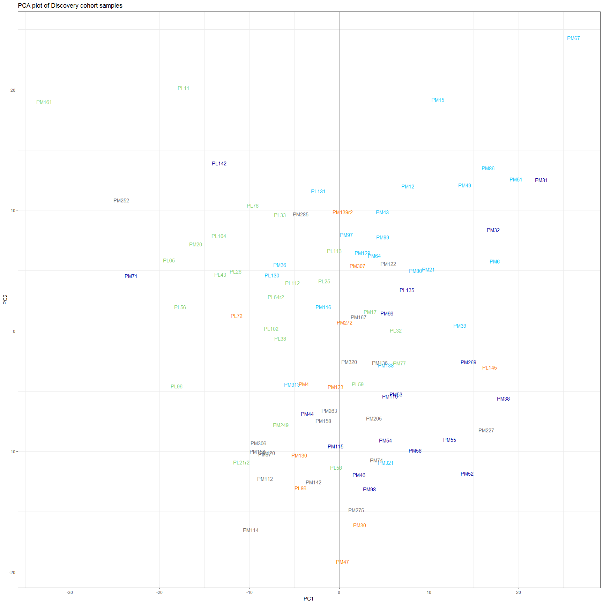<!-- -->

```r
#legend("bottomleft",c("Term","PreT","LOPE","IUGR","EOPE"),fill=c("#696969","#7fd071","#000199","#02c0fa"))

##Cox
Cox_Data_t<-t(Cox_Data)
Cox.pca <-prcomp(scale(m2beta(Cox_Data_t), center = TRUE, scale = FALSE))
summary(Cox.pca)
```

```
## Importance of components%s:
##                            PC1     PC2     PC3     PC4     PC5    PC6
## Standard deviation     10.5660 8.87343 8.16467 5.73082 5.24985 4.7479
## Proportion of Variance  0.1386 0.09778 0.08279 0.04079 0.03423 0.0280
## Cumulative Proportion   0.1386 0.23643 0.31922 0.36000 0.39423 0.4222
##                            PC7     PC8     PC9    PC10    PC11    PC12
## Standard deviation     4.37960 4.27758 4.12717 4.04167 3.97954 3.91486
## Proportion of Variance 0.02382 0.02272 0.02115 0.02029 0.01967 0.01903
## Cumulative Proportion  0.44605 0.46877 0.48993 0.51021 0.52988 0.54891
##                           PC13    PC14    PC15    PC16    PC17    PC18
## Standard deviation     3.80167 3.67965 3.66758 3.59057 3.54826 3.51128
## Proportion of Variance 0.01795 0.01682 0.01671 0.01601 0.01564 0.01531
## Cumulative Proportion  0.56686 0.58368 0.60038 0.61639 0.63203 0.64734
##                           PC19    PC20    PC21    PC22    PC23    PC24
## Standard deviation     3.48023 3.42544 3.40953 3.36620 3.33660 3.29987
## Proportion of Variance 0.01504 0.01457 0.01444 0.01407 0.01383 0.01352
## Cumulative Proportion  0.66238 0.67696 0.69139 0.70547 0.71929 0.73281
##                           PC25    PC26    PC27    PC28    PC29    PC30
## Standard deviation     3.25675 3.24119 3.22827 3.19316 3.18954 3.16482
## Proportion of Variance 0.01317 0.01305 0.01294 0.01266 0.01263 0.01244
## Cumulative Proportion  0.74599 0.75903 0.77198 0.78464 0.79727 0.80971
##                           PC31    PC32    PC33    PC34   PC35    PC36
## Standard deviation     3.12703 3.12460 3.11732 3.08754 3.0688 3.04873
## Proportion of Variance 0.01214 0.01212 0.01207 0.01184 0.0117 0.01154
## Cumulative Proportion  0.82186 0.83398 0.84605 0.85789 0.8696 0.88113
##                           PC37   PC38    PC39   PC40    PC41    PC42
## Standard deviation     3.03191 3.0165 2.99546 2.9891 2.98352 2.95633
## Proportion of Variance 0.01142 0.0113 0.01114 0.0111 0.01105 0.01085
## Cumulative Proportion  0.89254 0.9038 0.91499 0.9261 0.93714 0.94799
##                           PC43   PC44    PC45   PC46    PC47      PC48
## Standard deviation     2.93823 2.9084 2.90341 2.8655 2.85406 8.791e-14
## Proportion of Variance 0.01072 0.0105 0.01047 0.0102 0.01012 0.000e+00
## Cumulative Proportion  0.95871 0.9692 0.97969 0.9899 1.00000 1.000e+00
```

```r
##Plot
# create data frame with scores
scores = as.data.frame(Cox.pca$x)
scores<-scores[order(rownames(scores)),]
Cox_des<-Cox_des[order(rownames(Cox_des)),]
all(rownames(Cox_des)==rownames(scores))##TRUE
```

```
## [1] TRUE
```

```r
Path<-as.data.frame(Cox_des$GRP)
rownames(Path)<-rownames(Cox_des)
all(rownames(Path)==rownames(scores))##TRUE
```

```
## [1] TRUE
```

```r
scores<-merge(scores,Path,by='row.names')
rownames(scores)<-scores$Row.names
scores$Row.names<-NULL
scores$Path<-scores$`Cox_des$GRP`
scores$`Cox_des$GRP`<-NULL

##Pathology colour
(Coxv.grp.col<-as.vector(scores$Path))
```

```
##  [1] "LOPE" "EOPE" "LOPE" "EOPE" "EOPE" "LOPE" "EOPE" "EOPE" "PreT" "EOPE"
## [11] "LOPE" "LOPE" "Term" "EOPE" "PreT" "EOPE" "EOPE" "EOPE" "Term" "LOPE"
## [21] "PreT" "EOPE" "EOPE" "LOPE" "PreT" "LOPE" "EOPE" "PreT" "EOPE" "EOPE"
## [31] "EOPE" "EOPE" "LOPE" "LOPE" "PreT" "Term" "LOPE" "Term" "Term" "Term"
## [41] "Term" "EOPE" "EOPE" "EOPE" "Term" "EOPE" "EOPE" "Term"
```

```r
(Coxv.grp.col<-gsub("Term","#696969",Coxv.grp.col))
```

```
##  [1] "LOPE"    "EOPE"    "LOPE"    "EOPE"    "EOPE"    "LOPE"    "EOPE"   
##  [8] "EOPE"    "PreT"    "EOPE"    "LOPE"    "LOPE"    "#696969" "EOPE"   
## [15] "PreT"    "EOPE"    "EOPE"    "EOPE"    "#696969" "LOPE"    "PreT"   
## [22] "EOPE"    "EOPE"    "LOPE"    "PreT"    "LOPE"    "EOPE"    "PreT"   
## [29] "EOPE"    "EOPE"    "EOPE"    "EOPE"    "LOPE"    "LOPE"    "PreT"   
## [36] "#696969" "LOPE"    "#696969" "#696969" "#696969" "#696969" "EOPE"   
## [43] "EOPE"    "EOPE"    "#696969" "EOPE"    "EOPE"    "#696969"
```

```r
(Coxv.grp.col<-gsub("PreT","#7fd071",Coxv.grp.col))
```

```
##  [1] "LOPE"    "EOPE"    "LOPE"    "EOPE"    "EOPE"    "LOPE"    "EOPE"   
##  [8] "EOPE"    "#7fd071" "EOPE"    "LOPE"    "LOPE"    "#696969" "EOPE"   
## [15] "#7fd071" "EOPE"    "EOPE"    "EOPE"    "#696969" "LOPE"    "#7fd071"
## [22] "EOPE"    "EOPE"    "LOPE"    "#7fd071" "LOPE"    "EOPE"    "#7fd071"
## [29] "EOPE"    "EOPE"    "EOPE"    "EOPE"    "LOPE"    "LOPE"    "#7fd071"
## [36] "#696969" "LOPE"    "#696969" "#696969" "#696969" "#696969" "EOPE"   
## [43] "EOPE"    "EOPE"    "#696969" "EOPE"    "EOPE"    "#696969"
```

```r
(Coxv.grp.col<-gsub("LOPE","#000199",Coxv.grp.col))
```

```
##  [1] "#000199" "EOPE"    "#000199" "EOPE"    "EOPE"    "#000199" "EOPE"   
##  [8] "EOPE"    "#7fd071" "EOPE"    "#000199" "#000199" "#696969" "EOPE"   
## [15] "#7fd071" "EOPE"    "EOPE"    "EOPE"    "#696969" "#000199" "#7fd071"
## [22] "EOPE"    "EOPE"    "#000199" "#7fd071" "#000199" "EOPE"    "#7fd071"
## [29] "EOPE"    "EOPE"    "EOPE"    "EOPE"    "#000199" "#000199" "#7fd071"
## [36] "#696969" "#000199" "#696969" "#696969" "#696969" "#696969" "EOPE"   
## [43] "EOPE"    "EOPE"    "#696969" "EOPE"    "EOPE"    "#696969"
```

```r
(Coxv.grp.col<-gsub("EOPE","#02c0fa",Coxv.grp.col))
```

```
##  [1] "#000199" "#02c0fa" "#000199" "#02c0fa" "#02c0fa" "#000199" "#02c0fa"
##  [8] "#02c0fa" "#7fd071" "#02c0fa" "#000199" "#000199" "#696969" "#02c0fa"
## [15] "#7fd071" "#02c0fa" "#02c0fa" "#02c0fa" "#696969" "#000199" "#7fd071"
## [22] "#02c0fa" "#02c0fa" "#000199" "#7fd071" "#000199" "#02c0fa" "#7fd071"
## [29] "#02c0fa" "#02c0fa" "#02c0fa" "#02c0fa" "#000199" "#000199" "#7fd071"
## [36] "#696969" "#000199" "#696969" "#696969" "#696969" "#696969" "#02c0fa"
## [43] "#02c0fa" "#02c0fa" "#696969" "#02c0fa" "#02c0fa" "#696969"
```

```r
Coxv.grp.col
```

```
##  [1] "#000199" "#02c0fa" "#000199" "#02c0fa" "#02c0fa" "#000199" "#02c0fa"
##  [8] "#02c0fa" "#7fd071" "#02c0fa" "#000199" "#000199" "#696969" "#02c0fa"
## [15] "#7fd071" "#02c0fa" "#02c0fa" "#02c0fa" "#696969" "#000199" "#7fd071"
## [22] "#02c0fa" "#02c0fa" "#000199" "#7fd071" "#000199" "#02c0fa" "#7fd071"
## [29] "#02c0fa" "#02c0fa" "#02c0fa" "#02c0fa" "#000199" "#000199" "#7fd071"
## [36] "#696969" "#000199" "#696969" "#696969" "#696969" "#696969" "#02c0fa"
## [43] "#02c0fa" "#02c0fa" "#696969" "#02c0fa" "#02c0fa" "#696969"
```

```r
# plot of observations
Cox_pca<-ggplot(data = scores, aes(x = PC1, y = PC2, label = rownames(scores))) +
  geom_hline(yintercept = 0, colour = "gray65") +
  geom_vline(xintercept = 0, colour = "gray65") +
  geom_text(colour = Coxv.grp.col) +
  ggtitle("PCA plot of Validation cohort samples")+
  theme_bw()

Cox_pca
```

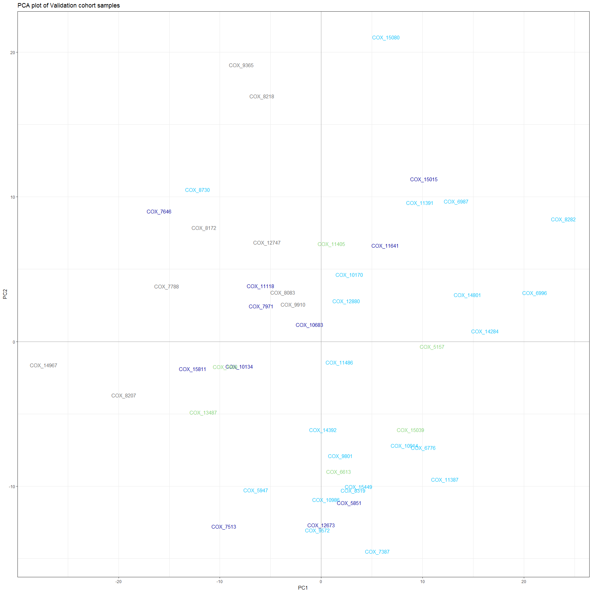<!-- -->

To try to comment on global DNAm of these samples, I will take an average of DNAm across all probes on the array and plot them between the group. LR will be used to see is global DNAm differs between groups accounting for fetal sex

```r
##install.packages("ggjoy")
library(devtools)
##install_github("clauswilke/ggjoy")
library(ggplot2)
library(ggjoy)

##Roblab
##remove infinite values
sum(is.na(Roblab_Data))##0
```

```
## [1] 0
```

```r
sum(is.infinite(Roblab_Data))##65
```

```
## [1] 65
```

```r
impute.med.Inf <- function(x) replace(x, is.infinite(x), median(x, na.rm = TRUE))
Roblab_Data<-impute.med.Inf(Roblab_Data)
sum(is.infinite(Roblab_Data))##0
```

```
## [1] 0
```

```r
##Calculate the average per sample (column)
Roblab_Data<-m2beta(Roblab_Data)
Roblab_Mean<-as.data.frame(colMeans(Roblab_Data))
colnames(Roblab_Mean)<-c("Avg_Beta")

Roblab_des_GRP<-as.data.frame(Roblab_des$group)
rownames(Roblab_des_GRP)<-rownames(Roblab_des)
Roblab_Mean2<-merge(Roblab_Mean,Roblab_des_GRP,by='row.names')
Roblab_Mean2$Row.names<-NULL
colnames(Roblab_Mean2)<-c("Avg_Beta","GRP")

##Joy Plot
Roblab_AvgDist<-ggplot(Roblab_Mean2, aes(x = Avg_Beta, y = GRP,fill=GRP)) +
  geom_joy(scale = 4) + theme_joy() +
  scale_y_discrete(expand = c(0.01, 0)) +   # will generally have to set the `expand` option
  scale_x_continuous(expand = c(0, 0)) + # for both axes to remove unneeded padding
  scale_fill_cyclical(values = c("#02c0fa", "#fa7200","#000199","#7fd071","#696969"),guide="legend") 

##Cox
sum(is.na(Cox_Data))##0
```

```
## [1] 0
```

```r
sum(is.infinite(Cox_Data))##4
```

```
## [1] 4
```

```r
impute.med.Inf <- function(x) replace(x, is.infinite(x), median(x, na.rm = TRUE))
Cox_Data<-impute.med.Inf(Cox_Data)
sum(is.infinite(Cox_Data))##0
```

```
## [1] 0
```

```r
##Calculate the average per sample (column)
Cox_Data<-m2beta(Cox_Data)
Cox_Mean<-as.data.frame(colMeans(Cox_Data))
colnames(Cox_Mean)<-c("Avg_Beta")

Cox_des_GRP<-as.data.frame(Cox_des$GRP)
rownames(Cox_des_GRP)<-rownames(Cox_des)
Cox_Mean2<-merge(Cox_Mean,Cox_des_GRP,by='row.names')
Cox_Mean2$Row.names<-NULL
colnames(Cox_Mean2)<-c("Avg_Beta","GRP")

##Joy Plot
Cox_AvgDist<-ggplot(Cox_Mean2, aes(x = Avg_Beta, y = GRP,fill=GRP)) +
  geom_joy(scale = 4) + theme_joy() +
  scale_y_discrete(expand = c(0.01, 0)) +   # will generally have to set the `expand` option
  scale_x_continuous(expand = c(0, 0)) + # for both axes to remove unneeded padding
  scale_fill_cyclical(values = c("#02c0fa","#000199","#7fd071","#696969"),guide="legend") 

grid.arrange(Roblab_AvgDist,Cox_AvgDist,nrow=1)
```

```
## Picking joint bandwidth of 0.00352
```

```
## Picking joint bandwidth of 0.00369
```

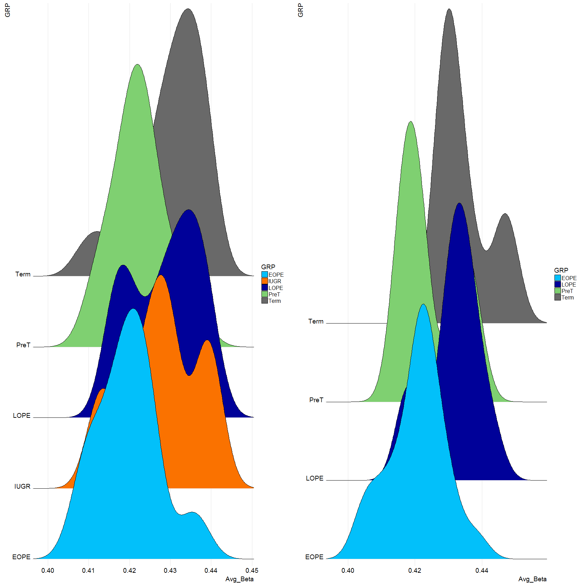<!-- -->

Adding in other gene information about the validated hits that was requested by the reviewer.

```r
validatedhits<-read.table('Cox_Roblab_PersistentHits_Betas_Pval_GeneName_2017.txt')
anno<-read.table('Uber annotation.txt',header=T)
anno_subset<-anno[,c("MAPINFO","Relation_to_UCSC_CpG_Island","Enhancer","Regulatory_Feature_Group")]

anno_subset_599<-anno_subset[which(rownames(anno_subset) %in% rownames(validatedhits)),]

ValidatedHits_ExtraInfo<-merge(validatedhits,anno_subset_599, by='row.names')
write.table(ValidatedHits_ExtraInfo,file="ValidatedHits_ExtraInfo.txt")
```


```r
##Sites that have DB>0.1 in both cohort

DB0.1Sites<-subset(validatedhits,validatedhits$BVal>0.1 & validatedhits$Cox_Betas>0.1)##128 sites
DB0.15Sites<-subset(validatedhits,validatedhits$BVal>abs(0.15) & validatedhits$Cox_Betas>abs(0.15))##7

##JoyPlots to look at distributions between groups
##Roblab
##remove infinite values
sum(is.na(Roblab_Data))##0
```

```
## [1] 0
```

```r
sum(is.infinite(Roblab_Data))##65
```

```
## [1] 0
```

```r
impute.med.Inf <- function(x) replace(x, is.infinite(x), median(x, na.rm = TRUE))
Roblab_Data<-impute.med.Inf(Roblab_Data)
sum(is.infinite(Roblab_Data))##0
```

```
## [1] 0
```

```r
##Cox
sum(is.na(Cox_Data))##0
```

```
## [1] 0
```

```r
sum(is.infinite(Cox_Data))##4
```

```
## [1] 0
```

```r
impute.med.Inf <- function(x) replace(x, is.infinite(x), median(x, na.rm = TRUE))
Cox_Data<-impute.med.Inf(Cox_Data)
sum(is.infinite(Cox_Data))##0
```

```
## [1] 0
```

```r
##Subset each of the top 7 hits
##RASA3
Roblab_RASA3<-as.data.frame(Roblab_Data[which(rownames(Roblab_Data)=='cg19674091'),])
Roblab_RASA3<-m2beta(Roblab_RASA3)
colnames(Roblab_RASA3)<-c("beta")

Roblab_des_GRP<-as.data.frame(Roblab_des$group)
rownames(Roblab_des_GRP)<-rownames(Roblab_des)
Roblab_RASA3<-merge(Roblab_RASA3,Roblab_des_GRP,by='row.names')
Roblab_RASA3$Row.names<-NULL
colnames(Roblab_RASA3)<-c("Beta","GRP")

Cox_RASA3<-as.data.frame(Cox_Data[which(rownames(Cox_Data)=='cg19674091'),])
Cox_RASA3<-m2beta(Cox_RASA3)
colnames(Cox_RASA3)<-c("beta")

Cox_des_GRP<-as.data.frame(Cox_des$GRP)
rownames(Cox_des_GRP)<-rownames(Cox_des)
Cox_RASA3<-merge(Cox_RASA3,Cox_des_GRP,by='row.names')
Cox_RASA3$Row.names<-NULL
colnames(Cox_RASA3)<-c("Beta","GRP")

##Joy Plot
Roblab_RASA3Dist<-ggplot(Roblab_RASA3, aes(x = Beta, y = GRP,fill=GRP)) +
  geom_joy(scale = 4) + theme_joy() +
  scale_y_discrete(expand = c(0.01, 0)) +   # will generally have to set the `expand` option
  scale_x_continuous(expand = c(0, 0))  +   # for both axes to remove unneeded padding
  scale_fill_cyclical(values = c("#02c0fa", "#fa7200","#000199","#7fd071","#696969"),guide="legend") 

Cox_RASA3Dist<-ggplot(Cox_RASA3, aes(x = Beta, y = GRP, fill=GRP)) +
  geom_joy(scale = 4) + theme_joy() +
  scale_y_discrete(expand = c(0.01, 0)) +   # will generally have to set the `expand` option
  scale_x_continuous(expand = c(0, 0))  +  # for both axes to remove unneeded padding
  scale_fill_cyclical(values = c("#02c0fa","#000199","#7fd071","#696969"),guide="legend") 

grid.arrange(Roblab_RASA3Dist,Cox_RASA3Dist,nrow=1)
```

```
## Picking joint bandwidth of 0.00914
```

```
## Picking joint bandwidth of 0.00636
```

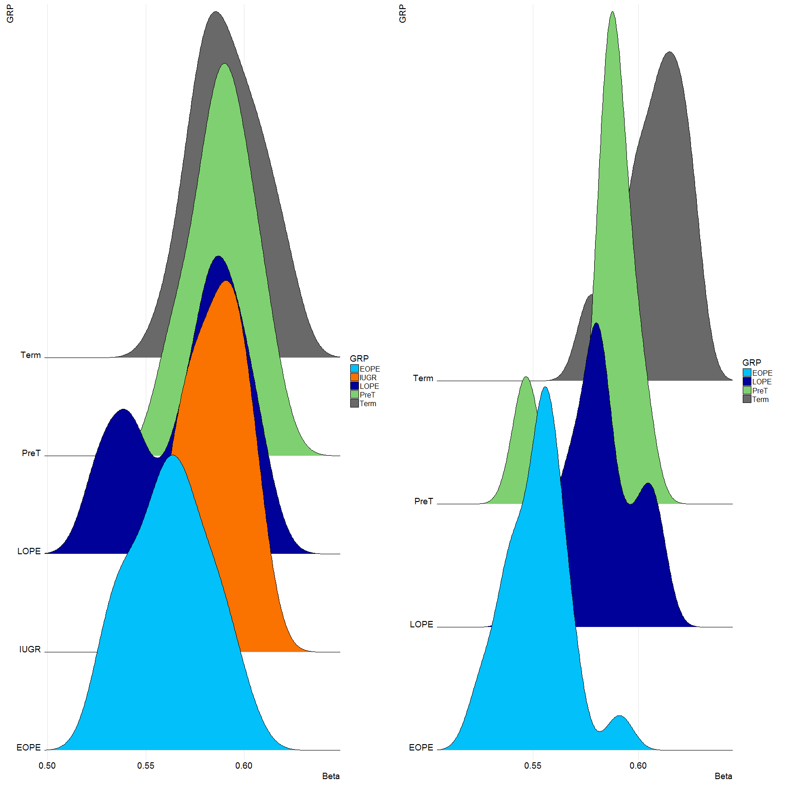<!-- -->

```r
#ZP3
Roblab_ZP3<-as.data.frame(Roblab_Data[which(rownames(Roblab_Data)=='cg18474072'),])
Roblab_ZP3<-m2beta(Roblab_ZP3)
colnames(Roblab_ZP3)<-c("beta")

Roblab_des_GRP<-as.data.frame(Roblab_des$group)
rownames(Roblab_des_GRP)<-rownames(Roblab_des)
Roblab_ZP3<-merge(Roblab_ZP3,Roblab_des_GRP,by='row.names')
Roblab_ZP3$Row.names<-NULL
colnames(Roblab_ZP3)<-c("Beta","GRP")

Cox_ZP3<-as.data.frame(Cox_Data[which(rownames(Cox_Data)=='cg18474072'),])
Cox_ZP3<-m2beta(Cox_ZP3)
colnames(Cox_ZP3)<-c("beta")

Cox_des_GRP<-as.data.frame(Cox_des$GRP)
rownames(Cox_des_GRP)<-rownames(Cox_des)
Cox_ZP3<-merge(Cox_ZP3,Cox_des_GRP,by='row.names')
Cox_ZP3$Row.names<-NULL
colnames(Cox_ZP3)<-c("Beta","GRP")

##Joy Plot
Roblab_ZP3Dist<-ggplot(Roblab_ZP3, aes(x = Beta, y = GRP,fill=GRP)) +
  geom_joy(scale = 4) + theme_joy() +
  scale_y_discrete(expand = c(0.01, 0)) +   # will generally have to set the `expand` option
  scale_x_continuous(expand = c(0, 0))  +   # for both axes to remove unneeded padding
  scale_fill_cyclical(values = c("#02c0fa", "#fa7200","#000199","#7fd071","#696969"),guide="legend") 

Cox_ZP3Dist<-ggplot(Cox_ZP3, aes(x = Beta, y = GRP, fill=GRP)) +
  geom_joy(scale = 4) + theme_joy() +
  scale_y_discrete(expand = c(0.01, 0)) +   # will generally have to set the `expand` option
  scale_x_continuous(expand = c(0, 0))  +  # for both axes to remove unneeded padding
  scale_fill_cyclical(values = c("#02c0fa","#000199","#7fd071","#696969"),guide="legend") 

grid.arrange(Roblab_ZP3Dist,Cox_ZP3Dist,nrow=1)
```

```
## Picking joint bandwidth of 0.0074
```

```
## Picking joint bandwidth of 0.00842
```

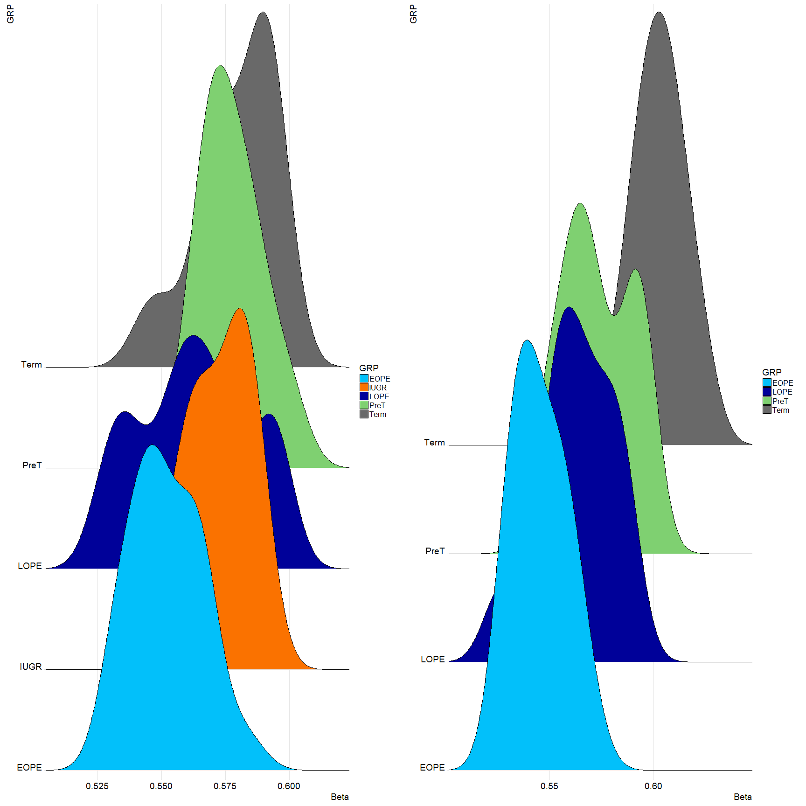<!-- -->

```r
##CTTNBP2
Roblab_CTTNBP2<-as.data.frame(Roblab_Data[which(rownames(Roblab_Data)=='cg26625897'),])
Roblab_CTTNBP2<-m2beta(Roblab_CTTNBP2)
colnames(Roblab_CTTNBP2)<-c("beta")

Roblab_des_GRP<-as.data.frame(Roblab_des$group)
rownames(Roblab_des_GRP)<-rownames(Roblab_des)
Roblab_CTTNBP2<-merge(Roblab_CTTNBP2,Roblab_des_GRP,by='row.names')
Roblab_CTTNBP2$Row.names<-NULL
colnames(Roblab_CTTNBP2)<-c("Beta","GRP")

Cox_CTTNBP2<-as.data.frame(Cox_Data[which(rownames(Cox_Data)=='cg26625897'),])
Cox_CTTNBP2<-m2beta(Cox_CTTNBP2)
colnames(Cox_CTTNBP2)<-c("beta")

Cox_des_GRP<-as.data.frame(Cox_des$GRP)
rownames(Cox_des_GRP)<-rownames(Cox_des)
Cox_CTTNBP2<-merge(Cox_CTTNBP2,Cox_des_GRP,by='row.names')
Cox_CTTNBP2$Row.names<-NULL
colnames(Cox_CTTNBP2)<-c("Beta","GRP")

##Joy Plot
Roblab_CTTNBP2Dist<-ggplot(Roblab_CTTNBP2, aes(x = Beta, y = GRP,fill=GRP)) +
  geom_joy(scale = 4) + theme_joy() +
  scale_y_discrete(expand = c(0.01, 0)) +   # will generally have to set the `expand` option
  scale_x_continuous(expand = c(0, 0))  +   # for both axes to remove unneeded padding
  scale_fill_cyclical(values = c("#02c0fa", "#fa7200","#000199","#7fd071","#696969"),guide="legend") 

Cox_CTTNBP2Dist<-ggplot(Cox_CTTNBP2, aes(x = Beta, y = GRP, fill=GRP)) +
  geom_joy(scale = 4) + theme_joy() +
  scale_y_discrete(expand = c(0.01, 0)) +   # will generally have to set the `expand` option
  scale_x_continuous(expand = c(0, 0))  +  # for both axes to remove unneeded padding
  scale_fill_cyclical(values = c("#02c0fa","#000199","#7fd071","#696969"),guide="legend") 

grid.arrange(Roblab_CTTNBP2Dist,Cox_CTTNBP2Dist,nrow=1)
```

```
## Picking joint bandwidth of 0.00823
```

```
## Picking joint bandwidth of 0.00887
```

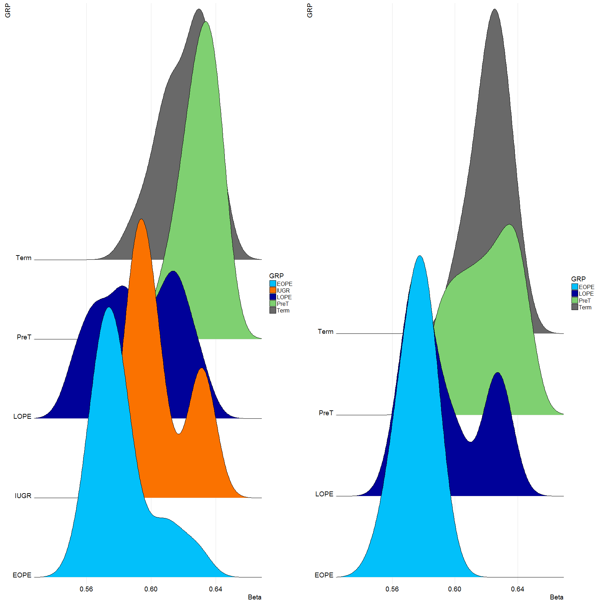<!-- -->

```r
##LOC100507582
Roblab_LOC100507582<-as.data.frame(Roblab_Data[which(rownames(Roblab_Data)=='cg26625897'),])
Roblab_LOC100507582<-m2beta(Roblab_LOC100507582)
colnames(Roblab_LOC100507582)<-c("beta")

Roblab_des_GRP<-as.data.frame(Roblab_des$group)
rownames(Roblab_des_GRP)<-rownames(Roblab_des)
Roblab_LOC100507582<-merge(Roblab_LOC100507582,Roblab_des_GRP,by='row.names')
Roblab_LOC100507582$Row.names<-NULL
colnames(Roblab_LOC100507582)<-c("Beta","GRP")

Cox_LOC100507582<-as.data.frame(Cox_Data[which(rownames(Cox_Data)=='cg26625897'),])
Cox_LOC100507582<-m2beta(Cox_LOC100507582)
colnames(Cox_LOC100507582)<-c("beta")

Cox_des_GRP<-as.data.frame(Cox_des$GRP)
rownames(Cox_des_GRP)<-rownames(Cox_des)
Cox_LOC100507582<-merge(Cox_LOC100507582,Cox_des_GRP,by='row.names')
Cox_LOC100507582$Row.names<-NULL
colnames(Cox_LOC100507582)<-c("Beta","GRP")

##Joy Plot
Roblab_LOC100507582Dist<-ggplot(Roblab_LOC100507582, aes(x = Beta, y = GRP,fill=GRP)) +
  geom_joy(scale = 4) + theme_joy() +
  scale_y_discrete(expand = c(0.01, 0)) +   # will generally have to set the `expand` option
  scale_x_continuous(expand = c(0, 0))  +   # for both axes to remove unneeded padding
  scale_fill_cyclical(values = c("#02c0fa", "#fa7200","#000199","#7fd071","#696969"),guide="legend") 

Cox_LOC100507582Dist<-ggplot(Cox_LOC100507582, aes(x = Beta, y = GRP, fill=GRP)) +
  geom_joy(scale = 4) + theme_joy() +
  scale_y_discrete(expand = c(0.01, 0)) +   # will generally have to set the `expand` option
  scale_x_continuous(expand = c(0, 0))  +  # for both axes to remove unneeded padding
  scale_fill_cyclical(values = c("#02c0fa","#000199","#7fd071","#696969"),guide="legend") 

grid.arrange(Roblab_LOC100507582Dist,Cox_LOC100507582Dist,nrow=1)
```

```
## Picking joint bandwidth of 0.00823
## Picking joint bandwidth of 0.00887
```

<!-- -->

```r
##DUSP1
Roblab_DUSP1<-as.data.frame(Roblab_Data[which(rownames(Roblab_Data)=='cg10668363'),])
Roblab_DUSP1<-m2beta(Roblab_DUSP1)
colnames(Roblab_DUSP1)<-c("beta")

Roblab_des_GRP<-as.data.frame(Roblab_des$group)
rownames(Roblab_des_GRP)<-rownames(Roblab_des)
Roblab_DUSP1<-merge(Roblab_DUSP1,Roblab_des_GRP,by='row.names')
Roblab_DUSP1$Row.names<-NULL
colnames(Roblab_DUSP1)<-c("Beta","GRP")

Cox_DUSP1<-as.data.frame(Cox_Data[which(rownames(Cox_Data)=='cg10668363'),])
Cox_DUSP1<-m2beta(Cox_DUSP1)
colnames(Cox_DUSP1)<-c("beta")

Cox_des_GRP<-as.data.frame(Cox_des$GRP)
rownames(Cox_des_GRP)<-rownames(Cox_des)
Cox_DUSP1<-merge(Cox_DUSP1,Cox_des_GRP,by='row.names')
Cox_DUSP1$Row.names<-NULL
colnames(Cox_DUSP1)<-c("Beta","GRP")

##Joy Plot
Roblab_DUSP1Dist<-ggplot(Roblab_DUSP1, aes(x = Beta, y = GRP,fill=GRP)) +
  geom_joy(scale = 4) + theme_joy() +
  scale_y_discrete(expand = c(0.01, 0)) +   # will generally have to set the `expand` option
  scale_x_continuous(expand = c(0, 0))  +   # for both axes to remove unneeded padding
  scale_fill_cyclical(values = c("#02c0fa", "#fa7200","#000199","#7fd071","#696969"),guide="legend") 

Cox_DUSP1Dist<-ggplot(Cox_DUSP1, aes(x = Beta, y = GRP, fill=GRP)) +
  geom_joy(scale = 4) + theme_joy() +
  scale_y_discrete(expand = c(0.01, 0)) +   # will generally have to set the `expand` option
  scale_x_continuous(expand = c(0, 0))  +  # for both axes to remove unneeded padding
  scale_fill_cyclical(values = c("#02c0fa","#000199","#7fd071","#696969"),guide="legend") 

grid.arrange(Roblab_DUSP1Dist,Cox_DUSP1Dist,nrow=1)
```

```
## Picking joint bandwidth of 0.00781
```

```
## Picking joint bandwidth of 0.00647
```

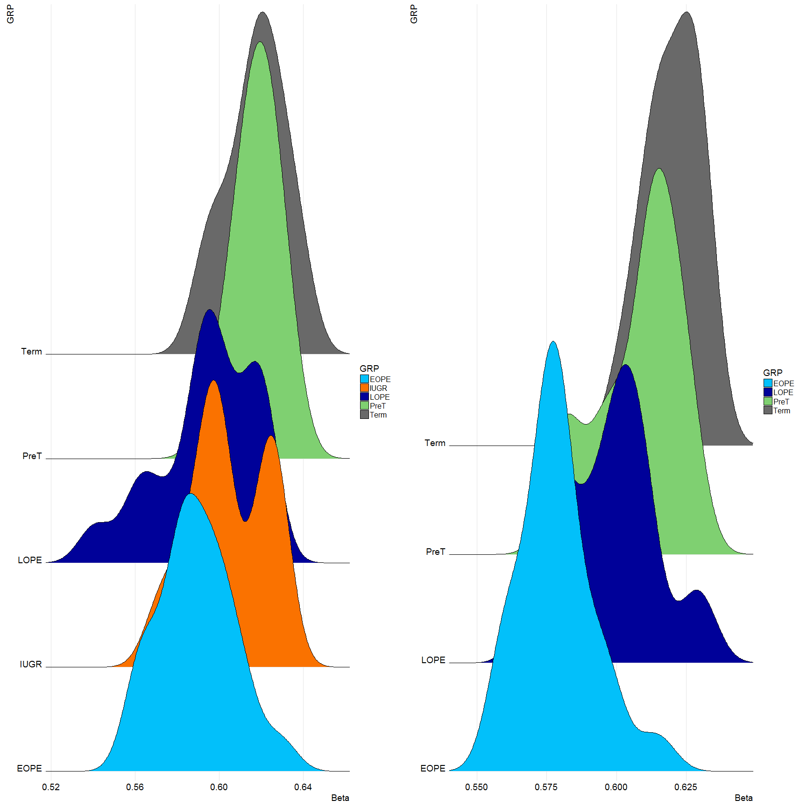<!-- -->

```r
##NIPAL2
Roblab_NIPAL2<-as.data.frame(Roblab_Data[which(rownames(Roblab_Data)=='cg13672136'),])
Roblab_NIPAL2<-m2beta(Roblab_NIPAL2)
colnames(Roblab_NIPAL2)<-c("beta")

Roblab_des_GRP<-as.data.frame(Roblab_des$group)
rownames(Roblab_des_GRP)<-rownames(Roblab_des)
Roblab_NIPAL2<-merge(Roblab_NIPAL2,Roblab_des_GRP,by='row.names')
Roblab_NIPAL2$Row.names<-NULL
colnames(Roblab_NIPAL2)<-c("Beta","GRP")

Cox_NIPAL2<-as.data.frame(Cox_Data[which(rownames(Cox_Data)=='cg13672136'),])
Cox_NIPAL2<-m2beta(Cox_NIPAL2)
colnames(Cox_NIPAL2)<-c("beta")

Cox_des_GRP<-as.data.frame(Cox_des$GRP)
rownames(Cox_des_GRP)<-rownames(Cox_des)
Cox_NIPAL2<-merge(Cox_NIPAL2,Cox_des_GRP,by='row.names')
Cox_NIPAL2$Row.names<-NULL
colnames(Cox_NIPAL2)<-c("Beta","GRP")

##Joy Plot
Roblab_NIPAL2Dist<-ggplot(Roblab_NIPAL2, aes(x = Beta, y = GRP,fill=GRP)) +
  geom_joy(scale = 4) + theme_joy() +
  scale_y_discrete(expand = c(0.01, 0)) +   # will generally have to set the `expand` option
  scale_x_continuous(expand = c(0, 0))  +   # for both axes to remove unneeded padding
  scale_fill_cyclical(values = c("#02c0fa", "#fa7200","#000199","#7fd071","#696969"),guide="legend") 

Cox_NIPAL2Dist<-ggplot(Cox_NIPAL2, aes(x = Beta, y = GRP, fill=GRP)) +
  geom_joy(scale = 4) + theme_joy() +
  scale_y_discrete(expand = c(0.01, 0)) +   # will generally have to set the `expand` option
  scale_x_continuous(expand = c(0, 0))  +  # for both axes to remove unneeded padding
  scale_fill_cyclical(values = c("#02c0fa","#000199","#7fd071","#696969"),guide="legend") 

grid.arrange(Roblab_NIPAL2Dist,Cox_NIPAL2Dist,nrow=1)
```

```
## Picking joint bandwidth of 0.00452
```

```
## Picking joint bandwidth of 0.00608
```

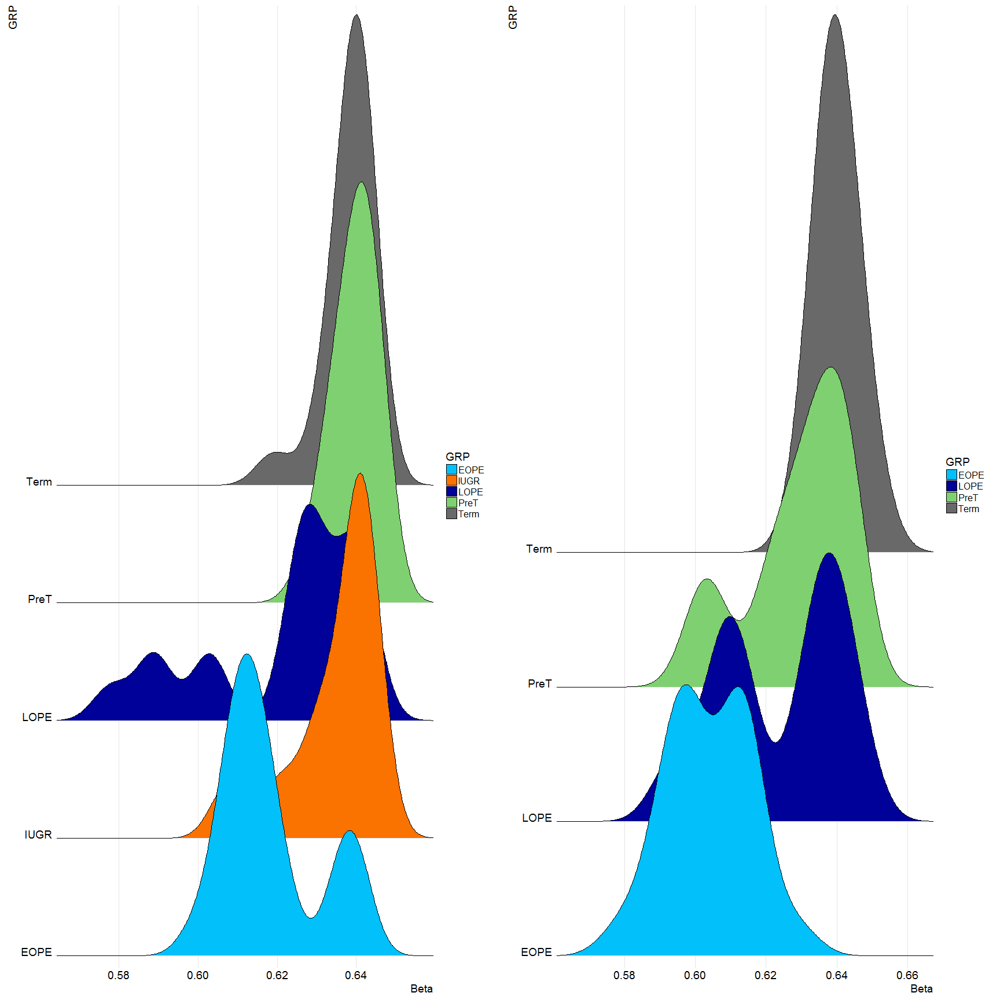<!-- -->

```r
##EGFR
Roblab_EGFR<-as.data.frame(Roblab_Data[which(rownames(Roblab_Data)=='cg12436772'),])
Roblab_EGFR<-m2beta(Roblab_EGFR)
colnames(Roblab_EGFR)<-c("beta")

Roblab_des_GRP<-as.data.frame(Roblab_des$group)
rownames(Roblab_des_GRP)<-rownames(Roblab_des)
Roblab_EGFR<-merge(Roblab_EGFR,Roblab_des_GRP,by='row.names')
Roblab_EGFR$Row.names<-NULL
colnames(Roblab_EGFR)<-c("Beta","GRP")

Cox_EGFR<-as.data.frame(Cox_Data[which(rownames(Cox_Data)=='cg12436772'),])
Cox_EGFR<-m2beta(Cox_EGFR)
colnames(Cox_EGFR)<-c("beta")

Cox_des_GRP<-as.data.frame(Cox_des$GRP)
rownames(Cox_des_GRP)<-rownames(Cox_des)
Cox_EGFR<-merge(Cox_EGFR,Cox_des_GRP,by='row.names')
Cox_EGFR$Row.names<-NULL
colnames(Cox_EGFR)<-c("Beta","GRP")

##Joy Plot
Roblab_EGFRDist<-ggplot(Roblab_EGFR, aes(x = Beta, y = GRP,fill=GRP)) +
  geom_joy(scale = 4) + theme_joy() +
  scale_y_discrete(expand = c(0.01, 0)) +   # will generally have to set the `expand` option
  scale_x_continuous(expand = c(0, 0))  +   # for both axes to remove unneeded padding
  scale_fill_cyclical(values = c("#02c0fa", "#fa7200","#000199","#7fd071","#696969"),guide="legend") 

Cox_EGFRDist<-ggplot(Cox_EGFR, aes(x = Beta, y = GRP, fill=GRP)) +
  geom_joy(scale = 4) + theme_joy() +
  scale_y_discrete(expand = c(0.01, 0)) +   # will generally have to set the `expand` option
  scale_x_continuous(expand = c(0, 0))  +  # for both axes to remove unneeded padding
  scale_fill_cyclical(values = c("#02c0fa","#000199","#7fd071","#696969"),guide="legend") 

grid.arrange(Roblab_EGFRDist,Cox_EGFRDist,nrow=1)
```

```
## Picking joint bandwidth of 0.00863
```

```
## Picking joint bandwidth of 0.00751
```

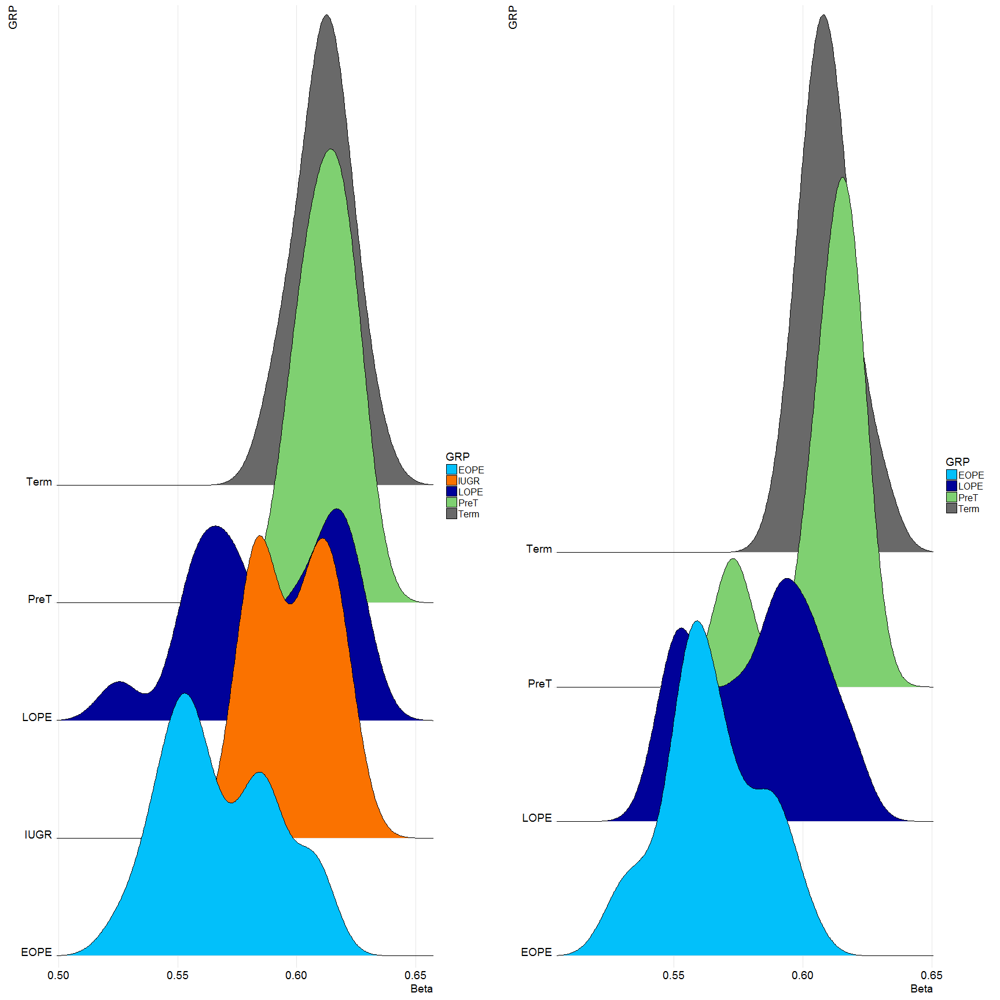<!-- -->


```r
Roblab_Top7<-Roblab_Data[which(rownames(Roblab_Data) %in% rownames(DB0.15Sites)),]
Cox_Top7<- Cox_Data[which(rownames(Cox_Data) %in% rownames(DB0.15Sites)),]

(v.grp.col<-as.vector(Roblab_des$group))
```

```
##  [1] "PreT" "PreT" "PreT" "PreT" "PreT" "EOPE" "EOPE" "LOPE" "LOPE" "IUGR"
## [11] "PreT" "PreT" "PreT" "PreT" "PreT" "PreT" "PreT" "PreT" "PreT" "PreT"
## [21] "PreT" "PreT" "IUGR" "PreT" "IUGR" "PreT" "Term" "Term" "LOPE" "EOPE"
## [31] "LOPE" "EOPE" "Term" "Term" "IUGR" "EOPE" "IUGR" "Term" "EOPE" "IUGR"
## [41] "Term" "EOPE" "Term" "Term" "PreT" "Term" "PreT" "PreT" "Term" "EOPE"
## [51] "Term" "PreT" "Term" "Term" "LOPE" "IUGR" "Term" "Term" "IUGR" "Term"
## [61] "IUGR" "LOPE" "EOPE" "LOPE" "Term" "EOPE" "EOPE" "LOPE" "EOPE" "IUGR"
## [71] "EOPE" "LOPE" "LOPE" "IUGR" "EOPE" "EOPE" "LOPE" "LOPE" "LOPE" "LOPE"
## [81] "LOPE" "EOPE" "EOPE" "LOPE" "EOPE" "LOPE" "Term" "PreT" "EOPE" "EOPE"
## [91] "Term" "EOPE" "LOPE" "EOPE"
```

```r
(v.grp.col<-gsub("Term","#696969",v.grp.col))
```

```
##  [1] "PreT"    "PreT"    "PreT"    "PreT"    "PreT"    "EOPE"    "EOPE"   
##  [8] "LOPE"    "LOPE"    "IUGR"    "PreT"    "PreT"    "PreT"    "PreT"   
## [15] "PreT"    "PreT"    "PreT"    "PreT"    "PreT"    "PreT"    "PreT"   
## [22] "PreT"    "IUGR"    "PreT"    "IUGR"    "PreT"    "#696969" "#696969"
## [29] "LOPE"    "EOPE"    "LOPE"    "EOPE"    "#696969" "#696969" "IUGR"   
## [36] "EOPE"    "IUGR"    "#696969" "EOPE"    "IUGR"    "#696969" "EOPE"   
## [43] "#696969" "#696969" "PreT"    "#696969" "PreT"    "PreT"    "#696969"
## [50] "EOPE"    "#696969" "PreT"    "#696969" "#696969" "LOPE"    "IUGR"   
## [57] "#696969" "#696969" "IUGR"    "#696969" "IUGR"    "LOPE"    "EOPE"   
## [64] "LOPE"    "#696969" "EOPE"    "EOPE"    "LOPE"    "EOPE"    "IUGR"   
## [71] "EOPE"    "LOPE"    "LOPE"    "IUGR"    "EOPE"    "EOPE"    "LOPE"   
## [78] "LOPE"    "LOPE"    "LOPE"    "LOPE"    "EOPE"    "EOPE"    "LOPE"   
## [85] "EOPE"    "LOPE"    "#696969" "PreT"    "EOPE"    "EOPE"    "#696969"
## [92] "EOPE"    "LOPE"    "EOPE"
```

```r
(v.grp.col<-gsub("PreT","#7fd071",v.grp.col))
```

```
##  [1] "#7fd071" "#7fd071" "#7fd071" "#7fd071" "#7fd071" "EOPE"    "EOPE"   
##  [8] "LOPE"    "LOPE"    "IUGR"    "#7fd071" "#7fd071" "#7fd071" "#7fd071"
## [15] "#7fd071" "#7fd071" "#7fd071" "#7fd071" "#7fd071" "#7fd071" "#7fd071"
## [22] "#7fd071" "IUGR"    "#7fd071" "IUGR"    "#7fd071" "#696969" "#696969"
## [29] "LOPE"    "EOPE"    "LOPE"    "EOPE"    "#696969" "#696969" "IUGR"   
## [36] "EOPE"    "IUGR"    "#696969" "EOPE"    "IUGR"    "#696969" "EOPE"   
## [43] "#696969" "#696969" "#7fd071" "#696969" "#7fd071" "#7fd071" "#696969"
## [50] "EOPE"    "#696969" "#7fd071" "#696969" "#696969" "LOPE"    "IUGR"   
## [57] "#696969" "#696969" "IUGR"    "#696969" "IUGR"    "LOPE"    "EOPE"   
## [64] "LOPE"    "#696969" "EOPE"    "EOPE"    "LOPE"    "EOPE"    "IUGR"   
## [71] "EOPE"    "LOPE"    "LOPE"    "IUGR"    "EOPE"    "EOPE"    "LOPE"   
## [78] "LOPE"    "LOPE"    "LOPE"    "LOPE"    "EOPE"    "EOPE"    "LOPE"   
## [85] "EOPE"    "LOPE"    "#696969" "#7fd071" "EOPE"    "EOPE"    "#696969"
## [92] "EOPE"    "LOPE"    "EOPE"
```

```r
(v.grp.col<-gsub("LOPE","#000199",v.grp.col))
```

```
##  [1] "#7fd071" "#7fd071" "#7fd071" "#7fd071" "#7fd071" "EOPE"    "EOPE"   
##  [8] "#000199" "#000199" "IUGR"    "#7fd071" "#7fd071" "#7fd071" "#7fd071"
## [15] "#7fd071" "#7fd071" "#7fd071" "#7fd071" "#7fd071" "#7fd071" "#7fd071"
## [22] "#7fd071" "IUGR"    "#7fd071" "IUGR"    "#7fd071" "#696969" "#696969"
## [29] "#000199" "EOPE"    "#000199" "EOPE"    "#696969" "#696969" "IUGR"   
## [36] "EOPE"    "IUGR"    "#696969" "EOPE"    "IUGR"    "#696969" "EOPE"   
## [43] "#696969" "#696969" "#7fd071" "#696969" "#7fd071" "#7fd071" "#696969"
## [50] "EOPE"    "#696969" "#7fd071" "#696969" "#696969" "#000199" "IUGR"   
## [57] "#696969" "#696969" "IUGR"    "#696969" "IUGR"    "#000199" "EOPE"   
## [64] "#000199" "#696969" "EOPE"    "EOPE"    "#000199" "EOPE"    "IUGR"   
## [71] "EOPE"    "#000199" "#000199" "IUGR"    "EOPE"    "EOPE"    "#000199"
## [78] "#000199" "#000199" "#000199" "#000199" "EOPE"    "EOPE"    "#000199"
## [85] "EOPE"    "#000199" "#696969" "#7fd071" "EOPE"    "EOPE"    "#696969"
## [92] "EOPE"    "#000199" "EOPE"
```

```r
(v.grp.col<-gsub("IUGR","#fa7200",v.grp.col))
```

```
##  [1] "#7fd071" "#7fd071" "#7fd071" "#7fd071" "#7fd071" "EOPE"    "EOPE"   
##  [8] "#000199" "#000199" "#fa7200" "#7fd071" "#7fd071" "#7fd071" "#7fd071"
## [15] "#7fd071" "#7fd071" "#7fd071" "#7fd071" "#7fd071" "#7fd071" "#7fd071"
## [22] "#7fd071" "#fa7200" "#7fd071" "#fa7200" "#7fd071" "#696969" "#696969"
## [29] "#000199" "EOPE"    "#000199" "EOPE"    "#696969" "#696969" "#fa7200"
## [36] "EOPE"    "#fa7200" "#696969" "EOPE"    "#fa7200" "#696969" "EOPE"   
## [43] "#696969" "#696969" "#7fd071" "#696969" "#7fd071" "#7fd071" "#696969"
## [50] "EOPE"    "#696969" "#7fd071" "#696969" "#696969" "#000199" "#fa7200"
## [57] "#696969" "#696969" "#fa7200" "#696969" "#fa7200" "#000199" "EOPE"   
## [64] "#000199" "#696969" "EOPE"    "EOPE"    "#000199" "EOPE"    "#fa7200"
## [71] "EOPE"    "#000199" "#000199" "#fa7200" "EOPE"    "EOPE"    "#000199"
## [78] "#000199" "#000199" "#000199" "#000199" "EOPE"    "EOPE"    "#000199"
## [85] "EOPE"    "#000199" "#696969" "#7fd071" "EOPE"    "EOPE"    "#696969"
## [92] "EOPE"    "#000199" "EOPE"
```

```r
(v.grp.col<-gsub("EOPE","#02c0fa",v.grp.col))
```

```
##  [1] "#7fd071" "#7fd071" "#7fd071" "#7fd071" "#7fd071" "#02c0fa" "#02c0fa"
##  [8] "#000199" "#000199" "#fa7200" "#7fd071" "#7fd071" "#7fd071" "#7fd071"
## [15] "#7fd071" "#7fd071" "#7fd071" "#7fd071" "#7fd071" "#7fd071" "#7fd071"
## [22] "#7fd071" "#fa7200" "#7fd071" "#fa7200" "#7fd071" "#696969" "#696969"
## [29] "#000199" "#02c0fa" "#000199" "#02c0fa" "#696969" "#696969" "#fa7200"
## [36] "#02c0fa" "#fa7200" "#696969" "#02c0fa" "#fa7200" "#696969" "#02c0fa"
## [43] "#696969" "#696969" "#7fd071" "#696969" "#7fd071" "#7fd071" "#696969"
## [50] "#02c0fa" "#696969" "#7fd071" "#696969" "#696969" "#000199" "#fa7200"
## [57] "#696969" "#696969" "#fa7200" "#696969" "#fa7200" "#000199" "#02c0fa"
## [64] "#000199" "#696969" "#02c0fa" "#02c0fa" "#000199" "#02c0fa" "#fa7200"
## [71] "#02c0fa" "#000199" "#000199" "#fa7200" "#02c0fa" "#02c0fa" "#000199"
## [78] "#000199" "#000199" "#000199" "#000199" "#02c0fa" "#02c0fa" "#000199"
## [85] "#02c0fa" "#000199" "#696969" "#7fd071" "#02c0fa" "#02c0fa" "#696969"
## [92] "#02c0fa" "#000199" "#02c0fa"
```

```r
v.grp.col
```

```
##  [1] "#7fd071" "#7fd071" "#7fd071" "#7fd071" "#7fd071" "#02c0fa" "#02c0fa"
##  [8] "#000199" "#000199" "#fa7200" "#7fd071" "#7fd071" "#7fd071" "#7fd071"
## [15] "#7fd071" "#7fd071" "#7fd071" "#7fd071" "#7fd071" "#7fd071" "#7fd071"
## [22] "#7fd071" "#fa7200" "#7fd071" "#fa7200" "#7fd071" "#696969" "#696969"
## [29] "#000199" "#02c0fa" "#000199" "#02c0fa" "#696969" "#696969" "#fa7200"
## [36] "#02c0fa" "#fa7200" "#696969" "#02c0fa" "#fa7200" "#696969" "#02c0fa"
## [43] "#696969" "#696969" "#7fd071" "#696969" "#7fd071" "#7fd071" "#696969"
## [50] "#02c0fa" "#696969" "#7fd071" "#696969" "#696969" "#000199" "#fa7200"
## [57] "#696969" "#696969" "#fa7200" "#696969" "#fa7200" "#000199" "#02c0fa"
## [64] "#000199" "#696969" "#02c0fa" "#02c0fa" "#000199" "#02c0fa" "#fa7200"
## [71] "#02c0fa" "#000199" "#000199" "#fa7200" "#02c0fa" "#02c0fa" "#000199"
## [78] "#000199" "#000199" "#000199" "#000199" "#02c0fa" "#02c0fa" "#000199"
## [85] "#02c0fa" "#000199" "#696969" "#7fd071" "#02c0fa" "#02c0fa" "#696969"
## [92] "#02c0fa" "#000199" "#02c0fa"
```

```r
(Coxv.grp.col<-as.vector(Cox_des$GRP))
```

```
##  [1] "LOPE" "EOPE" "LOPE" "EOPE" "EOPE" "LOPE" "EOPE" "EOPE" "PreT" "EOPE"
## [11] "LOPE" "LOPE" "Term" "EOPE" "PreT" "EOPE" "EOPE" "EOPE" "Term" "LOPE"
## [21] "PreT" "EOPE" "EOPE" "LOPE" "PreT" "LOPE" "EOPE" "PreT" "EOPE" "EOPE"
## [31] "EOPE" "EOPE" "LOPE" "LOPE" "PreT" "Term" "LOPE" "Term" "Term" "Term"
## [41] "Term" "EOPE" "EOPE" "EOPE" "Term" "EOPE" "EOPE" "Term"
```

```r
(Coxv.grp.col<-gsub("Term","#696969",Coxv.grp.col))
```

```
##  [1] "LOPE"    "EOPE"    "LOPE"    "EOPE"    "EOPE"    "LOPE"    "EOPE"   
##  [8] "EOPE"    "PreT"    "EOPE"    "LOPE"    "LOPE"    "#696969" "EOPE"   
## [15] "PreT"    "EOPE"    "EOPE"    "EOPE"    "#696969" "LOPE"    "PreT"   
## [22] "EOPE"    "EOPE"    "LOPE"    "PreT"    "LOPE"    "EOPE"    "PreT"   
## [29] "EOPE"    "EOPE"    "EOPE"    "EOPE"    "LOPE"    "LOPE"    "PreT"   
## [36] "#696969" "LOPE"    "#696969" "#696969" "#696969" "#696969" "EOPE"   
## [43] "EOPE"    "EOPE"    "#696969" "EOPE"    "EOPE"    "#696969"
```

```r
(Coxv.grp.col<-gsub("PreT","#7fd071",Coxv.grp.col))
```

```
##  [1] "LOPE"    "EOPE"    "LOPE"    "EOPE"    "EOPE"    "LOPE"    "EOPE"   
##  [8] "EOPE"    "#7fd071" "EOPE"    "LOPE"    "LOPE"    "#696969" "EOPE"   
## [15] "#7fd071" "EOPE"    "EOPE"    "EOPE"    "#696969" "LOPE"    "#7fd071"
## [22] "EOPE"    "EOPE"    "LOPE"    "#7fd071" "LOPE"    "EOPE"    "#7fd071"
## [29] "EOPE"    "EOPE"    "EOPE"    "EOPE"    "LOPE"    "LOPE"    "#7fd071"
## [36] "#696969" "LOPE"    "#696969" "#696969" "#696969" "#696969" "EOPE"   
## [43] "EOPE"    "EOPE"    "#696969" "EOPE"    "EOPE"    "#696969"
```

```r
(Coxv.grp.col<-gsub("LOPE","#000199",Coxv.grp.col))
```

```
##  [1] "#000199" "EOPE"    "#000199" "EOPE"    "EOPE"    "#000199" "EOPE"   
##  [8] "EOPE"    "#7fd071" "EOPE"    "#000199" "#000199" "#696969" "EOPE"   
## [15] "#7fd071" "EOPE"    "EOPE"    "EOPE"    "#696969" "#000199" "#7fd071"
## [22] "EOPE"    "EOPE"    "#000199" "#7fd071" "#000199" "EOPE"    "#7fd071"
## [29] "EOPE"    "EOPE"    "EOPE"    "EOPE"    "#000199" "#000199" "#7fd071"
## [36] "#696969" "#000199" "#696969" "#696969" "#696969" "#696969" "EOPE"   
## [43] "EOPE"    "EOPE"    "#696969" "EOPE"    "EOPE"    "#696969"
```

```r
(Coxv.grp.col<-gsub("EOPE","#02c0fa",Coxv.grp.col))
```

```
##  [1] "#000199" "#02c0fa" "#000199" "#02c0fa" "#02c0fa" "#000199" "#02c0fa"
##  [8] "#02c0fa" "#7fd071" "#02c0fa" "#000199" "#000199" "#696969" "#02c0fa"
## [15] "#7fd071" "#02c0fa" "#02c0fa" "#02c0fa" "#696969" "#000199" "#7fd071"
## [22] "#02c0fa" "#02c0fa" "#000199" "#7fd071" "#000199" "#02c0fa" "#7fd071"
## [29] "#02c0fa" "#02c0fa" "#02c0fa" "#02c0fa" "#000199" "#000199" "#7fd071"
## [36] "#696969" "#000199" "#696969" "#696969" "#696969" "#696969" "#02c0fa"
## [43] "#02c0fa" "#02c0fa" "#696969" "#02c0fa" "#02c0fa" "#696969"
```

```r
Coxv.grp.col
```

```
##  [1] "#000199" "#02c0fa" "#000199" "#02c0fa" "#02c0fa" "#000199" "#02c0fa"
##  [8] "#02c0fa" "#7fd071" "#02c0fa" "#000199" "#000199" "#696969" "#02c0fa"
## [15] "#7fd071" "#02c0fa" "#02c0fa" "#02c0fa" "#696969" "#000199" "#7fd071"
## [22] "#02c0fa" "#02c0fa" "#000199" "#7fd071" "#000199" "#02c0fa" "#7fd071"
## [29] "#02c0fa" "#02c0fa" "#02c0fa" "#02c0fa" "#000199" "#000199" "#7fd071"
## [36] "#696969" "#000199" "#696969" "#696969" "#696969" "#696969" "#02c0fa"
## [43] "#02c0fa" "#02c0fa" "#696969" "#02c0fa" "#02c0fa" "#696969"
```

```r
##Roblab
mvalues =Roblab_Top7
D = dist(t(mvalues))
clust = hclust(D,method="complete")
plot(as.phylo(clust), lab4ut="axial", type = "unrooted", no.margin = TRUE, edge.width=2,cex=0.6,tip.col=v.grp.col)
legend("bottomright",c("Term","PreT","LOPE","IUGR","EOPE"),fill=c("#696969","#7fd071","#000199","#fa7200","#02c0fa"))
```

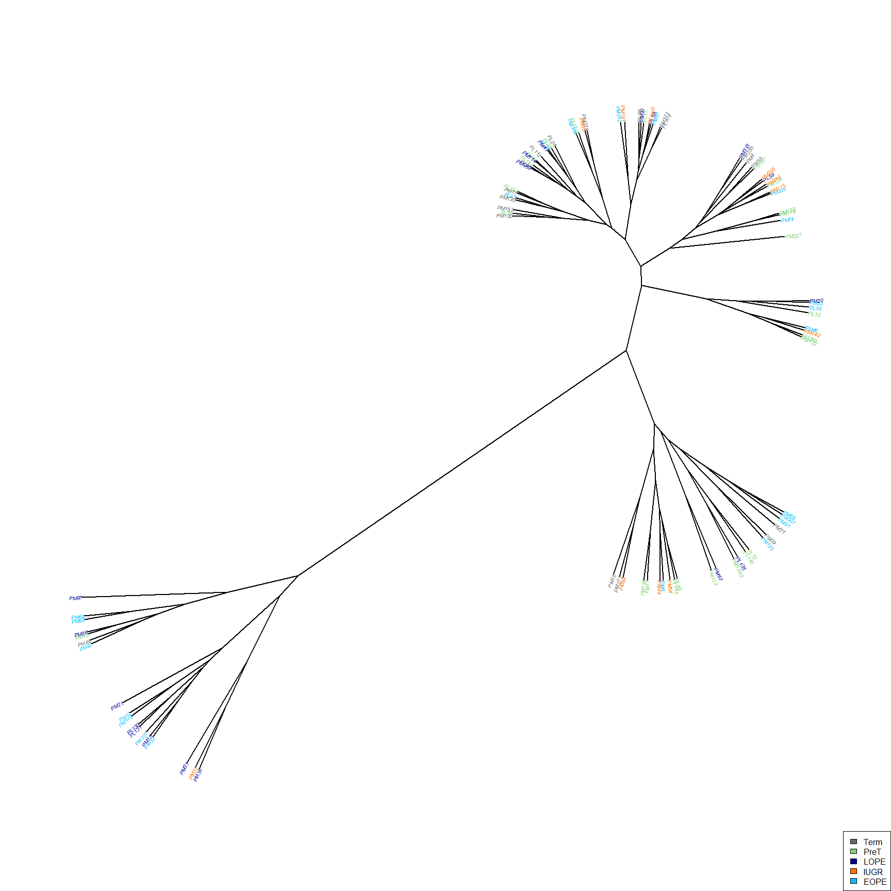<!-- -->

```r
##This is interesting, there appears to be an EOPE groups, LOPE group and control group

##Cox
mvalues =Cox_Top7
D = dist(t(mvalues))
clust = hclust(D,method="complete")
plot(as.phylo(clust), lab4ut="axial", type = "unrooted", no.margin = TRUE, edge.width=2,cex=0.6,tip.col=Coxv.grp.col)
legend("bottomright",c("Term","PreT","LOPE","IUGR","EOPE"),fill=c("#696969","#7fd071","#000199","#02c0fa"))
```

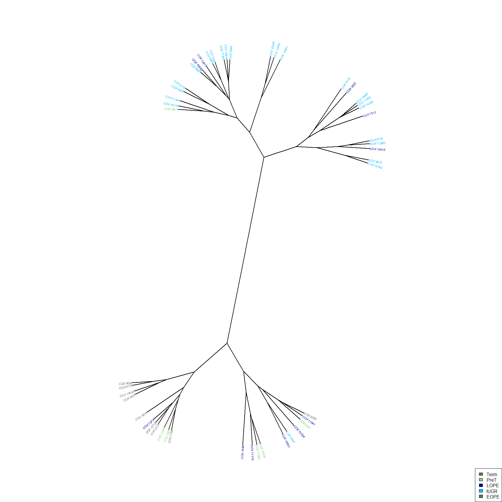<!-- -->

```r
##This is interesting, there appears to be an EOPE groups, LOPE group and control group
```


```r
##Sites that met FDR<0.05 in the discovery cohort
Roblab_EOPE0.05<-read.table('Roblab_EOPE_FDR0.05.txt',header=T)

##Load Cox lab LM to get the betas
load('ttbeta_all_Cox_LM.RData')

##Merge the betas
EOPEvspreterm_betas<-ttbeta_all[which(rownames(ttbeta_all) %in% rownames(Roblab_EOPE0.05)),]
head(EOPEvspreterm_betas)
```

```
##              PreTvsEOPE  PreTvsLOPE TermvsEOPE  TermvsLOPE TermvsPreT
## cg13192180 -0.007323179 -0.01703658 0.01392755 0.004214140 0.02125072
## cg01030406  0.042159469 -0.04701122 0.11464466 0.025473976 0.07248520
## cg13631318 -0.026223959 -0.12548374 0.10383493 0.004575152 0.13005889
## cg24797431  0.032489409 -0.04929951 0.16081198 0.079023066 0.12832257
## cg08721112  0.006476392 -0.03749431 0.06142189 0.017451194 0.05494550
## cg03880841  0.018139095 -0.01662304 0.08047896 0.045716833 0.06233987
##                     Sex    AveExpr        F      P.Value    adj.P.Val
## cg13192180  0.114644057 0.82144591 69.24885 1.949164e-18 4.307926e-13
## cg01030406 -0.028634276 0.44510010 33.18807 8.795038e-13 4.328842e-08
## cg13631318  0.111082608 0.29211513 33.08420 9.256402e-13 4.328842e-08
## cg24797431 -0.023102106 0.36183411 31.84099 1.722862e-12 6.006908e-08
## cg08721112  0.058125447 0.50535243 31.79152 1.766626e-12 6.006908e-08
## cg03880841 -0.001581172 0.09176943 30.57604 3.301912e-12 8.193831e-08
```

```r
EOPEvspreterm_betas2<-as.data.frame(EOPEvspreterm_betas[,c("PreTvsEOPE")])
rownames(EOPEvspreterm_betas2)<-rownames(EOPEvspreterm_betas)
EOPEvspreterm_betas2$BVal_EOPE<-EOPEvspreterm_betas2$`EOPEvspreterm_betas[, c("PreTvsEOPE")]`
EOPEvspreterm_betas2$`EOPEvspreterm_betas[, c("PreTvsEOPE")]`<-NULL

Roblab_Cox_EOPEBetas<-merge(Roblab_EOPE0.05,EOPEvspreterm_betas2,by='row.names')##difference in probe number due to bad quality probes removed from Cox data

##Merge with annotation
anno<-read.table('Uber annotation.txt',header=T)
##Merge with EOPE Data
rownames(Roblab_Cox_EOPEBetas)<-Roblab_Cox_EOPEBetas$Row.names
Roblab_Cox_EOPEBetas_Gene<-merge(Roblab_Cox_EOPEBetas,anno,by='row.names')##74016 probes
rownames(Roblab_Cox_EOPEBetas_Gene)<-Roblab_Cox_EOPEBetas_Gene$IlmnID
##Use only the data needed (Betas,IlmnID,GeneName)
Roblab_Cox_EOPEBetas_Gene<-Roblab_Cox_EOPEBetas_Gene[,c("PreTvsEOPE","BVal_EOPE","IlmnID","Closest_TSS_gene_name")]

##Sites DB>0.2
DB0.2sites<-subset(Roblab_Cox_EOPEBetas_Gene,Roblab_Cox_EOPEBetas_Gene$PreTvsEOPE>abs(0.2) & Roblab_Cox_EOPEBetas_Gene$BVal_EOPE>abs(0.2))


##Let's go with these sites
##Change E1 and E2 in the design matrix to just E1
Roblab_des$Cluster<-recode(Roblab_des$Cluster,"E2"="E1")
Cox_des$Cluster<-recode(Cox_des$Cluster,"E2"="E1")

##TEAD3
Roblab_TEAD3<-as.data.frame(Roblab_Data[which(rownames(Roblab_Data)=='cg10893014'),])
Roblab_TEAD3<-m2beta(Roblab_TEAD3)
colnames(Roblab_TEAD3)<-c("beta")

Roblab_des_Clus<-as.data.frame(Roblab_des$Cluster)
rownames(Roblab_des_Clus)<-rownames(Roblab_des)
Roblab_TEAD3<-merge(Roblab_TEAD3,Roblab_des_Clus,by='row.names')
Roblab_TEAD3$Row.names<-NULL
colnames(Roblab_TEAD3)<-c("Beta","Cluster")

Cox_TEAD3<-as.data.frame(Cox_Data[which(rownames(Cox_Data)=='cg10893014'),])
Cox_TEAD3<-m2beta(Cox_TEAD3)
colnames(Cox_TEAD3)<-c("beta")

Cox_des_Clus<-as.data.frame(Cox_des$Cluster)
rownames(Cox_des_Clus)<-rownames(Cox_des)
Cox_TEAD3<-merge(Cox_TEAD3,Cox_des_Clus,by='row.names')
Cox_TEAD3$Row.names<-NULL
colnames(Cox_TEAD3)<-c("Beta","Cluster")

##Joy Plot
Roblab_TEAD3Dist<-ggplot(Roblab_TEAD3, aes(x = Beta, y = Cluster,fill=Cluster)) +
  geom_joy(scale = 4) + theme_joy() +
  scale_y_discrete(expand = c(0.01, 0)) +   # will generally have to set the `expand` option
  scale_x_continuous(expand = c(0, 0))  +   # for both axes to remove unneeded padding
  scale_fill_cyclical(values = c("#696969","#02c0fa","#7fd071"),guide="legend") 

Cox_TEAD3Dist<-ggplot(Cox_TEAD3, aes(x = Beta, y = Cluster, fill=Cluster)) +
  geom_joy(scale = 4) + theme_joy() +
  scale_y_discrete(expand = c(0.01, 0)) +   # will generally have to set the `expand` option
  scale_x_continuous(expand = c(0, 0))  +  # for both axes to remove unneeded padding
  scale_fill_cyclical(values = c("#696969","#02c0fa","#7fd071"),guide="legend") 

grid.arrange(Roblab_TEAD3Dist,Cox_TEAD3Dist,nrow=1)
```

```
## Picking joint bandwidth of 0.0082
```

```
## Picking joint bandwidth of 0.00632
```

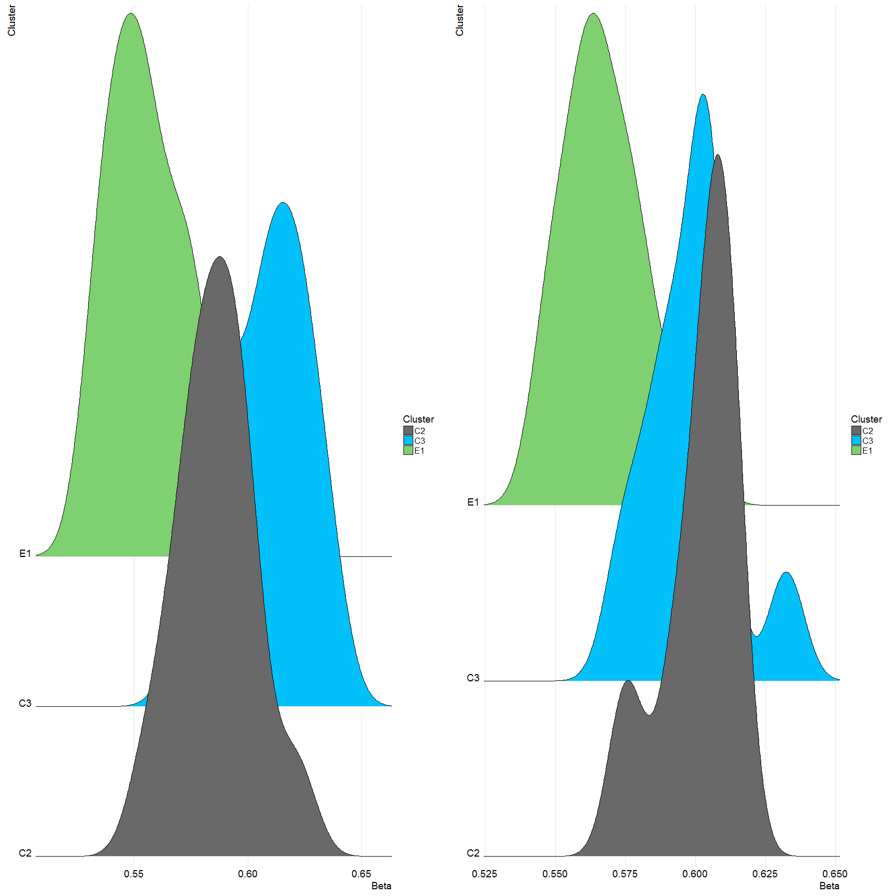<!-- -->

```r
##FN1
Roblab_FN1<-as.data.frame(Roblab_Data[which(rownames(Roblab_Data)=='cg12436772'),])
Roblab_FN1<-m2beta(Roblab_FN1)
colnames(Roblab_FN1)<-c("beta")

Roblab_des_Clus<-as.data.frame(Roblab_des$Cluster)
rownames(Roblab_des_Clus)<-rownames(Roblab_des)
Roblab_FN1<-merge(Roblab_FN1,Roblab_des_Clus,by='row.names')
Roblab_FN1$Row.names<-NULL
colnames(Roblab_FN1)<-c("Beta","Cluster")

Cox_FN1<-as.data.frame(Cox_Data[which(rownames(Cox_Data)=='cg12436772'),])
Cox_FN1<-m2beta(Cox_FN1)
colnames(Cox_FN1)<-c("beta")

Cox_des_Clus<-as.data.frame(Cox_des$Cluster)
rownames(Cox_des_Clus)<-rownames(Cox_des)
Cox_FN1<-merge(Cox_FN1,Cox_des_Clus,by='row.names')
Cox_FN1$Row.names<-NULL
colnames(Cox_FN1)<-c("Beta","Cluster")

##Joy Plot
Roblab_FN1Dist<-ggplot(Roblab_FN1, aes(x = Beta, y = Cluster,fill=Cluster)) +
  geom_joy(scale = 4) + theme_joy() +
  scale_y_discrete(expand = c(0.01, 0)) +   # will generally have to set the `expand` option
  scale_x_continuous(expand = c(0, 0))  +   # for both axes to remove unneeded padding
  scale_fill_cyclical(values = c("#696969","#02c0fa","#7fd071"),guide="legend") 

Cox_FN1Dist<-ggplot(Cox_FN1, aes(x = Beta, y = Cluster, fill=Cluster)) +
  geom_joy(scale = 4) + theme_joy() +
  scale_y_discrete(expand = c(0.01, 0)) +   # will generally have to set the `expand` option
  scale_x_continuous(expand = c(0, 0))  +  # for both axes to remove unneeded padding
  scale_fill_cyclical(values = c("#696969","#02c0fa","#7fd071"),guide="legend") 

grid.arrange(Roblab_FN1Dist,Cox_FN1Dist,nrow=1)
```

```
## Picking joint bandwidth of 0.00602
```

```
## Picking joint bandwidth of 0.0055
```

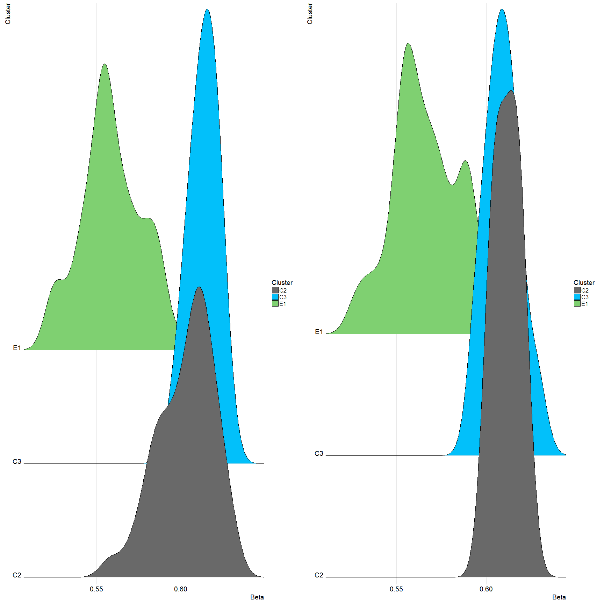<!-- -->

```r
##PKM2
Roblab_PKM2<-as.data.frame(Roblab_Data[which(rownames(Roblab_Data)=='cg22234930'),])
Roblab_PKM2<-m2beta(Roblab_PKM2)
colnames(Roblab_PKM2)<-c("beta")

Roblab_des_Clus<-as.data.frame(Roblab_des$Cluster)
rownames(Roblab_des_Clus)<-rownames(Roblab_des)
Roblab_PKM2<-merge(Roblab_PKM2,Roblab_des_Clus,by='row.names')
Roblab_PKM2$Row.names<-NULL
colnames(Roblab_PKM2)<-c("Beta","Cluster")

Cox_PKM2<-as.data.frame(Cox_Data[which(rownames(Cox_Data)=='cg22234930'),])
Cox_PKM2<-m2beta(Cox_PKM2)
colnames(Cox_PKM2)<-c("beta")

Cox_des_Clus<-as.data.frame(Cox_des$Cluster)
rownames(Cox_des_Clus)<-rownames(Cox_des)
Cox_PKM2<-merge(Cox_PKM2,Cox_des_Clus,by='row.names')
Cox_PKM2$Row.names<-NULL
colnames(Cox_PKM2)<-c("Beta","Cluster")

##Joy Plot
Roblab_PKM2Dist<-ggplot(Roblab_PKM2, aes(x = Beta, y = Cluster,fill=Cluster)) +
  geom_joy(scale = 4) + theme_joy() +
  scale_y_discrete(expand = c(0.01, 0)) +   # will generally have to set the `expand` option
  scale_x_continuous(expand = c(0, 0))  +   # for both axes to remove unneeded padding
  scale_fill_cyclical(values = c("#696969","#02c0fa","#7fd071"),guide="legend") 

Cox_PKM2Dist<-ggplot(Cox_PKM2, aes(x = Beta, y = Cluster, fill=Cluster)) +
  geom_joy(scale = 4) + theme_joy() +
  scale_y_discrete(expand = c(0.01, 0)) +   # will generally have to set the `expand` option
  scale_x_continuous(expand = c(0, 0))  +  # for both axes to remove unneeded padding
  scale_fill_cyclical(values = c("#696969","#02c0fa","#7fd071"),guide="legend") 

grid.arrange(Roblab_PKM2Dist,Cox_PKM2Dist,nrow=1)
```

```
## Picking joint bandwidth of 0.00441
```

```
## Picking joint bandwidth of 0.00407
```

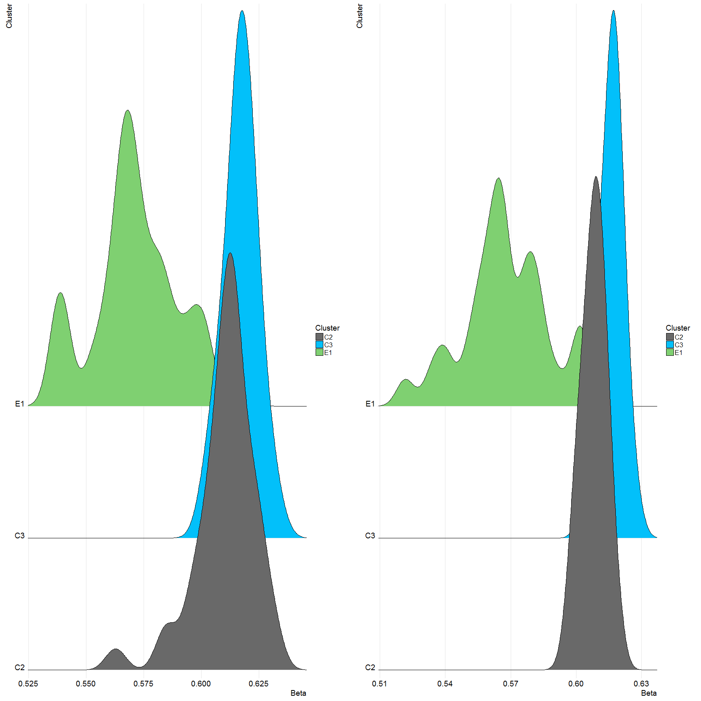<!-- -->

```r
##KRT15
Roblab_KRT15<-as.data.frame(Roblab_Data[which(rownames(Roblab_Data)=='cg26625897'),])
Roblab_KRT15<-m2beta(Roblab_KRT15)
colnames(Roblab_KRT15)<-c("beta")

Roblab_des_Clus<-as.data.frame(Roblab_des$Cluster)
rownames(Roblab_des_Clus)<-rownames(Roblab_des)
Roblab_KRT15<-merge(Roblab_KRT15,Roblab_des_Clus,by='row.names')
Roblab_KRT15$Row.names<-NULL
colnames(Roblab_KRT15)<-c("Beta","Cluster")

Cox_KRT15<-as.data.frame(Cox_Data[which(rownames(Cox_Data)=='cg26625897'),])
Cox_KRT15<-m2beta(Cox_KRT15)
colnames(Cox_KRT15)<-c("beta")

Cox_des_Clus<-as.data.frame(Cox_des$Cluster)
rownames(Cox_des_Clus)<-rownames(Cox_des)
Cox_KRT15<-merge(Cox_KRT15,Cox_des_Clus,by='row.names')
Cox_KRT15$Row.names<-NULL
colnames(Cox_KRT15)<-c("Beta","Cluster")

##Joy Plot
Roblab_KRT15Dist<-ggplot(Roblab_KRT15, aes(x = Beta, y = Cluster,fill=Cluster)) +
  geom_joy(scale = 4) + theme_joy() +
  scale_y_discrete(expand = c(0.01, 0)) +   # will generally have to set the `expand` option
  scale_x_continuous(expand = c(0, 0))  +   # for both axes to remove unneeded padding
  scale_fill_cyclical(values = c("#696969","#02c0fa","#7fd071"),guide="legend") 

Cox_KRT15Dist<-ggplot(Cox_KRT15, aes(x = Beta, y = Cluster, fill=Cluster)) +
  geom_joy(scale = 4) + theme_joy() +
  scale_y_discrete(expand = c(0.01, 0)) +   # will generally have to set the `expand` option
  scale_x_continuous(expand = c(0, 0))  +  # for both axes to remove unneeded padding
  scale_fill_cyclical(values = c("#696969","#02c0fa","#7fd071"),guide="legend") 

grid.arrange(Roblab_KRT15Dist,Cox_KRT15Dist,nrow=1)
```

```
## Picking joint bandwidth of 0.00515
```

```
## Picking joint bandwidth of 0.00604
```

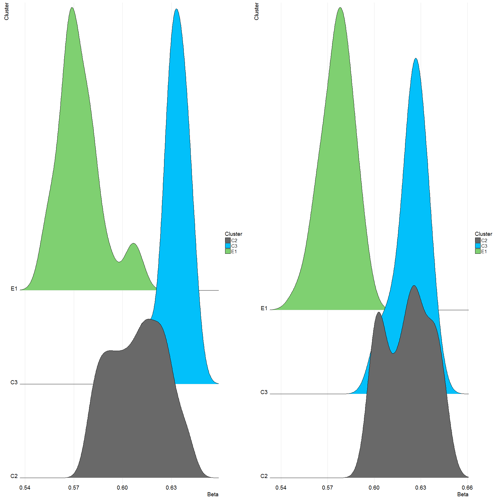<!-- -->

```r
##JUNB cg22996170
Roblab_JUNB<-as.data.frame(Roblab_Data[which(rownames(Roblab_Data)=='cg22996170'),])
Roblab_JUNB<-m2beta(Roblab_JUNB)
colnames(Roblab_JUNB)<-c("beta")

Roblab_des_Clus<-as.data.frame(Roblab_des$Cluster)
rownames(Roblab_des_Clus)<-rownames(Roblab_des)
Roblab_JUNB<-merge(Roblab_JUNB,Roblab_des_Clus,by='row.names')
Roblab_JUNB$Row.names<-NULL
colnames(Roblab_JUNB)<-c("Beta","Cluster")

Cox_JUNB<-as.data.frame(Cox_Data[which(rownames(Cox_Data)=='cg22996170'),])
Cox_JUNB<-m2beta(Cox_JUNB)
colnames(Cox_JUNB)<-c("beta")

Cox_des_Clus<-as.data.frame(Cox_des$Cluster)
rownames(Cox_des_Clus)<-rownames(Cox_des)
Cox_JUNB<-merge(Cox_JUNB,Cox_des_Clus,by='row.names')
Cox_JUNB$Row.names<-NULL
colnames(Cox_JUNB)<-c("Beta","Cluster")

##Joy Plot
Roblab_JUNBDist<-ggplot(Roblab_JUNB, aes(x = Beta, y = Cluster,fill=Cluster)) +
  geom_joy(scale = 4) + theme_joy() +
  scale_y_discrete(expand = c(0.01, 0)) +   # will generally have to set the `expand` option
  scale_x_continuous(expand = c(0, 0))  +   # for both axes to remove unneeded padding
  scale_fill_cyclical(values = c("#696969","#02c0fa","#7fd071"),guide="legend") 

Cox_JUNBDist<-ggplot(Cox_JUNB, aes(x = Beta, y = Cluster, fill=Cluster)) +
  geom_joy(scale = 4) + theme_joy() +
  scale_y_discrete(expand = c(0.01, 0)) +   # will generally have to set the `expand` option
  scale_x_continuous(expand = c(0, 0))  +  # for both axes to remove unneeded padding
  scale_fill_cyclical(values = c("#696969","#02c0fa","#7fd071"),guide="legend") 

grid.arrange(Roblab_JUNBDist,Cox_JUNBDist,nrow=1)
```

```
## Picking joint bandwidth of 0.00639
```

```
## Picking joint bandwidth of 0.00588
```

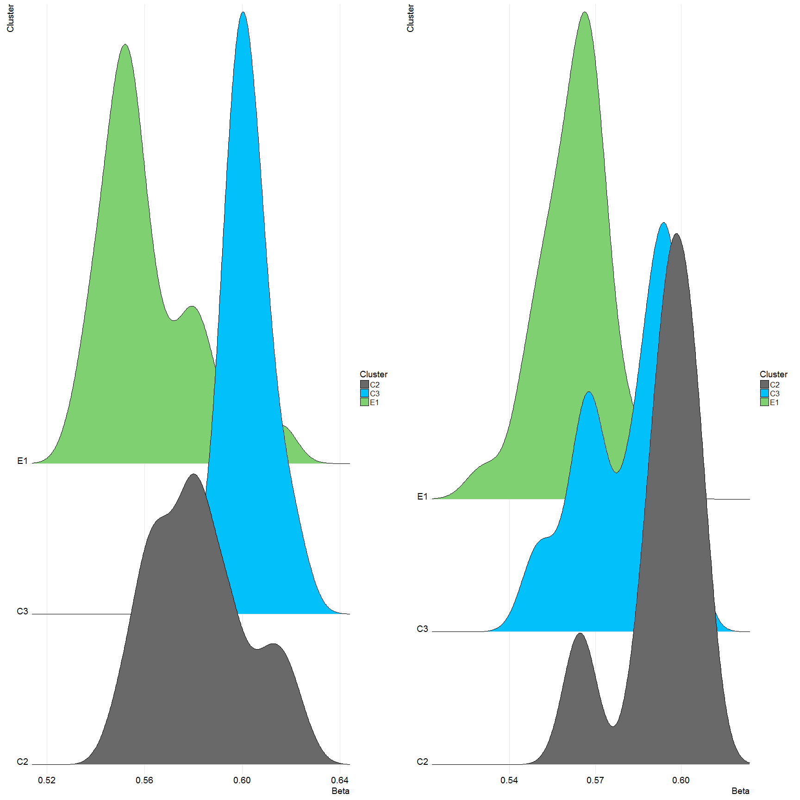<!-- -->

```r
##FAM3B
Roblab_FAM3B<-as.data.frame(Roblab_Data[which(rownames(Roblab_Data)=='cg09179211'),])
Roblab_FAM3B<-m2beta(Roblab_FAM3B)
colnames(Roblab_FAM3B)<-c("beta")

Roblab_des_Clus<-as.data.frame(Roblab_des$Cluster)
rownames(Roblab_des_Clus)<-rownames(Roblab_des)
Roblab_FAM3B<-merge(Roblab_FAM3B,Roblab_des_Clus,by='row.names')
Roblab_FAM3B$Row.names<-NULL
colnames(Roblab_FAM3B)<-c("Beta","Cluster")

Cox_FAM3B<-as.data.frame(Cox_Data[which(rownames(Cox_Data)=='cg09179211'),])
Cox_FAM3B<-m2beta(Cox_FAM3B)
colnames(Cox_FAM3B)<-c("beta")

Cox_des_Clus<-as.data.frame(Cox_des$Cluster)
rownames(Cox_des_Clus)<-rownames(Cox_des)
Cox_FAM3B<-merge(Cox_FAM3B,Cox_des_Clus,by='row.names')
Cox_FAM3B$Row.names<-NULL
colnames(Cox_FAM3B)<-c("Beta","Cluster")

##Joy Plot
Roblab_FAM3BDist<-ggplot(Roblab_FAM3B, aes(x = Beta, y = Cluster,fill=Cluster)) +
  geom_joy(scale = 4) + theme_joy() +
  scale_y_discrete(expand = c(0.01, 0)) +   # will generally have to set the `expand` option
  scale_x_continuous(expand = c(0, 0))  +   # for both axes to remove unneeded padding
  scale_fill_cyclical(values = c("#696969","#02c0fa","#7fd071"),guide="legend") 

Cox_FAM3BDist<-ggplot(Cox_FAM3B, aes(x = Beta, y = Cluster, fill=Cluster)) +
  geom_joy(scale = 4) + theme_joy() +
  scale_y_discrete(expand = c(0.01, 0)) +   # will generally have to set the `expand` option
  scale_x_continuous(expand = c(0, 0))  +  # for both axes to remove unneeded padding
  scale_fill_cyclical(values = c("#696969","#02c0fa","#7fd071"),guide="legend") 

grid.arrange(Roblab_FAM3BDist,Cox_FAM3BDist,nrow=1)
```

```
## Picking joint bandwidth of 0.0088
```

```
## Picking joint bandwidth of 0.0114
```

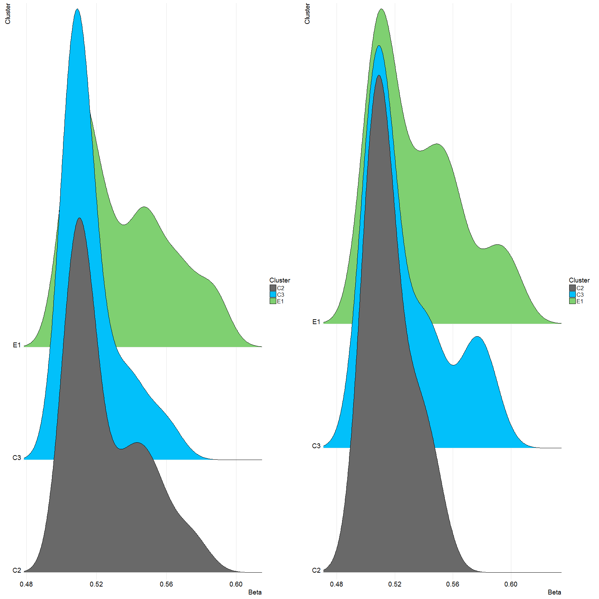<!-- -->

```r
##FAM3B-2
Roblab_FAM3B<-as.data.frame(Roblab_Data[which(rownames(Roblab_Data)=='cg10054197'),])
Roblab_FAM3B<-m2beta(Roblab_FAM3B)
colnames(Roblab_FAM3B)<-c("beta")

Roblab_des_Clus<-as.data.frame(Roblab_des$Cluster)
rownames(Roblab_des_Clus)<-rownames(Roblab_des)
Roblab_FAM3B<-merge(Roblab_FAM3B,Roblab_des_Clus,by='row.names')
Roblab_FAM3B$Row.names<-NULL
colnames(Roblab_FAM3B)<-c("Beta","Cluster")

Cox_FAM3B<-as.data.frame(Cox_Data[which(rownames(Cox_Data)=='cg10054197'),])
Cox_FAM3B<-m2beta(Cox_FAM3B)
colnames(Cox_FAM3B)<-c("beta")

Cox_des_Clus<-as.data.frame(Cox_des$Cluster)
rownames(Cox_des_Clus)<-rownames(Cox_des)
Cox_FAM3B<-merge(Cox_FAM3B,Cox_des_Clus,by='row.names')
Cox_FAM3B$Row.names<-NULL
colnames(Cox_FAM3B)<-c("Beta","Cluster")

##Joy Plot
Roblab_FAM3BDist<-ggplot(Roblab_FAM3B, aes(x = Beta, y = Cluster,fill=Cluster)) +
  geom_joy(scale = 4) + theme_joy() +
  scale_y_discrete(expand = c(0.01, 0)) +   # will generally have to set the `expand` option
  scale_x_continuous(expand = c(0, 0))  +   # for both axes to remove unneeded padding
  scale_fill_cyclical(values = c("#696969","#02c0fa","#7fd071"),guide="legend") 

Cox_FAM3BDist<-ggplot(Cox_FAM3B, aes(x = Beta, y = Cluster, fill=Cluster)) +
  geom_joy(scale = 4) + theme_joy() +
  scale_y_discrete(expand = c(0.01, 0)) +   # will generally have to set the `expand` option
  scale_x_continuous(expand = c(0, 0))  +  # for both axes to remove unneeded padding
  scale_fill_cyclical(values = c("#696969","#02c0fa","#7fd071"),guide="legend") 

grid.arrange(Roblab_FAM3BDist,Cox_FAM3BDist,nrow=1)
```

```
## Picking joint bandwidth of 0.00665
```

```
## Picking joint bandwidth of 0.0079
```

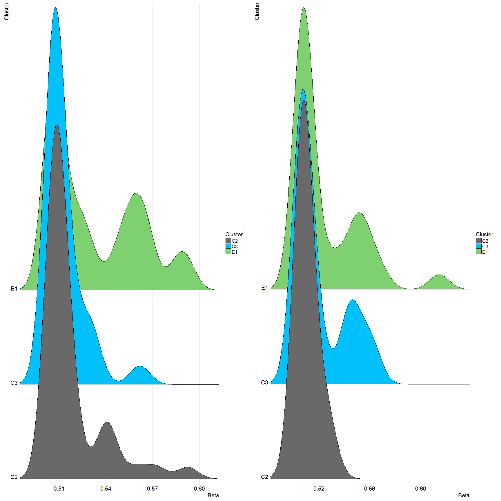<!-- -->

```r
##IL7-how well does it divide between cluster 2 and cluster 3
Roblab_IL7<-as.data.frame(Roblab_Data[which(rownames(Roblab_Data)=='cg14556425'),])
Roblab_IL7<-m2beta(Roblab_IL7)
colnames(Roblab_IL7)<-c("beta")

Roblab_des_Clus<-as.data.frame(Roblab_des$Cluster)
rownames(Roblab_des_Clus)<-rownames(Roblab_des)
Roblab_IL7<-merge(Roblab_IL7,Roblab_des_Clus,by='row.names')
Roblab_IL7$Row.names<-NULL
colnames(Roblab_IL7)<-c("Beta","Cluster")

Cox_IL7<-as.data.frame(Cox_Data[which(rownames(Cox_Data)=='cg14556425'),])
Cox_IL7<-m2beta(Cox_IL7)
colnames(Cox_IL7)<-c("beta")

Cox_des_Clus<-as.data.frame(Cox_des$Cluster)
rownames(Cox_des_Clus)<-rownames(Cox_des)
Cox_IL7<-merge(Cox_IL7,Cox_des_Clus,by='row.names')
Cox_IL7$Row.names<-NULL
colnames(Cox_IL7)<-c("Beta","Cluster")

##Joy Plot
Roblab_IL7Dist<-ggplot(Roblab_IL7, aes(x = Beta, y = Cluster,fill=Cluster)) +
  geom_joy(scale = 4) + theme_joy() +
  scale_y_discrete(expand = c(0.01, 0)) +   # will generally have to set the `expand` option
  scale_x_continuous(expand = c(0, 0))  +   # for both axes to remove unneeded padding
  scale_fill_cyclical(values = c("#696969","#02c0fa","#7fd071"),guide="legend") 

Cox_IL7Dist<-ggplot(Cox_IL7, aes(x = Beta, y = Cluster, fill=Cluster)) +
  geom_joy(scale = 4) + theme_joy() +
  scale_y_discrete(expand = c(0.01, 0)) +   # will generally have to set the `expand` option
  scale_x_continuous(expand = c(0, 0))  +  # for both axes to remove unneeded padding
  scale_fill_cyclical(values = c("#696969","#02c0fa","#7fd071"),guide="legend") 

grid.arrange(Roblab_IL7Dist,Cox_IL7Dist,nrow=1)
```

```
## Picking joint bandwidth of 0.00901
```

```
## Picking joint bandwidth of 0.00704
```

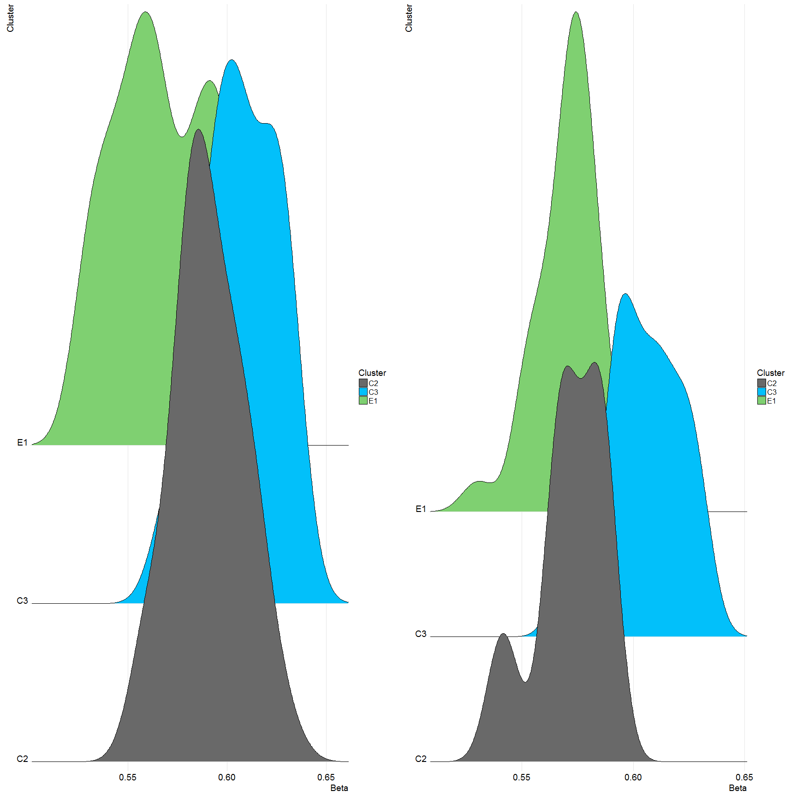<!-- -->

```r
##KIF21B
Roblab_KIF21B<-as.data.frame(Roblab_Data[which(rownames(Roblab_Data)=='cg07344172'),])
Roblab_KIF21B<-m2beta(Roblab_KIF21B)
colnames(Roblab_KIF21B)<-c("beta")

Roblab_des_Clus<-as.data.frame(Roblab_des$Cluster)
rownames(Roblab_des_Clus)<-rownames(Roblab_des)
Roblab_KIF21B<-merge(Roblab_KIF21B,Roblab_des_Clus,by='row.names')
Roblab_KIF21B$Row.names<-NULL
colnames(Roblab_KIF21B)<-c("Beta","Cluster")

Cox_KIF21B<-as.data.frame(Cox_Data[which(rownames(Cox_Data)=='cg07344172'),])
Cox_KIF21B<-m2beta(Cox_KIF21B)
colnames(Cox_KIF21B)<-c("beta")

Cox_des_Clus<-as.data.frame(Cox_des$Cluster)
rownames(Cox_des_Clus)<-rownames(Cox_des)
Cox_KIF21B<-merge(Cox_KIF21B,Cox_des_Clus,by='row.names')
Cox_KIF21B$Row.names<-NULL
colnames(Cox_KIF21B)<-c("Beta","Cluster")

##Joy Plot
Roblab_KIF21BDist<-ggplot(Roblab_KIF21B, aes(x = Beta, y = Cluster,fill=Cluster)) +
  geom_joy(scale = 4) + theme_joy() +
  scale_y_discrete(expand = c(0.01, 0)) +   # will generally have to set the `expand` option
  scale_x_continuous(expand = c(0, 0))  +   # for both axes to remove unneeded padding
  scale_fill_cyclical(values = c("#696969","#02c0fa","#7fd071"),guide="legend") 

Cox_KIF21BDist<-ggplot(Cox_KIF21B, aes(x = Beta, y = Cluster, fill=Cluster)) +
  geom_joy(scale = 4) + theme_joy() +
  scale_y_discrete(expand = c(0.01, 0)) +   # will generally have to set the `expand` option
  scale_x_continuous(expand = c(0, 0))  +  # for both axes to remove unneeded padding
  scale_fill_cyclical(values = c("#696969","#02c0fa","#7fd071"),guide="legend") 

grid.arrange(Roblab_KIF21BDist,Cox_KIF21BDist,nrow=1)
```

```
## Picking joint bandwidth of 0.00489
```

```
## Picking joint bandwidth of 0.0043
```

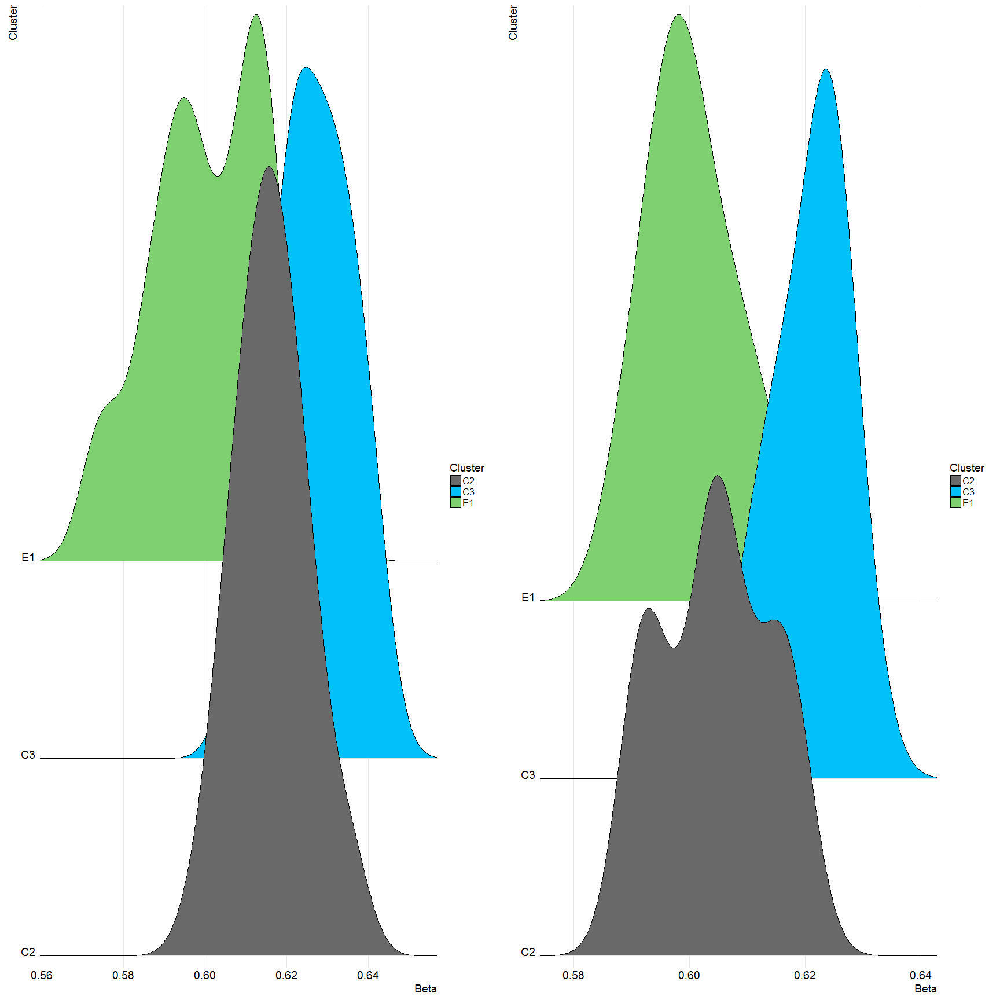<!-- -->

```r
##SLC5A9
Roblab_SLC5A9<-as.data.frame(Roblab_Data[which(rownames(Roblab_Data)=='cg25469314'),])
Roblab_SLC5A9<-m2beta(Roblab_SLC5A9)
colnames(Roblab_SLC5A9)<-c("beta")

Roblab_des_Clus<-as.data.frame(Roblab_des$Cluster)
rownames(Roblab_des_Clus)<-rownames(Roblab_des)
Roblab_SLC5A9<-merge(Roblab_SLC5A9,Roblab_des_Clus,by='row.names')
Roblab_SLC5A9$Row.names<-NULL
colnames(Roblab_SLC5A9)<-c("Beta","Cluster")

Cox_SLC5A9<-as.data.frame(Cox_Data[which(rownames(Cox_Data)=='cg25469314'),])
Cox_SLC5A9<-m2beta(Cox_SLC5A9)
colnames(Cox_SLC5A9)<-c("beta")

Cox_des_Clus<-as.data.frame(Cox_des$Cluster)
rownames(Cox_des_Clus)<-rownames(Cox_des)
Cox_SLC5A9<-merge(Cox_SLC5A9,Cox_des_Clus,by='row.names')
Cox_SLC5A9$Row.names<-NULL
colnames(Cox_SLC5A9)<-c("Beta","Cluster")

##Joy Plot
Roblab_SLC5A9Dist<-ggplot(Roblab_SLC5A9, aes(x = Beta, y = Cluster,fill=Cluster)) +
  geom_joy(scale = 4) + theme_joy() +
  scale_y_discrete(expand = c(0.01, 0)) +   # will generally have to set the `expand` option
  scale_x_continuous(expand = c(0, 0))  +   # for both axes to remove unneeded padding
  scale_fill_cyclical(values = c("#696969","#02c0fa","#7fd071"),guide="legend") 

Cox_SLC5A9Dist<-ggplot(Cox_SLC5A9, aes(x = Beta, y = Cluster, fill=Cluster)) +
  geom_joy(scale = 4) + theme_joy() +
  scale_y_discrete(expand = c(0.01, 0)) +   # will generally have to set the `expand` option
  scale_x_continuous(expand = c(0, 0))  +  # for both axes to remove unneeded padding
  scale_fill_cyclical(values = c("#696969","#02c0fa","#7fd071"),guide="legend") 

grid.arrange(Roblab_SLC5A9Dist,Cox_SLC5A9Dist,nrow=1)
```

```
## Picking joint bandwidth of 0.00534
```

```
## Picking joint bandwidth of 0.00429
```

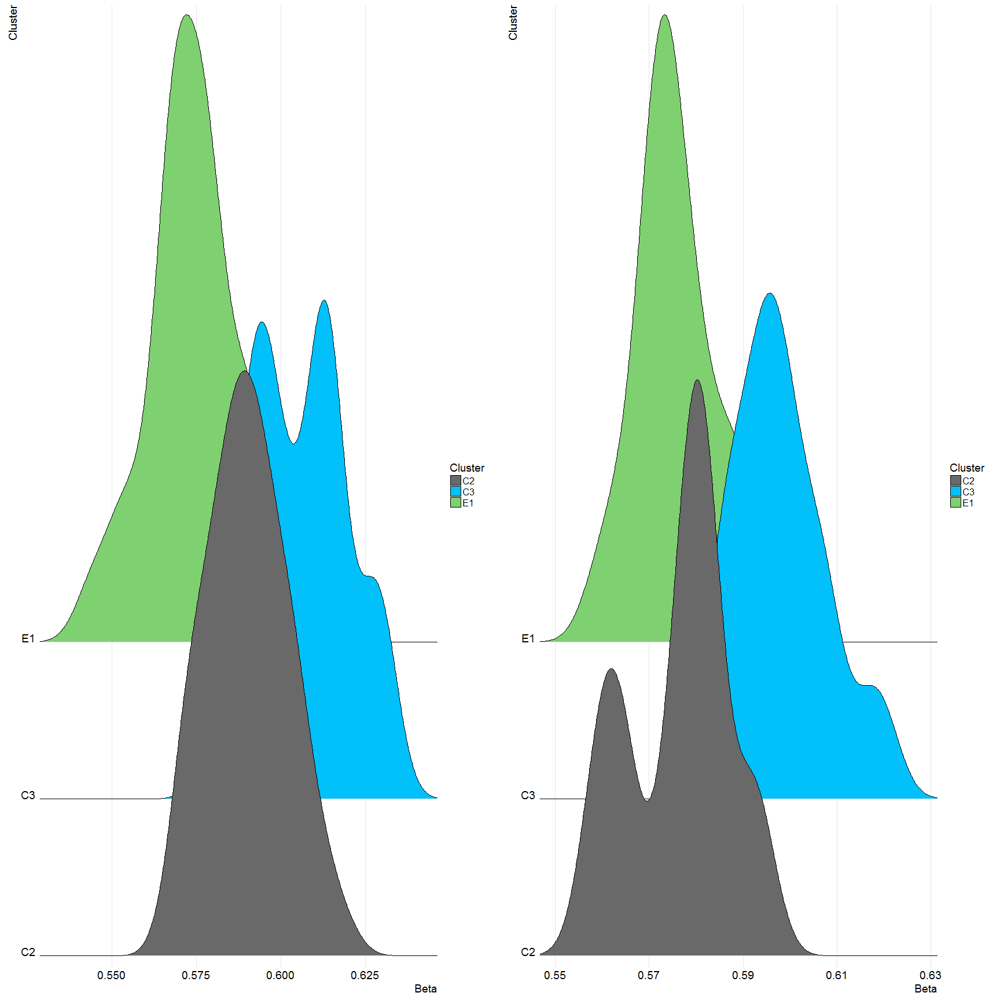<!-- -->

```r
##HIVEP3
Roblab_HIVEP3<-as.data.frame(Roblab_Data[which(rownames(Roblab_Data)=='cg25469314'),])
Roblab_HIVEP3<-m2beta(Roblab_HIVEP3)
colnames(Roblab_HIVEP3)<-c("beta")

Roblab_des_Clus<-as.data.frame(Roblab_des$Cluster)
rownames(Roblab_des_Clus)<-rownames(Roblab_des)
Roblab_HIVEP3<-merge(Roblab_HIVEP3,Roblab_des_Clus,by='row.names')
Roblab_HIVEP3$Row.names<-NULL
colnames(Roblab_HIVEP3)<-c("Beta","Cluster")

Cox_HIVEP3<-as.data.frame(Cox_Data[which(rownames(Cox_Data)=='cg25469314'),])
Cox_HIVEP3<-m2beta(Cox_HIVEP3)
colnames(Cox_HIVEP3)<-c("beta")

Cox_des_Clus<-as.data.frame(Cox_des$Cluster)
rownames(Cox_des_Clus)<-rownames(Cox_des)
Cox_HIVEP3<-merge(Cox_HIVEP3,Cox_des_Clus,by='row.names')
Cox_HIVEP3$Row.names<-NULL
colnames(Cox_HIVEP3)<-c("Beta","Cluster")

##Joy Plot
Roblab_HIVEP3Dist<-ggplot(Roblab_HIVEP3, aes(x = Beta, y = Cluster,fill=Cluster)) +
  geom_joy(scale = 4) + theme_joy() +
  scale_y_discrete(expand = c(0.01, 0)) +   # will generally have to set the `expand` option
  scale_x_continuous(expand = c(0, 0))  +   # for both axes to remove unneeded padding
  scale_fill_cyclical(values = c("#696969","#02c0fa","#7fd071"),guide="legend") 

Cox_HIVEP3Dist<-ggplot(Cox_HIVEP3, aes(x = Beta, y = Cluster, fill=Cluster)) +
  geom_joy(scale = 4) + theme_joy() +
  scale_y_discrete(expand = c(0.01, 0)) +   # will generally have to set the `expand` option
  scale_x_continuous(expand = c(0, 0))  +  # for both axes to remove unneeded padding
  scale_fill_cyclical(values = c("#696969","#02c0fa","#7fd071"),guide="legend") 

grid.arrange(Roblab_HIVEP3Dist,Cox_HIVEP3Dist,nrow=1)
```

```
## Picking joint bandwidth of 0.00534
## Picking joint bandwidth of 0.00429
```

<!-- -->

```r
##CHRM2
Roblab_CHRM2<-as.data.frame(Roblab_Data[which(rownames(Roblab_Data)=='cg07116919'),])
Roblab_CHRM2<-m2beta(Roblab_CHRM2)
colnames(Roblab_CHRM2)<-c("beta")

Roblab_des_Clus<-as.data.frame(Roblab_des$Cluster)
rownames(Roblab_des_Clus)<-rownames(Roblab_des)
Roblab_CHRM2<-merge(Roblab_CHRM2,Roblab_des_Clus,by='row.names')
Roblab_CHRM2$Row.names<-NULL
colnames(Roblab_CHRM2)<-c("Beta","Cluster")

Cox_CHRM2<-as.data.frame(Cox_Data[which(rownames(Cox_Data)=='cg07116919'),])
Cox_CHRM2<-m2beta(Cox_CHRM2)
colnames(Cox_CHRM2)<-c("beta")

Cox_des_Clus<-as.data.frame(Cox_des$Cluster)
rownames(Cox_des_Clus)<-rownames(Cox_des)
Cox_CHRM2<-merge(Cox_CHRM2,Cox_des_Clus,by='row.names')
Cox_CHRM2$Row.names<-NULL
colnames(Cox_CHRM2)<-c("Beta","Cluster")

##Joy Plot
Roblab_CHRM2Dist<-ggplot(Roblab_CHRM2, aes(x = Beta, y = Cluster,fill=Cluster)) +
  geom_joy(scale = 4) + theme_joy() +
  scale_y_discrete(expand = c(0.01, 0)) +   # will generally have to set the `expand` option
  scale_x_continuous(expand = c(0, 0))  +   # for both axes to remove unneeded padding
  scale_fill_cyclical(values = c("#696969","#02c0fa","#7fd071"),guide="legend") 

Cox_CHRM2Dist<-ggplot(Cox_CHRM2, aes(x = Beta, y = Cluster, fill=Cluster)) +
  geom_joy(scale = 4) + theme_joy() +
  scale_y_discrete(expand = c(0.01, 0)) +   # will generally have to set the `expand` option
  scale_x_continuous(expand = c(0, 0))  +  # for both axes to remove unneeded padding
  scale_fill_cyclical(values = c("#696969","#02c0fa","#7fd071"),guide="legend") 

grid.arrange(Roblab_CHRM2Dist,Cox_CHRM2Dist,nrow=1)
```

```
## Picking joint bandwidth of 0.00521
```

```
## Picking joint bandwidth of 0.00607
```

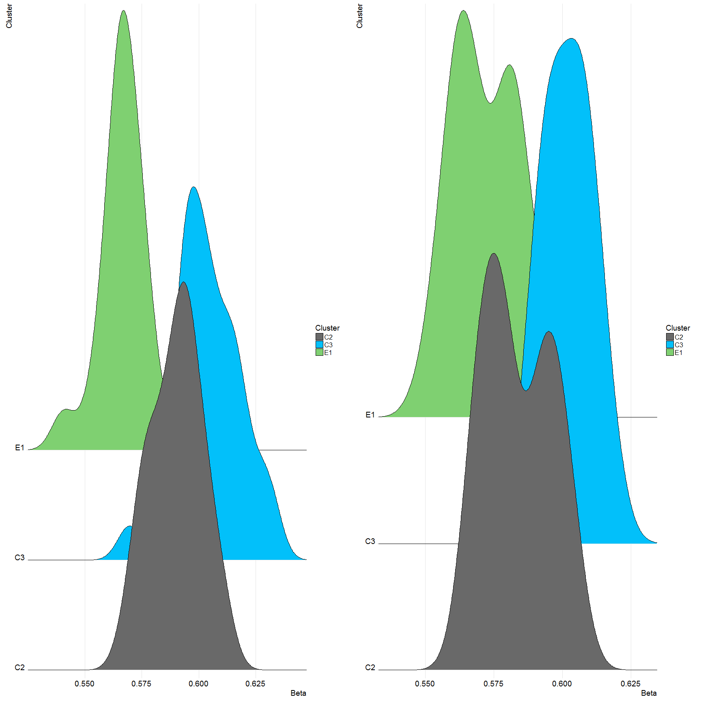<!-- -->

```r
##MAF
Roblab_MAF<-as.data.frame(Roblab_Data[which(rownames(Roblab_Data)=='cg09038266'),])
Roblab_MAF<-m2beta(Roblab_MAF)
colnames(Roblab_MAF)<-c("beta")

Roblab_des_Clus<-as.data.frame(Roblab_des$Cluster)
rownames(Roblab_des_Clus)<-rownames(Roblab_des)
Roblab_MAF<-merge(Roblab_MAF,Roblab_des_Clus,by='row.names')
Roblab_MAF$Row.names<-NULL
colnames(Roblab_MAF)<-c("Beta","Cluster")

Cox_MAF<-as.data.frame(Cox_Data[which(rownames(Cox_Data)=='cg09038266'),])
Cox_MAF<-m2beta(Cox_MAF)
colnames(Cox_MAF)<-c("beta")

Cox_des_Clus<-as.data.frame(Cox_des$Cluster)
rownames(Cox_des_Clus)<-rownames(Cox_des)
Cox_MAF<-merge(Cox_MAF,Cox_des_Clus,by='row.names')
Cox_MAF$Row.names<-NULL
colnames(Cox_MAF)<-c("Beta","Cluster")

##Joy Plot
Roblab_MAFDist<-ggplot(Roblab_MAF, aes(x = Beta, y = Cluster,fill=Cluster)) +
  geom_joy(scale = 4) + theme_joy() +
  scale_y_discrete(expand = c(0.01, 0)) +   # will generally have to set the `expand` option
  scale_x_continuous(expand = c(0, 0))  +   # for both axes to remove unneeded padding
  scale_fill_cyclical(values = c("#696969","#02c0fa","#7fd071"),guide="legend") 

Cox_MAFDist<-ggplot(Cox_MAF, aes(x = Beta, y = Cluster, fill=Cluster)) +
  geom_joy(scale = 4) + theme_joy() +
  scale_y_discrete(expand = c(0.01, 0)) +   # will generally have to set the `expand` option
  scale_x_continuous(expand = c(0, 0))  +  # for both axes to remove unneeded padding
  scale_fill_cyclical(values = c("#696969","#02c0fa","#7fd071"),guide="legend") 

grid.arrange(Roblab_MAFDist,Cox_MAFDist,nrow=1)
```

```
## Picking joint bandwidth of 0.00658
```

```
## Picking joint bandwidth of 0.00593
```

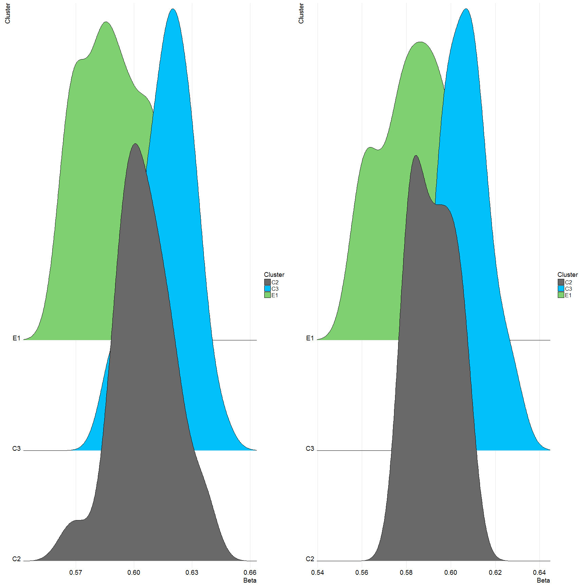<!-- -->

```r
##CXCL9
Roblab_CXCL9<-as.data.frame(Roblab_Data[which(rownames(Roblab_Data)=='cg04038163'),])
Roblab_CXCL9<-m2beta(Roblab_CXCL9)
colnames(Roblab_CXCL9)<-c("beta")

Roblab_des_Clus<-as.data.frame(Roblab_des$Cluster)
rownames(Roblab_des_Clus)<-rownames(Roblab_des)
Roblab_CXCL9<-merge(Roblab_CXCL9,Roblab_des_Clus,by='row.names')
Roblab_CXCL9$Row.names<-NULL
colnames(Roblab_CXCL9)<-c("Beta","Cluster")

Cox_CXCL9<-as.data.frame(Cox_Data[which(rownames(Cox_Data)=='cg04038163'),])
Cox_CXCL9<-m2beta(Cox_CXCL9)
colnames(Cox_CXCL9)<-c("beta")

Cox_des_Clus<-as.data.frame(Cox_des$Cluster)
rownames(Cox_des_Clus)<-rownames(Cox_des)
Cox_CXCL9<-merge(Cox_CXCL9,Cox_des_Clus,by='row.names')
Cox_CXCL9$Row.names<-NULL
colnames(Cox_CXCL9)<-c("Beta","Cluster")

##Joy Plot
Roblab_CXCL9Dist<-ggplot(Roblab_CXCL9, aes(x = Beta, y = Cluster,fill=Cluster)) +
  geom_joy(scale = 4) + theme_joy() +
  scale_y_discrete(expand = c(0.01, 0)) +   # will generally have to set the `expand` option
  scale_x_continuous(expand = c(0, 0))  +   # for both axes to remove unneeded padding
  scale_fill_cyclical(values = c("#696969","#02c0fa","#7fd071"),guide="legend") 

Cox_CXCL9Dist<-ggplot(Cox_CXCL9, aes(x = Beta, y = Cluster, fill=Cluster)) +
  geom_joy(scale = 4) + theme_joy() +
  scale_y_discrete(expand = c(0.01, 0)) +   # will generally have to set the `expand` option
  scale_x_continuous(expand = c(0, 0))  +  # for both axes to remove unneeded padding
  scale_fill_cyclical(values = c("#696969","#02c0fa","#7fd071"),guide="legend") 

grid.arrange(Roblab_CXCL9Dist,Cox_CXCL9Dist,nrow=1)
```

```
## Picking joint bandwidth of 0.00438
```

```
## Picking joint bandwidth of 0.00381
```

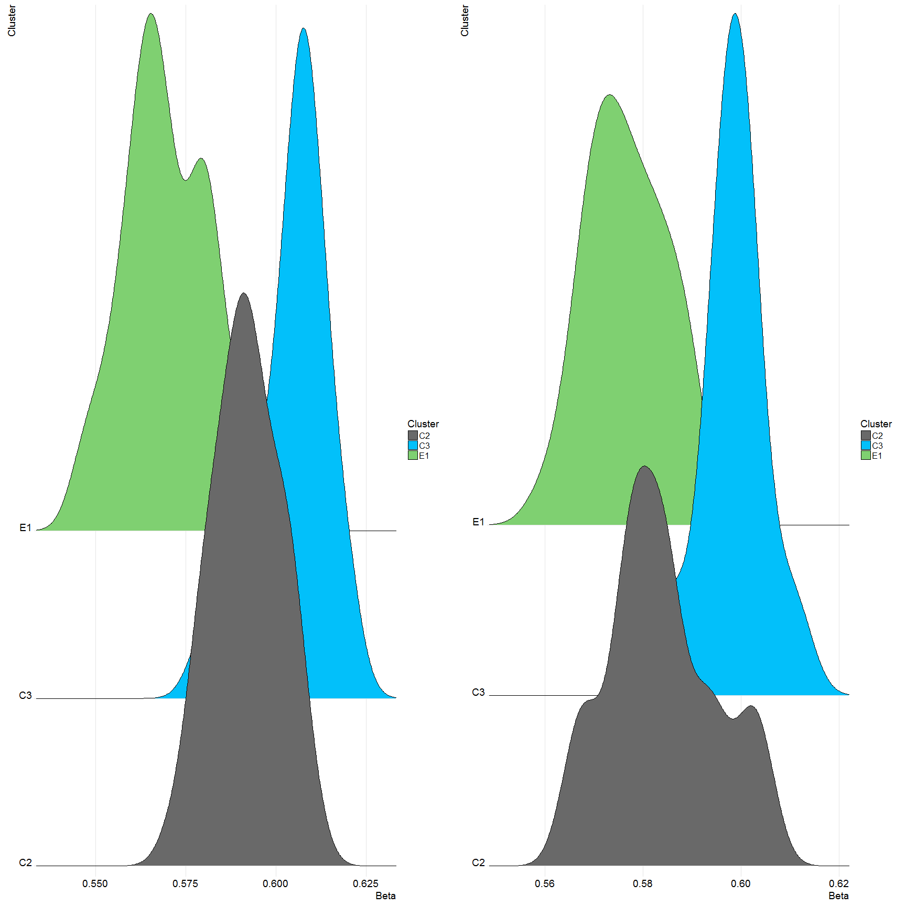<!-- -->

```r
#U6atac
Roblab_U6atac<-as.data.frame(Roblab_Data[which(rownames(Roblab_Data)=='cg21977522'),])
Roblab_U6atac<-m2beta(Roblab_U6atac)
colnames(Roblab_U6atac)<-c("beta")

Roblab_des_Clus<-as.data.frame(Roblab_des$Cluster)
rownames(Roblab_des_Clus)<-rownames(Roblab_des)
Roblab_U6atac<-merge(Roblab_U6atac,Roblab_des_Clus,by='row.names')
Roblab_U6atac$Row.names<-NULL
colnames(Roblab_U6atac)<-c("Beta","Cluster")

Cox_U6atac<-as.data.frame(Cox_Data[which(rownames(Cox_Data)=='cg21977522'),])
Cox_U6atac<-m2beta(Cox_U6atac)
colnames(Cox_U6atac)<-c("beta")

Cox_des_Clus<-as.data.frame(Cox_des$Cluster)
rownames(Cox_des_Clus)<-rownames(Cox_des)
Cox_U6atac<-merge(Cox_U6atac,Cox_des_Clus,by='row.names')
Cox_U6atac$Row.names<-NULL
colnames(Cox_U6atac)<-c("Beta","Cluster")

##Joy Plot
Roblab_U6atacDist<-ggplot(Roblab_U6atac, aes(x = Beta, y = Cluster,fill=Cluster)) +
  geom_joy(scale = 4) + theme_joy() +
  scale_y_discrete(expand = c(0.01, 0)) +   # will generally have to set the `expand` option
  scale_x_continuous(expand = c(0, 0))  +   # for both axes to remove unneeded padding
  scale_fill_cyclical(values = c("#696969","#02c0fa","#7fd071"),guide="legend") 

Cox_U6atacDist<-ggplot(Cox_U6atac, aes(x = Beta, y = Cluster, fill=Cluster)) +
  geom_joy(scale = 4) + theme_joy() +
  scale_y_discrete(expand = c(0.01, 0)) +   # will generally have to set the `expand` option
  scale_x_continuous(expand = c(0, 0))  +  # for both axes to remove unneeded padding
  scale_fill_cyclical(values = c("#696969","#02c0fa","#7fd071"),guide="legend") 

grid.arrange(Roblab_U6atacDist,Cox_U6atacDist,nrow=1)
```

```
## Picking joint bandwidth of 0.00693
```

```
## Picking joint bandwidth of 0.00439
```

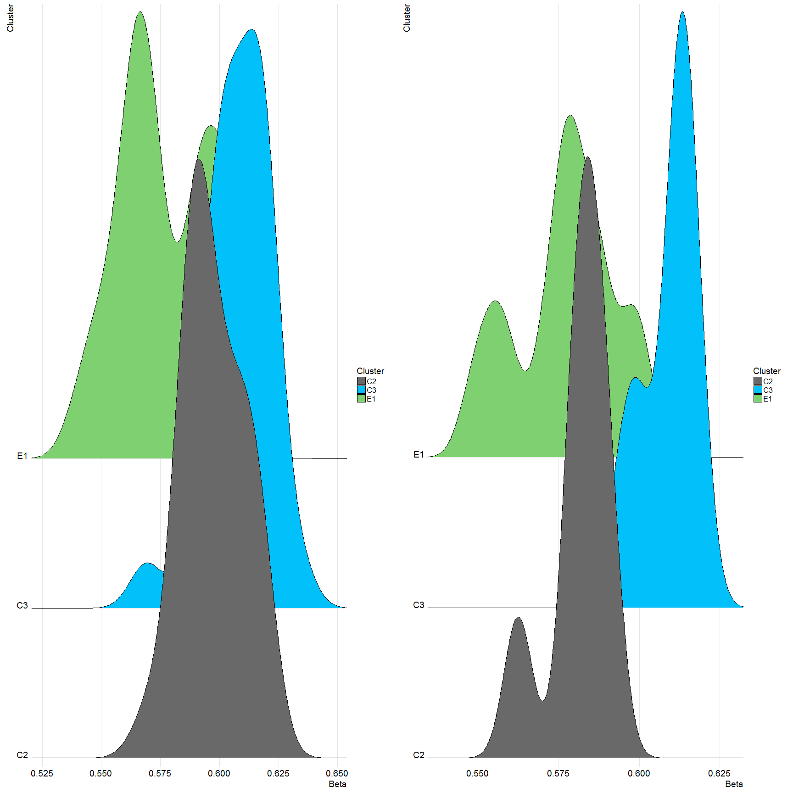<!-- -->

```r
##Plots for the final figure
E1Clusters<-grid.arrange(Roblab_FN1Dist,Cox_FN1Dist,Roblab_PKM2Dist,Cox_PKM2Dist,Roblab_KRT15Dist,Cox_KRT15Dist,nrow=1)
```

```
## Picking joint bandwidth of 0.00602
```

```
## Picking joint bandwidth of 0.0055
```

```
## Picking joint bandwidth of 0.00441
```

```
## Picking joint bandwidth of 0.00407
```

```
## Picking joint bandwidth of 0.00515
```

```
## Picking joint bandwidth of 0.00604
```

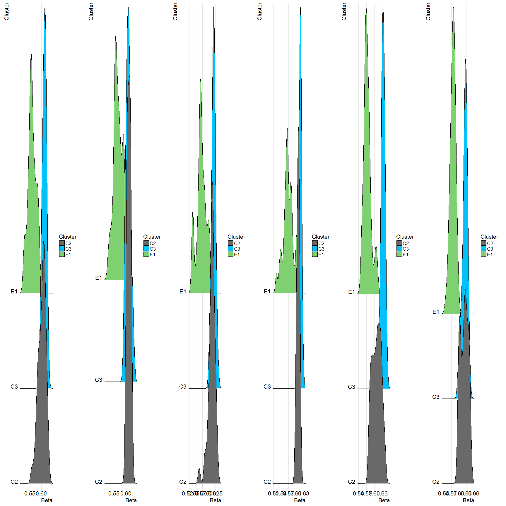<!-- -->

```r
C2C3Clusters<-grid.arrange(Roblab_IL7Dist,Cox_IL7Dist,Roblab_MAFDist,Cox_MAFDist,Roblab_CXCL9Dist,Cox_CXCL9Dist, nrow=1)
```

```
## Picking joint bandwidth of 0.00901
```

```
## Picking joint bandwidth of 0.00704
```

```
## Picking joint bandwidth of 0.00658
```

```
## Picking joint bandwidth of 0.00593
```

```
## Picking joint bandwidth of 0.00438
```

```
## Picking joint bandwidth of 0.00381
```

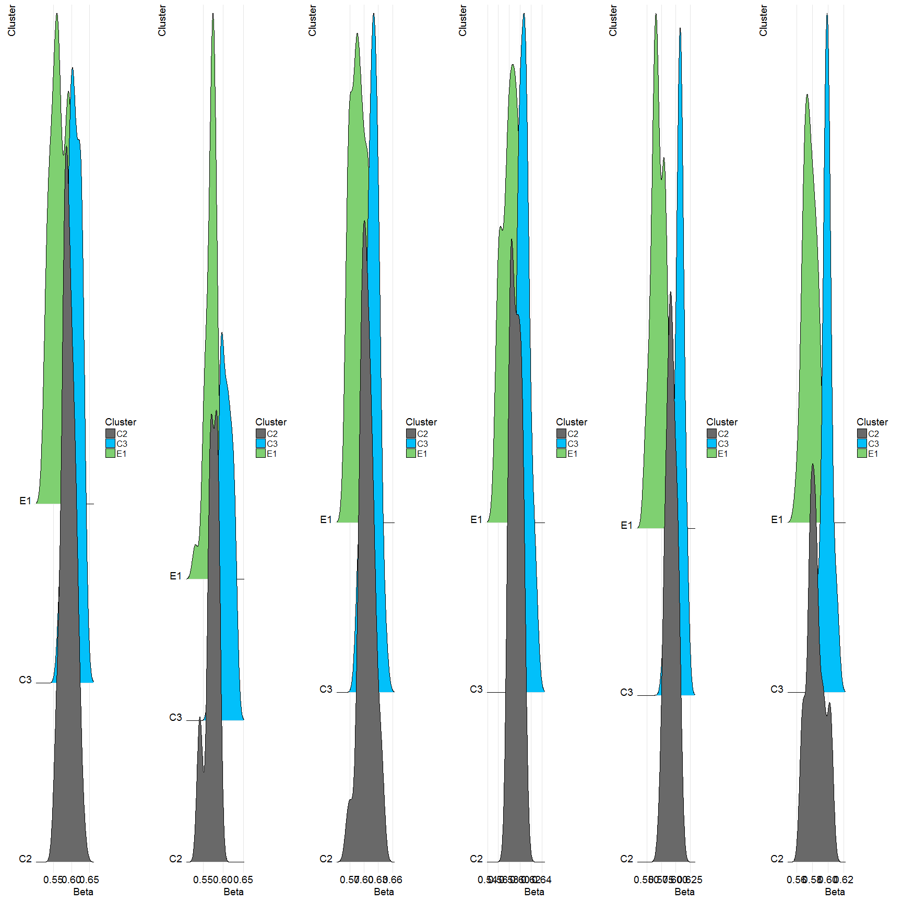<!-- -->

```r
grid.arrange(E1Clusters,C2C3Clusters,nrow=2)
```

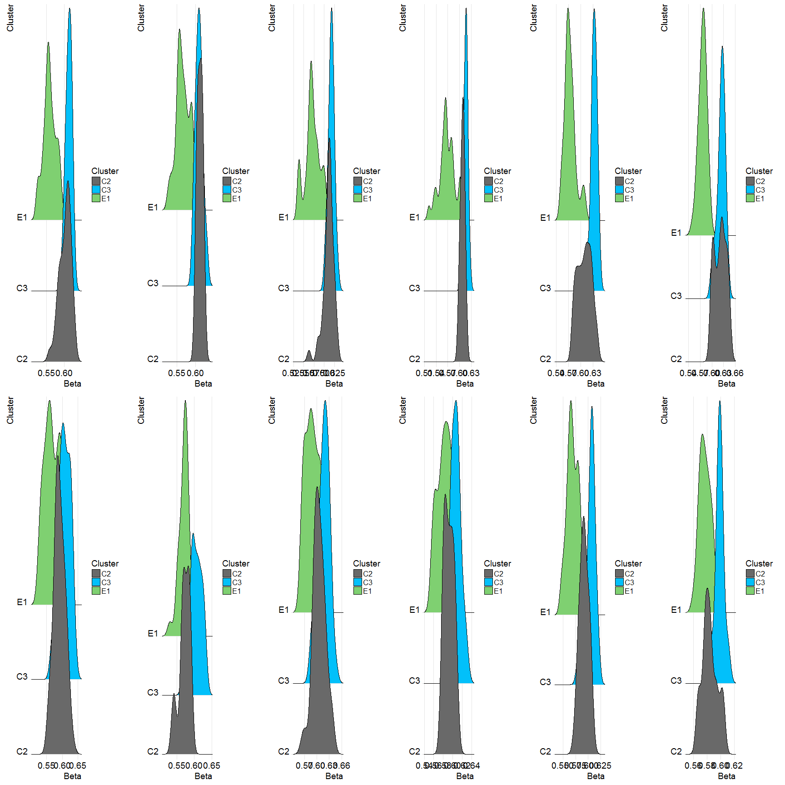<!-- -->


```r
sites<-c("cg12436772","cg22234930","cg26625897","cg14556425","cg04038163","cg09038266")
Roblab_6sites<-as.data.frame(Roblab_Data[which(rownames(Roblab_Data)%in% sites),])
Cox_6sites<-as.data.frame(Cox_Data[which(rownames(Cox_Data)%in% sites),])

##Roblab 6 sites
Roblab_Data_t<-t(Roblab_6sites)
Rob.pca <-prcomp(scale(m2beta(Roblab_Data_t), center = TRUE, scale = FALSE))
summary(Rob.pca)
```

```
## Importance of components%s:
##                            PC1     PC2     PC3     PC4     PC5      PC6
## Standard deviation     0.04515 0.02214 0.01387 0.01232 0.01008 0.007708
## Proportion of Variance 0.67199 0.16155 0.06339 0.04999 0.03349 0.019580
## Cumulative Proportion  0.67199 0.83354 0.89694 0.94692 0.98042 1.000000
```

```r
scores = as.data.frame(Rob.pca$x)
scores<-scores[order(rownames(scores)),]
Roblab_des<-Roblab_des[order(rownames(Roblab_des)),]
all(rownames(Roblab_des)==rownames(scores))##TRUE
```

```
## [1] TRUE
```

```r
Path<-as.data.frame(Roblab_des$Cluster)
rownames(Path)<-rownames(Roblab_des)
all(rownames(Path)==rownames(scores))##TRUE
```

```
## [1] TRUE
```

```r
scores<-merge(scores,Path,by='row.names')
rownames(scores)<-scores$Row.names
scores$Row.names<-NULL
scores$Path<-scores$`Roblab_des$Cluster`
scores$`Roblab_des$Cluster`<-NULL

##Pathology colour
(v.grp.col<-as.vector(scores$Path))
```

```
##  [1] "C2" "C3" "C3" "C3" "C2" "E1" "E1" "E1" "C2" "C2" "C3" "C3" "C3" "C2"
## [15] "C3" "C2" "C2" "C3" "C2" "C2" "C2" "C3" "C2" "C2" "C2" "C3" "C3" "C3"
## [29] "C3" "E1" "C2" "E1" "C3" "C2" "C2" "E1" "C3" "C2" "C2" "C2" "C3" "E1"
## [43] "C3" "C2" "C3" "C2" "C2" "C3" "C2" "E1" "C2" "C2" "C3" "C3" "C2" "C2"
## [57] "C3" "C2" "C2" "C3" "C2" "E1" "C2" "E1" "C2" "E1" "C2" "E1" "E1" "C2"
## [71] "E1" "C2" "C3" "C3" "E1" "E1" "E1" "C2" "C2" "C2" "C2" "E1" "C2" "E1"
## [85] "E1" "C2" "C2" "C2" "E1" "E1" "C3" "E1" "C3" "E1"
```

```r
(v.grp.col<-gsub("C3","#696969",v.grp.col))
```

```
##  [1] "C2"      "#696969" "#696969" "#696969" "C2"      "E1"      "E1"     
##  [8] "E1"      "C2"      "C2"      "#696969" "#696969" "#696969" "C2"     
## [15] "#696969" "C2"      "C2"      "#696969" "C2"      "C2"      "C2"     
## [22] "#696969" "C2"      "C2"      "C2"      "#696969" "#696969" "#696969"
## [29] "#696969" "E1"      "C2"      "E1"      "#696969" "C2"      "C2"     
## [36] "E1"      "#696969" "C2"      "C2"      "C2"      "#696969" "E1"     
## [43] "#696969" "C2"      "#696969" "C2"      "C2"      "#696969" "C2"     
## [50] "E1"      "C2"      "C2"      "#696969" "#696969" "C2"      "C2"     
## [57] "#696969" "C2"      "C2"      "#696969" "C2"      "E1"      "C2"     
## [64] "E1"      "C2"      "E1"      "C2"      "E1"      "E1"      "C2"     
## [71] "E1"      "C2"      "#696969" "#696969" "E1"      "E1"      "E1"     
## [78] "C2"      "C2"      "C2"      "C2"      "E1"      "C2"      "E1"     
## [85] "E1"      "C2"      "C2"      "C2"      "E1"      "E1"      "#696969"
## [92] "E1"      "#696969" "E1"
```

```r
(v.grp.col<-gsub("E1","#7fd071",v.grp.col))
```

```
##  [1] "C2"      "#696969" "#696969" "#696969" "C2"      "#7fd071" "#7fd071"
##  [8] "#7fd071" "C2"      "C2"      "#696969" "#696969" "#696969" "C2"     
## [15] "#696969" "C2"      "C2"      "#696969" "C2"      "C2"      "C2"     
## [22] "#696969" "C2"      "C2"      "C2"      "#696969" "#696969" "#696969"
## [29] "#696969" "#7fd071" "C2"      "#7fd071" "#696969" "C2"      "C2"     
## [36] "#7fd071" "#696969" "C2"      "C2"      "C2"      "#696969" "#7fd071"
## [43] "#696969" "C2"      "#696969" "C2"      "C2"      "#696969" "C2"     
## [50] "#7fd071" "C2"      "C2"      "#696969" "#696969" "C2"      "C2"     
## [57] "#696969" "C2"      "C2"      "#696969" "C2"      "#7fd071" "C2"     
## [64] "#7fd071" "C2"      "#7fd071" "C2"      "#7fd071" "#7fd071" "C2"     
## [71] "#7fd071" "C2"      "#696969" "#696969" "#7fd071" "#7fd071" "#7fd071"
## [78] "C2"      "C2"      "C2"      "C2"      "#7fd071" "C2"      "#7fd071"
## [85] "#7fd071" "C2"      "C2"      "C2"      "#7fd071" "#7fd071" "#696969"
## [92] "#7fd071" "#696969" "#7fd071"
```

```r
(v.grp.col<-gsub("C2","#02c0fa",v.grp.col))
```

```
##  [1] "#02c0fa" "#696969" "#696969" "#696969" "#02c0fa" "#7fd071" "#7fd071"
##  [8] "#7fd071" "#02c0fa" "#02c0fa" "#696969" "#696969" "#696969" "#02c0fa"
## [15] "#696969" "#02c0fa" "#02c0fa" "#696969" "#02c0fa" "#02c0fa" "#02c0fa"
## [22] "#696969" "#02c0fa" "#02c0fa" "#02c0fa" "#696969" "#696969" "#696969"
## [29] "#696969" "#7fd071" "#02c0fa" "#7fd071" "#696969" "#02c0fa" "#02c0fa"
## [36] "#7fd071" "#696969" "#02c0fa" "#02c0fa" "#02c0fa" "#696969" "#7fd071"
## [43] "#696969" "#02c0fa" "#696969" "#02c0fa" "#02c0fa" "#696969" "#02c0fa"
## [50] "#7fd071" "#02c0fa" "#02c0fa" "#696969" "#696969" "#02c0fa" "#02c0fa"
## [57] "#696969" "#02c0fa" "#02c0fa" "#696969" "#02c0fa" "#7fd071" "#02c0fa"
## [64] "#7fd071" "#02c0fa" "#7fd071" "#02c0fa" "#7fd071" "#7fd071" "#02c0fa"
## [71] "#7fd071" "#02c0fa" "#696969" "#696969" "#7fd071" "#7fd071" "#7fd071"
## [78] "#02c0fa" "#02c0fa" "#02c0fa" "#02c0fa" "#7fd071" "#02c0fa" "#7fd071"
## [85] "#7fd071" "#02c0fa" "#02c0fa" "#02c0fa" "#7fd071" "#7fd071" "#696969"
## [92] "#7fd071" "#696969" "#7fd071"
```

```r
v.grp.col
```

```
##  [1] "#02c0fa" "#696969" "#696969" "#696969" "#02c0fa" "#7fd071" "#7fd071"
##  [8] "#7fd071" "#02c0fa" "#02c0fa" "#696969" "#696969" "#696969" "#02c0fa"
## [15] "#696969" "#02c0fa" "#02c0fa" "#696969" "#02c0fa" "#02c0fa" "#02c0fa"
## [22] "#696969" "#02c0fa" "#02c0fa" "#02c0fa" "#696969" "#696969" "#696969"
## [29] "#696969" "#7fd071" "#02c0fa" "#7fd071" "#696969" "#02c0fa" "#02c0fa"
## [36] "#7fd071" "#696969" "#02c0fa" "#02c0fa" "#02c0fa" "#696969" "#7fd071"
## [43] "#696969" "#02c0fa" "#696969" "#02c0fa" "#02c0fa" "#696969" "#02c0fa"
## [50] "#7fd071" "#02c0fa" "#02c0fa" "#696969" "#696969" "#02c0fa" "#02c0fa"
## [57] "#696969" "#02c0fa" "#02c0fa" "#696969" "#02c0fa" "#7fd071" "#02c0fa"
## [64] "#7fd071" "#02c0fa" "#7fd071" "#02c0fa" "#7fd071" "#7fd071" "#02c0fa"
## [71] "#7fd071" "#02c0fa" "#696969" "#696969" "#7fd071" "#7fd071" "#7fd071"
## [78] "#02c0fa" "#02c0fa" "#02c0fa" "#02c0fa" "#7fd071" "#02c0fa" "#7fd071"
## [85] "#7fd071" "#02c0fa" "#02c0fa" "#02c0fa" "#7fd071" "#7fd071" "#696969"
## [92] "#7fd071" "#696969" "#7fd071"
```

```r
# plot of observations
Roblab_pca<-ggplot(data = scores, aes(x = PC1, y = PC2, label = rownames(scores))) +
  geom_hline(yintercept = 0, colour = "gray65") +
  geom_vline(xintercept = 0, colour = "gray65") +
  geom_text(colour = v.grp.col) +
  ggtitle("PCA plot of Discovery cohort samples")+
  theme_bw()

Roblab_pca
```

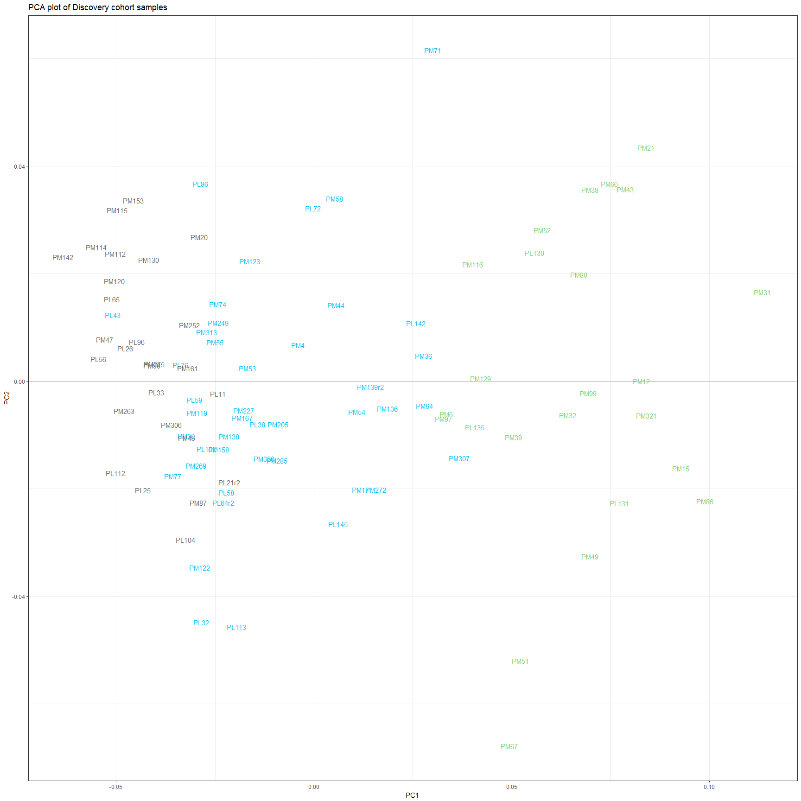<!-- -->

```r
##Cox
Cox_Data_t<-t(Cox_6sites)
Cox.pca <-prcomp(scale(m2beta(Cox_Data_t), center = TRUE, scale = FALSE))
summary(Cox.pca)
```

```
## Importance of components%s:
##                            PC1     PC2     PC3     PC4      PC5      PC6
## Standard deviation     0.04669 0.01895 0.01224 0.01061 0.007977 0.006092
## Proportion of Variance 0.75118 0.12370 0.05164 0.03876 0.021930 0.012790
## Cumulative Proportion  0.75118 0.87488 0.92652 0.96528 0.987210 1.000000
```

```r
##Plot
# create data frame with scores
scores = as.data.frame(Cox.pca$x)
scores<-scores[order(rownames(scores)),]
Cox_des<-Cox_des[order(rownames(Cox_des)),]
all(rownames(Cox_des)==rownames(scores))##TRUE
```

```
## [1] TRUE
```

```r
Path<-as.data.frame(Cox_des$Cluster)
rownames(Path)<-rownames(Cox_des)
all(rownames(Path)==rownames(scores))##TRUE
```

```
## [1] TRUE
```

```r
scores<-merge(scores,Path,by='row.names')
rownames(scores)<-scores$Row.names
scores$Row.names<-NULL
scores$Path<-scores$`Cox_des$Cluster`
scores$`Cox_des$Cluster`<-NULL

##Pathology colour
(Coxv.grp.col<-as.vector(scores$Path))
```

```
##  [1] "E1" "E1" "E1" "E1" "E1" "C3" "E1" "E1" "C2" "E1" "C2" "E1" "C3" "E1"
## [15] "C2" "E1" "E1" "E1" "C3" "E1" "C2" "E1" "E1" "E1" "C2" "E1" "E1" "E1"
## [29] "E1" "E1" "E1" "E1" "E1" "C3" "C2" "C3" "C2" "C3" "C3" "C3" "C3" "E1"
## [43] "E1" "E1" "C3" "E1" "E1" "C3"
```

```r
(Coxv.grp.col<-gsub("C3","#696969",Coxv.grp.col))
```

```
##  [1] "E1"      "E1"      "E1"      "E1"      "E1"      "#696969" "E1"     
##  [8] "E1"      "C2"      "E1"      "C2"      "E1"      "#696969" "E1"     
## [15] "C2"      "E1"      "E1"      "E1"      "#696969" "E1"      "C2"     
## [22] "E1"      "E1"      "E1"      "C2"      "E1"      "E1"      "E1"     
## [29] "E1"      "E1"      "E1"      "E1"      "E1"      "#696969" "C2"     
## [36] "#696969" "C2"      "#696969" "#696969" "#696969" "#696969" "E1"     
## [43] "E1"      "E1"      "#696969" "E1"      "E1"      "#696969"
```

```r
(Coxv.grp.col<-gsub("E1","#7fd071",Coxv.grp.col))
```

```
##  [1] "#7fd071" "#7fd071" "#7fd071" "#7fd071" "#7fd071" "#696969" "#7fd071"
##  [8] "#7fd071" "C2"      "#7fd071" "C2"      "#7fd071" "#696969" "#7fd071"
## [15] "C2"      "#7fd071" "#7fd071" "#7fd071" "#696969" "#7fd071" "C2"     
## [22] "#7fd071" "#7fd071" "#7fd071" "C2"      "#7fd071" "#7fd071" "#7fd071"
## [29] "#7fd071" "#7fd071" "#7fd071" "#7fd071" "#7fd071" "#696969" "C2"     
## [36] "#696969" "C2"      "#696969" "#696969" "#696969" "#696969" "#7fd071"
## [43] "#7fd071" "#7fd071" "#696969" "#7fd071" "#7fd071" "#696969"
```

```r
(Coxv.grp.col<-gsub("C2","#02c0fa",Coxv.grp.col))
```

```
##  [1] "#7fd071" "#7fd071" "#7fd071" "#7fd071" "#7fd071" "#696969" "#7fd071"
##  [8] "#7fd071" "#02c0fa" "#7fd071" "#02c0fa" "#7fd071" "#696969" "#7fd071"
## [15] "#02c0fa" "#7fd071" "#7fd071" "#7fd071" "#696969" "#7fd071" "#02c0fa"
## [22] "#7fd071" "#7fd071" "#7fd071" "#02c0fa" "#7fd071" "#7fd071" "#7fd071"
## [29] "#7fd071" "#7fd071" "#7fd071" "#7fd071" "#7fd071" "#696969" "#02c0fa"
## [36] "#696969" "#02c0fa" "#696969" "#696969" "#696969" "#696969" "#7fd071"
## [43] "#7fd071" "#7fd071" "#696969" "#7fd071" "#7fd071" "#696969"
```

```r
Coxv.grp.col
```

```
##  [1] "#7fd071" "#7fd071" "#7fd071" "#7fd071" "#7fd071" "#696969" "#7fd071"
##  [8] "#7fd071" "#02c0fa" "#7fd071" "#02c0fa" "#7fd071" "#696969" "#7fd071"
## [15] "#02c0fa" "#7fd071" "#7fd071" "#7fd071" "#696969" "#7fd071" "#02c0fa"
## [22] "#7fd071" "#7fd071" "#7fd071" "#02c0fa" "#7fd071" "#7fd071" "#7fd071"
## [29] "#7fd071" "#7fd071" "#7fd071" "#7fd071" "#7fd071" "#696969" "#02c0fa"
## [36] "#696969" "#02c0fa" "#696969" "#696969" "#696969" "#696969" "#7fd071"
## [43] "#7fd071" "#7fd071" "#696969" "#7fd071" "#7fd071" "#696969"
```

```r
# plot of observations
Cox_pca<-ggplot(data = scores, aes(x = PC1, y = PC2, label = rownames(scores))) +
  geom_hline(yintercept = 0, colour = "gray65") +
  geom_vline(xintercept = 0, colour = "gray65") +
  geom_text(colour = Coxv.grp.col) +
  ggtitle("PCA plot of Validation cohort samples")+
  theme_bw()

Cox_pca
```

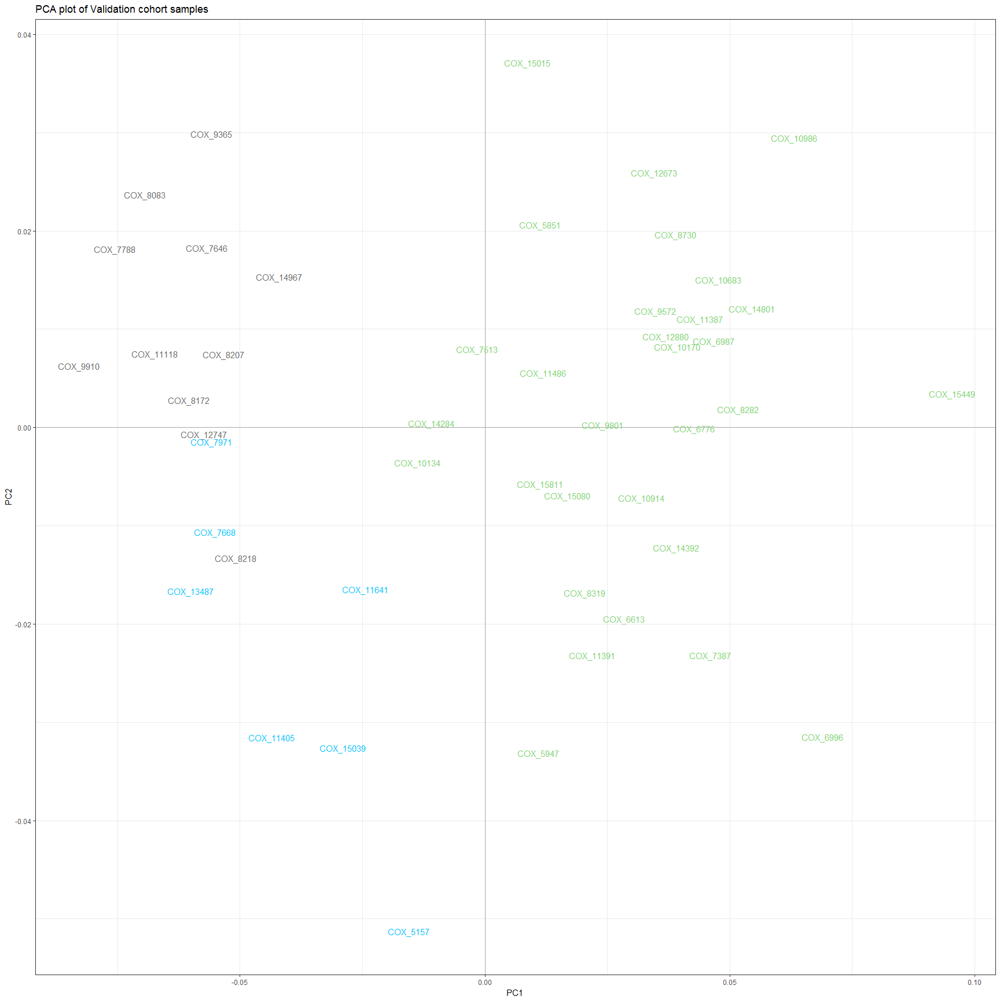<!-- -->

