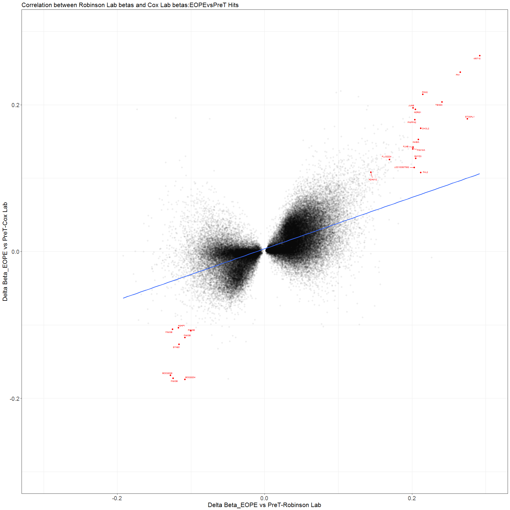

# CoxValidation_OverlapbetweenCohorts_Jul2016
SLW  
July 12, 2016  

Load Packages


```r
memory.limit(10000000000000)
```

```
## [1] 1e+13
```

```r
setwd('Z:/ROBLAB1 coredata-databases/1 Samantha DATA Folder/PROJECTS/DNAmProfiling_PE_IUGR_2017')

##Read in phenotype data
des<-read.csv('CoX_Samples_2017.csv',header=T)
for (i in 1:nrow(des)){
  des$Row[i]<-paste(substr(des[i,"Sentrix_Position"], start=1, stop=3))
}
des$Row<- as.factor(des$Row)
str(des)
```

```
## 'data.frame':	48 obs. of  14 variables:
##  $ ParticipantID       : Factor w/ 48 levels "COX_10134","COX_10170",..: 37 11 9 15 35 25 21 6 34 45 ...
##  $ Pheno               : Factor w/ 9 levels "Cont-preT-AGA",..: 8 7 1 1 1 1 1 7 8 3 ...
##  $ GRP                 : Factor w/ 4 levels "EOPE","LOPE",..: 2 2 3 3 3 3 3 2 2 4 ...
##  $ Cluster             : Factor w/ 4 levels "C2","C3","E1",..: 1 1 1 1 1 1 1 2 2 2 ...
##  $ IUGR                : Factor w/ 2 levels "No","Yes": 1 1 1 1 1 1 1 1 1 1 ...
##  $ Sex                 : Factor w/ 2 levels "F","M": 2 2 1 2 2 2 2 1 1 2 ...
##  $ GA                  : int  37 36 30 31 32 32 33 37 37 39 ...
##  $ BW                  : int  2875 2860 1380 1820 1780 2080 1960 2620 2570 3835 ...
##  $ BW_SD               : num  -0.48 0.01 -0.13 0.41 -0.31 0.5 -0.42 -0.81 -0.93 0.78 ...
##  $ Chronic.Hypertension: Factor w/ 2 levels "No","Yes": 2 1 1 1 1 1 1 1 2 1 ...
##  $ Maternal.Ethnicity  : Factor w/ 7 levels "Asian","Black",..: 3 3 1 3 3 3 3 3 5 3 ...
##  $ Sentrix_ID          : num  9.98e+09 1.00e+10 9.98e+09 9.98e+09 1.00e+10 ...
##  $ Sentrix_Position    : Factor w/ 12 levels "R01C01","R01C02",..: 8 2 10 10 6 10 1 3 7 11 ...
##  $ Row                 : Factor w/ 6 levels "R01","R02","R03",..: 4 1 5 5 3 5 1 2 4 6 ...
```

```r
des$Sentrix_ID<-as.factor(des$Sentrix_ID)
des$GA<-as.numeric(des$GA)
des$BW<-as.numeric(des$BW)

##As IUGR is not fully represented in all 6 row positions, I group rows into levels 1,2,and 3 on the microarray
des$row_grouped<-revalue(des$Row,c("R01"="1","R02"="1","R03"="2","R04"="2","R05"="3",
                                   "R06"="3"))
des$row_grouped<-as.numeric(des$row_grouped)
rownames(des)<-des$ParticipantID

##Loading in DNAm Data- DNAm measured on the Illumina 450K array
load('CoxCohort.fnorm_Jan2016.RData')
Data<-exprs(PROJECT.fun)
Data<-as.data.frame(Data)
dim(Data)
```

```
## [1] 442028     48
```

```r
#colnames(Data)
##typo error was made-need to change CPX to COX 
Data$COX_9801<-Data$CPX_9801
Data$CPX_9801<-NULL
Data$COX_11387<-Data$COX_11378
Data$COX_11378<-NULL
Data<-as.matrix(Data)

all(colnames(Data)==rownames(des))##FALSE
```

```
## [1] FALSE
```

```r
Data<-Data[,order(colnames(Data))]
des<-des[order(des$ParticipantID),]
all(colnames(Data)==rownames(des))##TRUE
```

```
## [1] TRUE
```


```r
##Making des into EOPEvsPreT, LOPEvT
EOPEvsPreT<-subset(des,GRP=="PreT"|GRP=="EOPE")
LOPEvsTerm<-subset(des,GRP=="Term"|GRP=="LOPE")

##Mann Whitney U Test for BW_SD
wilcox.test(BW_SD~GRP,data=EOPEvsPreT)##0.003924**
```

```
## 
## 	Wilcoxon rank sum test with continuity correction
## 
## data:  BW_SD by GRP
## W = 14, p-value = 0.003924
## alternative hypothesis: true location shift is not equal to 0
```

```r
wilcox.test(BW_SD~GRP,data=LOPEvsTerm)##0.0005358**
```

```
## 
## 	Wilcoxon rank sum test
## 
## data:  BW_SD by GRP
## W = 15, p-value = 0.007442
## alternative hypothesis: true location shift is not equal to 0
```

```r
##Mann Whitney U Test for GA
wilcox.test(GA~GRP,data=EOPEvsPreT)##0.5891
```

```
## 
## 	Wilcoxon rank sum test with continuity correction
## 
## data:  GA by GRP
## W = 56, p-value = 0.5891
## alternative hypothesis: true location shift is not equal to 0
```

```r
wilcox.test(GA~GRP,data=LOPEvsTerm)##0.0001434
```

```
## 
## 	Wilcoxon rank sum test with continuity correction
## 
## data:  GA by GRP
## W = 0, p-value = 0.0001434
## alternative hypothesis: true location shift is not equal to 0
```

```r
##Mann Whitney U Test for Fetal Sex
##Must first convert sex to a numeric where male is 1 and female is 2
EOPEvsPreT$Sex<-recode(EOPEvsPreT$Sex,"M"="1","F"="2")
EOPEvsPreT$Sex<-as.numeric(EOPEvsPreT$Sex)

LOPEvsTerm$Sex<-recode(LOPEvsTerm$Sex,"M"="1","F"="2")
LOPEvsTerm$Sex<-as.numeric(LOPEvsTerm$Sex)

wilcox.test(Sex~GRP,data=EOPEvsPreT)##0.2852
```

```
## 
## 	Wilcoxon rank sum test with continuity correction
## 
## data:  Sex by GRP
## W = 49, p-value = 0.2852
## alternative hypothesis: true location shift is not equal to 0
```

```r
wilcox.test(Sex~GRP,data=LOPEvsTerm)##0.9268
```

```
## 
## 	Wilcoxon rank sum test with continuity correction
## 
## data:  Sex by GRP
## W = 48, p-value = 0.9268
## alternative hypothesis: true location shift is not equal to 0
```

```r
##Comparing between the cohorts
Demo<-read.csv('Cohorts_Demos_Together_2017.csv',header=T)

##EOPE GA,BW,Sex
wilcox.test(EOPE_GA~EOPE_Lab,data=Demo)##0.06
```

```
## 
## 	Wilcoxon rank sum test with continuity correction
## 
## data:  EOPE_GA by EOPE_Lab
## W = 162, p-value = 0.06121
## alternative hypothesis: true location shift is not equal to 0
```

```r
wilcox.test(EOPE_BW~EOPE_Lab,data=Demo)##0.56
```

```
## 
## 	Wilcoxon rank sum test with continuity correction
## 
## data:  EOPE_BW by EOPE_Lab
## W = 267, p-value = 0.5652
## alternative hypothesis: true location shift is not equal to 0
```

```r
Demo$EOPE_Sex<-recode(Demo$EOPE_Sex,"M"="1","F"="2")
Demo$EOPE_Sex<-as.numeric(Demo$EOPE_Sex)
wilcox.test(EOPE_Sex~EOPE_Lab,data=Demo)##0.13
```

```
## 
## 	Wilcoxon rank sum test with continuity correction
## 
## data:  EOPE_Sex by EOPE_Lab
## W = 187, p-value = 0.1393
## alternative hypothesis: true location shift is not equal to 0
```

```r
##LOPE GA,BW,Sex
wilcox.test(LOPE_GA~LOPE_Lab,data=Demo)##0.17
```

```
## 
## 	Wilcoxon rank sum test with continuity correction
## 
## data:  LOPE_GA by LOPE_Lab
## W = 69, p-value = 0.1771
## alternative hypothesis: true location shift is not equal to 0
```

```r
wilcox.test(LOPE_BW~LOPE_Lab,data=Demo)##0.875
```

```
## 
## 	Wilcoxon rank sum test with continuity correction
## 
## data:  LOPE_BW by LOPE_Lab
## W = 103, p-value = 0.875
## alternative hypothesis: true location shift is not equal to 0
```

```r
Demo_2<-Demo[,c("LOPE_Lab","LOPE_Sex")]
Demo_2<-Demo_2[c(1:29),]
Demo_2$LOPE_Sex<-drop.levels(Demo_2$LOPE_Sex)
Demo_2$LOPE_Sex<-recode(Demo_2$LOPE_Sex,"M"="1","F"="2")
Demo_2$LOPE_Sex<-as.numeric(Demo_2$LOPE_Sex)
wilcox.test(LOPE_Sex~LOPE_Lab,data=Demo_2)##0.69
```

```
## 
## 	Wilcoxon rank sum test with continuity correction
## 
## data:  LOPE_Sex by LOPE_Lab
## W = 107, p-value = 0.6929
## alternative hypothesis: true location shift is not equal to 0
```

```r
##PreT GA,BW,Sex
wilcox.test(PreT_GA~PreT_Lab,data=Demo)##0.082
```

```
## 
## 	Wilcoxon rank sum test with continuity correction
## 
## data:  PreT_GA by PreT_Lab
## W = 38, p-value = 0.082
## alternative hypothesis: true location shift is not equal to 0
```

```r
wilcox.test(PreT_BW~PreT_Lab,data=Demo)##0.041**
```

```
## 
## 	Wilcoxon rank sum test
## 
## data:  PreT_BW by PreT_Lab
## W = 31, p-value = 0.04122
## alternative hypothesis: true location shift is not equal to 0
```

```r
Demo_2<-Demo[,c("PreT_Lab","PreT_Sex")]
Demo_2<-Demo_2[c(1:30),]
Demo_2$PreT_Sex<-drop.levels(Demo_2$PreT_Sex)
Demo_2$PreT_Sex<-recode(Demo_2$PreT_Sex,"M"="1","F"="2")
Demo_2$PreT_Sex<-as.numeric(Demo_2$PreT_Sex)
wilcox.test(PreT_Sex~PreT_Lab,data=Demo_2)##1
```

```
## 
## 	Wilcoxon rank sum test with continuity correction
## 
## data:  PreT_Sex by PreT_Lab
## W = 72, p-value = 1
## alternative hypothesis: true location shift is not equal to 0
```

```r
##Term GA,BW,Sex
wilcox.test(RL_Term_GA~Term_Lab,data=Demo)##0.34
```

```
## 
## 	Wilcoxon rank sum test with continuity correction
## 
## data:  RL_Term_GA by Term_Lab
## W = 99.5, p-value = 0.3454
## alternative hypothesis: true location shift is not equal to 0
```

```r
wilcox.test(Term_BW~Term_Lab,data=Demo)##0.15
```

```
## 
## 	Wilcoxon rank sum test with continuity correction
## 
## data:  Term_BW by Term_Lab
## W = 109.5, p-value = 0.1494
## alternative hypothesis: true location shift is not equal to 0
```

```r
Demo_2<-Demo[,c("Term_Lab","Term_Sex")]
Demo_2<-Demo_2[c(1:27),]
Demo_2$Term_Sex<-drop.levels(Demo_2$Term_Sex)
Demo_2$Term_Sex<-recode(Demo_2$Term_Sex,"M"="1","F"="2")
Demo_2$Term_Sex<-as.numeric(Demo_2$Term_Sex)
wilcox.test(Term_Sex~Term_Lab,data=Demo_2)##0.30
```

```
## 
## 	Wilcoxon rank sum test with continuity correction
## 
## data:  Term_Sex by Term_Lab
## W = 99, p-value = 0.2986
## alternative hypothesis: true location shift is not equal to 0
```

*Heatmap and Scree Plot code*
Code Source: Rachel Edgar and Sumaiya Islam

Citation: De Souza, Rebecca AG, et al. "DNA methylation profiling in human Huntington's disease brain." Human molecular genetics (2016).

```r
##Heatmap and Scree plot prior to ComBat
### Function of association meta variable with PC (ANOVA)
heat_scree_plot<-function(Loadings, Importance, Num, Order){
  adjust<-1-Importance[1]
  pca_adjusted<-Importance[2:length(Importance)]/adjust
  pca_df<-data.frame(adjusted_variance=pca_adjusted, PC=seq(1:length(pca_adjusted)))
  
  scree<-ggplot(pca_df[which(pca_df$PC<Num),],aes(PC,adjusted_variance))+geom_bar(stat = "identity",color="black",fill="grey")+theme_bw()+
        theme(axis.text = element_text(size =12),
              axis.title = element_text(size =15),
              plot.margin=unit(c(1,1.5,0.2,2.25),"cm"))+ylab("Variance")+
    scale_x_continuous(breaks = seq(1,Num,1))
  
  #### Heat
  ## correlate meta with PCS
  ## Run anova of each PC on each meta data variable

  aov_PC_meta<-lapply(1:ncol(meta_categorical), function(covar) sapply(1:ncol(Loadings), function(PC) summary(aov(Loadings[,PC]~meta_categorical[,covar]))[[1]]$"Pr(>F)"[1]))
   cor_PC_meta<-lapply(1:ncol(meta_continuous), function(covar) sapply(1:ncol(Loadings), function(PC) (cor.test(Loadings[,PC],as.numeric(meta_continuous[,covar]),alternative = "two.sided", method="spearman", na.action=na.omit)$p.value)))
  names(aov_PC_meta)<-colnames(meta_categorical)
  names(cor_PC_meta)<-colnames(meta_continuous)
  aov_PC_meta<-do.call(rbind, aov_PC_meta)
  cor_PC_meta<-do.call(rbind, cor_PC_meta)
  aov_PC_meta<-rbind(aov_PC_meta, cor_PC_meta)
  aov_PC_meta<-as.data.frame(aov_PC_meta)
  #adjust
  aov_PC_meta_adjust<-aov_PC_meta[,2:ncol(aov_PC_meta)]
  
    
  #reshape
  avo<-aov_PC_meta_adjust[,1:(Num-1)]
  avo_heat_num<-apply(avo,2, as.numeric)
  avo_heat<-as.data.frame(avo_heat_num)
  colnames(avo_heat)<-sapply(1:(Num-1), function(x) paste("PC",x, sep=""))
  avo_heat$meta<-rownames(avo)
  avo_heat_melt<-melt(avo_heat, id=c("meta"))
  
  # cluster meta data
  ord <- Order
  meta_var_order<-unique(avo_heat_melt$meta)[rev(ord)]
  avo_heat_melt$meta <- factor(avo_heat_melt$meta, levels = meta_var_order)
  
  # color if sig
  # avo_heat_melt$Pvalue<-sapply(1:nrow(avo_heat_melt), function(x) if(avo_heat_melt$value[x]>=0.9){">=0.9"}else{
   # if(avo_heat_melt$value[x]>=0.5){">=0.5"}else{
     # if(avo_heat_melt$value[x]>=0.1){">=0.1"}else{"<0.1"}}})
  avo_heat_melt$Pvalue<-sapply(1:nrow(avo_heat_melt), function(x) if(avo_heat_melt$value[x]<=0.001){"<=0.001"}else{
     if(avo_heat_melt$value[x]<=0.01){"<=0.01"}else{
       if(avo_heat_melt$value[x]<=0.05){"<=0.05"}else{">0.05"}}})
  
  heat<-ggplot(avo_heat_melt, aes(variable,meta, fill = Pvalue)) +
  geom_tile(color = "black",size=0.5) +
  theme_gray(8)+scale_fill_manual(values=c("#084594","#4292c6","#9ecae1","#deebf7"))+
      theme(axis.text = element_text(size =10, color="black"),
            axis.text.x = element_text(),
          axis.title = element_text(size =15),
          legend.text = element_text(size =14),
          legend.title = element_text(size =12),
          legend.position = c(1, 0), legend.justification = c(1,0),
          plot.margin=unit(c(0,2.25,1,1),"cm"))+
    xlab("Principal Component")+ylab(NULL)
  
  grid.arrange(scree, heat, ncol=1, heights = c(2, 4))
}
```


```r
Dat<-Data
###

PCA_full<-princomp(scale(m2beta(Dat), center = TRUE, scale = FALSE), cor=FALSE) # scaling is not necessary for normalized dataset
Loadings<-as.data.frame(unclass(PCA_full$loadings))
vars <- PCA_full$sdev^2
Importance<-vars/sum(vars)
adjust<-1-Importance[1]
pca_adjusted<-Importance[2:length(Importance)]/adjust
#(pca_df<-data.frame(adjusted_variance=pca_adjusted, PC=seq(1:length(pca_adjusted))))
#save(pca_df, file="PC_vars_Cox_Apr2017.txt")

meta_categorical<-des[,c("GRP", "Sex", "Sentrix_ID", "row_grouped")]  # input column numbers in design matrix that contain categorical variables

meta_continuous<-des[,c("BW_SD", "GA")]# input column numbers in design matrix that contain continuous variables
meta_continuous<-data.frame(meta_continuous)
colnames(meta_categorical)<-c("Pathology","Sex", "Chip", "Row")
colnames(meta_continuous)<-c("Birth_weight_SD","Gestational_Age")

# Specifiy the number of PCs you want shown
Num<-20 # should be equal to the number of samples in your dataset; for large datasets, you can opt to just see the top PCs

# Designate what order you want the variables to appear (continuous variables rbinded to categorical variables in function)
Order<-c(1,2,3,4,5,6)

#Apply function on PCA results, pulls in the meta data and beta values from above
heat_scree_plot(Loadings, Importance, Num, Order)
```

<!-- -->


```r
##Run the linear model looking for changes in DNAm between pathological groups, correcting for fetal sex
Des= model.matrix(~0+GRP +Sex, data = des)
#head(Des)
fit1 = lmFit(Data, Des)
fit1= eBayes(fit1)

cont.matrix = makeContrasts(PreTvsEOPE=GRPPreT-GRPEOPE,PreTvsLOPE=GRPPreT-GRPLOPE, TermvsEOPE=GRPTerm-GRPEOPE, TermvsLOPE=GRPTerm-GRPLOPE,TermvsPreT=GRPTerm-GRPPreT,Sex=SexM,levels = Des)
fitCont = contrasts.fit(fit1, cont.matrix)###getting row names of contrasts don't match col names of coefficients- not sure why-look into
EbfitCont = eBayes(fitCont)

##Pulling our differentially methylated sites for pathological groups compared to controls and fetal sex (Male vs Female)
tt_sex = topTable(EbfitCont, coef = "Sex", n = Inf)
Sex_Pval<-data.frame(CpG=rownames(tt_sex), Nominal_P=tt_sex$P.Value)
Sex<-ggplot(Sex_Pval, aes(Nominal_P))+geom_histogram(fill="grey90", color="black")+theme_bw()+xlab("Nominal P Value")+ggtitle("Sex")+
  ylim(0,50000)

tt_EOPEvsTerm = topTable(EbfitCont, coef = "TermvsEOPE", n = Inf)
EOPEvsTerm_Pval<-data.frame(CpG=rownames(tt_EOPEvsTerm), Nominal_P=tt_EOPEvsTerm$P.Value)
EOPEvsTerm<-ggplot(EOPEvsTerm_Pval, aes(Nominal_P))+geom_histogram(fill="grey90", color="black")+theme_bw()+xlab("Nominal P Value")+ggtitle("EOPEvsTerm")+
  ylim(0,50000)

tt_LOPEvsTerm = topTable(EbfitCont, coef = "TermvsLOPE", n = Inf)
LOPEvsTerm_Pval<-data.frame(CpG=rownames(tt_LOPEvsTerm), Nominal_P=tt_LOPEvsTerm$P.Value)
LOPEvsTerm<-ggplot(LOPEvsTerm_Pval, aes(Nominal_P))+geom_histogram(fill="grey90", color="black")+theme_bw()+xlab("Nominal P Value")+ggtitle("LOPEvsTerm")+
  ylim(0,50000)

tt_PreTvsTerm = topTable(EbfitCont, coef = "TermvsPreT", n = Inf)
PreTvsTerm_Pval<-data.frame(CpG=rownames(tt_PreTvsTerm), Nominal_P=tt_PreTvsTerm$P.Value)
PreTvsTerm<-ggplot(PreTvsTerm_Pval, aes(Nominal_P))+geom_histogram(fill="grey90", color="black")+theme_bw()+xlab("Nominal P Value")+ggtitle("PreTvsTerm")+
  ylim(0,50000)

tt_EOPEvsPreT = topTable(EbfitCont, coef = "PreTvsEOPE", n = Inf)
EOPEvsPreT_Pval<-data.frame(CpG=rownames(tt_EOPEvsPreT), Nominal_P=tt_EOPEvsPreT$P.Value)
EOPEvsPreT<-ggplot(EOPEvsPreT_Pval, aes(Nominal_P))+geom_histogram(fill="grey90", color="black")+theme_bw()+xlab("Nominal P Value")+ggtitle("EOPEvsPreT")+
  ylim(0,50000)
##save(tt_EOPEvsPreT,file='tt_EOPEvsPreT_Cox_Aug2016.RData')

tt_LOPEvsPreT = topTable(EbfitCont, coef = "PreTvsLOPE", n = Inf)
LOPEvsPreT_Pval<-data.frame(CpG=rownames(tt_LOPEvsPreT), Nominal_P=tt_LOPEvsPreT$P.Value)
LOPEvsPreT<-ggplot(LOPEvsPreT_Pval, aes(Nominal_P))+geom_histogram(fill="grey90", color="black")+theme_bw()+xlab("Nominal P Value")+ggtitle("LOPEvsPreT")+
  ylim(0,50000)

##p-value distribution for each comparison
grid.arrange(Sex,EOPEvsTerm,LOPEvsTerm,PreTvsTerm,EOPEvsPreT,LOPEvsPreT,nrow=4)
```

```
## Warning: Removed 1 rows containing missing values (geom_bar).
```

<!-- -->


```r
cutoff.p = 0.05  # FDR threshold

##EOPE vs PreT hits
hits_EOPEvsPreT = as.data.frame(rownames(tt_EOPEvsPreT)[tt_EOPEvsPreT$adj.P.Val < cutoff.p])
rownames(hits_EOPEvsPreT)<-hits_EOPEvsPreT$`rownames(tt_EOPEvsPreT)[tt_EOPEvsPreT$adj.P.Val < cutoff.p]`
#str(hits_EOPEvsPreT)##110

##LOPEvsTerm hits
hits_LOPEvsTerm = as.data.frame(rownames(tt_LOPEvsTerm)[tt_LOPEvsTerm$adj.P.Val < cutoff.p])
rownames(hits_LOPEvsTerm)<-hits_LOPEvsTerm$`rownames(tt_LOPEvsTerm)[tt_LOPEvsTerm$adj.P.Val < cutoff.p]`
#str(hits_LOPEvsTerm)##224
```


```r
Data_beta<-m2beta(Data)
##head(Data_beta)

fit_beta = lmFit(Data_beta, Des)
Ebfit_beta = eBayes(fit_beta)

cont.matrix = makeContrasts(PreTvsEOPE=GRPPreT-GRPEOPE,PreTvsLOPE=GRPPreT-GRPLOPE, TermvsEOPE=GRPTerm-GRPEOPE, TermvsLOPE=GRPTerm-GRPLOPE,TermvsPreT=GRPTerm-GRPPreT,Sex=SexM,levels = Des)
fitCont_beta = contrasts.fit(Ebfit_beta, cont.matrix)
EbfitCont_beta = eBayes(fitCont_beta)
ttbeta_all = topTable(EbfitCont_beta, n = Inf)
##save(ttbeta_all,file="ttbeta_all_Cox_LM.RData")

##Setting change and DNAm magnitude change
thresh = 0.1  # delta beta threshold
delta_EOPE.0.1 = rownames(ttbeta_all)[abs(ttbeta_all$PreTvsEOPE) > thresh]##1212
delta_LOPE.0.1 = rownames(ttbeta_all)[abs(ttbeta_all$TermvsLOPE) > thresh]##1486

##Which hits meet both FDR<0.05 and change in DNAm>0.1
hit2_EOPE.0.1= intersect(rownames(hits_EOPEvsPreT), delta_EOPE.0.1)##48
hit2_LOPE.0.1 = intersect(rownames(hits_LOPEvsTerm), delta_LOPE.0.1)##91- Though this may be influenced by EOPE
```


```r
cutoff.FDR = 0.05  # FDR threshold for plot
threshold = 0.1 #delta_beta threshold

##EOPE
delta_beta <- as.data.frame(ttbeta_all)  
names = rownames(tt_EOPEvsPreT) #toptable
data.volc = data.frame(adj.p = tt_EOPEvsPreT$adj.P.Val, delta = delta_beta$PreTvsEOPE[match(names, rownames(delta_beta))])
rownames(data.volc)<-rownames(tt_EOPEvsPreT)
data.volc$type = "not sign."
data.volc$type[data.volc$adj.p < cutoff.FDR & data.volc$delta > threshold] = "hyper"
data.volc$type[data.volc$adj.p < cutoff.FDR & data.volc$delta < -threshold] = "hypo"
data.volc$type = as.factor(data.volc$type)

EOPE<-ggplot(data.volc, aes(delta, -log10(adj.p), color=type)) + 
  geom_vline(xintercept=c(-0.10,0.10), color="slategray", size=1.5) + 
  geom_vline(xintercept=c(-0.05,0.05), color="slategray", size=1.5) +
  geom_hline(yintercept=(-log10(0.20)), color="slategray", size=1.5) + 
  geom_hline(yintercept=(-log10(0.10)), color="slategray", size=1.5) + 
  geom_hline(yintercept=(-log10(0.05)), color="slategray", size=1.5) + 
  geom_point(shape=19, alpha=0.3, size=5) + theme_bw() +
  ylab("-log10(adjusted P.Value)") + 
  xlab("adjusted delta beta")+
  scale_color_manual(values=c("green","red","black"), guide=F) + 
  coord_cartesian(xlim = c(-0.28, 0.28), ylim = c(-0.28,10))+
  ggtitle("EOPE vs Pre-term control CpG Hits")+
   theme(axis.text.x=element_text(size=15),
        axis.text.y=element_text(size=15),
        axis.title.x=element_text(size=15, vjust=-0.3),
        axis.title.y=element_text(size=15, vjust=2),
        plot.title=element_text(size=18, vjust=3))

##LOPE
delta_beta <- as.data.frame(ttbeta_all)  
names = rownames(tt_LOPEvsTerm) #toptable
data.volc = data.frame(adj.p = tt_LOPEvsTerm$adj.P.Val, delta = delta_beta$TermvsLOPE[match(names, rownames(delta_beta))])
data.volc$type = "not sign."
data.volc$type[data.volc$adj.p < cutoff.FDR & data.volc$delta > threshold] = "hyper"
data.volc$type[data.volc$adj.p < cutoff.FDR & data.volc$delta < -threshold] = "hypo"
data.volc$type = as.factor(data.volc$type)

LOPE<-ggplot(data.volc, aes(delta, -log10(adj.p), color=type)) + 
  geom_vline(xintercept=c(-0.10,0.10), color="slategray", size=1.5) + 
  geom_vline(xintercept=c(-0.05,0.05), color="slategray", size=1.5) +
  geom_hline(yintercept=(-log10(0.20)), color="slategray", size=1.5) + 
  geom_hline(yintercept=(-log10(0.10)), color="slategray", size=1.5) + 
  geom_hline(yintercept=(-log10(0.05)), color="slategray", size=1.5) + 
  geom_point(shape=19, alpha=0.3, size=5) + theme_bw() +
  ylab("-log10(adjusted P.Value)") + 
  xlab("adjusted delta beta")+
  scale_color_manual(values=c("green","red","black"), guide=F) + 
  coord_cartesian(xlim = c(-0.28, 0.28), ylim = c(-0.28,10))+
  ggtitle("LOPE vs Term control CpG Hits")+
   theme(axis.text.x=element_text(size=15),
        axis.text.y=element_text(size=15),
        axis.title.x=element_text(size=15, vjust=-0.3),
        axis.title.y=element_text(size=15, vjust=2),
        plot.title=element_text(size=18, vjust=3))

grid.arrange(EOPE,LOPE,nrow=1)
```

<!-- -->


```r
##Do differentially methylated sites in the discovery cohort (Robinson lab) validate in the validation cohort (Cox lab)?
##Read in Discovery cohort hits
Roblab_Hits<-read.table('EOPEvsPreT_Hits_FDR0.05_DB0.1_July2016.txt',header=T)
dim(Roblab_Hits)##1703
```

```
## [1] 1703    3
```

```r
##How many EOPE hits at same thresholds overlap between cohorts
thresh=0.1
delta_EOPE.0.05_0.1_Cox = hit2_EOPE.0.1
delta_EOPE.0.1_RobLab = rownames(Roblab_Hits)

overlap= intersect(delta_EOPE.0.1_RobLab, delta_EOPE.0.05_0.1_Cox)##38

##Subset out the Discovery cohort hits in the validation cohort data
cData_RoblabHits<-Data[which(rownames(Data) %in% rownames(Roblab_Hits)),]
dim(cData_RoblabHits)##1703
```

```
## [1] 1703   48
```

```r
##How to they rank? What is the p-value distribution of these genes in the Cox data
EOPEHits_Rank<-tt_EOPEvsPreT[which(rownames(tt_EOPEvsPreT) %in% rownames(Roblab_Hits)),]
#head(EOPEHits_Rank)

##If we run the linear model on only the 1703, do any meet significance?
## meta is the sample info 
EOPEHits_pval<-lapply(1:nrow(cData_RoblabHits), function(CpG){
  metaex<-des
  metaex$Mval<-cData_RoblabHits[CpG,]
  mod_hits<-lm(Mval~GRP+Sex, data=metaex)
  coef(summary(mod_hits))[2,4]}) ##Taking row 2 column 4, pre-term compared to EOPE, p-values

#save(EOPEHits_pval, file="RoblabHits_Coxpval_2017.RData")

EOPEHits_pval2<-as.data.frame(EOPEHits_pval)
EOPEHits_pval2<-t(EOPEHits_pval2)
EOPEHits_pval2<-as.data.frame(EOPEHits_pval2)
rownames(EOPEHits_pval2)<-rownames(cData_RoblabHits)

pvalue_dist_Cox<-data.frame(CpG=rownames(cData_RoblabHits), Nominal_P=EOPEHits_pval2$V1)
head(pvalue_dist_Cox)
```

```
##          CpG   Nominal_P
## 1 cg00001747 0.086137629
## 2 cg00037457 0.889949184
## 3 cg00088183 0.931214869
## 4 cg00110654 0.522548232
## 5 cg00159987 0.009184751
## 6 cg00226689 0.100708031
```

```r
##P-value distribution showing those that meet a nominal p-value threshold of 0.05
ggplot(pvalue_dist_Cox, aes(x=Nominal_P)) +
    geom_histogram(binwidth=.05, colour="black", fill="grey")+
  theme_bw()
```

<!-- -->

```r
##How many validate?
cutoff.p = 0.000029  # nominal p-value bonferroni corrected
hits_EOPE = rownames(EOPEHits_pval2)[EOPEHits_pval2$V1< cutoff.p]
hits_EOPE<-as.data.frame(hits_EOPE)##49 (2.8%)
rownames(hits_EOPE)<-hits_EOPE$hits_EOPE

##Do the roblab EOPE hits FDR<0.05 correlate in Cox Data?
##Read in hits in the discovery cohort that meet FDR<0.05
Roblab_EOPE0.05<-read.table('Roblab_EOPE_FDR0.05.txt',header=T)

EOPEvsterm_betas<-ttbeta_all[which(rownames(ttbeta_all) %in% rownames(Roblab_EOPE0.05)),]
head(EOPEvsterm_betas)
```

```
##              PreTvsEOPE  PreTvsLOPE TermvsEOPE  TermvsLOPE TermvsPreT
## cg13192180 -0.007323179 -0.01703658 0.01392755 0.004214140 0.02125072
## cg01030406  0.042159469 -0.04701122 0.11464466 0.025473976 0.07248520
## cg13631318 -0.026223959 -0.12548374 0.10383493 0.004575152 0.13005889
## cg24797431  0.032489409 -0.04929951 0.16081198 0.079023066 0.12832257
## cg08721112  0.006476392 -0.03749431 0.06142189 0.017451194 0.05494550
## cg03880841  0.018139095 -0.01662304 0.08047896 0.045716833 0.06233987
##                     Sex    AveExpr        F      P.Value    adj.P.Val
## cg13192180  0.114644057 0.82144591 69.24885 1.949164e-18 4.307926e-13
## cg01030406 -0.028634276 0.44510010 33.18807 8.795038e-13 4.328842e-08
## cg13631318  0.111082608 0.29211513 33.08420 9.256402e-13 4.328842e-08
## cg24797431 -0.023102106 0.36183411 31.84099 1.722862e-12 6.006908e-08
## cg08721112  0.058125447 0.50535243 31.79152 1.766626e-12 6.006908e-08
## cg03880841 -0.001581172 0.09176943 30.57604 3.301912e-12 8.193831e-08
```

```r
EOPEvsterm_betas2<-as.data.frame(EOPEvsterm_betas[,c("PreTvsEOPE")])
rownames(EOPEvsterm_betas2)<-rownames(EOPEvsterm_betas)
EOPEvsterm_betas2$BVal_EOPE<-EOPEvsterm_betas2$`EOPEvsterm_betas[, c("PreTvsEOPE")]`
EOPEvsterm_betas2$`EOPEvsterm_betas[, c("PreTvsEOPE")]`<-NULL

##
Roblab_Cox_EOPEBetas<-merge(Roblab_EOPE0.05,EOPEvsterm_betas2,by='row.names')##difference in probe number due to bad quality probes removed from Cox data
#head(Roblab_Cox_EOPEBetas)
cor.test(Roblab_Cox_EOPEBetas$PreTvsEOPE,Roblab_Cox_EOPEBetas$BVal_EOPE)##p<2.2e-16,R=0.62
```

```
## 
## 	Pearson's product-moment correlation
## 
## data:  Roblab_Cox_EOPEBetas$PreTvsEOPE and Roblab_Cox_EOPEBetas$BVal_EOPE
## t = 215.16, df = 74014, p-value < 2.2e-16
## alternative hypothesis: true correlation is not equal to 0
## 95 percent confidence interval:
##  0.6158616 0.6247260
## sample estimates:
##       cor 
## 0.6203137
```

```r
##Correlation Plot with Gene Labels
library(grid)
Corr<-grobTree(textGrob("R=0.62,p<2.2e-16", x=0.01,  y=0.97, hjust=0,
  gp=gpar(col="black", fontsize=20,fontface="bold")))

##Load Annotation to get gene name
anno<-read.table('Uber annotation.txt',header=T)
##Merge with EOPE Data
rownames(Roblab_Cox_EOPEBetas)<-Roblab_Cox_EOPEBetas$Row.names
Roblab_Cox_EOPEBetas_Gene<-merge(Roblab_Cox_EOPEBetas,anno,by='row.names')##74016 probes
rownames(Roblab_Cox_EOPEBetas_Gene)<-Roblab_Cox_EOPEBetas_Gene$IlmnID
##Use only the data needed (Betas,IlmnID,GeneName)
Roblab_Cox_EOPEBetas_Gene<-Roblab_Cox_EOPEBetas_Gene[,c("PreTvsEOPE","BVal_EOPE","IlmnID","Closest_TSS_gene_name")]

##Creating a label that I would like the graph to show- with both the gene name and the probe ID
Roblab_Cox_EOPEBetas_Gene$Label<-paste(Roblab_Cox_EOPEBetas_Gene$Closest_TSS_gene_name,"_",Roblab_Cox_EOPEBetas_Gene$IlmnID)

labels<-Roblab_Cox_EOPEBetas_Gene[which(Roblab_Cox_EOPEBetas_Gene$PreTvsEOPE>0.20 & Roblab_Cox_EOPEBetas_Gene$BVal_EOPE> 0.10|Roblab_Cox_EOPEBetas_Gene$PreTvsEOPE< -0.10 & Roblab_Cox_EOPEBetas_Gene$BVal_EOPE< -0.10|Roblab_Cox_EOPEBetas_Gene$IlmnID=="cg11079619"|Roblab_Cox_EOPEBetas_Gene$IlmnID=="cg20971407"|Roblab_Cox_EOPEBetas_Gene$IlmnID=="cg01924561"|Roblab_Cox_EOPEBetas_Gene$IlmnID=="cg02494582"|Roblab_Cox_EOPEBetas_Gene$IlmnID=="cg12436772"),]

#write.table(labels,file='Tophits_intprobes.txt')

##Plot
library(ggrepel)##Package to avoid overlap of labels
```

```
## Warning: package 'ggrepel' was built under R version 3.4.1
```

```r
EOPE_RoblabvsCox<-ggplot(Roblab_Cox_EOPEBetas_Gene, aes(x = PreTvsEOPE, y = BVal_EOPE)) +
  ylim(-0.3,0.3)+
  xlim(-0.3,0.3)+
  geom_point(alpha=0.05)+
  geom_point(data=labels, colour="red")+
  geom_text_repel(aes(label=ifelse(rownames(Roblab_Cox_EOPEBetas_Gene) %in% rownames(labels),as.character(Roblab_Cox_EOPEBetas_Gene$Closest_TSS_gene_name),'')),size=1.8,colour = "red") +
 stat_smooth(method="lm",se=FALSE) +
 theme_bw() + 
   xlab("Delta Beta_EOPE vs PreT-Robinson Lab") + 
   ylab("Delta Beta_EOPE vs PreT-Cox Lab") + 
   ggtitle("Correlation between Robinson Lab betas and Cox Lab betas:EOPEvsPreT Hits")+
  theme(
    axis.text = element_text(size = 14),
      axis.title.x = element_text(size = 16),
  axis.title.y = element_text(size = 16),
  plot.title=element_text(size = 16))

EOPE_RoblabvsCox
```

<!-- -->

```r
##Saving beta values in data frame
EOPEvsterm_betas<-ttbeta_all[which(rownames(ttbeta_all) %in% rownames(Roblab_Hits)),]
head(EOPEvsterm_betas)
```

```
##            PreTvsEOPE  PreTvsLOPE TermvsEOPE TermvsLOPE TermvsPreT
## cg17295389 0.03701349 -0.06119880  0.1582202 0.06000792 0.12120671
## cg23101885 0.08988704 -0.02445812  0.2288662 0.11452104 0.13897916
## cg17394304 0.09482121  0.04343545  0.1658475 0.11446175 0.07102630
## cg27492725 0.01742618 -0.07836164  0.1643723 0.06858450 0.14694614
## cg01226417 0.01720767 -0.08719049  0.1486864 0.04428828 0.13147877
## cg10440877 0.07504481  0.02565801  0.1339803 0.08459347 0.05893545
##                     Sex   AveExpr        F      P.Value    adj.P.Val
## cg17295389 -0.022023705 0.5969852 28.86110 8.232210e-12 1.254782e-07
## cg23101885 -0.020833850 0.5274845 27.27850 1.980302e-11 1.958595e-07
## cg17394304  0.018360302 0.4770164 27.00861 2.308204e-11 2.000570e-07
## cg27492725 -0.026863006 0.5779653 26.61813 2.886466e-11 2.301938e-07
## cg01226417  0.037925518 0.4820119 26.24358 3.584488e-11 2.500820e-07
## cg10440877  0.002711263 0.5302968 26.22620 3.620867e-11 2.500820e-07
```

```r
EOPEvsterm_betas2<-as.data.frame(EOPEvsterm_betas[,c("PreTvsEOPE","adj.P.Val")])
rownames(EOPEvsterm_betas2)<-rownames(EOPEvsterm_betas)
EOPEvsterm_betas2$BVal_EOPE<-EOPEvsterm_betas2$`EOPEvsterm_betas[, c("PreTvsEOPE")]`
EOPEvsterm_betas2$`EOPEvsterm_betas[, c("PreTvsEOPE")]`<-NULL
Roblab_Cox_EOPEBetas<-cbind(Roblab_Hits,EOPEvsterm_betas2)

##What are the hits that change in the same direction
Roblab_Cox_EOPEBetas2<-Roblab_Cox_EOPEBetas[,c("BVal","PVal","PreTvsEOPE","adj.P.Val")]
Roblab_Cox_EOPEBetas2$Roblab_EOPE_betas<-Roblab_Cox_EOPEBetas2$BVal
Roblab_Cox_EOPEBetas2$BVal<-NULL
Roblab_Cox_EOPEBetas2$Coxlab_EOPE_betas<-Roblab_Cox_EOPEBetas2$PreTvsEOPE
Roblab_Cox_EOPEBetas2$PreTvsEOPE<-NULL
Roblab_Cox_EOPEBetas2$Roblab_EOPE_P<-Roblab_Cox_EOPEBetas2$PVal
Roblab_Cox_EOPEBetas2$PVal<-NULL
Roblab_Cox_EOPEBetas2$Cox_EOPE_P<-Roblab_Cox_EOPEBetas2$adj.P.Val
Roblab_Cox_EOPEBetas2$adj.P.Val<-NULL

samedir_Hits<-Roblab_Cox_EOPEBetas2[which(Roblab_Cox_EOPEBetas2$Roblab_EOPE_betas>0 & Roblab_Cox_EOPEBetas2$Coxlab_EOPE_betas>0|Roblab_Cox_EOPEBetas2$Roblab_EOPE_betas<0 & Roblab_Cox_EOPEBetas2$Coxlab_EOPE_betas<0),]##1196 (70%) are in the same direction
```


```r
##
cData_RoblabHits_samedir<-Data[which(rownames(Data) %in% rownames(samedir_Hits)),]
dim(cData_RoblabHits_samedir)##1196
```

```
## [1] 1196   48
```

```r
##If we run the linear model on only the 1703, do any meet significance?
## meta is the sample info 
EOPEHits_pval<-lapply(1:nrow(cData_RoblabHits_samedir), function(CpG){
  metaex<-des
  metaex$Mval<-cData_RoblabHits_samedir[CpG,]
  mod_hits<-lm(Mval~GRP+Sex, data=metaex)
  coef(summary(mod_hits))[2,4]})

#save(EOPEHits_pval, file="RoblabHits_Coxpval.RData")

EOPEHits_pval2<-as.data.frame(EOPEHits_pval)
EOPEHits_pval2<-t(EOPEHits_pval2)
EOPEHits_pval2<-as.data.frame(EOPEHits_pval2)
rownames(EOPEHits_pval2)<-rownames(cData_RoblabHits_samedir)

pvalue_dist_Cox<-data.frame(CpG=rownames(cData_RoblabHits_samedir), Nominal_P=EOPEHits_pval2$V1)

ggplot(pvalue_dist_Cox, aes(x=Nominal_P)) +
    geom_histogram(binwidth=.05, colour="black", fill="grey")+
  theme_bw()
```

<!-- -->

```r
##Trying a different plot type
ggplot(pvalue_dist_Cox, aes(x=Nominal_P)) + 
    geom_histogram(aes(y=..density..),      # Histogram with density instead of count on y-axis
                   binwidth=.05,
                   colour="black", fill="white") +
    geom_density(alpha=.2, fill="#FF6666")
```

<!-- -->

```r
##How many hits have DNAm change in the same direction validate in the validation cohort with nominal p-value?
cutoff.p = 0.05 #nominal p-value
hits_EOPE = rownames(EOPEHits_pval2)[EOPEHits_pval2$V1< cutoff.p]
hits_EOPE<-as.data.frame(hits_EOPE)##599 
rownames(hits_EOPE)<-hits_EOPE$hits_EOPE
##This brings the validation rate to 599/1703 (35%) of the hits meet FDR<0.05 and also change in the same direction

##How many hits have DNAm change in the same direction validate in the validation cohort (FDR<0.05)?
cutoff.p = 0.000029  # bonferroni correct nominal p-value
hits_EOPE2 = rownames(EOPEHits_pval2)[EOPEHits_pval2$V1< cutoff.p]
hits_EOPE2<-as.data.frame(hits_EOPE2) ##42
rownames(hits_EOPE2)<-hits_EOPE2$hits_EOPE2
##This brings the validation rate to 42/1703 (2.5%) of the hits meet FDR<0.05 and also change in the same direction

##Getting geneInfo for 599 and 42 Validated hits
PersistentHits_GeneInfo<-anno[which(rownames(anno) %in% rownames(hits_EOPE)),]
#write.table(PersistentHits_GeneInfo,file='PersistentHits_GeneInfo_2017.txt')
PersistentHits_GeneInfo_BonCor<-anno[which(rownames(anno) %in% rownames(hits_EOPE2)),]
#write.table(PersistentHits_GeneInfo_BonCor,file='PersistentHits_GeneInfo_BonCor_2017.txt')

##P-values for 599 and 42 Persistent hits
head(Roblab_Hits)
```

```
##                 BVal         PVal     GeneName
## cg26813604 0.1711862 3.865125e-16 LOC100506421
## cg16353318 0.1257140 6.952155e-16         TBX4
## cg26625897 0.2919640 1.018358e-15       BARHL2
## cg17850498 0.1897642 1.908777e-15 LOC100130275
## cg09394306 0.1711204 7.273782e-15        INHBA
## cg01033642 0.1320292 1.171574e-14      C7orf10
```

```r
PH_Roblab<-Roblab_Hits[rownames(Roblab_Hits) %in% rownames(hits_EOPE),]
#write.table(PH_Roblab,file="PersistentHits_Roblabbetas_pval_GeneName_2017.txt")
PH_Roblab_BonCor<-Roblab_Hits[rownames(Roblab_Hits) %in% rownames(hits_EOPE2),]
#write.table(PH_Roblab_BonCor,file="PersistentHits_Roblabbetas_pval_GeneName_BonCor_2017.txt")

##Taking the beta values of the 599 PH from both cohorts into table
PH_Cox_Pval<-as.data.frame(EOPEHits_pval2[rownames(EOPEHits_pval2) %in% rownames(hits_EOPE),])
PH_Cox_Pval$PValue<-PH_Cox_Pval$`EOPEHits_pval2[rownames(EOPEHits_pval2) %in% rownames(hits_EOPE), ]`
PH_Cox_Pval$`EOPEHits_pval2[rownames(EOPEHits_pval2) %in% rownames(hits_EOPE), ]`<-NULL
rownames(PH_Cox_Pval)<-rownames(hits_EOPE)

PH_Cox_betas<-ttbeta_all[rownames(ttbeta_all) %in% rownames(hits_EOPE),]
PH_Cox_betas2<-as.data.frame(PH_Cox_betas[,c("PreTvsEOPE")])
rownames(PH_Cox_betas2)<-rownames(PH_Cox_betas)
PH_Cox_betas2$Cox_Betas<-PH_Cox_betas2$`PH_Cox_betas[, c("PreTvsEOPE")]`
PH_Cox_betas2$`PH_Cox_betas[, c("PreTvsEOPE")]`<-NULL

PH_Cox<-cbind(PH_Cox_betas2,PH_Cox_Pval)
PH_Cox_Roblab<-cbind(PH_Cox,PH_Roblab)
#write.table(PH_Cox_Roblab,file='Cox_Roblab_PersistentHits_Betas_Pval_GeneName_2017.txt')

##PValues and betas for the 599 persistent hits

PH_p_betas<-Roblab_Cox_EOPEBetas2[rownames(Roblab_Cox_EOPEBetas2) %in% rownames(hits_EOPE),]
PH_p_betas2<-merge(PH_p_betas,anno, by='row.names')
```

```
## Warning in merge.data.frame(PH_p_betas, anno, by = "row.names"): column
## name 'Row.names' is duplicated in the result
```

```r
PH_p_betas2<-PH_p_betas2[,c("IlmnID","Roblab_EOPE_betas","Coxlab_EOPE_betas","Roblab_EOPE_P","Cox_EOPE_P","Closest_TSS_gene_name")]
#write.table(PH_p_betas2,file="PH_p_betas_2017.txt")
```


```r
##Robinson lab clustered on the same direction hits- 599 Persistent hits
##Loading in the Robinson lab (discovery cohort) data
load('PROJECT.fnorm_Jan2016.RData')
Roblab_Data<-exprs(PROJECT.fun)
dim(Roblab_Data)##102 samples
```

```
## [1] 441093    102
```

```r
Roblab_des<-read.csv('Design_matrix_WPR_2016_ConSplit.csv', header=T)
rownames(Roblab_des)<-Roblab_des$ParticipantID
dim(Roblab_des)##102 samples
```

```
## [1] 102  30
```

```r
all(colnames(Roblab_Data)==rownames(Roblab_des))##FALSE
```

```
## [1] FALSE
```

```r
Roblab_Data<-Roblab_Data[,rownames(Roblab_des)]
all(colnames(Roblab_Data)==rownames(Roblab_des))##TRUE
```

```
## [1] TRUE
```

```r
##removing replicate samples
rm<-c("PL21","PL21r","PL64","PL64r1","PM139","PM139r1","PM72","PM72r")
Roblab_Data<-Roblab_Data[,-which(colnames(Roblab_Data) %in% rm)]
dim(Roblab_Data)
```

```
## [1] 441093     94
```

```r
Roblab_des<-Roblab_des[-which(rownames(Roblab_des) %in% rm),]
dim(Roblab_des)
```

```
## [1] 94 30
```

```r
Roblab_des$group<-droplevels(Roblab_des$group)
#str(Roblab_des)

##Double check that the columns of the data match the rows of the phenotype data
all(colnames(Roblab_Data)==rownames(Roblab_des))##TRUE
```

```
## [1] TRUE
```

```r
##Inputting sample position on the chip into the phenotype data
for (i in 1:nrow(Roblab_des)){
  Roblab_des$Row[i]<-paste(substr(des[i,"Sentrix_Position"], start=1, stop=3))
}
Roblab_des$Row<- as.factor(Roblab_des$Row)
#str(Roblab_des)

##Row grouped- as IUGR is not fully represented in all 6 row positions
Roblab_des$row_grouped<-revalue(Roblab_des$Row,c("R01"="1","R02"="1","R03"="2","R04"="2","R05"="3",
                                   "R06"="3"))
Roblab_des$row_grouped<-as.numeric(Roblab_des$row_grouped)
```


```r
##Make sure colours a distinguishable
#devtools::install_github("thomased/natpalette")
#library(natpalette)
#test<-nat_palette("Synchiropus")
##Colour for groups
(v.grp.col<-as.vector(Roblab_des$group))
(v.grp.col<-gsub("Term","#696969",v.grp.col))
(v.grp.col<-gsub("PreT","#7fd071",v.grp.col))
(v.grp.col<-gsub("LOPE","#000199",v.grp.col))
(v.grp.col<-gsub("IUGR","#fa7200",v.grp.col))
(v.grp.col<-gsub("EOPE","#02c0fa",v.grp.col))
v.grp.col
```


```r
##Clustering both cohort of the 599 validated hits
EOPE_Data_samedirHits_val<-Roblab_Data[which (rownames(Roblab_Data) %in% rownames(hits_EOPE)),]
dim(EOPE_Data_samedirHits_val)##599
```

```
## [1] 599  94
```

```r
mvalues =EOPE_Data_samedirHits_val
D = dist(t(mvalues))
clust = hclust(D,method="complete")
plot(as.phylo(clust), lab4ut="axial", type = "unrooted", no.margin = TRUE, edge.width=2,cex=0.7,tip.col=v.grp.col)
legend("bottomright",c("Term","PreT","LOPE","IUGR","EOPE"),fill=c("#696969","#7fd071","#000199","#fa7200","#02c0fa"))
```

<!-- -->

```r
##Different way to look at it
dist<-dist(t(EOPE_Data_samedirHits_val),method="euclidean")
clust = hclust(dist)
dend = as.dendrogram(clust)
colors_to_use <- as.numeric(Roblab_des$group)
colors_to_use <- colors_to_use[order.dendrogram(dend)]
labels_colors(dend) <- colors_to_use
labels(dend) = Roblab_des$group[order.dendrogram(dend)]
dend = set(dend, "labels_cex", 0.6) %>% hang.dendrogram
plot(dend,main="Pathology", ylim = c(0, 50))
legend(x = "topright", legend = unique(Roblab_des$group), fill = unique(Roblab_des$group))
```

<!-- -->

```r
##Are these cluster stable
set.seed(1234)
EOPE_Hits_val_samedir_cox<- pvclust(EOPE_Data_samedirHits_val, method.dist="euclidean", method.hclust="complete", nboot=1000)
```

```
## Bootstrap (r = 0.5)... Done.
## Bootstrap (r = 0.6)... Done.
## Bootstrap (r = 0.7)... Done.
## Bootstrap (r = 0.8)... Done.
## Bootstrap (r = 0.9)... Done.
## Bootstrap (r = 1.0)... Done.
## Bootstrap (r = 1.1)... Done.
## Bootstrap (r = 1.2)... Done.
## Bootstrap (r = 1.3)... Done.
## Bootstrap (r = 1.4)... Done.
```

```r
plot(EOPE_Hits_val_samedir_cox)

pvrect(EOPE_Hits_val_samedir_cox, alpha=0.74) #highlights clusters with high AU p-values
```

<!-- -->

```r
#seplot(EOPE_Data_0.15.clust,identify=T)
# Look at the plot and look for clusters whose standard values are extremely high. To examine these clusters more closely, interactive identification is also available by seplot with identify=TRUE option

##Are clustering significantly different?
#devtools::install_github("pkimes/sigclust2")
#suppressPackageStartupMessages(library("sigclust2"))
##Data must be matrix with samples in rows, no NA
#str(EOPE_Data_samedirHits_val)
EOPE_Data_samedirHits_val_t<-t(EOPE_Data_samedirHits_val)
#rownames(EOPE_Data_samedirHits_val)
sum(is.na(EOPE_Data_samedirHits_val))##0
```

```
## [1] 0
```

```r
##Default is 100 iterations, I'm doing 1000 as this is shown to work well in the Lu et al 2008 paper
set.seed(1234)
shc_result <- shc(EOPE_Data_samedirHits_val_t, metric="euclidean", linkage="complete",n_sim=1000)
summary(shc_result)
```

```
## 
## shc object created using shc(..)
## --------------------------------
## Clustering Parameters:
##     dissimilarity = euclidean
##     linkage = complete
## Testing Parameters:
##     n_sim = 1000
##     icovest = 1
##     ci = 2CI
##     null_alg = hclust
##     n_min = 10
##     FWER control = FALSE
```

```r
names(shc_result)
```

```
##  [1] "in_mat"     "in_args"    "eigval_dat" "eigval_sim" "backvar"   
##  [6] "nd_type"    "ci_dat"     "ci_sim"     "p_emp"      "p_norm"    
## [11] "idx_hc"     "hc_dat"
```

```r
#The computed p-values are probably of greatest interest. Two p-values are computed as part of the SHC testing procedure: (1) an empirical p-value (p_emp), and (2) a Gaussian approximate p-value (p_norm). The p-values are computed based on comparing the observed strength of clustering in the data against the expected strength of clustering under the null hypothesis that the data from a single cluster. The null distribution is approximated using a specified number of simulated datasets (n_sim = 100 default argument). p_emp is the empirical p-value computed from the collection of simulated null datasets. p_norm is an approximation to the empirical p-value which provides more continuous p-values.

#The p-values are reported for each of 149 (n-1) nodes along the hierarchical dendrogram. The very top (root) node of #the dendrogram corresponds to the final entry of the p_emp and p_norm results.
cbind(tail(shc_result$p_norm, 5),
      tail(shc_result$p_emp, 5))
```

```
##       hclust_2CI hclust_2CI
## [89,]          2          2
## [90,]          2          2
## [91,]          2          2
## [92,]          2          2
## [93,]          2          2
```

```r
#In addition to values between 0 and 1, some p-values are reported as 2. These values correspond to nodes which were not tested, either because of the implemented family-wise error rate (FWER) controlling procedure (alpha = argument) or the minimum tree size for testing (min_n = argument).

##Computing all p-values
data_nofwer <- shc(EOPE_Data_samedirHits_val_t, metric="euclidean", linkage="complete", alpha=1)

##With multiple indices- with 1000 iterations
##This methods uses both the cluster index (within-group sum of squares/total sum of squares) and linkage to account for strength of the cluster
#linkage criterion which specifies the dissimilarity of sets as a function of the pairwise distances of observations in the sets.

##Corrected for multiple test corrections by FWER with threshold <0.05
set.seed(1234)
data_2tests <- shc(EOPE_Data_samedirHits_val_t, metric="euclidean", linkage="complete",n_sim=1000,
                   ci=c("2CI", "linkage"),
                   null_alg=c("hclust", "hclust"))
tail(data_2tests$p_norm)
```

```
##       hclust_2CI hclust_linkage
## [88,]          2              2
## [89,]          2              2
## [90,]          2              2
## [91,]          2              2
## [92,]          2              2
## [93,]          2              2
```

```r
plot(shc_result, hang=.1)
```

```
## Warning: package 'bindrcpp' was built under R version 3.4.1
```

<!-- -->

```r
##plot(data_2tests, hang=.1)
```
Stable Clusters- possibly some heterogenetiy in the EOPE group (Cluster 1)


```r
##Colour for groups
(v.grp.col<-as.vector(des$GRP))
(v.grp.col<-gsub("Term","#696969",v.grp.col))
(v.grp.col<-gsub("PreT","#7fd071",v.grp.col))
(v.grp.col<-gsub("LOPE","#000199",v.grp.col))
(v.grp.col<-gsub("EOPE","#02c0fa",v.grp.col))
v.grp.col
```


```r
##Clustering the validation cohort on the validated hits
##Validate probes subsetted from data (599)
EOPE_Data_samedirHits_val<-Data[which (rownames(Data) %in% rownames(hits_EOPE)),]
dim(EOPE_Data_samedirHits_val)##599
```

```
## [1] 599  48
```

```r
mvalues =EOPE_Data_samedirHits_val
D = dist(t(mvalues))
clust = hclust(D,method="complete")
plot(as.phylo(clust), lab4ut="axial", type = "unrooted", no.margin = TRUE, edge.width=2,cex=0.6,tip.col=v.grp.col)
legend("bottomright",c("Term","PreT","LOPE","IUGR","EOPE"),fill=c("#696969","#7fd071","#000199","#02c0fa"))
```

<!-- -->

```r
##This is interesting, there appears to be an EOPE groups, LOPE group and control group

##Different way to look at it
dist<-dist(t(EOPE_Data_samedirHits_val),method="euclidean")
clust = hclust(dist)
dend = as.dendrogram(clust)
colors_to_use <- as.numeric(des$GRP)
colors_to_use <- colors_to_use[order.dendrogram(dend)]
labels_colors(dend) <- colors_to_use
labels(dend) = des$GRP[order.dendrogram(dend)]
dend = set(dend, "labels_cex", 0.6) %>% hang.dendrogram
plot(dend,main="Pathology", ylim = c(0, 50))
legend(x = "topright", legend = unique(des$GRP), fill = unique(des$GRP))
```

<!-- -->

```r
##Are these clustera stable?
set.seed(4444)
EOPE_Hits_val_samedir_cox<- pvclust(EOPE_Data_samedirHits_val, method.dist="euclidean", method.hclust="complete", nboot=1000)
```

```
## Bootstrap (r = 0.5)... Done.
## Bootstrap (r = 0.6)... Done.
## Bootstrap (r = 0.7)... Done.
## Bootstrap (r = 0.8)... Done.
## Bootstrap (r = 0.9)... Done.
## Bootstrap (r = 1.0)... Done.
## Bootstrap (r = 1.1)... Done.
## Bootstrap (r = 1.2)... Done.
## Bootstrap (r = 1.3)... Done.
## Bootstrap (r = 1.4)... Done.
```

```r
plot(EOPE_Hits_val_samedir_cox)

pvrect(EOPE_Hits_val_samedir_cox, alpha=0.75) #highlights clusters with high AU p-values
```

<!-- -->

```r
#seplot(EOPE_Data_0.15.clust,identify=T)
# Look at the plot and look for clusters whose standard values are extremely high. To examine these clusters more closely, interactive identification is also available by seplot with identify=TRUE option

##Are clustering significantly different?
##Data must be matrix with samples in rows, no NA
#str(EOPE_Data_samedirHits_val)
EOPE_Data_samedirHits_val_t<-t(EOPE_Data_samedirHits_val)
#rownames(EOPE_Data_samedirHits_val)
sum(is.na(EOPE_Data_samedirHits_val))##0
```

```
## [1] 0
```

```r
##Default is 100 iterations, I'm doing 1000 as this is shown to work well in the Lu et al 2008 paper
set.seed(1234)
shc_result <- shc(EOPE_Data_samedirHits_val_t, metric="euclidean", linkage="complete",n_sim=1000)
summary(shc_result)
```

```
## 
## shc object created using shc(..)
## --------------------------------
## Clustering Parameters:
##     dissimilarity = euclidean
##     linkage = complete
## Testing Parameters:
##     n_sim = 1000
##     icovest = 1
##     ci = 2CI
##     null_alg = hclust
##     n_min = 10
##     FWER control = FALSE
```

```r
names(shc_result)
```

```
##  [1] "in_mat"     "in_args"    "eigval_dat" "eigval_sim" "backvar"   
##  [6] "nd_type"    "ci_dat"     "ci_sim"     "p_emp"      "p_norm"    
## [11] "idx_hc"     "hc_dat"
```

```r
#The computed p-values are probably of greatest interest. Two p-values are computed as part of the SHC testing procedure: (1) an empirical p-value (p_emp), and (2) a Gaussian approximate p-value (p_norm). The p-values are computed based on comparing the observed strength of clustering in the data against the expected strength of clustering under the null hypothesis that the data from a single cluster. The null distribution is approximated using a specified number of simulated datasets (n_sim = 100 default argument). p_emp is the empirical p-value computed from the collection of simulated null datasets. p_norm is an approximation to the empirical p-value which provides more continuous p-values.

#The p-values are reported for each of 149 (n-1) nodes along the hierarchical dendrogram. The very top (root) node of #the dendrogram corresponds to the final entry of the p_emp and p_norm results.
cbind(tail(shc_result$p_norm, 5),
      tail(shc_result$p_emp, 5))
```

```
##       hclust_2CI hclust_2CI
## [43,]          2          2
## [44,]          2          2
## [45,]          2          2
## [46,]          2          2
## [47,]          2          2
```

```r
#In addition to values between 0 and 1, some p-values are reported as 2. These values correspond to nodes which were not tested, either because of the implemented family-wise error rate (FWER) controlling procedure (alpha = argument) or the minimum tree size for testing (min_n = argument).

##Computing all p-values
data_nofwer <- shc(EOPE_Data_samedirHits_val_t, metric="euclidean", linkage="complete", alpha=1)

##With multiple indices- with 1000 iterations
##This methods uses both the cluster index (within-group sum of squares/total sum of squares) and linkage to account for strength of the cluster
#linkage criterion which specifies the dissimilarity of sets as a function of the pairwise distances of observations in the sets.

##Corrected for multiple test corrections by FWER with threshold <0.05
set.seed(1234)
data_2tests <- shc(EOPE_Data_samedirHits_val_t, metric="euclidean", linkage="complete",n_sim=1000,
                   ci=c("2CI", "linkage"),
                   null_alg=c("hclust", "hclust"))
tail(data_2tests$p_norm)
```

```
##       hclust_2CI hclust_linkage
## [42,]          2              2
## [43,]          2              2
## [44,]          2              2
## [45,]          2              2
## [46,]          2              2
## [47,]          2              2
```

```r
plot(shc_result, hang=.1)
```

<!-- -->

```r
##plot(data_2tests, hang=.1)
```
Stable Clusters- possibly some heterogenetiy in the EOPE group (Cluster 1)


```r
#Colours for groups
(v.grp.col<-as.vector(Roblab_des$group))
(v.grp.col<-gsub("Term","#696969",v.grp.col))
(v.grp.col<-gsub("PreT","#7fd071",v.grp.col))
(v.grp.col<-gsub("LOPE","#000199",v.grp.col))
(v.grp.col<-gsub("IUGR","#fa7200",v.grp.col))
(v.grp.col<-gsub("EOPE","#02c0fa",v.grp.col))
v.grp.col
```

A heatmap was suggested instead of the hierarchical clustering diagram- I've tried it here

```r
##Robinson lab heatmap
##On all validated hits (599)
EOPE_Data_samedirHits_val<-Roblab_Data[which (rownames(Roblab_Data) %in% rownames(hits_EOPE)),]
dim(EOPE_Data_samedirHits_val)##599
```

```
## [1] 599  94
```

```r
EOPE_Data_samedirHits_val_t<-t(EOPE_Data_samedirHits_val)

##Sample-Sample correlation
cor.PH.Roblab<- cor(EOPE_Data_samedirHits_val, use = "pairwise.complete.obs", method="spearman")
 
grey <- colorRampPalette(brewer.pal(n = 9, "Greys"))

##Heatmap
heatmap.2(as.matrix(EOPE_Data_samedirHits_val_t), dendrogram = "row", trace = "none",col=grey,
          RowSideColors = v.grp.col)
legend(x = "topright", legend = unique(Roblab_des$group), fill = unique(v.grp.col))
```

<!-- -->
I don't feel like the heatmap shows the point I want to get across (distinct clusters) as well as the hierarchical clustering- therefore I will not use it in the paper


```r
##Clustering both cohort of the 34 bonferroni corrected validated hits
##On all probes EOPE hits same direction (42)
EOPE_Data_samedirHits_val<-Roblab_Data[which (rownames(Roblab_Data) %in% rownames(hits_EOPE2)),]
dim(EOPE_Data_samedirHits_val)##42
```

```
## [1] 42 94
```

```r
mvalues =EOPE_Data_samedirHits_val
D = dist(t(mvalues))
clust = hclust(D,method="complete")
plot(as.phylo(clust), lab4ut="axial", type = "unrooted", no.margin = TRUE, edge.width=2,cex=0.7,tip.col=v.grp.col)
legend("bottomright",c("Term","PreT","LOPE","IUGR","EOPE"),fill=c("#696969","#7fd071","#000199","#fa7200","#02c0fa"))
```

<!-- -->

```r
##Different way to look at it
dist<-dist(t(EOPE_Data_samedirHits_val),method="euclidean")
clust = hclust(dist)
dend = as.dendrogram(clust)
colors_to_use <- as.numeric(Roblab_des$group)
colors_to_use <- colors_to_use[order.dendrogram(dend)]
labels_colors(dend) <- colors_to_use
labels(dend) = Roblab_des$group[order.dendrogram(dend)]
dend = set(dend, "labels_cex", 0.6) %>% hang.dendrogram
plot(dend,main="Pathology", ylim = c(0, 50))
legend(x = "topright", legend = unique(Roblab_des$group), fill = unique(Roblab_des$group))
```

<!-- -->

```r
##Are these cluster stable
set.seed(1234)
EOPE_Hits_val_samedir_cox<- pvclust(EOPE_Data_samedirHits_val, method.dist="euclidean", method.hclust="complete", nboot=1000)
```

```
## Bootstrap (r = 0.5)... Done.
## Bootstrap (r = 0.6)... Done.
## Bootstrap (r = 0.69)... Done.
## Bootstrap (r = 0.79)... Done.
## Bootstrap (r = 0.88)... Done.
## Bootstrap (r = 1.0)... Done.
## Bootstrap (r = 1.1)... Done.
## Bootstrap (r = 1.19)... Done.
## Bootstrap (r = 1.29)... Done.
## Bootstrap (r = 1.38)... Done.
```

```r
plot(EOPE_Hits_val_samedir_cox)

pvrect(EOPE_Hits_val_samedir_cox, alpha=0.75) #highlights clusters with high AU p-values
```

<!-- -->

```r
#seplot(EOPE_Data_0.15.clust,identify=T)
# Look at the plot and look for clusters whose standard values are extremely high. To examine these clusters more closely, interactive identification is also available by seplot with identify=TRUE option

##Are clustering significantly different?
#devtools::install_github("pkimes/sigclust2")
#suppressPackageStartupMessages(library("sigclust2"))
##Data must be matrix with samples in rows, no NA
#str(EOPE_Data_samedirHits_val)
EOPE_Data_samedirHits_val_t<-t(EOPE_Data_samedirHits_val)
#rownames(EOPE_Data_samedirHits_val)
sum(is.na(EOPE_Data_samedirHits_val))##0
```

```
## [1] 0
```

```r
##Default is 100 iterations, I'm doing 1000 as this is shown to work well in the Lu et al 2008 paper
set.seed(1234)
shc_result <- shc(EOPE_Data_samedirHits_val_t, metric="euclidean", linkage="complete",n_sim=1000)
summary(shc_result)
```

```
## 
## shc object created using shc(..)
## --------------------------------
## Clustering Parameters:
##     dissimilarity = euclidean
##     linkage = complete
## Testing Parameters:
##     n_sim = 1000
##     icovest = 1
##     ci = 2CI
##     null_alg = hclust
##     n_min = 10
##     FWER control = FALSE
```

```r
names(shc_result)
```

```
##  [1] "in_mat"     "in_args"    "eigval_dat" "eigval_sim" "backvar"   
##  [6] "nd_type"    "ci_dat"     "ci_sim"     "p_emp"      "p_norm"    
## [11] "idx_hc"     "hc_dat"
```

```r
#The computed p-values are probably of greatest interest. Two p-values are computed as part of the SHC testing procedure: (1) an empirical p-value (p_emp), and (2) a Gaussian approximate p-value (p_norm). The p-values are computed based on comparing the observed strength of clustering in the data against the expected strength of clustering under the null hypothesis that the data from a single cluster. The null distribution is approximated using a specified number of simulated datasets (n_sim = 100 default argument). p_emp is the empirical p-value computed from the collection of simulated null datasets. p_norm is an approximation to the empirical p-value which provides more continuous p-values.

#The p-values are reported for each of 149 (n-1) nodes along the hierarchical dendrogram. The very top (root) node of #the dendrogram corresponds to the final entry of the p_emp and p_norm results.
cbind(tail(shc_result$p_norm, 5),
      tail(shc_result$p_emp, 5))
```

```
##       hclust_2CI hclust_2CI
## [89,]          2          2
## [90,]          2          2
## [91,]          2          2
## [92,]          2          2
## [93,]          2          2
```

```r
#In addition to values between 0 and 1, some p-values are reported as 2. These values correspond to nodes which were not tested, either because of the implemented family-wise error rate (FWER) controlling procedure (alpha = argument) or the minimum tree size for testing (min_n = argument).

##Computing all p-values
data_nofwer <- shc(EOPE_Data_samedirHits_val_t, metric="euclidean", linkage="complete", alpha=1)

##With multiple indices- with 1000 iterations
##This methods uses both the cluster index (within-group sum of squares/total sum of squares) and linkage to account for strength of the cluster
#linkage criterion which specifies the dissimilarity of sets as a function of the pairwise distances of observations in the sets.

##Corrected for multiple test corrections by FWER with threshold <0.05
set.seed(1234)
data_2tests <- shc(EOPE_Data_samedirHits_val_t, metric="euclidean", linkage="complete",n_sim=1000,
                   ci=c("2CI", "linkage"),
                   null_alg=c("hclust", "hclust"))
tail(data_2tests$p_norm)
```

```
##       hclust_2CI hclust_linkage
## [88,]          2              2
## [89,]          2              2
## [90,]          2              2
## [91,]          2              2
## [92,]          2              2
## [93,]          2              2
```

```r
plot(shc_result, hang=.1)
```

<!-- -->

```r
##plot(data_2tests, hang=.1)
```


```r
##Colour for groups
(v.grp.col<-as.vector(des$GRP))
(v.grp.col<-gsub("Term","#696969",v.grp.col))
(v.grp.col<-gsub("PreT","#7fd071",v.grp.col))
(v.grp.col<-gsub("LOPE","#000199",v.grp.col))
(v.grp.col<-gsub("EOPE","#02c0fa",v.grp.col))
v.grp.col
```


```r
##Clustering the validation cohort on the validated hits
##Validate probes subsetted from data (599)
EOPE_Data_samedirHits_val<-Data[which (rownames(Data) %in% rownames(hits_EOPE2)),]
dim(EOPE_Data_samedirHits_val)##42
```

```
## [1] 42 48
```

```r
mvalues =EOPE_Data_samedirHits_val
D = dist(t(mvalues))
clust = hclust(D,method="complete")
plot(as.phylo(clust), lab4ut="axial", type = "unrooted", no.margin = TRUE, edge.width=2,cex=0.6,tip.col=v.grp.col)
legend("bottomright",c("Term","PreT","LOPE","EOPE"),fill=c("#696969","#7fd071","#000199","#02c0fa"))
```

<!-- -->

```r
##Different way to look at it
dist<-dist(t(EOPE_Data_samedirHits_val),method="euclidean")
clust = hclust(dist)
dend = as.dendrogram(clust)
colors_to_use <- as.numeric(des$GRP)
colors_to_use <- colors_to_use[order.dendrogram(dend)]
labels_colors(dend) <- colors_to_use
labels(dend) = des$GRP[order.dendrogram(dend)]
dend = set(dend, "labels_cex", 0.6) %>% hang.dendrogram
plot(dend,main="Pathology", ylim = c(0, 50))
legend(x = "topright", legend = unique(des$GRP), fill = unique(des$GRP))
```

<!-- -->

```r
##Are these clustera stable?
set.seed(4444)
EOPE_Hits_val_samedir_cox<- pvclust(EOPE_Data_samedirHits_val, method.dist="euclidean", method.hclust="complete", nboot=1000)
```

```
## Bootstrap (r = 0.5)... Done.
## Bootstrap (r = 0.6)... Done.
## Bootstrap (r = 0.69)... Done.
## Bootstrap (r = 0.79)... Done.
## Bootstrap (r = 0.88)... Done.
## Bootstrap (r = 1.0)... Done.
## Bootstrap (r = 1.1)... Done.
## Bootstrap (r = 1.19)... Done.
## Bootstrap (r = 1.29)... Done.
## Bootstrap (r = 1.38)... Done.
```

```r
plot(EOPE_Hits_val_samedir_cox)

pvrect(EOPE_Hits_val_samedir_cox, alpha=0.75) #highlights clusters with high AU p-values
```

<!-- -->

```r
#seplot(EOPE_Data_0.15.clust,identify=T)
# Look at the plot and look for clusters whose standard values are extremely high. To examine these clusters more closely, interactive identification is also available by seplot with identify=TRUE option

##Are clustering significantly different?
##Data must be matrix with samples in rows, no NA
#str(EOPE_Data_samedirHits_val)
EOPE_Data_samedirHits_val_t<-t(EOPE_Data_samedirHits_val)
#rownames(EOPE_Data_samedirHits_val)
sum(is.na(EOPE_Data_samedirHits_val))##0
```

```
## [1] 0
```

```r
##Default is 100 iterations, I'm doing 1000 as this is shown to work well in the Lu et al 2008 paper
set.seed(1234)
shc_result <- shc(EOPE_Data_samedirHits_val_t, metric="euclidean", linkage="complete",n_sim=1000)
summary(shc_result)
```

```
## 
## shc object created using shc(..)
## --------------------------------
## Clustering Parameters:
##     dissimilarity = euclidean
##     linkage = complete
## Testing Parameters:
##     n_sim = 1000
##     icovest = 1
##     ci = 2CI
##     null_alg = hclust
##     n_min = 10
##     FWER control = FALSE
```

```r
names(shc_result)
```

```
##  [1] "in_mat"     "in_args"    "eigval_dat" "eigval_sim" "backvar"   
##  [6] "nd_type"    "ci_dat"     "ci_sim"     "p_emp"      "p_norm"    
## [11] "idx_hc"     "hc_dat"
```

```r
#The computed p-values are probably of greatest interest. Two p-values are computed as part of the SHC testing procedure: (1) an empirical p-value (p_emp), and (2) a Gaussian approximate p-value (p_norm). The p-values are computed based on comparing the observed strength of clustering in the data against the expected strength of clustering under the null hypothesis that the data from a single cluster. The null distribution is approximated using a specified number of simulated datasets (n_sim = 100 default argument). p_emp is the empirical p-value computed from the collection of simulated null datasets. p_norm is an approximation to the empirical p-value which provides more continuous p-values.

#The p-values are reported for each of 149 (n-1) nodes along the hierarchical dendrogram. The very top (root) node of #the dendrogram corresponds to the final entry of the p_emp and p_norm results.
cbind(tail(shc_result$p_norm, 5),
      tail(shc_result$p_emp, 5))
```

```
##       hclust_2CI hclust_2CI
## [43,]          2          2
## [44,]          2          2
## [45,]          2          2
## [46,]          2          2
## [47,]          2          2
```

```r
#In addition to values between 0 and 1, some p-values are reported as 2. These values correspond to nodes which were not tested, either because of the implemented family-wise error rate (FWER) controlling procedure (alpha = argument) or the minimum tree size for testing (min_n = argument).

##Computing all p-values
data_nofwer <- shc(EOPE_Data_samedirHits_val_t, metric="euclidean", linkage="complete", alpha=1)

##With multiple indices- with 1000 iterations
##This methods uses both the cluster index (within-group sum of squares/total sum of squares) and linkage to account for strength of the cluster
#linkage criterion which specifies the dissimilarity of sets as a function of the pairwise distances of observations in the sets.

##Corrected for multiple test corrections by FWER with threshold <0.05
set.seed(1234)
data_2tests <- shc(EOPE_Data_samedirHits_val_t, metric="euclidean", linkage="complete",n_sim=1000,
                   ci=c("2CI", "linkage"),
                   null_alg=c("hclust", "hclust"))
tail(data_2tests$p_norm)
```

```
##       hclust_2CI hclust_linkage
## [42,]          2              2
## [43,]          2              2
## [44,]          2              2
## [45,]          2              2
## [46,]          2              2
## [47,]          2              2
```

```r
plot(shc_result, hang=.1)
```

<!-- -->

```r
##plot(data_2tests, hang=.1)
```


```r
#Colours for groups
(v.grp.col<-as.vector(Roblab_des$group))
(v.grp.col<-gsub("Term","#696969",v.grp.col))
(v.grp.col<-gsub("PreT","#7fd071",v.grp.col))
(v.grp.col<-gsub("LOPE","#000199",v.grp.col))
(v.grp.col<-gsub("IUGR","#fa7200",v.grp.col))
(v.grp.col<-gsub("EOPE","#02c0fa",v.grp.col))
v.grp.col
```

A heatmap was suggested instead of the hierarchical clustering diagram- I've tried it here

```r
##Robinson lab heatmap
##On all validated hits (599)
EOPE_Data_samedirHits_val<-Roblab_Data[which (rownames(Roblab_Data) %in% rownames(hits_EOPE)),]
dim(EOPE_Data_samedirHits_val)##599
```

```
## [1] 599  94
```

```r
##Sample-Sample correlation
cor.PH.Roblab<- cor(EOPE_Data_samedirHits_val, use = "pairwise.complete.obs", method="spearman")
 
grey <- colorRampPalette(brewer.pal(n = 9, "RdYlBu"))

##Heatmap
heatmap.2(as.matrix(cor.PH.Roblab), dendrogram = "row", trace = "none",col=grey,
          RowSideColors = v.grp.col)
legend(x = "topright", legend = unique(Roblab_des$group), fill = unique(v.grp.col))
```

<!-- -->
I don't feel like the heatmap shows the point I want to get across (distinct clusters) as well as the hierarchical clustering- therefore I will not use it in the paper


```r
Roblab_GRP<-Roblab_des[,c("ParticipantID","group")]
Roblab_GRP$GRP<-Roblab_GRP$group
Roblab_GRP$group<-NULL

Cox_GRP<-des[,c("ParticipantID","GRP")]

DES_Cohorts<-rbind(Roblab_GRP,Cox_GRP)
rownames(DES_Cohorts)<-DES_Cohorts$ParticipantID

##Merge Data
dim(Roblab_Data)
```

```
## [1] 441093     94
```

```r
dim(Data)
```

```
## [1] 442028     48
```

```r
Data_All<-merge(Roblab_Data,Data, by='row.names')
dim(Data_All)##440093 probes
```

```
## [1] 440943    143
```

```r
rownames(Data_All)<-Data_All$Row.names
Data_All$Row.names<-NULL

##Colours
(v.grp.col<-as.vector(DES_Cohorts$GRP))
```

```
##   [1] "PreT" "PreT" "LOPE" "IUGR" "PreT" "PreT" "PreT" "PreT" "PreT" "PreT"
##  [11] "IUGR" "PreT" "IUGR" "LOPE" "Term" "IUGR" "Term" "EOPE" "IUGR" "Term"
##  [21] "Term" "PreT" "Term" "Term" "PreT" "LOPE" "IUGR" "Term" "IUGR" "IUGR"
##  [31] "EOPE" "Term" "EOPE" "IUGR" "LOPE" "LOPE" "LOPE" "LOPE" "LOPE" "EOPE"
##  [41] "LOPE" "Term" "PreT" "PreT" "PreT" "PreT" "PreT" "PreT" "PreT" "PreT"
##  [51] "PreT" "PreT" "PreT" "Term" "Term" "LOPE" "Term" "IUGR" "Term" "Term"
##  [61] "PreT" "PreT" "Term" "Term" "Term" "Term" "LOPE" "IUGR" "Term" "LOPE"
##  [71] "EOPE" "EOPE" "LOPE" "LOPE" "EOPE" "EOPE" "EOPE" "EOPE" "EOPE" "EOPE"
##  [81] "LOPE" "EOPE" "EOPE" "EOPE" "EOPE" "LOPE" "EOPE" "EOPE" "LOPE" "EOPE"
##  [91] "LOPE" "EOPE" "EOPE" "EOPE" "LOPE" "EOPE" "LOPE" "EOPE" "EOPE" "LOPE"
## [101] "EOPE" "EOPE" "PreT" "EOPE" "LOPE" "LOPE" "Term" "EOPE" "PreT" "EOPE"
## [111] "EOPE" "EOPE" "Term" "LOPE" "PreT" "EOPE" "EOPE" "LOPE" "PreT" "LOPE"
## [121] "EOPE" "PreT" "EOPE" "EOPE" "EOPE" "EOPE" "LOPE" "LOPE" "PreT" "Term"
## [131] "LOPE" "Term" "Term" "Term" "Term" "EOPE" "EOPE" "EOPE" "Term" "EOPE"
## [141] "EOPE" "Term"
```

```r
(v.grp.col<-gsub("Term","#696969",v.grp.col))
```

```
##   [1] "PreT"    "PreT"    "LOPE"    "IUGR"    "PreT"    "PreT"    "PreT"   
##   [8] "PreT"    "PreT"    "PreT"    "IUGR"    "PreT"    "IUGR"    "LOPE"   
##  [15] "#696969" "IUGR"    "#696969" "EOPE"    "IUGR"    "#696969" "#696969"
##  [22] "PreT"    "#696969" "#696969" "PreT"    "LOPE"    "IUGR"    "#696969"
##  [29] "IUGR"    "IUGR"    "EOPE"    "#696969" "EOPE"    "IUGR"    "LOPE"   
##  [36] "LOPE"    "LOPE"    "LOPE"    "LOPE"    "EOPE"    "LOPE"    "#696969"
##  [43] "PreT"    "PreT"    "PreT"    "PreT"    "PreT"    "PreT"    "PreT"   
##  [50] "PreT"    "PreT"    "PreT"    "PreT"    "#696969" "#696969" "LOPE"   
##  [57] "#696969" "IUGR"    "#696969" "#696969" "PreT"    "PreT"    "#696969"
##  [64] "#696969" "#696969" "#696969" "LOPE"    "IUGR"    "#696969" "LOPE"   
##  [71] "EOPE"    "EOPE"    "LOPE"    "LOPE"    "EOPE"    "EOPE"    "EOPE"   
##  [78] "EOPE"    "EOPE"    "EOPE"    "LOPE"    "EOPE"    "EOPE"    "EOPE"   
##  [85] "EOPE"    "LOPE"    "EOPE"    "EOPE"    "LOPE"    "EOPE"    "LOPE"   
##  [92] "EOPE"    "EOPE"    "EOPE"    "LOPE"    "EOPE"    "LOPE"    "EOPE"   
##  [99] "EOPE"    "LOPE"    "EOPE"    "EOPE"    "PreT"    "EOPE"    "LOPE"   
## [106] "LOPE"    "#696969" "EOPE"    "PreT"    "EOPE"    "EOPE"    "EOPE"   
## [113] "#696969" "LOPE"    "PreT"    "EOPE"    "EOPE"    "LOPE"    "PreT"   
## [120] "LOPE"    "EOPE"    "PreT"    "EOPE"    "EOPE"    "EOPE"    "EOPE"   
## [127] "LOPE"    "LOPE"    "PreT"    "#696969" "LOPE"    "#696969" "#696969"
## [134] "#696969" "#696969" "EOPE"    "EOPE"    "EOPE"    "#696969" "EOPE"   
## [141] "EOPE"    "#696969"
```

```r
(v.grp.col<-gsub("PreT","#7fd071",v.grp.col))
```

```
##   [1] "#7fd071" "#7fd071" "LOPE"    "IUGR"    "#7fd071" "#7fd071" "#7fd071"
##   [8] "#7fd071" "#7fd071" "#7fd071" "IUGR"    "#7fd071" "IUGR"    "LOPE"   
##  [15] "#696969" "IUGR"    "#696969" "EOPE"    "IUGR"    "#696969" "#696969"
##  [22] "#7fd071" "#696969" "#696969" "#7fd071" "LOPE"    "IUGR"    "#696969"
##  [29] "IUGR"    "IUGR"    "EOPE"    "#696969" "EOPE"    "IUGR"    "LOPE"   
##  [36] "LOPE"    "LOPE"    "LOPE"    "LOPE"    "EOPE"    "LOPE"    "#696969"
##  [43] "#7fd071" "#7fd071" "#7fd071" "#7fd071" "#7fd071" "#7fd071" "#7fd071"
##  [50] "#7fd071" "#7fd071" "#7fd071" "#7fd071" "#696969" "#696969" "LOPE"   
##  [57] "#696969" "IUGR"    "#696969" "#696969" "#7fd071" "#7fd071" "#696969"
##  [64] "#696969" "#696969" "#696969" "LOPE"    "IUGR"    "#696969" "LOPE"   
##  [71] "EOPE"    "EOPE"    "LOPE"    "LOPE"    "EOPE"    "EOPE"    "EOPE"   
##  [78] "EOPE"    "EOPE"    "EOPE"    "LOPE"    "EOPE"    "EOPE"    "EOPE"   
##  [85] "EOPE"    "LOPE"    "EOPE"    "EOPE"    "LOPE"    "EOPE"    "LOPE"   
##  [92] "EOPE"    "EOPE"    "EOPE"    "LOPE"    "EOPE"    "LOPE"    "EOPE"   
##  [99] "EOPE"    "LOPE"    "EOPE"    "EOPE"    "#7fd071" "EOPE"    "LOPE"   
## [106] "LOPE"    "#696969" "EOPE"    "#7fd071" "EOPE"    "EOPE"    "EOPE"   
## [113] "#696969" "LOPE"    "#7fd071" "EOPE"    "EOPE"    "LOPE"    "#7fd071"
## [120] "LOPE"    "EOPE"    "#7fd071" "EOPE"    "EOPE"    "EOPE"    "EOPE"   
## [127] "LOPE"    "LOPE"    "#7fd071" "#696969" "LOPE"    "#696969" "#696969"
## [134] "#696969" "#696969" "EOPE"    "EOPE"    "EOPE"    "#696969" "EOPE"   
## [141] "EOPE"    "#696969"
```

```r
(v.grp.col<-gsub("LOPE","#000199",v.grp.col))
```

```
##   [1] "#7fd071" "#7fd071" "#000199" "IUGR"    "#7fd071" "#7fd071" "#7fd071"
##   [8] "#7fd071" "#7fd071" "#7fd071" "IUGR"    "#7fd071" "IUGR"    "#000199"
##  [15] "#696969" "IUGR"    "#696969" "EOPE"    "IUGR"    "#696969" "#696969"
##  [22] "#7fd071" "#696969" "#696969" "#7fd071" "#000199" "IUGR"    "#696969"
##  [29] "IUGR"    "IUGR"    "EOPE"    "#696969" "EOPE"    "IUGR"    "#000199"
##  [36] "#000199" "#000199" "#000199" "#000199" "EOPE"    "#000199" "#696969"
##  [43] "#7fd071" "#7fd071" "#7fd071" "#7fd071" "#7fd071" "#7fd071" "#7fd071"
##  [50] "#7fd071" "#7fd071" "#7fd071" "#7fd071" "#696969" "#696969" "#000199"
##  [57] "#696969" "IUGR"    "#696969" "#696969" "#7fd071" "#7fd071" "#696969"
##  [64] "#696969" "#696969" "#696969" "#000199" "IUGR"    "#696969" "#000199"
##  [71] "EOPE"    "EOPE"    "#000199" "#000199" "EOPE"    "EOPE"    "EOPE"   
##  [78] "EOPE"    "EOPE"    "EOPE"    "#000199" "EOPE"    "EOPE"    "EOPE"   
##  [85] "EOPE"    "#000199" "EOPE"    "EOPE"    "#000199" "EOPE"    "#000199"
##  [92] "EOPE"    "EOPE"    "EOPE"    "#000199" "EOPE"    "#000199" "EOPE"   
##  [99] "EOPE"    "#000199" "EOPE"    "EOPE"    "#7fd071" "EOPE"    "#000199"
## [106] "#000199" "#696969" "EOPE"    "#7fd071" "EOPE"    "EOPE"    "EOPE"   
## [113] "#696969" "#000199" "#7fd071" "EOPE"    "EOPE"    "#000199" "#7fd071"
## [120] "#000199" "EOPE"    "#7fd071" "EOPE"    "EOPE"    "EOPE"    "EOPE"   
## [127] "#000199" "#000199" "#7fd071" "#696969" "#000199" "#696969" "#696969"
## [134] "#696969" "#696969" "EOPE"    "EOPE"    "EOPE"    "#696969" "EOPE"   
## [141] "EOPE"    "#696969"
```

```r
(v.grp.col<-gsub("IUGR","#fa7200",v.grp.col))
```

```
##   [1] "#7fd071" "#7fd071" "#000199" "#fa7200" "#7fd071" "#7fd071" "#7fd071"
##   [8] "#7fd071" "#7fd071" "#7fd071" "#fa7200" "#7fd071" "#fa7200" "#000199"
##  [15] "#696969" "#fa7200" "#696969" "EOPE"    "#fa7200" "#696969" "#696969"
##  [22] "#7fd071" "#696969" "#696969" "#7fd071" "#000199" "#fa7200" "#696969"
##  [29] "#fa7200" "#fa7200" "EOPE"    "#696969" "EOPE"    "#fa7200" "#000199"
##  [36] "#000199" "#000199" "#000199" "#000199" "EOPE"    "#000199" "#696969"
##  [43] "#7fd071" "#7fd071" "#7fd071" "#7fd071" "#7fd071" "#7fd071" "#7fd071"
##  [50] "#7fd071" "#7fd071" "#7fd071" "#7fd071" "#696969" "#696969" "#000199"
##  [57] "#696969" "#fa7200" "#696969" "#696969" "#7fd071" "#7fd071" "#696969"
##  [64] "#696969" "#696969" "#696969" "#000199" "#fa7200" "#696969" "#000199"
##  [71] "EOPE"    "EOPE"    "#000199" "#000199" "EOPE"    "EOPE"    "EOPE"   
##  [78] "EOPE"    "EOPE"    "EOPE"    "#000199" "EOPE"    "EOPE"    "EOPE"   
##  [85] "EOPE"    "#000199" "EOPE"    "EOPE"    "#000199" "EOPE"    "#000199"
##  [92] "EOPE"    "EOPE"    "EOPE"    "#000199" "EOPE"    "#000199" "EOPE"   
##  [99] "EOPE"    "#000199" "EOPE"    "EOPE"    "#7fd071" "EOPE"    "#000199"
## [106] "#000199" "#696969" "EOPE"    "#7fd071" "EOPE"    "EOPE"    "EOPE"   
## [113] "#696969" "#000199" "#7fd071" "EOPE"    "EOPE"    "#000199" "#7fd071"
## [120] "#000199" "EOPE"    "#7fd071" "EOPE"    "EOPE"    "EOPE"    "EOPE"   
## [127] "#000199" "#000199" "#7fd071" "#696969" "#000199" "#696969" "#696969"
## [134] "#696969" "#696969" "EOPE"    "EOPE"    "EOPE"    "#696969" "EOPE"   
## [141] "EOPE"    "#696969"
```

```r
(v.grp.col<-gsub("EOPE","#02c0fa",v.grp.col))
```

```
##   [1] "#7fd071" "#7fd071" "#000199" "#fa7200" "#7fd071" "#7fd071" "#7fd071"
##   [8] "#7fd071" "#7fd071" "#7fd071" "#fa7200" "#7fd071" "#fa7200" "#000199"
##  [15] "#696969" "#fa7200" "#696969" "#02c0fa" "#fa7200" "#696969" "#696969"
##  [22] "#7fd071" "#696969" "#696969" "#7fd071" "#000199" "#fa7200" "#696969"
##  [29] "#fa7200" "#fa7200" "#02c0fa" "#696969" "#02c0fa" "#fa7200" "#000199"
##  [36] "#000199" "#000199" "#000199" "#000199" "#02c0fa" "#000199" "#696969"
##  [43] "#7fd071" "#7fd071" "#7fd071" "#7fd071" "#7fd071" "#7fd071" "#7fd071"
##  [50] "#7fd071" "#7fd071" "#7fd071" "#7fd071" "#696969" "#696969" "#000199"
##  [57] "#696969" "#fa7200" "#696969" "#696969" "#7fd071" "#7fd071" "#696969"
##  [64] "#696969" "#696969" "#696969" "#000199" "#fa7200" "#696969" "#000199"
##  [71] "#02c0fa" "#02c0fa" "#000199" "#000199" "#02c0fa" "#02c0fa" "#02c0fa"
##  [78] "#02c0fa" "#02c0fa" "#02c0fa" "#000199" "#02c0fa" "#02c0fa" "#02c0fa"
##  [85] "#02c0fa" "#000199" "#02c0fa" "#02c0fa" "#000199" "#02c0fa" "#000199"
##  [92] "#02c0fa" "#02c0fa" "#02c0fa" "#000199" "#02c0fa" "#000199" "#02c0fa"
##  [99] "#02c0fa" "#000199" "#02c0fa" "#02c0fa" "#7fd071" "#02c0fa" "#000199"
## [106] "#000199" "#696969" "#02c0fa" "#7fd071" "#02c0fa" "#02c0fa" "#02c0fa"
## [113] "#696969" "#000199" "#7fd071" "#02c0fa" "#02c0fa" "#000199" "#7fd071"
## [120] "#000199" "#02c0fa" "#7fd071" "#02c0fa" "#02c0fa" "#02c0fa" "#02c0fa"
## [127] "#000199" "#000199" "#7fd071" "#696969" "#000199" "#696969" "#696969"
## [134] "#696969" "#696969" "#02c0fa" "#02c0fa" "#02c0fa" "#696969" "#02c0fa"
## [141] "#02c0fa" "#696969"
```

```r
v.grp.col
```

```
##   [1] "#7fd071" "#7fd071" "#000199" "#fa7200" "#7fd071" "#7fd071" "#7fd071"
##   [8] "#7fd071" "#7fd071" "#7fd071" "#fa7200" "#7fd071" "#fa7200" "#000199"
##  [15] "#696969" "#fa7200" "#696969" "#02c0fa" "#fa7200" "#696969" "#696969"
##  [22] "#7fd071" "#696969" "#696969" "#7fd071" "#000199" "#fa7200" "#696969"
##  [29] "#fa7200" "#fa7200" "#02c0fa" "#696969" "#02c0fa" "#fa7200" "#000199"
##  [36] "#000199" "#000199" "#000199" "#000199" "#02c0fa" "#000199" "#696969"
##  [43] "#7fd071" "#7fd071" "#7fd071" "#7fd071" "#7fd071" "#7fd071" "#7fd071"
##  [50] "#7fd071" "#7fd071" "#7fd071" "#7fd071" "#696969" "#696969" "#000199"
##  [57] "#696969" "#fa7200" "#696969" "#696969" "#7fd071" "#7fd071" "#696969"
##  [64] "#696969" "#696969" "#696969" "#000199" "#fa7200" "#696969" "#000199"
##  [71] "#02c0fa" "#02c0fa" "#000199" "#000199" "#02c0fa" "#02c0fa" "#02c0fa"
##  [78] "#02c0fa" "#02c0fa" "#02c0fa" "#000199" "#02c0fa" "#02c0fa" "#02c0fa"
##  [85] "#02c0fa" "#000199" "#02c0fa" "#02c0fa" "#000199" "#02c0fa" "#000199"
##  [92] "#02c0fa" "#02c0fa" "#02c0fa" "#000199" "#02c0fa" "#000199" "#02c0fa"
##  [99] "#02c0fa" "#000199" "#02c0fa" "#02c0fa" "#7fd071" "#02c0fa" "#000199"
## [106] "#000199" "#696969" "#02c0fa" "#7fd071" "#02c0fa" "#02c0fa" "#02c0fa"
## [113] "#696969" "#000199" "#7fd071" "#02c0fa" "#02c0fa" "#000199" "#7fd071"
## [120] "#000199" "#02c0fa" "#7fd071" "#02c0fa" "#02c0fa" "#02c0fa" "#02c0fa"
## [127] "#000199" "#000199" "#7fd071" "#696969" "#000199" "#696969" "#696969"
## [134] "#696969" "#696969" "#02c0fa" "#02c0fa" "#02c0fa" "#696969" "#02c0fa"
## [141] "#02c0fa" "#696969"
```

```r
##599 hits
AllData_599<-Data_All[which(rownames(Data_All) %in% rownames(hits_EOPE2)),]

##Cluster
mvalues =AllData_599
D = dist(t(mvalues))
clust = hclust(D,method="complete")
plot(as.phylo(clust), lab4ut="axial", type = "unrooted", no.margin = TRUE, edge.width=2,cex=0.7,tip.col=v.grp.col)
legend("bottomright",c("Term","PreT","LOPE","IUGR","EOPE"),fill=c("#696969","#7fd071","#000199","#fa7200","#02c0fa"))
```

<!-- -->

