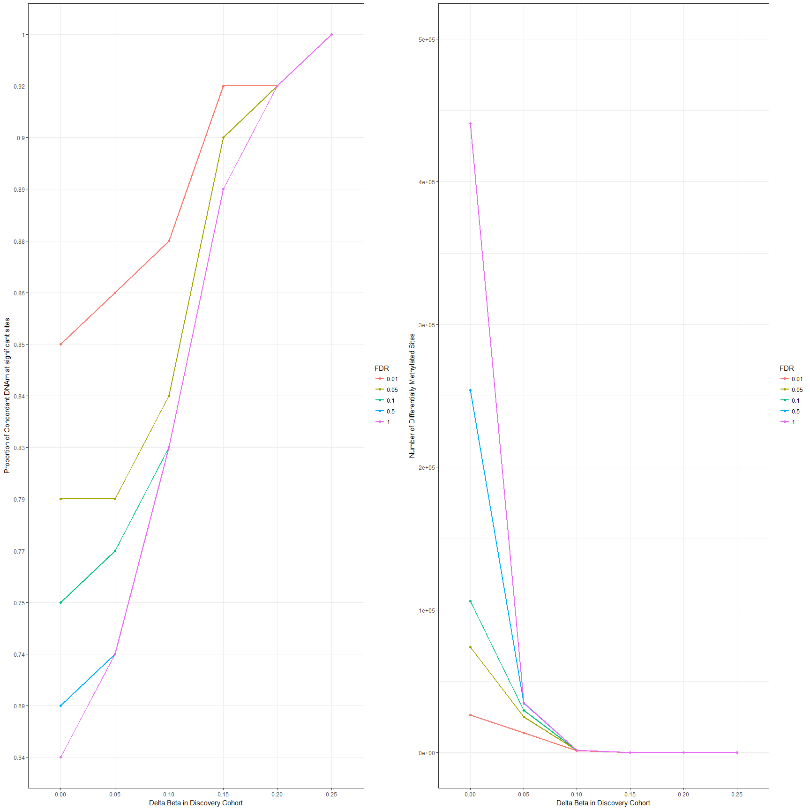
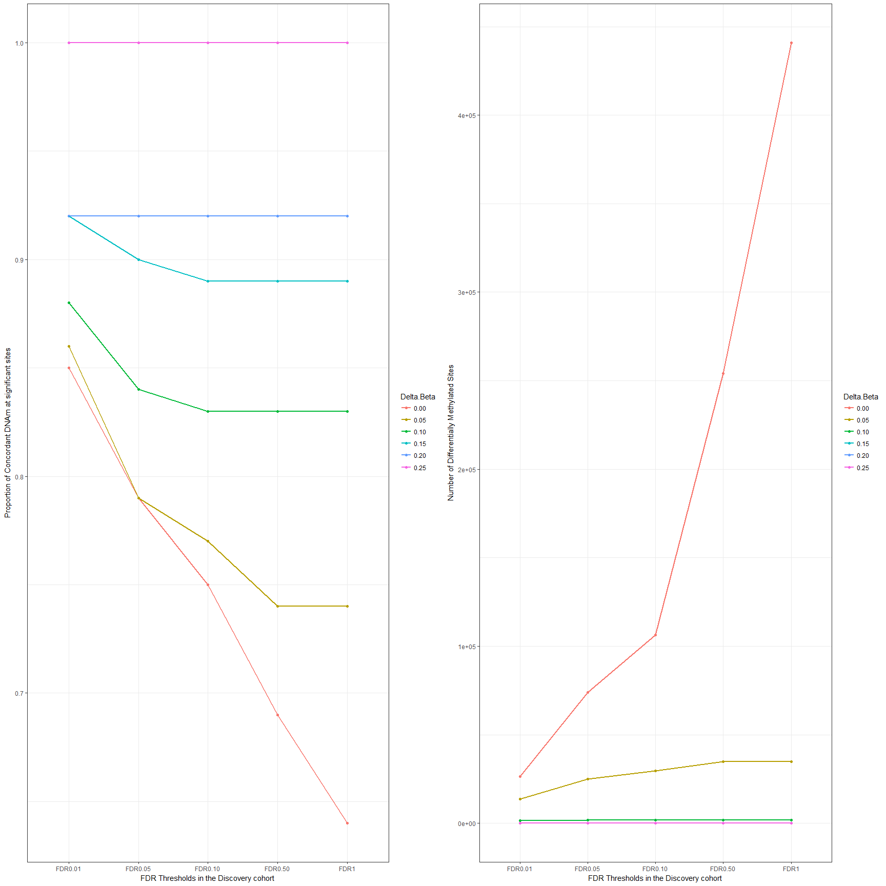

# FDR_DeltaBeta_ThresholdPlot
SLW  
February 23, 2017  


```r
setwd('Z:/ROBLAB1 coredata-databases/1 Samantha DATA Folder/PROJECTS/PE_IUGR_Array/Cox Validation Cohort')

##Load in the beta values of sites that meet the different FDR thresholds in our discovery cohort
Roblab_FDR0.01_betas<-read.table('Z:/ROBLAB1 coredata-databases/1 Samantha DATA Folder/PROJECTS/PE_IUGR_Array/Robinson Cohort/Roblab_EOPE_FDR0.01_Feb2017.txt',header=T)
Roblab_FDR0.05_betas<- read.table('Z:/ROBLAB1 coredata-databases/1 Samantha DATA Folder/PROJECTS/PE_IUGR_Array/Robinson Cohort/Roblab_EOPE_FDR0.05_Feb2017.txt',header=T)
Roblab_FDR0.1_betas<-read.table('Z:/ROBLAB1 coredata-databases/1 Samantha DATA Folder/PROJECTS/PE_IUGR_Array/Robinson Cohort/Roblab_EOPE_FDR0.1_Feb2017.txt',header=T)
Roblab_FDR0.5_betas<- read.table('Z:/ROBLAB1 coredata-databases/1 Samantha DATA Folder/PROJECTS/PE_IUGR_Array/Robinson Cohort/Roblab_EOPE_FDR0.5_Feb2017.txt',header=T)
Roblab_FDR1_betas<- read.table('Z:/ROBLAB1 coredata-databases/1 Samantha DATA Folder/PROJECTS/PE_IUGR_Array/Robinson Cohort/Roblab_EOPE_FDR1_Feb2017.txt',header=T)

##Isolating the same betas at the different FDR thresholds in the Validation cohort
load('ttbeta_all_Cox_LM.RData')

Cox_FDR0.01_betas<-ttbeta_all[which(rownames(ttbeta_all) %in% rownames(Roblab_FDR0.01_betas)),]##26502
Cox_FDR0.05_betas<-ttbeta_all[which(rownames(ttbeta_all) %in% rownames(Roblab_FDR0.05_betas)),]##74016
Cox_FDR0.1_betas<-ttbeta_all[which(rownames(ttbeta_all) %in% rownames(Roblab_FDR0.1_betas)),]##106267
Cox_FDR0.5_betas<-ttbeta_all[which(rownames(ttbeta_all) %in% rownames(Roblab_FDR0.5_betas)),]##254082
Cox_FDR1_betas<-ttbeta_all[which(rownames(ttbeta_all) %in% rownames(Roblab_FDR1_betas)),]##440,943

##For each subset only EOPEvsPreT and merge with the roblab
##First subset and change the column name for all
##Discovery cohort
Roblab_FDR0.01_betas2<-as.data.frame(Roblab_FDR0.01_betas[,c("PreTvsEOPE")])
rownames(Roblab_FDR0.01_betas2)<-rownames(Roblab_FDR0.01_betas)
colnames(Roblab_FDR0.01_betas2)<-c("EOPEvsPreT_Dis")

Roblab_FDR0.05_betas2<-as.data.frame(Roblab_FDR0.05_betas[,c("PreTvsEOPE")])
rownames(Roblab_FDR0.05_betas2)<-rownames(Roblab_FDR0.05_betas)
colnames(Roblab_FDR0.05_betas2)<-c("EOPEvsPreT_Dis")

Roblab_FDR0.1_betas2<-as.data.frame(Roblab_FDR0.1_betas[,c("PreTvsEOPE")])
rownames(Roblab_FDR0.1_betas2)<-rownames(Roblab_FDR0.1_betas)
colnames(Roblab_FDR0.1_betas2)<-c("EOPEvsPreT_Dis")

Roblab_FDR0.5_betas2<-as.data.frame(Roblab_FDR0.5_betas[,c("PreTvsEOPE")])
rownames(Roblab_FDR0.5_betas2)<-rownames(Roblab_FDR0.5_betas)
colnames(Roblab_FDR0.5_betas2)<-c("EOPEvsPreT_Dis")

Roblab_FDR01_betas2<-as.data.frame(Roblab_FDR1_betas[,c("PreTvsEOPE")])
rownames(Roblab_FDR01_betas2)<-rownames(Roblab_FDR1_betas)
colnames(Roblab_FDR01_betas2)<-c("EOPEvsPreT_Dis")

##Validation cohort
Cox_FDR0.01_betas2<-as.data.frame(Cox_FDR0.01_betas[,c("PreTvsEOPE")])
rownames(Cox_FDR0.01_betas2)<-rownames(Cox_FDR0.01_betas)
colnames(Cox_FDR0.01_betas2)<-c("EOPEvsPreT_Val")

Cox_FDR0.05_betas2<-as.data.frame(Cox_FDR0.05_betas[,c("PreTvsEOPE")])
rownames(Cox_FDR0.05_betas2)<-rownames(Cox_FDR0.05_betas)
colnames(Cox_FDR0.05_betas2)<-c("EOPEvsPreT_Val")

Cox_FDR0.1_betas2<-as.data.frame(Cox_FDR0.1_betas[,c("PreTvsEOPE")])
rownames(Cox_FDR0.1_betas2)<-rownames(Cox_FDR0.1_betas)
colnames(Cox_FDR0.1_betas2)<-c("EOPEvsPreT_Val")

Cox_FDR0.5_betas2<-as.data.frame(Cox_FDR0.5_betas[,c("PreTvsEOPE")])
rownames(Cox_FDR0.5_betas2)<-rownames(Cox_FDR0.5_betas)
colnames(Cox_FDR0.5_betas2)<-c("EOPEvsPreT_Val")

Cox_FDR01_betas2<-as.data.frame(Cox_FDR1_betas[,c("PreTvsEOPE")])
rownames(Cox_FDR01_betas2)<-rownames(Cox_FDR1_betas)
colnames(Cox_FDR01_betas2)<-c("EOPEvsPreT_Val")


##now merge
FDR0.01<-merge(Roblab_FDR0.01_betas2,Cox_FDR0.01_betas2,by='row.names')
rownames(FDR0.01)<-FDR0.01$Row.names
FDR0.01$Row.names<-NULL

FDR0.05<-merge(Roblab_FDR0.05_betas2,Cox_FDR0.05_betas2,by='row.names')
rownames(FDR0.05)<-FDR0.05$Row.names
FDR0.05$Row.names<-NULL

FDR0.1<-merge(Roblab_FDR0.1_betas2,Cox_FDR0.1_betas2,by='row.names')
rownames(FDR0.1)<-FDR0.1$Row.names
FDR0.1$Row.names<-NULL

FDR0.5<-merge(Roblab_FDR0.5_betas2,Cox_FDR0.5_betas2,by='row.names')
rownames(FDR0.5)<-FDR0.5$Row.names
FDR0.5$Row.names<-NULL

FDR1<-merge(Roblab_FDR01_betas2,Cox_FDR01_betas2,by='row.names')
rownames(FDR1)<-FDR1$Row.names
FDR1$Row.names<-NULL

##Add new column categorizing where the delta beta falls:
##if the delta beta in the discovery cohort is between 0-0.01 then label "0-0.01", etc. 
library(Hmisc)
```

```
## Loading required package: lattice
```

```
## Loading required package: survival
```

```
## Loading required package: Formula
```

```
## Loading required package: ggplot2
```

```
## 
## Attaching package: 'Hmisc'
```

```
## The following objects are masked from 'package:base':
## 
##     format.pval, round.POSIXt, trunc.POSIXt, units
```

```r
FDR0.01_int<-as.data.frame(cut2(FDR0.01$EOPEvsPreT_Dis, c(-0.3,-0.25,-0.2,-0.15,-0.1,-0.05,0,0.05,0.1,0.15,0.2,0.25,0.3)))
rownames(FDR0.01_int)<-rownames(FDR0.01)
FDR0.01<-cbind(FDR0.01,FDR0.01_int)

FDR0.05_int<-as.data.frame(cut2(FDR0.05$EOPEvsPreT_Dis, c(-0.3,-0.25,-0.2,-0.15,-0.1,-0.05,0,0.05,0.1,0.15,0.2,0.25,0.3)))
rownames(FDR0.05_int) <-rownames(FDR0.05)
FDR0.05<-cbind(FDR0.05,FDR0.05_int)

FDR0.1_int<-as.data.frame(cut2(FDR0.1$EOPEvsPreT_Dis, c(-0.3,-0.25,-0.2,-0.15,-0.1,-0.05,0,0.05,0.1,0.15,0.2,0.25,0.3)))
rownames(FDR0.1_int) <-rownames(FDR0.1)
FDR0.1<-cbind(FDR0.1,FDR0.1_int)

FDR0.5_int<-as.data.frame(cut2(FDR0.5$EOPEvsPreT_Dis, c(-0.3,-0.25,-0.2,-0.15,-0.1,-0.05,0,0.05,0.1,0.15,0.2,0.25,0.3)))
rownames(FDR0.5_int) <-rownames(FDR0.5)
FDR0.5<-cbind(FDR0.5,FDR0.5_int)

FDR1_int<-as.data.frame(cut2(FDR1$EOPEvsPreT_Dis, c(-0.3,-0.25,-0.2,-0.15,-0.1,-0.05,0,0.05,0.1,0.15,0.2,0.25,0.3)))
rownames(FDR1_int) <-rownames(FDR1)
FDR1<-cbind(FDR1,FDR1_int)

##Rename the column name just to make it less confusing
colnames(FDR0.01)<- c("EOPEvsPreT_Dis","EOPEvsPreT_Val","Beta_Category")
colnames(FDR0.05)<- c("EOPEvsPreT_Dis","EOPEvsPreT_Val","Beta_Category")
colnames(FDR0.1)<- c("EOPEvsPreT_Dis","EOPEvsPreT_Val","Beta_Category")
colnames(FDR0.5)<- c("EOPEvsPreT_Dis","EOPEvsPreT_Val","Beta_Category")
colnames(FDR1)<- c("EOPEvsPreT_Dis","EOPEvsPreT_Val","Beta_Category")

##Changing Beta category levels so we have the absolute delta beta
library(plyr)
```

```
## 
## Attaching package: 'plyr'
```

```
## The following objects are masked from 'package:Hmisc':
## 
##     is.discrete, summarize
```

```r
##FDR0.01
FDR0.01$Beta_Category<-revalue(FDR0.01$Beta_Category,c("-0.30"= "[ 0.25, 0.30]"))
FDR0.01$Beta_Category<-revalue(FDR0.01$Beta_Category,c("-0.25"= "[ 0.20, 0.25)"))
FDR0.01$Beta_Category<-revalue(FDR0.01$Beta_Category,c("[-0.20,-0.15)"= "[ 0.15, 0.20)"))
FDR0.01$Beta_Category<-revalue(FDR0.01$Beta_Category,c("[-0.15,-0.10)"= "[ 0.10, 0.15)"))
FDR0.01$Beta_Category<-revalue(FDR0.01$Beta_Category,c("[-0.10,-0.05)"= "[ 0.05, 0.10)"))
FDR0.01$Beta_Category<-revalue(FDR0.01$Beta_Category,c("[-0.05, 0.00)"= "[ 0.00, 0.05)"))

##FDR0.05
FDR0.05$Beta_Category<-revalue(FDR0.05$Beta_Category,c("-0.30"= "[ 0.25, 0.30]"))
FDR0.05$Beta_Category<-revalue(FDR0.05$Beta_Category,c("-0.25"= "[ 0.20, 0.25)"))
FDR0.05$Beta_Category<-revalue(FDR0.05$Beta_Category,c("[-0.20,-0.15)"= "[ 0.15, 0.20)"))
FDR0.05$Beta_Category<-revalue(FDR0.05$Beta_Category,c("[-0.15,-0.10)"= "[ 0.10, 0.15)"))
FDR0.05$Beta_Category<-revalue(FDR0.05$Beta_Category,c("[-0.10,-0.05)"= "[ 0.05, 0.10)"))
FDR0.05$Beta_Category<-revalue(FDR0.05$Beta_Category,c("[-0.05, 0.00)"= "[ 0.00, 0.05)"))

##FDR0.1
FDR0.1$Beta_Category<-revalue(FDR0.1$Beta_Category,c("-0.30"= "[ 0.25, 0.30]"))
FDR0.1$Beta_Category<-revalue(FDR0.1$Beta_Category,c("-0.25"= "[ 0.20, 0.25)"))
FDR0.1$Beta_Category<-revalue(FDR0.1$Beta_Category,c("[-0.20,-0.15)"= "[ 0.15, 0.20)"))
FDR0.1$Beta_Category<-revalue(FDR0.1$Beta_Category,c("[-0.15,-0.10)"= "[ 0.10, 0.15)"))
FDR0.1$Beta_Category<-revalue(FDR0.1$Beta_Category,c("[-0.10,-0.05)"= "[ 0.05, 0.10)"))
FDR0.1$Beta_Category<-revalue(FDR0.1$Beta_Category,c("[-0.05, 0.00)"= "[ 0.00, 0.05)"))

##FDR0.5
FDR0.5$Beta_Category<-revalue(FDR0.5$Beta_Category,c("-0.30"= "[ 0.25, 0.30]"))
FDR0.5$Beta_Category<-revalue(FDR0.5$Beta_Category,c("-0.25"= "[ 0.20, 0.25)"))
FDR0.5$Beta_Category<-revalue(FDR0.5$Beta_Category,c("[-0.20,-0.15)"= "[ 0.15, 0.20)"))
FDR0.5$Beta_Category<-revalue(FDR0.5$Beta_Category,c("[-0.15,-0.10)"= "[ 0.10, 0.15)"))
FDR0.5$Beta_Category<-revalue(FDR0.5$Beta_Category,c("[-0.10,-0.05)"= "[ 0.05, 0.10)"))
FDR0.5$Beta_Category<-revalue(FDR0.5$Beta_Category,c("[-0.05, 0.00)"= "[ 0.00, 0.05)"))

##FDR1
FDR1$Beta_Category<-revalue(FDR1$Beta_Category,c("-0.30"= "[ 0.25, 0.30]"))
FDR1$Beta_Category<-revalue(FDR1$Beta_Category,c("-0.25"= "[ 0.20, 0.25)"))
FDR1$Beta_Category<-revalue(FDR1$Beta_Category,c("[-0.20,-0.15)"= "[ 0.15, 0.20)"))
FDR1$Beta_Category<-revalue(FDR1$Beta_Category,c("[-0.15,-0.10)"= "[ 0.10, 0.15)"))
FDR1$Beta_Category<-revalue(FDR1$Beta_Category,c("[-0.10,-0.05)"= "[ 0.05, 0.10)"))
FDR1$Beta_Category<-revalue(FDR1$Beta_Category,c("[-0.05, 0.00)"= "[ 0.00, 0.05)"))

##Make a column that is "Concordance" where 1 is a change in DNAm in the same direction and 0 is change in DNAm in different directions
##FDR0.01
Concor<-as.data.frame(ifelse(FDR0.01[,1]>0 & FDR0.01[,2]>0|FDR0.01[,1]<0 &FDR0.01[,2]<0,"cor","discor"))
rownames(Concor)<-rownames(FDR0.01)
colnames(Concor)<-c("DNAm_Concordance")
FDR0.01_2<-cbind(FDR0.01, Concor)

##FDR0.05
Concor<-as.data.frame(ifelse(FDR0.05[,1]>0 & FDR0.05[,2]>0|FDR0.05[,1]<0 &FDR0.05[,2]<0,"cor","discor"))
rownames(Concor)<-rownames(FDR0.05)
colnames(Concor)<-c("DNAm_Concordance")
FDR0.05_2<-cbind(FDR0.05, Concor)

##FDR0.1
Concor<-as.data.frame(ifelse(FDR0.1[,1]>0 & FDR0.1[,2]>0|FDR0.1[,1]<0 &FDR0.1[,2]<0,"cor","discor"))
rownames(Concor)<-rownames(FDR0.1)
colnames(Concor)<-c("DNAm_Concordance")
FDR0.1_2<-cbind(FDR0.1, Concor)

##FDR0.5
Concor<-as.data.frame(ifelse(FDR0.5[,1]>0 & FDR0.5[,2]>0|FDR0.5[,1]<0 &FDR0.5[,2]<0,"cor","discor"))
rownames(Concor)<-rownames(FDR0.5)
colnames(Concor)<-c("DNAm_Concordance")
FDR0.5_2<-cbind(FDR0.5, Concor)

##FDR1
Concor<-as.data.frame(ifelse(FDR1[,1]>0 & FDR1[,2]>0|FDR1[,1]<0 &FDR1[,2]<0,"cor","discor"))
rownames(Concor)<-rownames(FDR1)
colnames(Concor)<-c("DNAm_Concordance")
FDR1_2<-cbind(FDR1, Concor)
```


```r
##Dividing the beta values into category doesn't give us the best idea of what changing the beta value threshold does to our concordance proportion rate.

##Let's look at the data in terms of concordance rate for setting beta value thresholds >0.05, >0.1,>0.15,>0.2,>0.25
##FDR0.01
##Subset beta values by those >0.00
FDR0.01_B0.00<-FDR0.01_2[which(FDR0.01_2$Beta_Category=="[ 0.00, 0.05)"|FDR0.01_2$Beta_Category=="[ 0.05, 0.10)"|FDR0.01_2$Beta_Category=="[ 0.10, 0.15)"| FDR0.01_2$Beta_Category=="[ 0.15, 0.20)"|FDR0.01_2$Beta_Category=="[ 0.20, 0.25)",FDR0.01_2$Beta_Category=="[ 0.25, 0.30]"),]
##Calculate concordance rate
sum(FDR0.01_B0.00$DNAm_Concordance=="cor")/sum(nrow(FDR0.01_B0.00))##0.85 (N=26499)
```

```
## [1] 0.851617
```

```r
##Subset beta values by those >0.05
FDR0.01_B0.05<-FDR0.01_2[which(FDR0.01_2$Beta_Category=="[ 0.05, 0.10)"|FDR0.01_2$Beta_Category=="[ 0.10, 0.15)"| FDR0.01_2$Beta_Category=="[ 0.15, 0.20)"|FDR0.01_2$Beta_Category=="[ 0.20, 0.25)",FDR0.01_2$Beta_Category=="[ 0.25, 0.30]"),]
##Calculate concordance rate
sum(FDR0.01_B0.05$DNAm_Concordance=="cor")/sum(nrow(FDR0.01_B0.05))##0.86 (N=13699)
```

```
## [1] 0.8653916
```

```r
##Subset beta values by those >0.1
FDR0.01_2_B0.1<-FDR0.01_2[which(FDR0.01_2$Beta_Category=="[ 0.10, 0.15)"| FDR0.01_2$Beta_Category=="[ 0.15, 0.20)"|FDR0.01_2$Beta_Category=="[ 0.20, 0.25)",FDR0.01_2$Beta_Category=="[ 0.25, 0.30]"),]
##Calculate concordance rate
sum(FDR0.01_2_B0.1$DNAm_Concordance=="cor")/sum(nrow(FDR0.01_2_B0.1))##0.88(1388)
```

```
## [1] 0.8759342
```

```r
##Subset beta values by those >0.15
FDR0.01_2_B0.15<-FDR0.01_2[which(FDR0.01_2$Beta_Category=="[ 0.15, 0.20)"|FDR0.01_2$Beta_Category=="[ 0.20, 0.25)",FDR0.01_2$Beta_Category=="[ 0.25, 0.30]"),]
##Calculate concordance rate
sum(FDR0.01_2_B0.15$DNAm_Concordance=="cor")/sum(nrow(FDR0.01_2_B0.15))##0.92 (119)
```

```
## [1] 0.9159664
```

```r
##Subset beta values by those >0.2
FDR0.01_2_B0.2<-FDR0.01_2[which(FDR0.01_2$Beta_Category=="[ 0.20, 0.25)",FDR0.01_2$Beta_Category=="[ 0.25, 0.30]"),]
##Calculate concordance rate
sum(FDR0.01_2_B0.2$DNAm_Concordance=="cor")/sum(nrow(FDR0.01_2_B0.2))##0.92 (13)
```

```
## [1] 0.9230769
```

```r
##Subset beta values by those >0.25
FDR0.01_2_B0.25<-FDR0.01_2[which(FDR0.01_2$Beta_Category=="[ 0.25, 0.30]"),]
##Calculate concordance rate
sum(FDR0.01_2_B0.25$DNAm_Concordance=="cor")/sum(nrow(FDR0.01_2_B0.25))##
```

```
## [1] 1
```

```r
##FDR0.05
##Subset beta values by those >0.00
FDR0.05_B0.00<-FDR0.05_2[which(FDR0.05_2$Beta_Category=="[ 0.00, 0.05)"|FDR0.05_2$Beta_Category=="[ 0.05, 0.10)"|FDR0.05_2$Beta_Category=="[ 0.10, 0.15)"| FDR0.05_2$Beta_Category=="[ 0.15, 0.20)"|FDR0.05_2$Beta_Category=="[ 0.20, 0.25)",FDR0.05_2$Beta_Category=="[ 0.25, 0.30]"),]
##Calculate concordance rate
sum(FDR0.05_B0.00$DNAm_Concordance=="cor")/sum(nrow(FDR0.05_B0.00))##0.79 (N=74013)
```

```
## [1] 0.7779309
```

```r
##Subset beta values by those >0.05
FDR0.05_2_B0.05<-FDR0.05_2[which(FDR0.05_2$Beta_Category=="[ 0.05, 0.10)"|FDR0.05_2$Beta_Category=="[ 0.10, 0.15)"| FDR0.05_2$Beta_Category=="[ 0.15, 0.20)"|FDR0.05_2$Beta_Category=="[ 0.20, 0.25)",FDR0.05_2$Beta_Category=="[ 0.25, 0.30]"),]
##Calculate concordance rate
sum(FDR0.05_2_B0.05$DNAm_Concordance=="cor")/sum(nrow(FDR0.05_2_B0.05))##0.79 (25035)
```

```
## [1] 0.7910925
```

```r
##Subset beta values by those >0.1
FDR0.05_2_B0.1<-FDR0.05_2[which(FDR0.05_2$Beta_Category=="[ 0.10, 0.15)"| FDR0.05_2$Beta_Category=="[ 0.15, 0.20)"|FDR0.05_2$Beta_Category=="[ 0.20, 0.25)",FDR0.05_2$Beta_Category=="[ 0.25, 0.30]"),]
##Calculate concordance rate
sum(FDR0.05_2_B0.1$DNAm_Concordance=="cor")/sum(nrow(FDR0.05_2_B0.1))##0.84 (1700)
```

```
## [1] 0.8364706
```

```r
##Subset beta values by those >0.15
FDR0.05_2_B0.15<-FDR0.05_2[which(FDR0.05_2$Beta_Category=="[ 0.15, 0.20)"|FDR0.05_2$Beta_Category=="[ 0.20, 0.25)",FDR0.05_2$Beta_Category=="[ 0.25, 0.30]"),]
##Calculate concordance rate
sum(FDR0.05_2_B0.15$DNAm_Concordance=="cor")/sum(nrow(FDR0.05_2_B0.15))##0.9 (131)
```

```
## [1] 0.9007634
```

```r
##Subset beta values by those >0.2
FDR0.05_2_B0.2<-FDR0.05_2[which(FDR0.05_2$Beta_Category=="[ 0.20, 0.25)",FDR0.05_2$Beta_Category=="[ 0.25, 0.30]"),]
##Calculate concordance rate
sum(FDR0.05_2_B0.2$DNAm_Concordance=="cor")/sum(nrow(FDR0.05_2_B0.2))##0.92 (13)
```

```
## [1] 0.9230769
```

```r
##Subset beta values by those >0.25
FDR0.05_2_B0.25<-FDR0.05_2[which(FDR0.05_2$Beta_Category=="[ 0.25, 0.30]"),]
##Calculate concordance rate
sum(FDR0.05_2_B0.25$DNAm_Concordance=="cor")/sum(nrow(FDR0.05_2_B0.25))##1 (3)
```

```
## [1] 1
```

```r
##FDR0.1
##Subset beta values by those >0.00
FDR0.1_B0.00<-FDR0.1_2[which(FDR0.1_2$Beta_Category=="[ 0.00, 0.05)"|FDR0.1_2$Beta_Category=="[ 0.05, 0.10)"|FDR0.1_2$Beta_Category=="[ 0.10, 0.15)"| FDR0.1_2$Beta_Category=="[ 0.15, 0.20)"|FDR0.1_2$Beta_Category=="[ 0.20, 0.25)",FDR0.1_2$Beta_Category=="[ 0.25, 0.30]"),]
##Calculate concordance rate
sum(FDR0.1_B0.00$DNAm_Concordance=="cor")/sum(nrow(FDR0.1_B0.00))##0.75 (N=106264)
```

```
## [1] 0.7531243
```

```r
##Subset beta values by those >0.05
FDR0.1_2_B0.05<-FDR0.1_2[which(FDR0.1_2$Beta_Category=="[ 0.05, 0.10)"|FDR0.1_2$Beta_Category=="[ 0.10, 0.15)"| FDR0.1_2$Beta_Category=="[ 0.15, 0.20)"|FDR0.1_2$Beta_Category=="[ 0.20, 0.25)",FDR0.1_2$Beta_Category=="[ 0.25, 0.30]"),]
##Calculate concordance rate
sum(FDR0.1_2_B0.05$DNAm_Concordance=="cor")/sum(nrow(FDR0.1_2_B0.05))## 0.77 (29656)
```

```
## [1] 0.7676693
```

```r
##Subset beta values by those >0.1
FDR0.1_2_B0.1<-FDR0.1_2[which(FDR0.1_2$Beta_Category=="[ 0.10, 0.15)"| FDR0.1_2$Beta_Category=="[ 0.15, 0.20)"|FDR0.1_2$Beta_Category=="[ 0.20, 0.25)",FDR0.1_2$Beta_Category=="[ 0.25, 0.30]"),]
##Calculate concordance rate
sum(FDR0.1_2_B0.1$DNAm_Concordance=="cor")/sum(nrow(FDR0.1_2_B0.1))##0.83(1789)
```

```
## [1] 0.8311906
```

```r
##Subset beta values by those >0.15
FDR0.1_2_B0.15<-FDR0.1_2[which(FDR0.1_2$Beta_Category=="[ 0.15, 0.20)"|FDR0.1_2$Beta_Category=="[ 0.20, 0.25)",FDR0.1_2$Beta_Category=="[ 0.25, 0.30]"),]
##Calculate concordance rate
sum(FDR0.1_2_B0.15$DNAm_Concordance=="cor")/sum(nrow(FDR0.1_2_B0.15))##0.89 (138)
```

```
## [1] 0.8913043
```

```r
##Subset beta values by those >0.2
FDR0.1_2_B0.2<-FDR0.1_2[which(FDR0.1_2$Beta_Category=="[ 0.20, 0.25)",FDR0.1_2$Beta_Category=="[ 0.25, 0.30]"),]
##Calculate concordance rate
sum(FDR0.1_2_B0.2$DNAm_Concordance=="cor")/sum(nrow(FDR0.1_2_B0.2))##0.92 (13)
```

```
## [1] 0.9230769
```

```r
##Subset beta values by those >0.25
FDR0.1_2_B0.25<-FDR0.1_2[which(FDR0.1_2$Beta_Category=="[ 0.25, 0.30]"),]
##Calculate concordance rate
sum(FDR0.1_2_B0.25$DNAm_Concordance=="cor")/sum(nrow(FDR0.1_2_B0.25))## 1(3)
```

```
## [1] 1
```

```r
##FDR0.5
##Subset beta values by those >0.00
FDR0.5_B0.00<-FDR0.5_2[which(FDR0.5_2$Beta_Category=="[ 0.00, 0.05)"|FDR0.5_2$Beta_Category=="[ 0.05, 0.10)"|FDR0.5_2$Beta_Category=="[ 0.10, 0.15)"| FDR0.5_2$Beta_Category=="[ 0.15, 0.20)"|FDR0.5_2$Beta_Category=="[ 0.20, 0.25)",FDR0.5_2$Beta_Category=="[ 0.25, 0.30]"),]
##Calculate concordance rate
sum(FDR0.5_B0.00$DNAm_Concordance=="cor")/sum(nrow(FDR0.5_B0.00))##0.69 (N=254079)
```

```
## [1] 0.6910646
```

```r
##Subset beta values by those >0.05
FDR0.5_2_B0.05<-FDR0.5_2[which(FDR0.5_2$Beta_Category=="[ 0.05, 0.10)"|FDR0.5_2$Beta_Category=="[ 0.10, 0.15)"| FDR0.5_2$Beta_Category=="[ 0.15, 0.20)"|FDR0.5_2$Beta_Category=="[ 0.20, 0.25)",FDR0.5_2$Beta_Category=="[ 0.25, 0.30]"),]
##Calculate concordance rate
sum(FDR0.5_2_B0.05$DNAm_Concordance=="cor")/sum(nrow(FDR0.5_2_B0.05))##0.74 (34682)
```

```
## [1] 0.7426907
```

```r
##Subset beta values by those >0.1
FDR0.5_2_B0.1<-FDR0.5_2[which(FDR0.5_2$Beta_Category=="[ 0.10, 0.15)"| FDR0.5_2$Beta_Category=="[ 0.15, 0.20)"|FDR0.5_2$Beta_Category=="[ 0.20, 0.25)",FDR0.5_2$Beta_Category=="[ 0.25, 0.30]"),]
##Calculate concordance rate
sum(FDR0.5_2_B0.1$DNAm_Concordance=="cor")/sum(nrow(FDR0.5_2_B0.1))##0.83 (1842)
```

```
## [1] 0.8268187
```

```r
##Subset beta values by those >0.15
FDR0.5_2_B0.15<-FDR0.5_2[which(FDR0.5_2$Beta_Category=="[ 0.15, 0.20)"|FDR0.5_2$Beta_Category=="[ 0.20, 0.25)",FDR0.5_2$Beta_Category=="[ 0.25, 0.30]"),]
##Calculate concordance rate
sum(FDR0.5_2_B0.15$DNAm_Concordance=="cor")/sum(nrow(FDR0.5_2_B0.15))##0.89 (138)
```

```
## [1] 0.8913043
```

```r
##Subset beta values by those >0.2
FDR0.5_2_B0.2<-FDR0.5_2[which(FDR0.5_2$Beta_Category=="[ 0.20, 0.25)",FDR0.5_2$Beta_Category=="[ 0.25, 0.30]"),]
##Calculate concordance rate
sum(FDR0.5_2_B0.2$DNAm_Concordance=="cor")/sum(nrow(FDR0.5_2_B0.2))##0.92 (13)
```

```
## [1] 0.9230769
```

```r
##Subset beta values by those >0.25
FDR0.5_2_B0.25<-FDR0.5_2[which(FDR0.5_2$Beta_Category=="[ 0.25, 0.30]"),]
##Calculate concordance rate
sum(FDR0.5_2_B0.25$DNAm_Concordance=="cor")/sum(nrow(FDR0.5_2_B0.25))##1 (3)
```

```
## [1] 1
```

```r
##FDR1
##Subset beta values by those >0.00
FDR1_B0.00<-FDR1_2[which(FDR1_2$Beta_Category=="[ 0.00, 0.05)"|FDR1_2$Beta_Category=="[ 0.05, 0.10)"|FDR1_2$Beta_Category=="[ 0.10, 0.15)"| FDR1_2$Beta_Category=="[ 0.15, 0.20)"|FDR1_2$Beta_Category=="[ 0.20, 0.25)",FDR1_2$Beta_Category=="[ 0.25, 0.30]"),]
##Calculate concordance rate
sum(FDR1_B0.00$DNAm_Concordance=="cor")/sum(nrow(FDR1_B0.00))##0.64 (N=440940)
```

```
## [1] 0.6411462
```

```r
##Subset beta values by those >0.05
FDR1_2_B0.05<-FDR1_2[which(FDR1_2$Beta_Category=="[ 0.05, 0.10)"|FDR1_2$Beta_Category=="[ 0.10, 0.15)"| FDR1_2$Beta_Category=="[ 0.15, 0.20)"|FDR1_2$Beta_Category=="[ 0.20, 0.25)",FDR1_2$Beta_Category=="[ 0.25, 0.30]"),]
##Calculate concordance rate
sum(FDR1_2_B0.05$DNAm_Concordance=="cor")/sum(nrow(FDR1_2_B0.05))##0.74 (34798)
```

```
## [1] 0.7420541
```

```r
##Subset beta values by those >0.1
FDR1_2_B0.1<-FDR1_2[which(FDR1_2$Beta_Category=="[ 0.10, 0.15)"| FDR1_2$Beta_Category=="[ 0.15, 0.20)"|FDR1_2$Beta_Category=="[ 0.20, 0.25)",FDR1_2$Beta_Category=="[ 0.25, 0.30]"),]
##Calculate concordance rate
sum(FDR1_2_B0.1$DNAm_Concordance=="cor")/sum(nrow(FDR1_2_B0.1))##0.82 (1842)
```

```
## [1] 0.8268187
```

```r
##Subset beta values by those >0.15
FDR1_2_B0.15<-FDR1_2[which(FDR1_2$Beta_Category=="[ 0.15, 0.20)"|FDR1_2$Beta_Category=="[ 0.20, 0.25)",FDR1_2$Beta_Category=="[ 0.25, 0.30]"),]
##Calculate concordance rate
sum(FDR1_2_B0.15$DNAm_Concordance=="cor")/sum(nrow(FDR1_2_B0.15))##0.89 (138)
```

```
## [1] 0.8913043
```

```r
##Subset beta values by those >0.2
FDR1_2_B0.2<-FDR1_2[which(FDR1_2$Beta_Category=="[ 0.20, 0.25)",FDR1_2$Beta_Category=="[ 0.25, 0.30]"),]
##Calculate concordance rate
sum(FDR1_2_B0.2$DNAm_Concordance=="cor")/sum(nrow(FDR1_2_B0.2))##0.92 (13)
```

```
## [1] 0.9230769
```

```r
##Subset beta values by those >0.25
FDR1_2_B0.25<-FDR1_2[which(FDR1_2$Beta_Category=="[ 0.25, 0.30]"),]
##Calculate concordance rate
sum(FDR1_2_B0.25$DNAm_Concordance=="cor")/sum(nrow(FDR1_2_B0.25))##
```

```
## [1] 1
```


```r
##Creating a dataframe with the specific concordance proporotions for each FDR 
Concordance_Data<-data.frame("FDR"=as.numeric(),
                             "DB0.00"=as.numeric(),
                              "DB0.05"=numeric(),
                             "DB0.1"=numeric(),
                             "DB0.15"=numeric(),
                             "DB0.2"=numeric(),
                             "DB0.25"=numeric())

##Input the values (Concordance proportion) manually
Concordance_Data[1,]<-c("0.01","0.85","0.86","0.88","0.92","0.92","1")
Concordance_Data[2,]<-c("0.05","0.79","0.79","0.84","0.9","0.92","1")
Concordance_Data[3,]<-c("0.1","0.75","0.77","0.83","0.89","0.92","1")
Concordance_Data[4,]<-c("0.5","0.69","0.74","0.83","0.89","0.92","1")
Concordance_Data[5,]<-c("1","0.64","0.74","0.83","0.89","0.92","1")

##melt data by FDR
library("reshape2")
Concordance_Data_melt<-melt(Concordance_Data,id="FDR")
##rename variable so DB is not showing
Concordance_Data_melt$variable<-revalue(Concordance_Data_melt$variable,c("DB0.00"="0.00","DB0.05"="0.05","DB0.1"="0.10","DB0.15"="0.15","DB0.2"="0.20","DB0.25"="0.25"))

##Plot
library(ggplot2)
library(tidyr)
```

```
## 
## Attaching package: 'tidyr'
```

```
## The following object is masked from 'package:reshape2':
## 
##     smiths
```

```r
Concordance_DB_Plot<-ggplot(Concordance_Data_melt,aes(x=variable,y=value,colour=FDR,group=FDR))+geom_point()+geom_line(size=1)+
  xlab("Delta Beta in Discovery Cohort")+
  ylab("Proportion of Concordant DNAm at significant sites")+
  theme_bw()


##Plotting FDR on the x axis and the lines being the delta beta cutoffs
Concordance_Data<-data.frame("Delta Beta"=as.numeric(),
                             "FDR0.01"=as.numeric(),
                              "FDR0.05"=numeric(),
                             "FDR0.10"=numeric(),
                             "FDR0.50"=numeric(),
                             "FDR1"=numeric())

##Input the values (Concordance proportion) manually
Concordance_Data[1,]<-c("0.00","0.85","0.79","0.75","0.69","0.64")
Concordance_Data[2,]<-c("0.05","0.86","0.79","0.77","0.74","0.74")
Concordance_Data[3,]<-c("0.10","0.88","0.84","0.83","0.83","0.83")
Concordance_Data[4,]<-c("0.15","0.92","0.90","0.89","0.89","0.89")
Concordance_Data[5,]<-c("0.20","0.92","0.92","0.92","0.92","0.92")
Concordance_Data[6,]<-c("0.25","1","1","1","1","1")

Concordance_Data$FDR0.01<-as.numeric(Concordance_Data$FDR0.01)
Concordance_Data$FDR0.05<-as.numeric(Concordance_Data$FDR0.05)
Concordance_Data$FDR0.10<-as.numeric(Concordance_Data$FDR0.10)
Concordance_Data$FDR0.50<-as.numeric(Concordance_Data$FDR0.50)
Concordance_Data$FDR1<-as.numeric(Concordance_Data$FDR1)
str(Concordance_Data)
```

```
## 'data.frame':	6 obs. of  6 variables:
##  $ Delta.Beta: chr  "0.00" "0.05" "0.10" "0.15" ...
##  $ FDR0.01   : num  0.85 0.86 0.88 0.92 0.92 1
##  $ FDR0.05   : num  0.79 0.79 0.84 0.9 0.92 1
##  $ FDR0.10   : num  0.75 0.77 0.83 0.89 0.92 1
##  $ FDR0.50   : num  0.69 0.74 0.83 0.89 0.92 1
##  $ FDR1      : num  0.64 0.74 0.83 0.89 0.92 1
```

```r
##melt data by Delta Beta
library("reshape2")
Concordance_Data_melt<-melt(Concordance_Data,id="Delta.Beta")

Concordance_FDR_Plot<-ggplot(Concordance_Data_melt,aes(x=variable,y=value,colour=Delta.Beta,group=Delta.Beta))+geom_point()+geom_line(size=1)+
  xlab("FDR Thresholds in the Discovery cohort")+
  ylab("Proportion of Concordant DNAm at significant sites")+
  theme_bw()
```


```r
##With Delta Beta on the x-axis and lines as FDR
HitNo_Data<-data.frame("FDR"=as.numeric(),
                             "DB0.00"=as.numeric(),
                              "DB0.05"=numeric(),
                             "DB0.1"=numeric(),
                             "DB0.15"=numeric(),
                             "DB0.2"=numeric(),
                             "DB0.25"=numeric())

##Input the values (Concordance proportion) manually
HitNo_Data[1,]<-c("0.01","26499","13699","1388","119","13","3")
HitNo_Data[2,]<-c("0.05","74013","25035","1700","131","13","3")
HitNo_Data[3,]<-c("0.1","106264","29656","1789","138","13","3")
HitNo_Data[4,]<-c("0.5","254079","34682","1842","138","13","3")
HitNo_Data[5,]<-c("1","440940","34798","1842","138","13","3")

##melt data by FDR
HitNo_Data_melt<-melt(HitNo_Data,id="FDR")
##rename variable so DB is not showing
HitNo_Data_melt$variable<-revalue(HitNo_Data_melt$variable,c("DB0.00"="0.00","DB0.05"="0.05","DB0.1"="0.10","DB0.15"="0.15","DB0.2"="0.20","DB0.25"="0.25"))
HitNo_Data_melt$value<-as.numeric(HitNo_Data_melt$value)

##Plot
HitNo__DB_Plot<-ggplot(HitNo_Data_melt,aes(x=variable,y=value,colour=FDR,group=FDR))+geom_point()+geom_line(size=1)+
  xlab("Delta Beta in Discovery Cohort")+
  ylab("Number of Differentially Methylated Sites")+
  ylim(c(0,500000))+
  theme_bw()

library(gridExtra)
```

```
## 
## Attaching package: 'gridExtra'
```

```
## The following object is masked from 'package:Hmisc':
## 
##     combine
```

```r
grid.arrange (Concordance_DB_Plot,HitNo__DB_Plot,nrow=1)
```

<!-- -->

```r
##With FDR on the x-axis and lines as Delta Beta
HitNo_Data<-data.frame("Delta Beta"=as.numeric(),
                             "FDR0.01"=as.numeric(),
                              "FDR0.05"=numeric(),
                             "FDR0.10"=numeric(),
                             "FDR0.50"=numeric(),
                             "FDR1"=numeric())

##Input the values (Concordance proportion) manually
HitNo_Data[1,]<-c("0.00","26499","74013","106264","254079","440940")
HitNo_Data[2,]<-c("0.05","13699","25035","29656","34682","34798")
HitNo_Data[3,]<-c("0.10","1388","1700","1789","1842","1842")
HitNo_Data[4,]<-c("0.15","119","131","138","138","138")
HitNo_Data[5,]<-c("0.20","13","13","13","13","13")
HitNo_Data[6,]<-c("0.25","3","3","3","3","3")

HitNo_Data$FDR0.01<-as.numeric(HitNo_Data$FDR0.01)
HitNo_Data$FDR0.05<-as.numeric(HitNo_Data$FDR0.05)
HitNo_Data$FDR0.10<-as.numeric(HitNo_Data$FDR0.10)
HitNo_Data$FDR0.50<-as.numeric(HitNo_Data$FDR0.50)
HitNo_Data$FDR1<-as.numeric(HitNo_Data$FDR1)

##melt data by Delta Beta
HitNo_Data_melt<-melt(HitNo_Data,id="Delta.Beta")

HitNo_FDR_Plot<-ggplot(HitNo_Data_melt,aes(x=variable,y=value,colour=Delta.Beta,group=Delta.Beta))+geom_point()+geom_line(size=1)+
  xlab("FDR Thresholds in the Discovery cohort")+
  ylab("Number of Differentially Methylated Sites")+
  theme_bw()

grid.arrange(Concordance_FDR_Plot,HitNo_FDR_Plot,nrow=1)
```

<!-- -->


