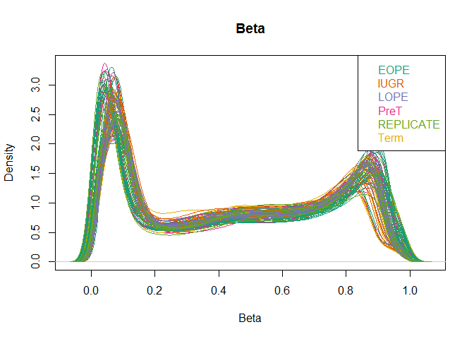

# PE_IUGR_PreProcessing_Jan2016
SLW  
January 13, 2016  
**Load Libraries**

```r
#source("https://bioconductor.org/biocLite.R")
#biocLite('compare')
library(digest)
library(methylumi)
library(lumi)
library(minfi)
library(minfiData)
library(gplots)
library(reshape2)
library(ggplot2)
library("RColorBrewer")
library(gplots)
library(gridExtra)
library(ggplot2)
library(grid)
library(lattice)
library(compare)
library(limma)
library(matrixStats)
```

**Read in Design matrix**

```r
setwd("Z:/ROBLAB1 coredata-databases/1 Samantha DATA Folder/PROJECTS/PE_IUGR_Array/Robinson Cohort")

##Read in Phenotypic data
des<-read.csv('Design_matrix_WPR_2015.csv')
str(des)
```

```
## 'data.frame':	102 obs. of  17 variables:
##  $ ParticipantID   : Factor w/ 102 levels "PL102","PL104",..: 5 25 21 4 13 26 15 14 22 20 ...
##  $ group           : Factor w/ 6 levels "EOPE","IUGR",..: 4 4 4 4 4 4 4 4 4 4 ...
##  $ IUGR            : Factor w/ 2 levels "NO","YES": 1 1 1 1 1 1 1 1 1 1 ...
##  $ Ethnicity       : Factor w/ 10 levels "Asian","Caucasian",..: NA NA NA NA NA NA NA NA NA NA ...
##  $ MA              : num  38.7 23.7 37.3 25.4 34.7 35.8 26.6 35.9 26.9 27.8 ...
##  $ Sex             : Factor w/ 2 levels "FEMALE","MALE": 2 1 1 2 2 2 2 2 2 1 ...
##  $ GA              : num  25 26 28 28 28.6 31.4 32 32.4 32.4 32.6 ...
##  $ BW              : int  978 758 1200 1245 1455 1849 1810 NA 1795 2100 ...
##  $ BW_SD           : num  0.66 -0.5 0.56 0.86 1.7 0.99 0.82 NA 0.74 0.69 ...
##  $ PW              : int  286 265 305 218 230 360 360 430 300 500 ...
##  $ F_PL            : num  3.42 2.86 3.93 5.71 6.33 5.14 5.03 NA 5.98 4.2 ...
##  $ PL_length       : num  NA NA NA NA NA NA NA NA NA NA ...
##  $ PL_breadth      : num  NA NA NA NA NA NA NA NA NA NA ...
##  $ Lgth_Bdth       : num  NA NA NA NA NA NA NA NA NA NA ...
##  $ Plate           : Factor w/ 5 levels "WG0003252-MSA2",..: 1 5 3 3 5 1 1 1 2 1 ...
##  $ Sentrix_ID      : num  6.04e+09 9.98e+09 7.97e+09 7.97e+09 1.00e+10 ...
##  $ Sentrix_Position: Factor w/ 12 levels "R01C01","R01C02",..: 9 12 3 12 5 3 5 3 3 9 ...
```

```r
des$Sentrix_ID<-as.factor(des$Sentrix_ID)
```

**Reading in IDAT Files**

```r
##Read in the raw IDAT Files
setwd("Z:/ROBLAB1 coredata-databases/1 Samantha DATA Folder/PROJECTS/PE_IUGR_Array/Robinson Cohort")
path <- "IDAT Files"
list.files(path)
list.files(file.path(path, "7970368036"))

#targets <- read.450k.sheet(path)
targets <- read.metharray.sheet(path)

baseDir <- system.file(path, package = "minfiData")
sub(baseDir, "", targets$Basename)
##If there is a character(0) within the files, you have a incorrect IDAT file, go back and double check

##Had issues with exceeding memory limit in this next step
## use this function if you have issues memory.limit(size=)
RGset <- read.metharray.exp(targets = targets, verbose = TRUE)
RGset
```

```r
pd <- pData(RGset)
colnames(pd) <- gsub("X", "sampleName", colnames(pd))
```

**Quality Control Checks**

```r
qcReport(RGset, sampNames = pd$sampleName, sampGroups = pd$cell, pdf = "minfi_qcReport.pdf")
```

```
## Warning: NON-POLYMORPHIC probes outside plot range
```

```
## png 
##   2
```

```r
##Some plots of the quality of the data
densityPlot(RGset, sampGroups = pd$group,main = "Beta", xlab = "Beta")
```

<!-- -->

**Raw,Genome Studio equivalent and swan normalization ofr comparison**
For comparison, make a raw, Illumina, and SWAN preprocessed datasets

```r
MSet.raw <- preprocessRaw(RGset)
MSet.raw <- MSet.raw[order(featureNames(MSet.raw)), ]
MSet.norm <- preprocessIllumina(RGset, bg.correct = TRUE, normalize = "no")
MSet.norm <- MSet.norm[order(featureNames(MSet.norm)), ]
MSet.swan <- preprocessSWAN(RGset, mSet = MSet.norm, verbose = TRUE)
MSet.swan <- MSet.swan[order(featureNames(MSet.swan)), ]
```

**Functional normalization**

```r
MSet.fnorm <- preprocessFunnorm(RGset, nPCs = 2, sex = NULL, bgCorr = TRUE, dyeCorr = TRUE, verbose = TRUE)
```

```
## [preprocessFunnorm] Background and dye bias correction with noob
```

```
## [preprocessNoob] Applying R/G ratio flip to fix dye bias...
```

```
## [preprocessFunnorm] Mapping to genome
```

```
## [preprocessFunnorm] Quantile extraction
```

```
## [preprocessFunnorm] Normalization
```

```r
# functional normalization with background and dye bias correction using noob
MSet.fnorm <- MSet.fnorm[order(featureNames(MSet.fnorm)), ]
MSet.fnorm
```

```
## class: GenomicRatioSet 
## dim: 485512 102 
## metadata(0):
## assays(2): Beta CN
## rownames(485512): cg00000029 cg00000108 ... ch.X.97737721F
##   ch.X.98007042R
## rowData names(0):
## colnames(102): 6042324020_R05C01 9977525015_R06C02 ...
##   6042308143_R06C02 9296930098_R05C02
## colData names(20): ParticipantID group ... filenames predictedSex
## Annotation
##   array: IlluminaHumanMethylation450k
##   annotation: ilmn12.hg19
## Preprocessing
##   Method: NA
##   minfi version: NA
##   Manifest version: NA
```

```r
##save project
##save(MSet.fnorm, file = "Z:/ROBLAB1 coredata-databases/1 Samantha DATA Folder/PROJECTS/PE_IUGR_Array/Robinson Cohort/Mset.fnorm_Jan2016.RData")
```

**More Quality Control**

```r
##Checking that all samples have the same sex as the records record
sex <- getSex(MSet.fnorm)
plotSex(sex)
```

<!-- -->

```r
##All samples plotted to the correct fetal sex
```

**Assessing Illumina Normalization (GenomeStudio)**

```r
qc <- getQC(MSet.norm)
plot(as.matrix(getQC(MSet.norm)))
```

<!-- -->

**Looking at sample groups with funNorm**

```r
##set colour palette
group.col <- c("purple4", "dodgerblue2", "turquoise1", "darkorange", "violetred")

mdsPlot(getBeta(MSet.fnorm), numPositions = 485512, sampGroups = pd$group, sampNames = pd$sampleName, pal = group.col, legendPos = "topright")
```

<!-- -->

```r
mdsPlot(getBeta(MSet.fnorm), numPositions = 100000, sampGroups = pd$group, sampNames = pd$sampleName, pal = group.col,legendPos = "topright")
```

<!-- -->

```r
mdsPlot(getBeta(MSet.fnorm), numPositions = 10000, sampGroups = pd$group, sampNames = pd$sampleName, pal = group.col,legendPos = "topright")
```

<!-- -->

```r
mdsPlot(getBeta(MSet.fnorm), numPositions = 1000, sampGroups = pd$group, sampNames = pd$sampleName, pal = group.col,legendPos = "topright")
```

<!-- -->

**Comparing Normalization methods**

```r
all(featureNames(MSet.raw) == featureNames(MSet.norm))
```

```
## [1] TRUE
```

```r
all(featureNames(MSet.raw) == featureNames(MSet.fnorm))
```

```
## [1] TRUE
```

```r
all(featureNames(MSet.raw) == featureNames(MSet.swan))
```

```
## [1] TRUE
```

```r
probeTypes <- data.frame(Name = featureNames(MSet.raw),
                         Type = getProbeType(MSet.raw))

par(mfrow = c(2, 2))
plotBetasByType(MSet.raw[,1], main = "Raw")
plotBetasByType(MSet.norm[,1], main = "GS_norm")
plotBetasByType(MSet.swan[,1], main = "SWAN")
plotBetasByType(getBeta(MSet.fnorm[,1]), probeTypes = probeTypes, main = "funNorm_noob")
```

<!-- -->

```r
##By the looks of things here functional normalization appears to do a better job at normalizing my samples, with the type 1 and type 2 probes being closer together
```


```r
(v.chp.col<-as.vector(pd$Slide))
(v.chp.col<-gsub("6042308147","black",v.chp.col))
(v.chp.col<-gsub("6042324020","green",v.chp.col))
(v.chp.col<-gsub("7970368014","purple",v.chp.col))
(v.chp.col<-gsub("7970368023","red",v.chp.col))
(v.chp.col<-gsub("7970368036","blue",v.chp.col))
(v.chp.col<-gsub("7970368050","yellow",v.chp.col))
(v.chp.col<-gsub("7970368054","orange",v.chp.col))
(v.chp.col<-gsub("7970368062","grey",v.chp.col))
(v.chp.col<-gsub("7970368066","darkred",v.chp.col))
(v.chp.col<-gsub("7970368076","lightgreen",v.chp.col))
(v.chp.col<-gsub("7970368097","darkblue",v.chp.col))
(v.chp.col<-gsub("7970368112","white",v.chp.col))
(v.chp.col<-gsub("7970368142","pink",v.chp.col))
(v.chp.col<-gsub("7973201026","lightyellow",v.chp.col))
(v.chp.col<-gsub("7973201038","lightblue",v.chp.col))
(v.chp.col<-gsub("9266441046","black",v.chp.col))
(v.chp.col<-gsub("9266441156","green",v.chp.col))
(v.chp.col<-gsub("9285451020","purple",v.chp.col))
(v.chp.col<-gsub("9285451059","red",v.chp.col))
(v.chp.col<-gsub("9296930098","blue",v.chp.col))
(v.chp.col<-gsub("9296930103","yellow",v.chp.col))
(v.chp.col<-gsub("9296930123","orange",v.chp.col))
(v.chp.col<-gsub("9977525013","grey",v.chp.col))
(v.chp.col<-gsub("9977525015","darkred",v.chp.col))
(v.chp.col<-gsub("10005833024","lightgreen",v.chp.col))
(v.chp.col<-gsub("10005833037","darkblue",v.chp.col))
(v.chp.col<-gsub("10005833038","white",v.chp.col))
(v.chp.col<-gsub("6042308143","pink",v.chp.col))
(v.chp.col<-gsub("7970368100","lightblue",v.chp.col))
v.chp.col

(v.grp.col<-as.vector(pd$group))
(v.grp.col<-gsub("Term","black",v.grp.col))
(v.grp.col<-gsub("PreT","chocolate4",v.grp.col))
(v.grp.col<-gsub("LOPE","blue",v.grp.col))
(v.grp.col<-gsub("IUGR","goldenrod",v.grp.col))
(v.grp.col<-gsub("REPLICATE","red",v.grp.col))
(v.grp.col<-gsub("EOPE","lightseagreen",v.grp.col))
v.grp.col
```

**Looking at batch effects with heatmap**

```r
##colour
grey <- colorRampPalette(brewer.pal(n = 9, "Greys"))

library(gplots)
cor.raw <- cor(getBeta(MSet.raw), use = "pairwise.complete.obs")
rownames(cor.raw) <- pd$ParticipantID
heatmap.2(cor.raw, main = "MSet.raw, no SNPs - 485,512 probes",
          trace = "none", col = grey, dendrogram = "row",
          RowSideColors = v.grp.col, cexRow = 0.5,
          ColSideColors = v.chp.col, cexCol = 0.9, keysize = 1, margins = c(20,20),
          key = TRUE)
legend("bottomright",bty="n",title="Side bar colours",c("Term","PreT", "LOPE","IUGR","REPLICATE","EOPE"),
       fill=c("black","chocolate4","blue","goldenrod","red","lightseagreen"),ncol=3)
```

<!-- -->

```r
cor.norm <- cor(getBeta(MSet.norm), use = "pairwise.complete.obs")
rownames(cor.norm) <- pd$ParticipantID
heatmap.2(cor.norm, main = "MSet.norm, no SNPs - 485,512 probes",
          trace = "none", col = grey, dendrogram = "row",
          RowSideColors = v.grp.col, cexRow = 0.5,
          ColSideColors = v.chp.col, cexCol = 0.9, keysize = 1, margins = c(20,20))
legend("bottomright",bty="n",title="Side bar colours",c("Term","PreT", "LOPE","IUGR","REPLICATE","EOPE"),
       fill=c("black","chocolate4","blue","goldenrod","red","lightseagreen"),ncol=3)
```

<!-- -->

```r
cor.swan <- cor(getBeta(MSet.swan), use = "pairwise.complete.obs")
rownames(cor.swan) <- pd$ParticipantID
heatmap.2(cor.swan, main = "MSet.swan, no SNPs - 485,512 probes",
          trace = "none", col = grey, dendrogram = "row",
          RowSideColors = v.grp.col, cexRow = 0.5,
          ColSideColors = v.chp.col, cexCol = 0.9, keysize = 1, margins = c(20,20))
legend("bottomright",bty="n",title="Side bar colours",c("Term","PreT", "LOPE","IUGR","REPLICATE","EOPE"),
       fill=c("black","chocolate4","blue","goldenrod","red","lightseagreen"),ncol=3)
```

<!-- -->

```r
cor.fnorm <- cor(getBeta(MSet.fnorm), use = "pairwise.complete.obs")
rownames(cor.fnorm) <- pd$ParticipantID
heatmap.2(cor.fnorm, main = "MSet.fnorm, no SNPs - 485,512 probes",
          trace = "none", col = grey, dendrogram = "row",
          RowSideColors = v.grp.col, cexRow = 0.5,
          ColSideColors = v.chp.col, cexCol = 0.9, keysize = 1, margins = c(20,20))
legend("bottomright",bty="n",title="Side bar colours",c("Term","PreT", "LOPE","IUGR","REPLICATE","EOPE"),
       fill=c("black","chocolate4","blue","goldenrod","red","lightseagreen"),ncol=3)
```

<!-- -->

**Taking m values from Functional Normalization and putting into methylumi PROJECT**
First make a methylumi object with all samples

```r
setwd('Z:/ROBLAB1 coredata-databases/1 Samantha DATA Folder/PROJECTS/PE_IUGR_Array/Robinson Cohort')
##allFile <- file.choose() ## From GenomeStudio: all samples, all columns (all illumina annotation information) 
#                     + average beta, detection Pval, signal A, signal B

##betaFile <- file.choose() ## From GenomeStudio: all the samples, columns
#                     + average beta

##qcFile <-  file.choose() ## From GenomeStudio: under Control Probes Profile - all samples, all columns 
#                     + Signal_Grn, Signal_Red, Detection Pval

load('PROJECT.original_nofilter_Jan2016.RData')
load('PROJECT.2.original_nofilter_Jan2016.RData')
##PROJECT<-lumiMethyR(allFile)
##PROJECT.2 <- methylumiR(betaFile,qcfile=qcFile)

# DataSummary
PROJECT#110 samples * 485,577 features
```

```
## MethyLumiM (storageMode: lockedEnvironment)
## assayData: 485577 features, 110 samples 
##   element names: detection, exprs, methylated, unmethylated 
## protocolData: none
## phenoData
##   sampleNames: PM139 PL11 ... PM306r (110 total)
##   varLabels: sampleID label
##   varMetadata: labelDescription
## featureData
##   featureNames: cg00000029 cg00000108 ... rs9839873 (485577 total)
##   fvarLabels: MAPINF0-1 MAPINFO+1 ... DHS (95 total)
##   fvarMetadata: labelDescription
## experimentData: use 'experimentData(object)'
## Annotation:
```

```r
#sampleNames(PROJECT)

##save(PROJECT,file="PROJECT.original_nofilter_Jan2016.RData")
##save(PROJECT.2,file="PROJECT.2.original_nofilter_Jan2016.RData")
```

**Organizing Design Matrix file**

```r
##reading in Phenotype data
des<-read.csv("Design_matrix_WPR_from540_final.csv",header=T)
rownames(des)<-des$ParticipantID
#str(des)
#Removing unneeded phenotypic data (mostly incomplete data)
des$Sentrix_ID<-as.factor(des$Sentrix_ID)
des$F_PL<-NULL
des$PW<-NULL
des$PL_length<-NULL
des$PL_breadth<-NULL
des$Lgth_Bdth<-NULL
des$Ethnicity<-NULL
des$BW<-NULL
#str(des)

all(sampleNames(PROJECT)%in% rownames(des)) #TRUE
```

```
## [1] TRUE
```

```r
stopifnot(all(sampleNames(PROJECT)%in% rownames(des))) #TRUE
Des <- des[sampleNames(PROJECT),] # *** must reorder des so that sampleNames & des are in same order!!
stopifnot(all(sampleNames(PROJECT)%in% rownames(Des))) #TRUE
#sampleNames(PROJECT)
#rownames(Des) # do a visual check of sample names

pData(PROJECT) <- des

PROJECT <- PROJECT[, order(sampleNames(PROJECT))] # reorder by sample names
#sampleNames(PROJECT)<-rownames(des)

#organize PROJECT.2
PROJECT.2 <- PROJECT.2[,order(sampleNames(PROJECT.2))]
sampleNames(PROJECT.2) # do a visual check of sample names in PROJECT & PROJECT.2
```

```
##   [1] "PL102"   "PL104"   "PL11"    "PL112"   "PL113"   "PL130"   "PL131"  
##   [8] "PL135"   "PL142"   "PL145"   "PL21"    "PL21r"   "PL21r2"  "PL25"   
##  [15] "PL26"    "PL32"    "PL33"    "PL38"    "PL43"    "PL56"    "PL58"   
##  [22] "PL59"    "PL64"    "PL64r1"  "PL64r2"  "PL65"    "PL72"    "PL76"   
##  [29] "PL86"    "PL96"    "PM112"   "PM114"   "PM115"   "PM116"   "PM119"  
##  [36] "PM12"    "PM120"   "PM121"   "PM122"   "PM123"   "PM129"   "PM130"  
##  [43] "PM136"   "PM138"   "PM139"   "PM139r1" "PM139r2" "PM142"   "PM15"   
##  [50] "PM153"   "PM158"   "PM161"   "PM167"   "PM17"    "PM20"    "PM205"  
##  [57] "PM21"    "PM226"   "PM227"   "PM249"   "PM252"   "PM256"   "PM263"  
##  [64] "PM269"   "PM272"   "PM275"   "PM285"   "PM29"    "PM30"    "PM306"  
##  [71] "PM306r"  "PM307"   "PM31"    "PM313"   "PM32"    "PM320"   "PM321"  
##  [78] "PM35"    "PM36"    "PM38"    "PM39"    "PM4"     "PM40"    "PM41"   
##  [85] "PM43"    "PM44"    "PM46"    "PM47"    "PM49"    "PM51"    "PM52"   
##  [92] "PM53"    "PM54"    "PM55"    "PM58"    "PM6"     "PM64"    "PM66"   
##  [99] "PM67"    "PM71"    "PM72"    "PM72r"   "PM74"    "PM77"    "PM80"   
## [106] "PM86"    "PM87"    "PM97"    "PM98"    "PM99"
```

```r
#check that sample names & feature names are the same in PROJECT & PROJECT.2
all(featureNames(PROJECT)%in%featureNames(PROJECT.2)) ## Must be TRUE
```

```
## [1] TRUE
```

```r
all(sampleNames(PROJECT)%in%sampleNames(PROJECT.2)) ## Must be TRUE
```

```
## [1] TRUE
```

**Bad detection p values**

```r
badDetP <- detection(PROJECT)>0.01
nbadDetP <- print(sum(rowSums(badDetP)>=5))##1250 # Number of probes with at least one bad detectionP --2443
```

```
## [1] 1250
```

```r
tbadDetP<-print(sum(badDetP)) # total number of NAs -- 32581
```

```
## [1] 32581
```

```r
nbadDetP.t<-cbind(colSums(badDetP),as.character(PROJECT$Plate))
str(nbadDetP.t)
```

```
##  chr [1:110, 1:2] "128" "426" "639" "265" "127" "331" ...
##  - attr(*, "dimnames")=List of 2
##   ..$ : chr [1:110] "PM39" "PM43" "PM139" "PL113" ...
##   ..$ : NULL
```

```r
#write.table(nbadDetP.t,file='bad dectection p vals_Jan2016.txt')
```

**Missing Beta Values**

```r
avgbeta <- betas(PROJECT.2)[featureNames(PROJECT),sampleNames(PROJECT)]
badAvgbeta <- is.na(avgbeta)
nbadAvgbeta <- print(sum(rowSums(badAvgbeta)>=1))# Number of probes with at least one no avgbeta -- 70,814
```

```
## [1] 70814
```

```r
tbadAvgbeta<-print(sum(badAvgbeta)) # total number of NAs -- 98199
```

```
## [1] 98199
```

```r
nbadAvgbeta.t<-cbind(colSums(badAvgbeta), as.character(PROJECT$Plate))
str(nbadAvgbeta.t)
```

```
##  chr [1:110, 1:2] "995" "702" "433" "567" "689" "800" ...
##  - attr(*, "dimnames")=List of 2
##   ..$ : chr [1:110] "PL102" "PL104" "PL11" "PL112" ...
##   ..$ : NULL
```

```r
#write.table(nbadAvgbeta.t,file='missing betas_all samples_Jan2016.txt')
```

**Filtering Probes-bad probes (missing betas and bad detetion p vals)**

```r
# Set numbers for bad probes 
(nSamples<-length(sampleNames(PROJECT)))
```

```
## [1] 110
```

```r
(Per5<-5)
```

```
## [1] 5
```

```r
## bad detection p value (>0.01)
badDetP <- detection(PROJECT)>0.01
nbadDetP <- print(sum(rowSums(badDetP)>=5)) # Number of probes ---- 1250- this is a very strinent criteria, to cut down the amount of probes I'm removing I will only take samples in which detection p val is>0.01 in >20% of samples
```

```
## [1] 1250
```

```r
## missing beta values
betas.NA <- betas(PROJECT.2)[featureNames(PROJECT.2),sampleNames(PROJECT.2)]
#head(betas.NA)
badAvgbeta<- is.na(betas.NA)
nbadAvgbeta <- print(sum(rowSums(badAvgbeta)>Per5))# Number of probes ---- 705
```

```
## [1] 705
```

```r
##only 705 probes are missing beta values in >5% of my samples

# total number of bad probes
badProbes <- rowSums(badDetP)>=Per5|rowSums(badAvgbeta)>=Per5 ## denotes that we're removing any probe with either a bad average beta or a bad detection P values in more than 5% of samples
sum(badProbes)# Number of probes that will be removed ------ 2294
```

```
## [1] 2294
```

```r
PROJECT.filt <- PROJECT[!badProbes,] #removes all badProbes
dim(PROJECT.filt) #110 samples, 483283  probes
```

```
## Features  Samples 
##   483283      110
```

```r
##save a version of the project with no NAs
PROJECT.noNA<-PROJECT.filt

PROJECT.2.filt<-PROJECT.2[!badProbes,]
dim(PROJECT.2.filt)
```

```
## Features  Samples 
##   483283      110
```

**Any detection p values>0.01, and <5% percent of samples become NA**
*Putting NAs from PROJECT.2.filt into PROJECT.filt*

```r
sum(is.na(exprs(PROJECT.filt)))##0
```

```
## [1] 0
```

```r
sum((detection(PROJECT.filt)>0.01))##6541 probes with >0.01 reading
```

```
## [1] 6541
```

```r
sum(is.na(betas(PROJECT.2)))##98199- total number of sites with NAs
```

```
## [1] 98199
```

```r
##Putting in NAs
exprs(PROJECT.filt)[is.na(betas(PROJECT.2.filt))]<-NA
exprs.NA <- exprs(PROJECT.filt)[featureNames(PROJECT.filt),sampleNames(PROJECT.filt)]
exprs.badAvgbeta<- is.na(exprs.NA)
exprs.nbadAvgbeta <- print(sum(rowSums(exprs.badAvgbeta)>=1)) #69400- slightly less than above, because we took out bad probes
```

```
## [1] 69400
```

```r
stopifnot(length(nbadAvgbeta)==length(exprs.nbadAvgbeta))
exprs.tbadAvgbeta<-print(sum(exprs.badAvgbeta))# total number of NAs in M values-- 89031
```

```
## [1] 89031
```

```r
# Transfer NAs into M values for probes with bad detection pvalues
sum(badDetP <- detection(PROJECT.filt)>0.01) #6541 (same as above)
```

```
## [1] 6541
```

```r
exprs(PROJECT.filt)[(detection(PROJECT.filt)>0.01)]<-NA
exprs.NA <- exprs(PROJECT.filt)[featureNames(PROJECT.filt),sampleNames(PROJECT.filt)]
exprs.NA.T<- is.na(exprs.NA) # matrix of T/F is the M value an NA?
exprs.n <- print(sum(rowSums(exprs.NA.T)>=1))#number of probes with >=1 NA -- 71974
```

```
## [1] 71974
```

```r
print(sum(exprs.NA.T))# total number of NAs -- 95505
```

```
## [1] 95434
```

```r
# Sanity check that NAs were transferred
sum(is.na(exprs(PROJECT.filt))) # 95505
```

```
## [1] 95434
```

```r
##PROJECT with PROJECT.2 NAs in place- be used in any statistical analysis
PROJECT.NA<-PROJECT.filt
```

**Filter XY probes,SNP probes, and cross hybridizing probes**

```r
##remove XY chromosome probes PROJECT.noNA
PROJECT.xy <- PROJECT.noNA[fData(PROJECT.noNA)$CHR%in%c("X","Y"),] 
PROJECT.xy #n=11,273
```

```
## MethyLumiM (storageMode: lockedEnvironment)
## assayData: 11273 features, 110 samples 
##   element names: detection, exprs, methylated, unmethylated 
## protocolData: none
## phenoData
##   sampleNames: PL102 PL104 ... PM99 (110 total)
##   varLabels: ParticipantID group ... Sentrix_Position (11 total)
##   varMetadata: labelDescription
## featureData
##   featureNames: cg00005617 cg00006815 ... ch.X.98007042R (11273
##     total)
##   fvarLabels: MAPINF0-1 MAPINFO+1 ... DHS (95 total)
##   fvarMetadata: labelDescription
## experimentData: use 'experimentData(object)'
## Annotation:
```

```r
PROJECT.noNA.noXY<- PROJECT.noNA[!fData(PROJECT.noNA)$CHR%in%c("X","Y"),]
PROJECT.noNA.noXY #110 samples, 472010  probes
```

```
## MethyLumiM (storageMode: lockedEnvironment)
## assayData: 472010 features, 110 samples 
##   element names: detection, exprs, methylated, unmethylated 
## protocolData: none
## phenoData
##   sampleNames: PL102 PL104 ... PM99 (110 total)
##   varLabels: ParticipantID group ... Sentrix_Position (11 total)
##   varMetadata: labelDescription
## featureData
##   featureNames: cg00000029 cg00000108 ... rs9839873 (472010 total)
##   fvarLabels: MAPINF0-1 MAPINFO+1 ... DHS (95 total)
##   fvarMetadata: labelDescription
## experimentData: use 'experimentData(object)'
## Annotation:
```

```r
##PROJECT.NA
PROJECT.xy <- PROJECT.NA[fData(PROJECT.NA)$CHR%in%c("X","Y"),] 
PROJECT.xy #n=11,273
```

```
## MethyLumiM (storageMode: lockedEnvironment)
## assayData: 11273 features, 110 samples 
##   element names: detection, exprs, methylated, unmethylated 
## protocolData: none
## phenoData
##   sampleNames: PL102 PL104 ... PM99 (110 total)
##   varLabels: ParticipantID group ... Sentrix_Position (11 total)
##   varMetadata: labelDescription
## featureData
##   featureNames: cg00005617 cg00006815 ... ch.X.98007042R (11273
##     total)
##   fvarLabels: MAPINF0-1 MAPINFO+1 ... DHS (95 total)
##   fvarMetadata: labelDescription
## experimentData: use 'experimentData(object)'
## Annotation:
```

```r
PROJECT.NA.noXY<- PROJECT.NA[!fData(PROJECT.NA)$CHR%in%c("X","Y"),]
PROJECT.NA.noXY #110 samples, 472010  probes
```

```
## MethyLumiM (storageMode: lockedEnvironment)
## assayData: 472010 features, 110 samples 
##   element names: detection, exprs, methylated, unmethylated 
## protocolData: none
## phenoData
##   sampleNames: PL102 PL104 ... PM99 (110 total)
##   varLabels: ParticipantID group ... Sentrix_Position (11 total)
##   varMetadata: labelDescription
## featureData
##   featureNames: cg00000029 cg00000108 ... rs9839873 (472010 total)
##   fvarLabels: MAPINF0-1 MAPINFO+1 ... DHS (95 total)
##   fvarMetadata: labelDescription
## experimentData: use 'experimentData(object)'
## Annotation:
```

```r
##PROJECT.2.filt
PROJECT.xy <- PROJECT.2.filt[fData(PROJECT.2.filt)$CHR%in%c("X","Y"),] 
PROJECT.xy #n=11,273
```

```
## 
## Object Information:
## MethyLumiSet (storageMode: lockedEnvironment)
## assayData: 11273 features, 110 samples 
##   element names: betas 
## protocolData: none
## phenoData
##   sampleNames: PL102 PL104 ... PM99 (110 total)
##   varLabels: sampleID label
##   varMetadata: labelDescription
## featureData
##   featureNames: cg00005617 cg00006815 ... ch.X.98007042R (11273
##     total)
##   fvarLabels: MAPINF0-1 MAPINFO+1 ... DHS (95 total)
##   fvarMetadata: labelDescription
## experimentData: use 'experimentData(object)'
## Annotation:  
## Major Operation History:
##             submitted            finished
## 1 2016-01-13 14:35:54 2016-01-13 14:40:25
## 2 2016-11-29 17:24:26 2016-11-29 17:24:28
## 3 2016-11-29 17:24:47 2016-11-29 17:24:50
## 4 2016-11-29 17:25:34 2016-11-29 17:25:34
##                                            command
## 1 methylumiR(filename = betaFile, qcfile = qcFile)
## 2                           Subset of 110 samples.
## 3                       Subset of 483283 features.
## 4                        Subset of 11273 features.
```

```r
PROJECT.2.filt.noXY<- PROJECT.2.filt[!fData(PROJECT.2.filt)$CHR%in%c("X","Y"),]
PROJECT.2.filt.noXY #110 samples, 472010  probes
```

```
## 
## Object Information:
## MethyLumiSet (storageMode: lockedEnvironment)
## assayData: 472010 features, 110 samples 
##   element names: betas 
## protocolData: none
## phenoData
##   sampleNames: PL102 PL104 ... PM99 (110 total)
##   varLabels: sampleID label
##   varMetadata: labelDescription
## featureData
##   featureNames: cg00000029 cg00000108 ... rs9839873 (472010 total)
##   fvarLabels: MAPINF0-1 MAPINFO+1 ... DHS (95 total)
##   fvarMetadata: labelDescription
## experimentData: use 'experimentData(object)'
## Annotation:  
## Major Operation History:
##             submitted            finished
## 1 2016-01-13 14:35:54 2016-01-13 14:40:25
## 2 2016-11-29 17:24:26 2016-11-29 17:24:28
## 3 2016-11-29 17:24:47 2016-11-29 17:24:50
## 4 2016-11-29 17:25:34 2016-11-29 17:25:37
##                                            command
## 1 methylumiR(filename = betaFile, qcfile = qcFile)
## 2                           Subset of 110 samples.
## 3                       Subset of 483283 features.
## 4                       Subset of 472010 features.
```

**Filter Polymorphic Probes**

```r
##PROJECT.noNA
fvarLabels(PROJECT.noNA.noXY)
```

```
##  [1] "MAPINF0-1"                   "MAPINFO+1"                  
##  [3] "Probe_start"                 "Probe_end"                  
##  [5] "SNPCpG"                      "n_SNPCpG"                   
##  [7] "SNPprobe"                    "n_SNPprobe"                 
##  [9] "HIL_CpG_class"               "HIL_CpG_Island_Name"        
## [11] "n_bp_repetitive"             "AlleleA_Hits"               
## [13] "AlleleB_Hits"                "XY_Hits"                    
## [15] "Autosomal_Hits"              "Closest_TSS"                
## [17] "Closest_TSS_1"               "Distance_closest_TSS"       
## [19] "Closest_TSS_gene_name"       "Closest_TSS_Transcript"     
## [21] "firstexon5UTRnHits"          "firstexon5UTRAccessions"    
## [23] "firstexonBodynHits"          "firstexonBodyAccessions"    
## [25] "firstexon3UTRnHits"          "firstexon3UTRAccessions"    
## [27] "exon5UTRnHits"               "exon5UTRAccessions"         
## [29] "exonBodynHits"               "exonBodyAccessions"         
## [31] "exon3UTRnHits"               "exon3UTRAccessions"         
## [33] "intron5UTRnHits"             "intron5UTRAccessions"       
## [35] "intronBodynHits"             "intronBodyAccessions"       
## [37] "intron3UTRnHits"             "intron3UTRAccessions"       
## [39] "IlluminaAccession"           "firstexon5UTRnHitsPerGene"  
## [41] "firstexon5UTRGene"           "firstexonBodynHitsPerGene"  
## [43] "firstexonBodyGene"           "firstexon3UTRnHitsPerGene"  
## [45] "firstexon3UTRGene"           "exon5UTRnHitsPerGene"       
## [47] "exon5UTRGene"                "exonBodynHitsPerGene"       
## [49] "exonBodyGene"                "exon3UTRnHitsPerGene"       
## [51] "exon3UTRGene"                "intron5UTRnHitsPerGene"     
## [53] "intron5UTRGene"              "intronBodynHitsPerGene"     
## [55] "intronBodyGene"              "intron3UTRnHitsPerGene"     
## [57] "intron3UTRGene"              "IlluminaGene"               
## [59] "Index"                       "TargetID"                   
## [61] "ProbeID_A"                   "ProbeID_B"                  
## [63] "ILMNID"                      "NAME"                       
## [65] "ADDRESSA_ID"                 "ALLELEA_PROBESEQ"           
## [67] "ADDRESSB_ID"                 "ALLELEB_PROBESEQ"           
## [69] "INFINIUM_DESIGN_TYPE"        "NEXT_BASE"                  
## [71] "COLOR_CHANNEL"               "FORWARD_SEQUENCE"           
## [73] "GENOME_BUILD"                "CHR"                        
## [75] "MAPINFO"                     "SOURCESEQ"                  
## [77] "CHROMOSOME_36"               "COORDINATE_36"              
## [79] "STRAND"                      "PROBE_SNPS"                 
## [81] "PROBE_SNPS_10"               "RANDOM_LOCI"                
## [83] "METHYL27_LOCI"               "UCSC_REFGENE_NAME"          
## [85] "UCSC_REFGENE_ACCESSION"      "UCSC_REFGENE_GROUP"         
## [87] "UCSC_CPG_ISLANDS_NAME"       "RELATION_TO_UCSC_CPG_ISLAND"
## [89] "PHANTOM"                     "DMR"                        
## [91] "ENHANCER"                    "HMM_ISLAND"                 
## [93] "REGULATORY_FEATURE_NAME"     "REGULATORY_FEATURE_GROUP"   
## [95] "DHS"
```

```r
PROJECT.noNA.noXY.noSNP<-PROJECT.noNA.noXY[substring(fData(PROJECT.noNA.noXY)[,5], 1,2)!="rs",] #removes all SNP probes
PROJECT.noNA.noXY.noSNP #110 samples, 453,182 probes
```

```
## MethyLumiM (storageMode: lockedEnvironment)
## assayData: 451806 features, 110 samples 
##   element names: detection, exprs, methylated, unmethylated 
## protocolData: none
## phenoData
##   sampleNames: PL102 PL104 ... PM99 (110 total)
##   varLabels: ParticipantID group ... Sentrix_Position (11 total)
##   varMetadata: labelDescription
## featureData
##   featureNames: cg00000029 cg00000108 ... rs9839873 (451806 total)
##   fvarLabels: MAPINF0-1 MAPINFO+1 ... DHS (95 total)
##   fvarMetadata: labelDescription
## experimentData: use 'experimentData(object)'
## Annotation:
```

```r
##PROJECT.NA
fvarLabels(PROJECT.NA.noXY)
```

```
##  [1] "MAPINF0-1"                   "MAPINFO+1"                  
##  [3] "Probe_start"                 "Probe_end"                  
##  [5] "SNPCpG"                      "n_SNPCpG"                   
##  [7] "SNPprobe"                    "n_SNPprobe"                 
##  [9] "HIL_CpG_class"               "HIL_CpG_Island_Name"        
## [11] "n_bp_repetitive"             "AlleleA_Hits"               
## [13] "AlleleB_Hits"                "XY_Hits"                    
## [15] "Autosomal_Hits"              "Closest_TSS"                
## [17] "Closest_TSS_1"               "Distance_closest_TSS"       
## [19] "Closest_TSS_gene_name"       "Closest_TSS_Transcript"     
## [21] "firstexon5UTRnHits"          "firstexon5UTRAccessions"    
## [23] "firstexonBodynHits"          "firstexonBodyAccessions"    
## [25] "firstexon3UTRnHits"          "firstexon3UTRAccessions"    
## [27] "exon5UTRnHits"               "exon5UTRAccessions"         
## [29] "exonBodynHits"               "exonBodyAccessions"         
## [31] "exon3UTRnHits"               "exon3UTRAccessions"         
## [33] "intron5UTRnHits"             "intron5UTRAccessions"       
## [35] "intronBodynHits"             "intronBodyAccessions"       
## [37] "intron3UTRnHits"             "intron3UTRAccessions"       
## [39] "IlluminaAccession"           "firstexon5UTRnHitsPerGene"  
## [41] "firstexon5UTRGene"           "firstexonBodynHitsPerGene"  
## [43] "firstexonBodyGene"           "firstexon3UTRnHitsPerGene"  
## [45] "firstexon3UTRGene"           "exon5UTRnHitsPerGene"       
## [47] "exon5UTRGene"                "exonBodynHitsPerGene"       
## [49] "exonBodyGene"                "exon3UTRnHitsPerGene"       
## [51] "exon3UTRGene"                "intron5UTRnHitsPerGene"     
## [53] "intron5UTRGene"              "intronBodynHitsPerGene"     
## [55] "intronBodyGene"              "intron3UTRnHitsPerGene"     
## [57] "intron3UTRGene"              "IlluminaGene"               
## [59] "Index"                       "TargetID"                   
## [61] "ProbeID_A"                   "ProbeID_B"                  
## [63] "ILMNID"                      "NAME"                       
## [65] "ADDRESSA_ID"                 "ALLELEA_PROBESEQ"           
## [67] "ADDRESSB_ID"                 "ALLELEB_PROBESEQ"           
## [69] "INFINIUM_DESIGN_TYPE"        "NEXT_BASE"                  
## [71] "COLOR_CHANNEL"               "FORWARD_SEQUENCE"           
## [73] "GENOME_BUILD"                "CHR"                        
## [75] "MAPINFO"                     "SOURCESEQ"                  
## [77] "CHROMOSOME_36"               "COORDINATE_36"              
## [79] "STRAND"                      "PROBE_SNPS"                 
## [81] "PROBE_SNPS_10"               "RANDOM_LOCI"                
## [83] "METHYL27_LOCI"               "UCSC_REFGENE_NAME"          
## [85] "UCSC_REFGENE_ACCESSION"      "UCSC_REFGENE_GROUP"         
## [87] "UCSC_CPG_ISLANDS_NAME"       "RELATION_TO_UCSC_CPG_ISLAND"
## [89] "PHANTOM"                     "DMR"                        
## [91] "ENHANCER"                    "HMM_ISLAND"                 
## [93] "REGULATORY_FEATURE_NAME"     "REGULATORY_FEATURE_GROUP"   
## [95] "DHS"
```

```r
PROJECT.NA.noXY.noSNP<-PROJECT.NA.noXY[substring(fData(PROJECT.NA.noXY)[,5], 1,2)!="rs",] #removes all SNP probes
PROJECT.NA.noXY.noSNP #110 samples, 453,182 probes
```

```
## MethyLumiM (storageMode: lockedEnvironment)
## assayData: 451806 features, 110 samples 
##   element names: detection, exprs, methylated, unmethylated 
## protocolData: none
## phenoData
##   sampleNames: PL102 PL104 ... PM99 (110 total)
##   varLabels: ParticipantID group ... Sentrix_Position (11 total)
##   varMetadata: labelDescription
## featureData
##   featureNames: cg00000029 cg00000108 ... rs9839873 (451806 total)
##   fvarLabels: MAPINF0-1 MAPINFO+1 ... DHS (95 total)
##   fvarMetadata: labelDescription
## experimentData: use 'experimentData(object)'
## Annotation:
```

```r
##PROJECT.2.filt
fvarLabels(PROJECT.2.filt.noXY)
```

```
##  [1] "MAPINF0-1"                   "MAPINFO+1"                  
##  [3] "Probe_start"                 "Probe_end"                  
##  [5] "SNPCpG"                      "n_SNPCpG"                   
##  [7] "SNPprobe"                    "n_SNPprobe"                 
##  [9] "HIL_CpG_class"               "HIL_CpG_Island_Name"        
## [11] "n_bp_repetitive"             "AlleleA_Hits"               
## [13] "AlleleB_Hits"                "XY_Hits"                    
## [15] "Autosomal_Hits"              "Closest_TSS"                
## [17] "Closest_TSS_1"               "Distance_closest_TSS"       
## [19] "Closest_TSS_gene_name"       "Closest_TSS_Transcript"     
## [21] "firstexon5UTRnHits"          "firstexon5UTRAccessions"    
## [23] "firstexonBodynHits"          "firstexonBodyAccessions"    
## [25] "firstexon3UTRnHits"          "firstexon3UTRAccessions"    
## [27] "exon5UTRnHits"               "exon5UTRAccessions"         
## [29] "exonBodynHits"               "exonBodyAccessions"         
## [31] "exon3UTRnHits"               "exon3UTRAccessions"         
## [33] "intron5UTRnHits"             "intron5UTRAccessions"       
## [35] "intronBodynHits"             "intronBodyAccessions"       
## [37] "intron3UTRnHits"             "intron3UTRAccessions"       
## [39] "IlluminaAccession"           "firstexon5UTRnHitsPerGene"  
## [41] "firstexon5UTRGene"           "firstexonBodynHitsPerGene"  
## [43] "firstexonBodyGene"           "firstexon3UTRnHitsPerGene"  
## [45] "firstexon3UTRGene"           "exon5UTRnHitsPerGene"       
## [47] "exon5UTRGene"                "exonBodynHitsPerGene"       
## [49] "exonBodyGene"                "exon3UTRnHitsPerGene"       
## [51] "exon3UTRGene"                "intron5UTRnHitsPerGene"     
## [53] "intron5UTRGene"              "intronBodynHitsPerGene"     
## [55] "intronBodyGene"              "intron3UTRnHitsPerGene"     
## [57] "intron3UTRGene"              "IlluminaGene"               
## [59] "Index"                       "TargetID"                   
## [61] "ProbeID_A"                   "ProbeID_B"                  
## [63] "ILMNID"                      "NAME"                       
## [65] "ADDRESSA_ID"                 "ALLELEA_PROBESEQ"           
## [67] "ADDRESSB_ID"                 "ALLELEB_PROBESEQ"           
## [69] "INFINIUM_DESIGN_TYPE"        "NEXT_BASE"                  
## [71] "COLOR_CHANNEL"               "FORWARD_SEQUENCE"           
## [73] "GENOME_BUILD"                "CHR"                        
## [75] "MAPINFO"                     "SOURCESEQ"                  
## [77] "CHROMOSOME_36"               "COORDINATE_36"              
## [79] "STRAND"                      "PROBE_SNPS"                 
## [81] "PROBE_SNPS_10"               "RANDOM_LOCI"                
## [83] "METHYL27_LOCI"               "UCSC_REFGENE_NAME"          
## [85] "UCSC_REFGENE_ACCESSION"      "UCSC_REFGENE_GROUP"         
## [87] "UCSC_CPG_ISLANDS_NAME"       "RELATION_TO_UCSC_CPG_ISLAND"
## [89] "PHANTOM"                     "DMR"                        
## [91] "ENHANCER"                    "HMM_ISLAND"                 
## [93] "REGULATORY_FEATURE_NAME"     "REGULATORY_FEATURE_GROUP"   
## [95] "DHS"
```

```r
PROJECT.2.filt.noXY.noSNP<-PROJECT.2.filt.noXY[substring(fData(PROJECT.2.filt.noXY)[,5], 1,2)!="rs",] #removes all SNP probes
PROJECT.2.filt.noXY.noSNP #110 samples, 453,182 probes
```

```
## 
## Object Information:
## MethyLumiSet (storageMode: lockedEnvironment)
## assayData: 451806 features, 110 samples 
##   element names: betas 
## protocolData: none
## phenoData
##   sampleNames: PL102 PL104 ... PM99 (110 total)
##   varLabels: sampleID label
##   varMetadata: labelDescription
## featureData
##   featureNames: cg00000029 cg00000108 ... rs9839873 (451806 total)
##   fvarLabels: MAPINF0-1 MAPINFO+1 ... DHS (95 total)
##   fvarMetadata: labelDescription
## experimentData: use 'experimentData(object)'
## Annotation:  
## Major Operation History:
##             submitted            finished
## 1 2016-01-13 14:35:54 2016-01-13 14:40:25
## 2 2016-11-29 17:24:26 2016-11-29 17:24:28
## 3 2016-11-29 17:24:47 2016-11-29 17:24:50
## 4 2016-11-29 17:25:34 2016-11-29 17:25:37
## 5 2016-11-29 17:26:00 2016-11-29 17:26:07
##                                            command
## 1 methylumiR(filename = betaFile, qcfile = qcFile)
## 2                           Subset of 110 samples.
## 3                       Subset of 483283 features.
## 4                       Subset of 472010 features.
## 5                       Subset of 451806 features.
```

**Filter Cross hybridizing probes**

```r
##PROJECT.noNA
xy_hit_index <- which(featureData(PROJECT.noNA.noXY.noSNP)$XY_Hits == "XY_NO")
PROJECT.noNA.noXY.noSNP.noCH<- PROJECT.noNA.noXY.noSNP[xy_hit_index, ]
PROJECT.noNA.noXY.noSNP.noCH #110 samples, 441093 probes
```

```
## MethyLumiM (storageMode: lockedEnvironment)
## assayData: 441093 features, 110 samples 
##   element names: detection, exprs, methylated, unmethylated 
## protocolData: none
## phenoData
##   sampleNames: PL102 PL104 ... PM99 (110 total)
##   varLabels: ParticipantID group ... Sentrix_Position (11 total)
##   varMetadata: labelDescription
## featureData
##   featureNames: cg00000029 cg00000108 ... ch.9.991104F (441093
##     total)
##   fvarLabels: MAPINF0-1 MAPINFO+1 ... DHS (95 total)
##   fvarMetadata: labelDescription
## experimentData: use 'experimentData(object)'
## Annotation:
```

```r
##PROJECT.NA
xy_hit_index <- which(featureData(PROJECT.NA.noXY.noSNP)$XY_Hits == "XY_NO")
PROJECT.NA.noXY.noSNP.noCH<- PROJECT.NA.noXY.noSNP[xy_hit_index, ]
PROJECT.NA.noXY.noSNP.noCH #110 samples, 441093 probes
```

```
## MethyLumiM (storageMode: lockedEnvironment)
## assayData: 441093 features, 110 samples 
##   element names: detection, exprs, methylated, unmethylated 
## protocolData: none
## phenoData
##   sampleNames: PL102 PL104 ... PM99 (110 total)
##   varLabels: ParticipantID group ... Sentrix_Position (11 total)
##   varMetadata: labelDescription
## featureData
##   featureNames: cg00000029 cg00000108 ... ch.9.991104F (441093
##     total)
##   fvarLabels: MAPINF0-1 MAPINFO+1 ... DHS (95 total)
##   fvarMetadata: labelDescription
## experimentData: use 'experimentData(object)'
## Annotation:
```

```r
##PROJECT.2.filt
xy_hit_index <- which(featureData(PROJECT.2.filt.noXY.noSNP)$XY_Hits == "XY_NO")
PROJECT.2.filt.noXY.noSNP.noCH<- PROJECT.2.filt.noXY.noSNP[xy_hit_index, ]
PROJECT.2.filt.noXY.noSNP.noCH #110 samples, 441093 probes
```

```
## 
## Object Information:
## MethyLumiSet (storageMode: lockedEnvironment)
## assayData: 441093 features, 110 samples 
##   element names: betas 
## protocolData: none
## phenoData
##   sampleNames: PL102 PL104 ... PM99 (110 total)
##   varLabels: sampleID label
##   varMetadata: labelDescription
## featureData
##   featureNames: cg00000029 cg00000108 ... ch.9.991104F (441093
##     total)
##   fvarLabels: MAPINF0-1 MAPINFO+1 ... DHS (95 total)
##   fvarMetadata: labelDescription
## experimentData: use 'experimentData(object)'
## Annotation:  
## Major Operation History:
##             submitted            finished
## 1 2016-01-13 14:35:54 2016-01-13 14:40:25
## 2 2016-11-29 17:24:26 2016-11-29 17:24:28
## 3 2016-11-29 17:24:47 2016-11-29 17:24:50
## 4 2016-11-29 17:25:34 2016-11-29 17:25:37
## 5 2016-11-29 17:26:00 2016-11-29 17:26:07
## 6 2016-11-29 17:26:24 2016-11-29 17:26:28
##                                            command
## 1 methylumiR(filename = betaFile, qcfile = qcFile)
## 2                           Subset of 110 samples.
## 3                       Subset of 483283 features.
## 4                       Subset of 472010 features.
## 5                       Subset of 451806 features.
## 6                       Subset of 441093 features.
```

**Save PROJECTS**

```r
##save PROJECT.NA
PROJECT.NA<-PROJECT.NA.noXY.noSNP.noCH
##save(PROJECT.NA,file="PROJECT.NA_Jan2016.RData")
  
## PROJECT with no NAs in place- used in any visual 
PROJECT.noNA<-PROJECT.noNA.noXY.noSNP.noCH
##save(PROJECT.noNA,file="PROJECT.noNA_Jan2016.RData")

##save PROJECT.2.filt
PROJECT.filt.2<-PROJECT.2.filt.noXY.noSNP.noCH
##save(PROJECT.2.filt,file="PROJECT.2.filt_Jan2016.RData")

sum(is.na((exprs(PROJECT.noNA))))##0
```

```
## [1] 0
```

```r
sum(is.na((exprs(PROJECT.NA))))##86369
```

```
## [1] 86311
```

```r
sum(is.na((betas(PROJECT.2.filt))))
```

```
## [1] 89031
```

**Now putting in the M values from Functional Normalization into the methylumi object**

```r
setwd('Z:/ROBLAB1 coredata-databases/1 Samantha DATA Folder/PROJECTS/PE_IUGR_Array/Robinson Cohort')
##Load functional normalization project
##load("Z:/ROBLAB1 coredata-databases/1 Samantha DATA Folder/PROJECTS/PE_IUGR_Array/Robinson Cohort/Mset.fnorm_Jan2016.RData")

##Load the SWAN normalized project and des file
##load("PROJECT.NA_Jan2016.RData")

PROJECT<-PROJECT.NA
dim(PROJECT)
```

```
## Features  Samples 
##   441093      110
```

```r
des<-read.csv('Design_matrix_WPR_2015.csv')
#str(des)
des$Sentrix_ID<-as.factor(des$Sentrix_ID)

##Remove samples from project that are not in MSet.fnorm
##First compare sampleNames
#sampleNames(PROJECT)
#MSet.fnorm$ParticipantID

##removing chr.ab samples from PROJECT
rm <- c("PM40","PM41","PM29","PM35","PM121","PM226","PM256","PM306r")
PROJECT<-PROJECT[, -which(sampleNames(PROJECT) %in% rm)]
dim(PROJECT)
```

```
## Features  Samples 
##   441093      102
```

```r
#sampleNames(PROJECT)
MSet.fnorm$ParticipantID
```

```
##   [1] "PL113"   "PL64r2"  "PL58"    "PL112"   "PL21r2"  "PL65"    "PL26"   
##   [8] "PL25"    "PL59"    "PL56"    "PL104"   "PL38"    "PL33"    "PL43"   
##  [15] "PL11"    "PL102"   "PL32"    "PL96"    "PL76"    "PM249"   "PM77"   
##  [22] "PM161"   "PM17"    "PM20"    "PM122"   "PM142"   "PM87"    "PM158"  
##  [29] "PM74"    "PM120"   "PM136"   "PM306"   "PM114"   "PM205"   "PM285"  
##  [36] "PM112"   "PM275"   "PM263"   "PM153"   "PM167"   "PM227"   "PM252"  
##  [43] "PM320"   "PM86"    "PM49"    "PM97"    "PM99"    "PM80"    "PM321"  
##  [50] "PM12"    "PM43"    "PM39"    "PM116"   "PL130"   "PM6"     "PM15"   
##  [57] "PM64"    "PL131"   "PM21"    "PM67"    "PM51"    "PM138"   "PM129"  
##  [64] "PM36"    "PM313"   "PM307"   "PM123"   "PM139r2" "PM30"    "PL145"  
##  [71] "PM130"   "PL72"    "PM4"     "PM272"   "PM47"    "PL86"    "PM54"   
##  [78] "PM66"    "PM32"    "PM52"    "PM31"    "PM38"    "PL135"   "PM119"  
##  [85] "PL142"   "PM58"    "PM98"    "PM269"   "PM53"    "PM71"    "PM44"   
##  [92] "PM55"    "PM46"    "PM115"   "PL64"    "PL64r1"  "PL21"    "PL21r"  
##  [99] "PM72"    "PM72r"   "PM139"   "PM139r1"
```

```r
rownames(des)<-des$ParticipantID
#rownames(des)

all(sampleNames(PROJECT) == rownames(des)) #FALSE
```

```
## [1] FALSE
```

```r
##Reorder samples
des<- des[sampleNames(PROJECT),]
all(sampleNames(PROJECT) == rownames(des)) #TRUE
```

```
## [1] TRUE
```

```r
Mset.fnorm <- MSet.fnorm[,match(rownames(des), MSet.fnorm$ParticipantID)]
all(Mset.fnorm$ParticipantID == rownames(des)) #TRUE
```

```
## [1] TRUE
```

```r
filtDat <- exprs(PROJECT[substring(featureNames(PROJECT), 1, 2) != "rs", ])
keepNames <- paste(as.character(des$Sentrix_ID), as.character(des$Sentrix_Position), sep = "_")
fnorm.M <- getM(MSet.fnorm)
fnorm.M.filt <- fnorm.M[rownames(filtDat), keepNames]
colnames(fnorm.M.filt) <- rownames(des)

filtDat[1:5, 1:5]
```

```
##                  PL102       PL104      PL11     PL112       PL113
## cg00000029 -3.13138233 -2.81453252 -2.876211 -3.173261 -2.69639505
## cg00000108  3.21550972  4.86493283  4.192221  4.452645  4.31591572
## cg00000109  3.64353376  2.82114924  2.935870  3.619880  3.69273103
## cg00000165  0.03686645 -0.02437925  1.550197  1.150884  0.00256024
## cg00000236  2.05694278  2.58129618  2.127159  2.577474  3.13964697
```

```r
fnorm.M.filt[1:5, 1:5]
```

```
##                 PL102     PL104      PL11     PL112      PL113
## cg00000029 -3.6732976 -3.876580 -4.266179 -3.912338 -4.2786012
## cg00000108  3.4019623  4.053420  3.723608  4.504231  4.1118243
## cg00000109  2.7397347  2.252949  2.212637  2.972016  2.9067982
## cg00000165  0.1736604 -0.346731  1.433691  1.346100 -0.7182395
## cg00000236  2.1026708  2.147054  1.890507  2.781738  2.7903153
```

```r
PROJECT.fun <- PROJECT[substring(featureNames(PROJECT), 1, 2) != "rs", ]
all(colnames(exprs(PROJECT.fun)) %in% colnames(fnorm.M.filt))
```

```
## [1] TRUE
```

```r
##double equal sign is more stringent, if samples are not in the same order than it will be false. I changed in == in %in% to just check if all the samples in each list are the same. 

all(rownames(exprs(PROJECT.fun)) == rownames(fnorm.M.filt))##TRUE
```

```
## [1] TRUE
```

```r
exprs(PROJECT.fun) <- fnorm.M.filt

sum(is.na(exprs(PROJECT.fun)))##0
```

```
## [1] 0
```

```r
##We didn't have a project.2 for this data- but it is only the beta value which I can later create a beta matrix with just out project.

save(PROJECT.fun, file = "Z:/ROBLAB1 coredata-databases/1 Samantha DATA Folder/PROJECTS/PE_IUGR_Array/Robinson Cohort/PROJECT.fnorm_Jan2016.RData")

dim(PROJECT.fun)
```

```
## Features  Samples 
##   441093      102
```

```r
##yay probes are already filterd
```

**Looking at variance due to batch in the fnorm data**
Heat Scree plot code written by Rachel Edgar and Sumaiya Islam

Citation:De Souza, Rebecca AG, et al. "DNA methylation profiling in human Huntington's disease brain." Human molecular genetics (2016): ddw076.

```r
##Heatmap and scree plot function
### Function of association meta variable with PC (ANOVA)
heat_scree_plot<-function(Loadings, Importance, Num, Order){
  adjust<-1-Importance[1]
  pca_adjusted<-Importance[2:length(Importance)]/adjust
  pca_df<-data.frame(adjusted_variance=pca_adjusted, PC=seq(1:length(pca_adjusted)))
  
  scree<-ggplot(pca_df[which(pca_df$PC<Num),],aes(PC,adjusted_variance))+geom_bar(stat = "identity",color="black",fill="grey")+theme_bw()+
        theme(axis.text = element_text(size =12),
              axis.title = element_text(size =15),
              plot.margin=unit(c(1,1.5,0.2,2.25),"cm"))+ylab("Variance")+
    scale_x_continuous(breaks = seq(1,Num,1))
  
  #### Heat
  ## correlate meta with PCS
  ## Run anova of each PC on each meta data variable

  aov_PC_meta<-lapply(1:ncol(meta_categorical), function(covar) sapply(1:ncol(Loadings), function(PC) summary(aov(Loadings[,PC]~meta_categorical[,covar]))[[1]]$"Pr(>F)"[1]))
   cor_PC_meta<-lapply(1:ncol(meta_continuous), function(covar) sapply(1:ncol(Loadings), function(PC) (cor.test(Loadings[,PC],as.numeric(meta_continuous[,covar]),alternative = "two.sided", method="spearman", na.action=na.omit)$p.value)))
  names(aov_PC_meta)<-colnames(meta_categorical)
  names(cor_PC_meta)<-colnames(meta_continuous)
  aov_PC_meta<-do.call(rbind, aov_PC_meta)
  cor_PC_meta<-do.call(rbind, cor_PC_meta)
  aov_PC_meta<-rbind(aov_PC_meta, cor_PC_meta)
  aov_PC_meta<-as.data.frame(aov_PC_meta)
  #adjust
  aov_PC_meta_adjust<-aov_PC_meta[,2:ncol(aov_PC_meta)]
  
    
  #reshape
  avo<-aov_PC_meta_adjust[,1:(Num-1)]
  avo_heat_num<-apply(avo,2, as.numeric)
  avo_heat<-as.data.frame(avo_heat_num)
  colnames(avo_heat)<-sapply(1:(Num-1), function(x) paste("PC",x, sep=""))
  avo_heat$meta<-rownames(avo)
  avo_heat_melt<-melt(avo_heat, id=c("meta"))
  
  # cluster meta data
  ord <- Order
  meta_var_order<-unique(avo_heat_melt$meta)[rev(ord)]
  avo_heat_melt$meta <- factor(avo_heat_melt$meta, levels = meta_var_order)
  
  # color if sig
  # avo_heat_melt$Pvalue<-sapply(1:nrow(avo_heat_melt), function(x) if(avo_heat_melt$value[x]>=0.9){">=0.9"}else{
   # if(avo_heat_melt$value[x]>=0.5){">=0.5"}else{
     # if(avo_heat_melt$value[x]>=0.1){">=0.1"}else{"<0.1"}}})
  avo_heat_melt$Pvalue<-sapply(1:nrow(avo_heat_melt), function(x) if(avo_heat_melt$value[x]<=0.001){"<=0.001"}else{
     if(avo_heat_melt$value[x]<=0.01){"<=0.01"}else{
       if(avo_heat_melt$value[x]<=0.05){"<=0.05"}else{">0.05"}}})
  
  heat<-ggplot(avo_heat_melt, aes(variable,meta, fill = Pvalue)) +
  geom_tile(color = "black",size=0.5) +
  theme_gray(8)+scale_fill_manual(values=c("#084594","#4292c6","#9ecae1","#deebf7"))+
      theme(axis.text = element_text(size =10, color="black"),
            axis.text.x = element_text(),
          axis.title = element_text(size =15),
          legend.text = element_text(size =14),
          legend.title = element_text(size =12),
          legend.position = c(1, 0), legend.justification = c(1,0),
          plot.margin=unit(c(0,2.25,1,1),"cm"))+
    xlab("Principal Component")+ylab(NULL)
  
  grid.arrange(scree, heat, ncol=1, heights = c(2, 4))
}

identical(rownames(des), rownames(pData(PROJECT.fun)))##Should be true
```

```
## [1] TRUE
```

```r
Dat<-PROJECT.fun

## re-structure meta data: change categorical variables to factors for ANOVA and continuous variables to numeric for Spearman's correlation
#str(des)
des$group<- as.factor(des$group)
des$Sex<- as.factor(des$Sex)
des$IUGR <- as.factor(des$IUGR)
des$MA<- as.numeric(des$MA) 
des$GA <- as.numeric(des$GA)
des$BW<- as.numeric(des$BW)
des$BW_SD<- as.numeric(des$BW_SD)
des$Plate<-as.factor(des$Plate)
des$Sentrix_ID <-as.factor(des$Sentrix_ID)
des$Sentrix_Position<-as.factor(des$Sentrix_Position)

for (i in 1:nrow(des)){
  des$Row[i]<-paste(substr(des[i,"Sentrix_Position"], start=1, stop=3))
}
des$Row<- as.factor(des$Row)
str(des)
```

```
## 'data.frame':	102 obs. of  18 variables:
##  $ ParticipantID   : Factor w/ 102 levels "PL102","PL104",..: 1 2 3 4 5 6 7 8 9 10 ...
##  $ group           : Factor w/ 6 levels "EOPE","IUGR",..: 4 4 4 4 4 1 1 3 3 2 ...
##  $ IUGR            : Factor w/ 2 levels "NO","YES": 1 1 1 1 1 2 2 2 2 2 ...
##  $ Ethnicity       : Factor w/ 10 levels "Asian","Caucasian",..: NA 3 NA NA NA NA NA NA NA NA ...
##  $ MA              : num  33.5 35.6 35 25.4 38.7 28.3 31.8 37 28.2 36.6 ...
##  $ Sex             : Factor w/ 2 levels "FEMALE","MALE": 2 1 2 2 2 2 1 2 2 2 ...
##  $ GA              : num  33.7 32.6 33.7 28 25 32.6 33.6 36.7 37 36.6 ...
##  $ BW              : num  2865 1685 2495 1245 978 ...
##  $ BW_SD           : num  3.23 -1.14 1.68 0.86 0.66 -8.19 -3.2 -1.9 -2.78 -2.31 ...
##  $ PW              : int  485 386 470 218 286 150 180 345 454 264 ...
##  $ F_PL            : num  5.91 4.37 5.31 5.71 3.42 5.47 7.39 5.74 4.06 6.93 ...
##  $ PL_length       : num  NA NA NA NA NA NA NA NA NA NA ...
##  $ PL_breadth      : num  NA NA NA NA NA NA NA NA NA NA ...
##  $ Lgth_Bdth       : num  NA NA NA NA NA NA NA NA NA NA ...
##  $ Plate           : Factor w/ 5 levels "WG0003252-MSA2",..: 2 2 1 3 1 2 3 4 4 4 ...
##  $ Sentrix_ID      : Factor w/ 29 levels "6042308143","6042308147",..: 8 4 2 17 3 12 5 20 22 24 ...
##  $ Sentrix_Position: Factor w/ 12 levels "R01C01","R01C02",..: 5 3 1 12 9 10 12 10 12 12 ...
##  $ Row             : Factor w/ 6 levels "R01","R02","R03",..: 3 2 1 6 5 5 6 5 6 6 ...
```

PCA Heat Scree Plot

```r
## PCA
PCA_full<-princomp(scale(betas(Dat), center = TRUE, scale = FALSE), cor=FALSE) # scaling is not necessary for normalized dataset
Loadings<-as.data.frame(unclass(PCA_full$loadings))
vars <- PCA_full$sdev^2
Importance<-vars/sum(vars)
adjust<-1-Importance[1]
pca_adjusted<-Importance[2:length(Importance)]/adjust
(pca_df<-data.frame(adjusted_variance=pca_adjusted, PC=seq(1:length(pca_adjusted))))
```

```
##          adjusted_variance  PC
## Comp.2         0.113449116   1
## Comp.3         0.076055370   2
## Comp.4         0.057013272   3
## Comp.5         0.046101144   4
## Comp.6         0.028700743   5
## Comp.7         0.025766780   6
## Comp.8         0.021841028   7
## Comp.9         0.018628370   8
## Comp.10        0.015678426   9
## Comp.11        0.015083320  10
## Comp.12        0.015000737  11
## Comp.13        0.013564206  12
## Comp.14        0.013230139  13
## Comp.15        0.012515171  14
## Comp.16        0.011503935  15
## Comp.17        0.010708329  16
## Comp.18        0.010687605  17
## Comp.19        0.010303455  18
## Comp.20        0.009965694  19
## Comp.21        0.009736338  20
## Comp.22        0.009448962  21
## Comp.23        0.009050639  22
## Comp.24        0.008844260  23
## Comp.25        0.008772987  24
## Comp.26        0.008623949  25
## Comp.27        0.008489891  26
## Comp.28        0.008268791  27
## Comp.29        0.008146922  28
## Comp.30        0.008045255  29
## Comp.31        0.007929608  30
## Comp.32        0.007643862  31
## Comp.33        0.007576485  32
## Comp.34        0.007529566  33
## Comp.35        0.007412719  34
## Comp.36        0.007370633  35
## Comp.37        0.007182711  36
## Comp.38        0.007144231  37
## Comp.39        0.007042566  38
## Comp.40        0.007006999  39
## Comp.41        0.006882285  40
## Comp.42        0.006782398  41
## Comp.43        0.006725073  42
## Comp.44        0.006652648  43
## Comp.45        0.006621915  44
## Comp.46        0.006547018  45
## Comp.47        0.006440201  46
## Comp.48        0.006408367  47
## Comp.49        0.006345469  48
## Comp.50        0.006316377  49
## Comp.51        0.006304125  50
## Comp.52        0.006130970  51
## Comp.53        0.006109661  52
## Comp.54        0.006031840  53
## Comp.55        0.005968790  54
## Comp.56        0.005908848  55
## Comp.57        0.005870033  56
## Comp.58        0.005829080  57
## Comp.59        0.005767752  58
## Comp.60        0.005728267  59
## Comp.61        0.005672915  60
## Comp.62        0.005665185  61
## Comp.63        0.005614755  62
## Comp.64        0.005549477  63
## Comp.65        0.005473583  64
## Comp.66        0.005457264  65
## Comp.67        0.005401379  66
## Comp.68        0.005394428  67
## Comp.69        0.005324909  68
## Comp.70        0.005267385  69
## Comp.71        0.005249010  70
## Comp.72        0.005212331  71
## Comp.73        0.005153902  72
## Comp.74        0.005080530  73
## Comp.75        0.005060338  74
## Comp.76        0.004971750  75
## Comp.77        0.004958544  76
## Comp.78        0.004910670  77
## Comp.79        0.004892844  78
## Comp.80        0.004886659  79
## Comp.81        0.004837621  80
## Comp.82        0.004820007  81
## Comp.83        0.004775431  82
## Comp.84        0.004765219  83
## Comp.85        0.004718784  84
## Comp.86        0.004679832  85
## Comp.87        0.004632344  86
## Comp.88        0.004600985  87
## Comp.89        0.004517030  88
## Comp.90        0.004507145  89
## Comp.91        0.004459647  90
## Comp.92        0.004422724  91
## Comp.93        0.004222366  92
## Comp.94        0.004199196  93
## Comp.95        0.004069598  94
## Comp.96        0.004016361  95
## Comp.97        0.002268523  96
## Comp.98        0.001976785  97
## Comp.99        0.001774402  98
## Comp.100       0.001616968  99
## Comp.101       0.001434610 100
## Comp.102       0.001051230 101
```

```r
#save(pca_df, file="Adj_PC_variance_PostFNorm_Jan2016.txt")

meta_categorical<-des[,c("group", "Sex","Plate", "Sentrix_ID", "Row")]  # input column numbers in meta that contain categorical variables

meta_continuous<-des[,c("BW", "MA", "GA")] # input column numbers in meta that contain continuous variables
meta_continuous<-data.frame(meta_continuous)
colnames(meta_categorical)<-c("Pathology","Sex", "Chip", "Row","Plate")
colnames(meta_continuous)<-c("Birth_weight", "Maternal_Age","Gestational_Age")

# Specifiy the number of PCs you want shown
Num<-20 # should be equal to the number of samples in your dataset; for large datasets, you can opt to just see the top PCs

# Designate what order you want the variables to appear (continuous variables rbinded to categorical variables in function)
Order<-c(1,2,3,4,5,6,7,8)

#Apply function on PCA results, pulls in the meta data and beta values from above
heat_scree_plot(Loadings, Importance, Num, Order)
```

<!-- -->

P-value distribution post Functional normalization

```r
#head(Des)
Des1 = model.matrix(~group+GA + Sex, data = des)
head(Des1)
```

```
##       (Intercept) groupIUGR groupLOPE groupPreT groupREPLICATE groupTerm
## PL102           1         0         0         1              0         0
## PL104           1         0         0         1              0         0
## PL11            1         0         0         1              0         0
## PL112           1         0         0         1              0         0
## PL113           1         0         0         1              0         0
## PL130           1         0         0         0              0         0
##         GA SexMALE
## PL102 33.7       1
## PL104 32.6       0
## PL11  33.7       1
## PL112 28.0       1
## PL113 25.0       1
## PL130 32.6       1
```

```r
fit1 = lmFit(PROJECT.fun, Des1)
fit1 = eBayes(fit1)

##Using Sex for the p-value distribution as to not bias myself for the number of hits in my variable of interest
tt_sex = topTable(fit1, coef = "SexMALE", n = Inf)
qplot(tt_sex$P.Value, geom = "density", main = "Fetal Sex (Male)", xlab = "p value",ylim=c(0,3))
```

<!-- -->

```r
##Clearly still an issue, fetal sex will be but into the linear regression model
```

