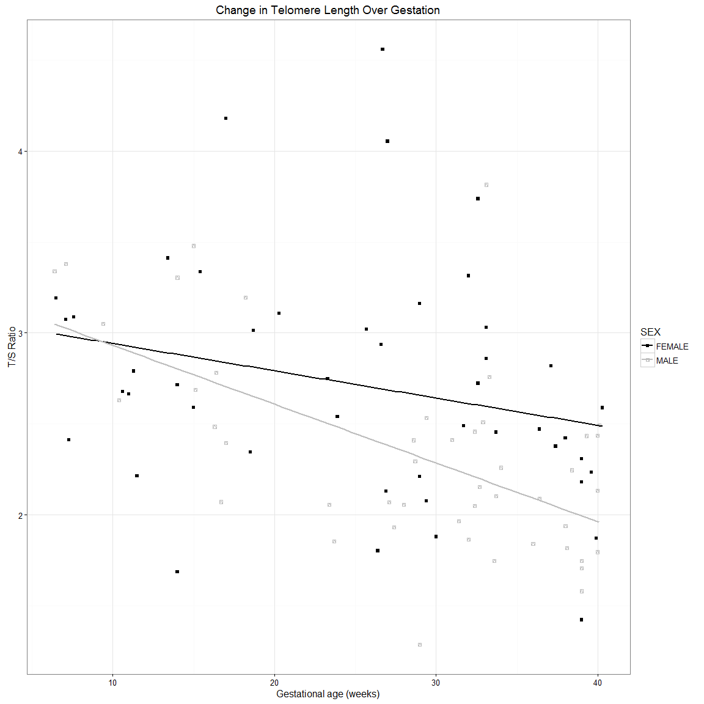
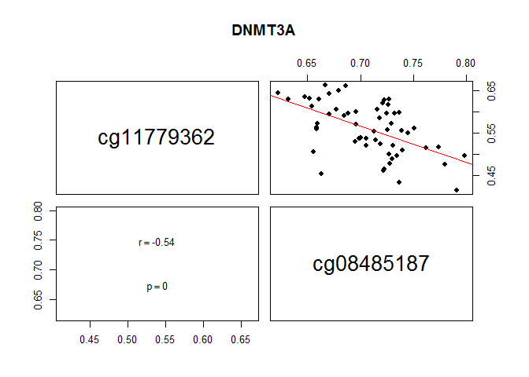

Title Telomere Project Analysis_Cleaned Code
========================================================


Dealing with missing clinical data:
There are 26 missing birth weight values and 31 missing BW_SD, as some of the gestational ages are too low to calculate a SD. These cases were removed when fitting the model. I did not impute them as imputing would not take into account gestational age. 

There were also  4 missing maternal ages. These were imputed, replacing the missing values with the median for maternal age.


Format my colours: Assigning specific colours to my groups, fetal sex, and IUGR status
This just comes in handy when plotting these clinical variables. I don't need to continuously define colours as I have done it in the beginning of the code.


**Start of Analysis**

Question 1: Are any of our confounding factors associated with telomere length?
For this question I use only the control live born samples, as I want to know if there is an association within a normal population.

```r
CON<-T.Dat[which(T.Dat$GROUP=="CONTROL" & T.Dat$GA>24),]

##Maternal age (MA) vs TL
##Makes the plot- later displayed with all other plots
MA.TL<-ggplot(CON, aes(x = MA, y = TS)) +
 geom_point() +
 stat_smooth(method="lm",se=T) +
 theme_grey() + 
   xlab("Maternal Age (years)") + 
   ylab("T/S Ratio") + 
   ggtitle("Change in Placental Telomere Length with Maternal Age ")

##Checking if there is a significant association between TL and MA. Does MA need to be included in our final model?
##Linear regression to determine if TL and MA are significantly associated
model_MA_effect<-lm(TS~MA, data = CON)
summary(model_MA_effect)##R=-0.0013, p=0.92
```

```
## 
## Call:
## lm(formula = TS ~ MA, data = CON)
## 
## Residuals:
##     Min      1Q  Median      3Q     Max 
## -1.0844 -0.4202 -0.1284  0.1483  2.1798 
## 
## Coefficients:
##              Estimate Std. Error t value Pr(>|t|)    
## (Intercept)  2.415402   0.463178   5.215 2.66e-06 ***
## MA          -0.001282   0.013923  -0.092    0.927    
## ---
## Signif. codes:  0 '***' 0.001 '**' 0.01 '*' 0.05 '.' 0.1 ' ' 1
## 
## Residual standard error: 0.6267 on 57 degrees of freedom
## Multiple R-squared:  0.0001488,	Adjusted R-squared:  -0.01739 
## F-statistic: 0.008483 on 1 and 57 DF,  p-value: 0.9269
```

```r
##Maternal age is not significantly associated with telomere length

##Fetal Birth weight measured in standard deviation (BW_SD) vs TL
BW.TL<-ggplot(CON, aes(x = BW_SD, y = TS)) +
 geom_point() +
 stat_smooth(method="lm",se=T) +
 theme_grey() + 
   xlab("Fetal Birth Weight (SD)") + 
   ylab("T/S Ratio") + 
   ggtitle("Change in Placental Telomere Length with Fetal Birth Weight (SD)")

##Checking if there is a significant association between TL and BW_SD. Does BW_SD need to be included in our final model?
##Linear regression to determine if TL and BW_SD are significantly associated
model_BW_SD_effect<-lm(TS~BW_SD, data = CON)
summary(model_BW_SD_effect)##-0.077, p=0.36
```

```
## 
## Call:
## lm(formula = TS ~ BW_SD, data = CON)
## 
## Residuals:
##     Min      1Q  Median      3Q     Max 
## -1.0536 -0.3911 -0.1071  0.1933  2.1627 
## 
## Coefficients:
##             Estimate Std. Error t value Pr(>|t|)    
## (Intercept)  2.41214    0.08737  27.609   <2e-16 ***
## BW_SD       -0.07726    0.08456  -0.914    0.365    
## ---
## Signif. codes:  0 '***' 0.001 '**' 0.01 '*' 0.05 '.' 0.1 ' ' 1
## 
## Residual standard error: 0.6282 on 55 degrees of freedom
##   (2 observations deleted due to missingness)
## Multiple R-squared:  0.01495,	Adjusted R-squared:  -0.00296 
## F-statistic: 0.8347 on 1 and 55 DF,  p-value: 0.3649
```

```r
##Birth weight is not significantly associated with telomere length

##Gestational age (GA) vs TL
GA.TL<-ggplot(CON, aes(x = GA, y = TS)) +
 geom_point() +
 stat_smooth(method="lm",se=T) +
 theme_grey() + 
   xlab("Gestational age (weeks)") + 
   ylab("T/S Ratio") + 
   ggtitle("Change in Placental Telomere Length with Gestational Age")

##Checking if there is a significant association between TL and GA. Does GA need to be included in our final model?
##Linear regression to determine if TL and GA are significantly associated
model_GA_effect<-lm(TS~GA, data = CON)
summary(model_GA_effect)##-0.041 p=0.019
```

```
## 
## Call:
## lm(formula = TS ~ GA, data = CON)
## 
## Residuals:
##      Min       1Q   Median       3Q      Max 
## -1.27725 -0.42098 -0.01537  0.29944  1.89835 
## 
## Coefficients:
##             Estimate Std. Error t value Pr(>|t|)    
## (Intercept)  3.75873    0.57976   6.483  2.3e-08 ***
## GA          -0.04117    0.01707  -2.411   0.0191 *  
## ---
## Signif. codes:  0 '***' 0.001 '**' 0.01 '*' 0.05 '.' 0.1 ' ' 1
## 
## Residual standard error: 0.5971 on 57 degrees of freedom
## Multiple R-squared:  0.09256,	Adjusted R-squared:  0.07664 
## F-statistic: 5.814 on 1 and 57 DF,  p-value: 0.01914
```

```r
##GA is  significantly associated with telomere length

##Fetal Sex vs. TL
##Check to see if TS ratio is significantly different between males and females
Fe<-subset(CON,SEX=="FEMALE")
rownames(Fe)<-Fe$Sample
Fe<-Fe[,5]

Male<-subset(CON,SEX=="MALE")
rownames(Male)<-Male$Sample
Male<-Male[,5]

t.test(Male,Fe)##p=0.0037
```

```
## 
## 	Welch Two Sample t-test
## 
## data:  Male and Fe
## t = -3.0657, df = 42.422, p-value = 0.003769
## alternative hypothesis: true difference in means is not equal to 0
## 95 percent confidence interval:
##  -0.7962365 -0.1641982
## sample estimates:
## mean of x mean of y 
##  2.153648  2.633865
```

```r
##Significant difference

##But is Fetal sex singificantly different when we account for gestational age?
SexvTS<- ggplot(CON, aes(SEX, TS)) + 
   geom_boxplot()+scale_fill_manual(values=unique(sex.col))+
  guides(fill=FALSE)+
   theme_grey() + 
   xlab("Fetal Sex") + 
   ylab("T/S Ratio") + 
   ggtitle("Change in Placental Telomere Length with Fetal Sex")

##Checking if there is a significant association between TL and Fetal Sex. Does Fetal Sex need to be included in our final model?
##Linear regression to determine if TL differs between sex taking into account gestational age
model_GA_effect<-lm(TS~SEX+GA, data = CON)
summary(model_GA_effect)##r=-0.43, p=0.001
```

```
## 
## Call:
## lm(formula = TS ~ SEX + GA, data = CON)
## 
## Residuals:
##      Min       1Q   Median       3Q      Max 
## -1.06314 -0.28315 -0.05372  0.23302  1.70338 
## 
## Coefficients:
##             Estimate Std. Error t value Pr(>|t|)    
## (Intercept)  3.78807    0.54361   6.968  3.9e-09 ***
## SEXMALE     -0.43895    0.14751  -2.976  0.00431 ** 
## GA          -0.03497    0.01614  -2.166  0.03457 *  
## ---
## Signif. codes:  0 '***' 0.001 '**' 0.01 '*' 0.05 '.' 0.1 ' ' 1
## 
## Residual standard error: 0.5598 on 56 degrees of freedom
## Multiple R-squared:  0.2165,	Adjusted R-squared:  0.1885 
## F-statistic: 7.735 on 2 and 56 DF,  p-value: 0.001081
```

```r
##Fetal sex is significantly associated with telomere length, even when you take into account GA

##Putting all graphs in one fig
grid.arrange(MA.TL,GA.TL,BW.TL,SexvTS,ncol=2)
```

```
## Warning: Removed 2 rows containing non-finite values (stat_smooth).
```

```
## Warning: Removed 2 rows containing missing values (geom_point).
```

<!-- -->

One question the comes out of question 1 is whether gestational age at delivery differs between males and female fetuses?

```r
##Fetal Sex vs. TL
(SexvGA<- ggplot(T.Dat, aes(SEX, GA,fill=SEX)) + 
   geom_boxplot()+scale_fill_manual(values=unique(sex.col)))+
   theme_grey() + 
   xlab("Fetal Sex") + 
   ylab("Gestational Age (weeks)") + 
   ggtitle("Difference in Gestational Age at Delivery with Fetal Sex")
```

<!-- -->

```r
##Check to see is gestational age is significantly different between males and females
Fe<-subset(T.Dat,SEX=="FEMALE")
rownames(Fe)<-Fe$Sample
Fe<-Fe[,10]

Male<-subset(T.Dat,SEX=="MALE")
rownames(Male)<-Male$Sample
Male<-Male[,10]

t.test(Male,Fe)
```

```
## 
## 	Welch Two Sample t-test
## 
## data:  Male and Fe
## t = 1.1714, df = 132.44, p-value = 0.2436
## alternative hypothesis: true difference in means is not equal to 0
## 95 percent confidence interval:
##  -1.305599  5.097266
## sample estimates:
## mean of x mean of y 
##  30.44583  28.55000
```

```r
##No significant difference

##Taking into account gestational age, do we still see a difference in TL between male and female fetuses using all the controls across gestationa age, not just the live born?
ALL.CON<-T.Dat[which(T.Dat$GROUP=="CONTROL"),]
ggplot(ALL.CON, aes(x = GA, y = TS,color=SEX,shape=SEX)) +
geom_point() + scale_color_manual(values = c("FEMALE" = 'black','MALE' = 'grey')) + 
scale_shape_manual(values = c('FEMALE' = 15, 'MALE' = 14))+
 stat_smooth(method="lm",se=F) +
 theme_bw() + 
   xlab("Gestational age (weeks)") + 
   ylab("T/S Ratio") + 
   ggtitle("Change in Telomere Length Over Gestation")
```

<!-- -->

```r
##Checking to see if the TL distributiuons are significantly different
Fe<-subset(T.Dat,SEX=="FEMALE")
rownames(Fe)<-Fe$Sample
Fe<-Fe[,5]

Male<-subset(T.Dat,SEX=="MALE")
rownames(Male)<-Male$Sample
Male<-Male[,5]

ks_test2<-ks.test(Fe,Male, alternative=c("two.sided"),exact=T)
print(ks_test2)
```

```
## 
## 	Two-sample Kolmogorov-Smirnov test
## 
## data:  Fe and Male
## D = 0.27288, p-value = 0.008379
## alternative hypothesis: two-sided
```

```r
##Significantly Different

##Comparing the linear regression lines between male and females
Fe<-subset(T.Dat,SEX=="FEMALE" & GROUP=="CONTROL")
rownames(Fe)<-Fe$Sample
model_Fe<-lm(TS~GA, data = Fe)##Sex not in model as this is being done seperately
summary(model_Fe)##GA, p=0.09
```

```
## 
## Call:
## lm(formula = TS ~ GA, data = Fe)
## 
## Residuals:
##     Min      1Q  Median      3Q     Max 
## -1.1962 -0.3148 -0.1136  0.2766  1.8659 
## 
## Coefficients:
##             Estimate Std. Error t value Pr(>|t|)    
## (Intercept)  3.09208    0.23806  12.989   <2e-16 ***
## GA          -0.01499    0.00872  -1.719   0.0926 .  
## ---
## Signif. codes:  0 '***' 0.001 '**' 0.01 '*' 0.05 '.' 0.1 ' ' 1
## 
## Residual standard error: 0.6261 on 44 degrees of freedom
## Multiple R-squared:  0.06293,	Adjusted R-squared:  0.04164 
## F-statistic: 2.955 on 1 and 44 DF,  p-value: 0.09264
```

```r
Male<-subset(T.Dat,SEX=="MALE"& GROUP=="CONTROL")
rownames(Male)<-Male$Sample
model_M<-lm(TS~GA, data = Male)##Sex not in model as this is being done seperately
summary(model_M)##GA, p=1.6e-05
```

```
## 
## Call:
## lm(formula = TS ~ GA, data = Male)
## 
## Residuals:
##      Min       1Q   Median       3Q      Max 
## -1.03034 -0.28864 -0.05534  0.24474  1.62861 
## 
## Coefficients:
##              Estimate Std. Error t value Pr(>|t|)    
## (Intercept)  3.254391   0.200036  16.269  < 2e-16 ***
## GA          -0.032295   0.006664  -4.846  1.6e-05 ***
## ---
## Signif. codes:  0 '***' 0.001 '**' 0.01 '*' 0.05 '.' 0.1 ' ' 1
## 
## Residual standard error: 0.4488 on 44 degrees of freedom
## Multiple R-squared:  0.348,	Adjusted R-squared:  0.3332 
## F-statistic: 23.49 on 1 and 44 DF,  p-value: 1.599e-05
```

```r
##are these linear regression models significantly different
s1 <- summary(model_Fe)$coefficients 
s2 <- summary(model_M)$coefficients 
db <- (s2[2,1]-s1[2,1]) 
sd <- sqrt(s2[2,2]^2+s1[2,2]^2) 
df <- (model_Fe$df.residual+model_M$df.residual) 
td <- db/sd 
2*pt(-abs(td), df) 
```

```
## [1] 0.1184088
```

```r
##p=0.12 trend that the male and female controls have significantly different rates of TL decline
```


Question 2:
Does telomere legnth differ between EOPE,LOPE, and IUGR compared to controls? What about between one another?

```r
##Removing the non-viable control samples, those <24wks
rm<-T.Dat[which(T.Dat$GROUP=="CONTROL" & T.Dat$GA<24),]
T.Dat<-T.Dat[-which(rownames(T.Dat) %in% rownames(rm)),]

##This leaves us with a sample set of:
print(table(T.Dat$GROUP))##59 controls
```

```
## 
## CONTROL    EOPE    IUGR    LOPE 
##      59      21       9      18
```

```r
##Plot Telomere length between Groups
(GRPvTS<- ggplot(T.Dat, aes(GROUP, TS)) + 
   geom_boxplot()+scale_fill_manual(values=unique(grp.col)))+
   theme_grey() + 
   xlab("Group") + 
   ylab("T/S Ratio") + 
   ggtitle("Change in Telomere Length with Group")
```

<!-- -->

```r
TL_Model<-lm(TS~GROUP+SEX+GA, data = T.Dat)
summary(TL_Model)
```

```
## 
## Call:
## lm(formula = TS ~ GROUP + SEX + GA, data = T.Dat)
## 
## Residuals:
##      Min       1Q   Median       3Q      Max 
## -1.20385 -0.40707 -0.05035  0.29082  1.84010 
## 
## Coefficients:
##             Estimate Std. Error t value Pr(>|t|)    
## (Intercept)  3.44365    0.50858   6.771 8.59e-10 ***
## GROUPEOPE   -0.25112    0.15137  -1.659   0.1002    
## GROUPIUGR    0.04948    0.21488   0.230   0.8183    
## GROUPLOPE    0.23155    0.16726   1.384   0.1693    
## SEXMALE     -0.28652    0.11402  -2.513   0.0136 *  
## GA          -0.02719    0.01491  -1.823   0.0712 .  
## ---
## Signif. codes:  0 '***' 0.001 '**' 0.01 '*' 0.05 '.' 0.1 ' ' 1
## 
## Residual standard error: 0.5844 on 101 degrees of freedom
## Multiple R-squared:  0.1219,	Adjusted R-squared:  0.07845 
## F-statistic: 2.805 on 5 and 101 DF,  p-value: 0.02053
```

```r
##ANOVA is used to compare telomere length between all of our pathology groups
amod <- aov(TS~GROUP+SEX+GA, data = T.Dat)
cht <- glht(amod, linfct = mcp(GROUP = "Tukey"))

summary(cht, test = univariate())
```

```
## 
## 	 Simultaneous Tests for General Linear Hypotheses
## 
## Multiple Comparisons of Means: Tukey Contrasts
## 
## 
## Fit: aov(formula = TS ~ GROUP + SEX + GA, data = T.Dat)
## 
## Linear Hypotheses:
##                     Estimate Std. Error t value Pr(>|t|)  
## EOPE - CONTROL == 0 -0.25112    0.15137  -1.659   0.1002  
## IUGR - CONTROL == 0  0.04948    0.21488   0.230   0.8183  
## LOPE - CONTROL == 0  0.23155    0.16726   1.384   0.1693  
## IUGR - EOPE == 0     0.30061    0.24579   1.223   0.2242  
## LOPE - EOPE == 0     0.48267    0.20633   2.339   0.0213 *
## LOPE - IUGR == 0     0.18206    0.23880   0.762   0.4476  
## ---
## Signif. codes:  0 '***' 0.001 '**' 0.01 '*' 0.05 '.' 0.1 ' ' 1
## (Univariate p values reported)
```

```r
##No significant difference in TL between pathology and controls, although a significant difference in TL between EOPE and LOPE
```


Question 4.Is TL associated with genome wide changes in DNAm?
##I am loading in already pre-processed data from another project looking at changes in DNAm in EOPE,LOPE, and IUGR and assessing the relationship between these pathologies. The scripts for the preprocessing will be uploaded seperately.


```r
load('AnalysisReadyData.RData')

##Make new project containing only the samples for which telomere length was measured
PROJECT<-Data[, which(colnames(Data)  %in% rownames(T.Dat))]
dim(PROJECT)##58 samples
```

```
## [1] 441093     58
```

```r
colnames(PROJECT)  %in% rownames(T.Dat)
```

```
##  [1] TRUE TRUE TRUE TRUE TRUE TRUE TRUE TRUE TRUE TRUE TRUE TRUE TRUE TRUE
## [15] TRUE TRUE TRUE TRUE TRUE TRUE TRUE TRUE TRUE TRUE TRUE TRUE TRUE TRUE
## [29] TRUE TRUE TRUE TRUE TRUE TRUE TRUE TRUE TRUE TRUE TRUE TRUE TRUE TRUE
## [43] TRUE TRUE TRUE TRUE TRUE TRUE TRUE TRUE TRUE TRUE TRUE TRUE TRUE TRUE
## [57] TRUE TRUE
```

```r
Des<-T.Dat[which(rownames(T.Dat) %in% colnames(Data)),]
Des$Sample<-droplevels(Des$Sample)

##Ordering the Project (DNAm data) in the same order as the meta data
PROJECT <- PROJECT[,order(colnames(PROJECT))]
Des<-Des[order(rownames(Des)),]
rownames(Des)==colnames(PROJECT)
```

```
##  [1] TRUE TRUE TRUE TRUE TRUE TRUE TRUE TRUE TRUE TRUE TRUE TRUE TRUE TRUE
## [15] TRUE TRUE TRUE TRUE TRUE TRUE TRUE TRUE TRUE TRUE TRUE TRUE TRUE TRUE
## [29] TRUE TRUE TRUE TRUE TRUE TRUE TRUE TRUE TRUE TRUE TRUE TRUE TRUE TRUE
## [43] TRUE TRUE TRUE TRUE TRUE TRUE TRUE TRUE TRUE TRUE TRUE TRUE TRUE TRUE
## [57] TRUE TRUE
```

```r
dim(PROJECT)
```

```
## [1] 441093     58
```

```r
##save PROJECT
##save(PROJECT,file="PROJECT.Telomere.Final.DNAm_Data.RData")
```
  
Question 3. Do we see changes in DNAm specifically at TERC,TERT,DNMTs or TERRA associated with telomere length?
Not correcting for group as if was not significantly different in our data

```r
##TERF2
load('FeatureData.RData')##This is an annotation for Price et al 2013


##TERC- Pulling all probes that are annotated to the TERC gene
TERCprobes<-fData[which(fData$Closest_TSS_gene_name=="TERC"),]##15probes
TERC.PROJECT<-PROJECT[which(rownames(PROJECT) %in% rownames(TERCprobes)),]
dim(TERC.PROJECT)##15 probes by 58 samples
```

```
## [1] 15 58
```

```r
##Linear model looking for associated between DNAm within TERC and TL
DesMat.TERC<- model.matrix(~TS+GA+SEX,Des)

##Pull out m-values
mDat.TERC<-TERC.PROJECT
str(mDat.TERC)
```

```
##  num [1:15, 1:58] 1.327 1.041 -2.778 -1.063 0.133 ...
##  - attr(*, "dimnames")=List of 2
##   ..$ : chr [1:15] "cg00151728" "cg00759573" "cg01389761" "cg07774096" ...
##   ..$ : chr [1:58] "PL104" "PL112" "PL130" "PL131" ...
```

```r
Fit.TERC<- lmFit(mDat.TERC, DesMat.TERC)
EbFit.TERC <- eBayes(Fit.TERC)
print(topTable(EbFit.TERC,coef="TS"))
```

```
##                  logFC    AveExpr          t   P.Value adj.P.Val         B
## cg16529676 -0.09356091 -0.8933607 -1.3771257 0.1737063 0.7029839 -4.476307
## cg07774096  0.11751694 -1.2838447  1.2150992 0.2291967 0.7029839 -4.589319
## cg00759573  0.13436856  0.1352174  1.0461699 0.2997746 0.7029839 -4.693105
## cg15494117  0.19244182 -5.6013905  1.0188335 0.3124659 0.7029839 -4.708524
## cg18507362 -0.05737213  3.7670873 -0.9801218 0.3310513 0.7029839 -4.729695
## cg00151728  0.08942605  0.7962726  0.9257934 0.3583467 0.7029839 -4.758087
## cg27020690  0.13066182 -3.7518437  0.8060717 0.4234575 0.7029839 -4.815154
## cg25090302  0.04668700  2.7514534  0.7852463 0.4354694 0.7029839 -4.824302
## cg15599946  0.10600648 -5.5831834  0.7259461 0.4707585 0.7029839 -4.849077
## cg12615982  0.05200292 -0.7642818  0.6241009 0.5349812 0.7029839 -4.887195
```

```r
## No significant association

##TERT- Pulling all probes that are annotated to the TERT gene
TERTprobes<-fData[which(fData$Closest_TSS_gene_name=="TERT"),]##99probes
TERT.PROJECT<-PROJECT[which(rownames(PROJECT) %in% rownames(TERTprobes)),]
dim(TERT.PROJECT)##99 probes by 58 samples
```

```
## [1] 99 58
```

```r
##Linear model looking for associated between DNAm within TERT and TL
DesMat.TERT<- model.matrix(~TS+GA+SEX,Des)

##Pull out m-values
mDat.TERT<-TERT.PROJECT
Fit.TERT<- lmFit(mDat.TERT, DesMat.TERT)
EbFit.TERT <- eBayes(Fit.TERT)
tt_TERT<-topTable(EbFit.TERT,coef="TS",n=99)
print(head(tt_TERT))
```

```
##                logFC    AveExpr        t      P.Value   adj.P.Val
## cg01934390 0.3188076 -0.5575195 4.542546 2.769683e-05 0.002741986
## cg08934976 0.3924597  3.2218087 4.101241 1.266377e-04 0.006268567
## cg10878976 0.2819884 -0.3706408 3.921434 2.304417e-04 0.007604575
## cg07728485 0.3735151  2.0583525 3.778885 3.669390e-04 0.009081740
## cg11832804 0.4729484  1.8346080 3.521889 8.298522e-04 0.013811261
## cg08295072 0.3066446  1.9416284 3.519118 8.370461e-04 0.013811261
##                     B
## cg01934390  2.2799074
## cg08934976  0.8481978
## cg10878976  0.2874839
## cg07728485 -0.1466778
## cg11832804 -0.9044054
## cg08295072 -0.9123902
```

```r
##significant association top 16 probes

##Saving this information to construct figure 4 of the paper
##write.table(tt_TERT,file="TERT_pvals.txt")
##Run the beta values through the model to look at the magnitude of change in DNAm
TERT.PROJECT.betas<-m2beta(TERT.PROJECT)
Fit.TERT<- lmFit(TERT.PROJECT.betas, DesMat.TERT)
EbFit.TERT <- eBayes(Fit.TERT)
tt_TERT_betas<-topTable(EbFit.TERT,coef="TS",n=99)
head(tt_TERT_betas)
```

```
##                 logFC   AveExpr        t      P.Value   adj.P.Val
## cg01934390 0.05284670 0.4057200 4.634652 0.0000213059 0.002109284
## cg10878976 0.04749427 0.4369568 3.997838 0.0001861920 0.009216504
## cg08934976 0.02442186 0.9000194 3.776625 0.0003820192 0.012606633
## cg07728485 0.03851322 0.8020095 3.605927 0.0006559634 0.016235094
## cg08295072 0.03542864 0.7902303 3.465951 0.0010120615 0.017151444
## cg19977628 0.04953560 0.5632722 3.457225 0.0010394814 0.017151444
##                      B
## cg01934390  2.14191170
## cg10878976  0.05725549
## cg08934976 -0.62764308
## cg07728485 -1.14018872
## cg08295072 -1.54938101
## cg19977628 -1.57454533
```

```r
MAP<-TERTprobes[,c("MAPINF0-1")]
tt_TERT_betas<-cbind(tt_TERT_betas,MAP)
##write.table(tt_TERT_betas,file="tt_TERT_betas.txt")

##DNMT1
DNMT1probes<-fData[which(fData$Closest_TSS_gene_name=="DNMT1"),]##19probes
DNMT1.PROJECT<-PROJECT[which(rownames(PROJECT) %in% rownames(DNMT1probes)),]
dim(DNMT1.PROJECT)##19 probes by 58 samples
```

```
## [1] 19 58
```

```r
##Linear model looking for associated between DNAm within DNMT1 and TL
DesMat.DNMT1<- model.matrix(~TS+GA+SEX,Des)

##Pull out m-values
mDat.DNMT1<-DNMT1.PROJECT
Fit.DNMT1<- lmFit(mDat.DNMT1, DesMat.DNMT1)
EbFit.DNMT1 <- eBayes(Fit.DNMT1)
topTable(EbFit.DNMT1,coef="TS",n=20)
```

```
##                   logFC     AveExpr          t      P.Value   adj.P.Val
## cg07627628  0.255151527  0.06747306  3.7756770 0.0003732757 0.007092239
## cg26538782 -0.342606150  2.06898670 -3.0800805 0.0031419714 0.029848728
## cg17445987 -0.103987609  0.16229229 -2.5610109 0.0130173051 0.082442932
## cg16260438  0.147326430  2.15705462  2.1608614 0.0347816898 0.165213027
## cg12053136  0.153292395  3.47997602  1.8342434 0.0716674634 0.236208774
## cg26705765  0.161085878  4.64429953  1.8157005 0.0745922445 0.236208774
## cg19803081  0.137383702 -0.42212560  1.7172861 0.0911780326 0.247483231
## cg09445675 -0.118808245  3.36043255 -1.5404587 0.1288010086 0.305902395
## cg10635912 -0.071043557 -0.31663087 -1.4208584 0.1606273881 0.324643449
## cg21063296  0.079521320 -0.94239813  1.3863421 0.1708649732 0.324643449
## cg08326996  0.057327931 -0.69369075  1.2361598 0.2213032890 0.382251136
## cg23662947  0.060882605  4.37894266  1.0566111 0.2950010527 0.462334206
## cg07955051  0.042933319 -0.51139890  0.9828576 0.3296952198 0.462334206
## cg24477899 -0.039061474 -0.07066082 -0.9606212 0.3406673097 0.462334206
## cg15043801 -0.040700748 -0.82096578 -0.7529918 0.4544522517 0.575639519
## cg06128182 -0.024388044 -0.51619688 -0.4610384 0.6464972209 0.750234057
## cg01347596  0.028440374  2.62575776  0.4265488 0.6712620509 0.750234057
## cg21892967 -0.012209262 -1.15133562 -0.2235917 0.8238482829 0.834192443
## cg23401624  0.005771966  0.31884127  0.2102568 0.8341924428 0.834192443
##                      B
## cg07627628 -0.04435589
## cg26538782 -1.98314877
## cg17445987 -3.24444915
## cg16260438 -4.08978131
## cg12053136 -4.68890343
## cg26705765 -4.71768304
## cg19803081 -4.88234988
## cg09445675 -5.15286339
## cg10635912 -5.32049030
## cg21063296 -5.36652477
## cg08326996 -5.55442838
## cg23662947 -5.75218700
## cg07955051 -5.82479595
## cg24477899 -5.84569182
## cg15043801 -6.01832208
## cg06128182 -6.18817305
## cg01347596 -6.20635360
## cg21892967 -6.27107994
## cg23401624 -6.27392126
```

```r
##significant association in top 2 probes

DNMT1.PROJECT.betas<-m2beta(DNMT1.PROJECT)
Fit.DNMT1<- lmFit(DNMT1.PROJECT.betas, DesMat.DNMT1)
EbFit.DNMT1 <- eBayes(Fit.DNMT1)
tt_DNMT1_betas<-topTable(EbFit.DNMT1,coef="TS",n=19)
print(head(tt_DNMT1_betas))
```

```
##                  logFC   AveExpr         t      P.Value   adj.P.Val
## cg07627628  0.04325552 0.5113869  3.767138 0.0003950448 0.007505852
## cg26538782 -0.04352793 0.8017668 -3.049753 0.0034790533 0.033051006
## cg17445987 -0.01794763 0.5280246 -2.671053 0.0098520534 0.062396338
## cg16260438  0.01454300 0.8151037  2.021683 0.0479402522 0.227716198
## cg19803081  0.02291098 0.4283363  1.731101 0.0888752827 0.336216214
## cg12053136  0.00790501 0.9159625  1.626891 0.1093083690 0.336216214
##                    B
## cg07627628 -1.093275
## cg26538782 -3.148051
## cg17445987 -4.107689
## cg16260438 -5.514335
## cg19803081 -6.034968
## cg12053136 -6.204062
```

```r
MAP<-DNMT1probes[,c("MAPINF0-1")]
tt_DNMT1_betas<-cbind(tt_DNMT1_betas,MAP)
##write.table(tt_DNMT1_betas,file="tt_DNMT1_betas.txt")

##DNMT3a
DNMT3Aprobes<-fData[which(fData$Closest_TSS_gene_name=="DNMT3A"),]##88probes
DNMT3A.PROJECT<-PROJECT[which(rownames(PROJECT) %in% rownames(DNMT3Aprobes)),]
dim(DNMT3A.PROJECT)##88 probes by 58 samples
```

```
## [1] 88 58
```

```r
##Linear model looking for associated between DNAm within DNMT3a and TL
DesMat.DNMT3A<- model.matrix(~TS+GA+SEX,Des)

##Pull out m-values
mDat.DNMT3A<-DNMT3A.PROJECT
Fit.DNMT3A<- lmFit(mDat.DNMT3A, DesMat.DNMT3A)
EbFit.DNMT3A <- eBayes(Fit.DNMT3A)
topTable(EbFit.DNMT3A,coef="TS",n=20)
```

```
##                  logFC    AveExpr         t      P.Value  adj.P.Val
## cg11779362  0.30097902  0.3544979  4.405277 4.456943e-05 0.00392211
## cg08485187 -0.22908958  1.2824847 -3.763955 3.840731e-04 0.01689922
## cg13558695 -0.22835232  1.0446770 -2.868150 5.727925e-03 0.16801914
## cg23009818 -0.14445132  1.4112311 -2.668002 9.809158e-03 0.21580147
## cg17742416 -0.14830004  1.8712417 -2.447437 1.739949e-02 0.22720360
## cg20669908 -0.09847272  0.7240633 -2.405301 1.927611e-02 0.22720360
## cg03980035 -0.23023175  1.3524988 -2.273964 2.657807e-02 0.22720360
## cg00886730 -0.11952478  3.3642335 -2.254722 2.789627e-02 0.22720360
## cg03208817 -0.11545444 -4.4095689 -2.195062 3.205971e-02 0.22720360
## cg23569120  0.12609368  5.1964554  2.175942 3.352913e-02 0.22720360
## cg05896193 -0.13240801  1.7168755 -2.163531 3.451424e-02 0.22720360
## cg00856404 -0.09646166  0.7259135 -2.144482 3.614603e-02 0.22720360
## cg18889183 -0.10656673 -6.2879527 -2.145173 3.601787e-02 0.22720360
## cg23733525 -0.09831314 -5.3886058 -2.143811 3.613165e-02 0.22720360
## cg23200404 -0.08990158  3.6967113 -2.098964 4.005855e-02 0.23501018
## cg05529848 -0.11559606 -5.4980439 -1.972879 5.314580e-02 0.29230190
## cg15998962 -0.08742822 -4.2188155 -1.837200 7.124473e-02 0.36879624
## cg10749994  0.23510815 -3.6442241  1.778946 8.034042e-02 0.37377679
## cg26470599  0.12062688  2.4651523  1.776769 8.070181e-02 0.37377679
## cg11798660 -0.30457241  2.3386262 -1.725018 8.969892e-02 0.39467524
##                     B
## cg11779362  1.8482230
## cg08485187 -0.1674793
## cg13558695 -2.6324692
## cg23009818 -3.1251485
## cg17742416 -3.6274736
## cg20669908 -3.7202930
## cg03980035 -3.9989278
## cg00886730 -4.0393110
## cg03208817 -4.1600251
## cg23569120 -4.1983399
## cg05896193 -4.2230575
## cg00856404 -4.2585430
## cg18889183 -4.2593989
## cg23733525 -4.2620841
## cg23200404 -4.3497007
## cg05529848 -4.5874420
## cg15998962 -4.8255336
## cg10749994 -4.9277721
## cg26470599 -4.9314144
## cg11798660 -5.0168189
```

```r
##significant association in top 2 probes

DNMT3A.PROJECT.betas<-m2beta(DNMT3A.PROJECT)
Fit.DNMT3A<- lmFit(DNMT3A.PROJECT.betas, DesMat.DNMT3A)
EbFit.DNMT3A<- eBayes(Fit.DNMT3A)
tt_DNMT3A_betas<-topTable(EbFit.DNMT3A,coef="TS",n=88)
print(head(tt_DNMT3A_betas))
```

```
##                  logFC   AveExpr         t      P.Value   adj.P.Val
## cg11779362  0.05056775 0.5602847  4.322534 6.514219e-05 0.005732513
## cg08485187 -0.03273834 0.7071495 -3.820844 3.400984e-04 0.014964327
## cg13558695 -0.03346007 0.6713793 -2.785527 7.352397e-03 0.215502518
## cg23009818 -0.01936470 0.7255968 -2.675902 9.795569e-03 0.215502518
## cg20669908 -0.01587941 0.6225418 -2.531230 1.425008e-02 0.234833138
## cg17742416 -0.01721966 0.7838695 -2.400298 1.985211e-02 0.234833138
##                     B
## cg11779362 -0.3287541
## cg08485187 -1.9256862
## cg13558695 -4.8115479
## cg23009818 -5.0897959
## cg20669908 -5.4311055
## cg17742416 -5.7259182
```

```r
MAP<-DNMT3Aprobes[,c("MAPINF0-1")]
tt_DNMT3A_betas<-cbind(tt_DNMT3A_betas,MAP)
##write.table(tt_DNMT3A_betas,file="tt_DNMT3A_betas.txt")

##DNMT3b
DNMT3Bprobes<-fData[which(fData$Closest_TSS_gene_name=="DNMT3B"),]##21probes
DNMT3B.PROJECT<-PROJECT[which(rownames(PROJECT) %in% rownames(DNMT3Bprobes)),]
dim(DNMT3B.PROJECT)##21 probes by 58 samples
```

```
## [1] 21 58
```

```r
##Linear model looking for associated between DNAm within DNMT3b and TL
DesMat.DNMT3B<- model.matrix(~TS+GA+SEX,Des)

##Pull out m-values
mDat.DNMT3B<-DNMT3B.PROJECT
Fit.DNMT3B<- lmFit(mDat.DNMT3B, DesMat.DNMT3B)
EbFit.DNMT3B <- eBayes(Fit.DNMT3B)
topTable(EbFit.DNMT3B,coef="TS",n=20)
```

```
##                  logFC    AveExpr          t    P.Value adj.P.Val
## cg09149842 -0.12877270 -5.1304441 -2.6494963 0.01031441 0.2166026
## cg09835408 -0.10119243  1.2349361 -1.9524714 0.05560219 0.4560972
## cg00300969  0.07957616 -0.5943727  1.8789940 0.06515675 0.4560972
## cg22605822 -0.07838101  1.5302526 -1.6065556 0.11345796 0.4983106
## cg01243992 -0.10287530  3.4243203 -1.5833903 0.11864539 0.4983106
## cg01870247 -0.07320824  2.5001964 -1.2814922 0.20500324 0.5615724
## cg13636640  0.22615324 -2.6343579  1.2238628 0.22583877 0.5615724
## cg16523653 -0.04454379 -6.2031276 -1.2041888 0.23329547 0.5615724
## cg25803642  0.06230285 -4.8866324  1.1228684 0.26601368 0.5615724
## cg14224313  0.07727946  2.7424789  1.0788733 0.28500792 0.5615724
## cg24403338  0.05074989 -0.9097690  0.9933341 0.32457844 0.5615724
## cg14320358 -0.03997331  3.5433431 -0.9263426 0.35801831 0.5615724
## cg13788819 -0.05356743  1.3318498 -0.8698225 0.38790054 0.5615724
## cg17475857  0.04286113 -0.7270435  0.8532631 0.39694279 0.5615724
## cg16953106 -0.04959065 -6.0140255 -0.8456866 0.40112311 0.5615724
## cg22052056 -0.03051579  3.6047905 -0.6235734 0.53529622 0.6657252
## cg08554061 -0.03033125  3.1340718 -0.5909196 0.55681732 0.6657252
## cg21235334  0.03865512 -3.1400293  0.5703616 0.57062158 0.6657252
## cg17721173 -0.02212232 -5.3017731 -0.5040477 0.61609330 0.6809452
## cg17482740  0.01521564 -1.0802595  0.3358063 0.73820082 0.7751109
##                    B
## cg09149842 -2.703754
## cg09835408 -3.941590
## cg00300969 -4.053729
## cg22605822 -4.436342
## cg01243992 -4.466403
## cg01870247 -4.821385
## cg13636640 -4.881214
## cg16523653 -4.901045
## cg25803642 -4.979783
## cg14224313 -5.020198
## cg24403338 -5.094349
## cg14320358 -5.148305
## cg13788819 -5.190993
## cg17475857 -5.203006
## cg16953106 -5.208428
## cg22052056 -5.346332
## cg08554061 -5.363150
## cg21235334 -5.373242
## cg17721173 -5.403542
## cg17482740 -5.463680
```

```r
##No association

##DNMT3L
DNMT3Lprobes<-fData[which(fData$Closest_TSS_gene_name=="DNMT3L"),]##11probes
DNMT3L.PROJECT<-PROJECT[which(rownames(PROJECT) %in% rownames(DNMT3Lprobes)),]
dim(DNMT3L.PROJECT)##11 probes by 58 samples
```

```
## [1] 11 58
```

```r
##Linear model looking for associated between DNAm within DNMT3L and TL
DesMat.DNMT3L<- model.matrix(~TS+GA+SEX,Des)

##Pull out m-values
mDat.DNMT3L<-DNMT3L.PROJECT
Fit.DNMT3L<- lmFit(mDat.DNMT3L, DesMat.DNMT3L)
EbFit.DNMT3L <- eBayes(Fit.DNMT3L)
topTable(EbFit.DNMT3L,coef="TS",n=20)
```

```
##                 logFC    AveExpr         t    P.Value adj.P.Val         B
## cg05062192 0.15692539  1.6064672 1.9341336 0.05769001 0.3071561 -4.030403
## cg23434074 0.21359948  0.1369566 1.7668353 0.08228721 0.3071561 -4.182164
## cg22028785 0.26469419  2.7555068 1.6668196 0.10062330 0.3071561 -4.257914
## cg14170172 0.21065293  3.2338921 1.5275602 0.13173645 0.3071561 -4.364797
## cg27187798 0.19011975 -0.1379833 1.4965355 0.13961643 0.3071561 -4.387482
## cg26398867 0.09927709  1.4414703 1.2868956 0.20294177 0.3720599 -4.529707
## cg27237537 0.10985398 -2.7840440 1.1048440 0.27352053 0.4298180 -4.637127
## cg27076046 0.04236406 -1.7861056 0.5904054 0.55707700 0.6946812 -4.855674
## cg15635600 0.05814321 -3.1562683 0.5735252 0.56837551 0.6946812 -4.860650
## cg12510221 0.03251526  0.9100715 0.3361721 0.73788263 0.8116709 -4.915499
## cg09247319 0.02840913 -1.6643258 0.2246623 0.82299721 0.8229972 -4.930535
```

```r
##No association
```

###Plot out changes in TERT

```r
(dsHits <- topTable(EbFit.TERT,n=16,
                    coef = grep("TS", colnames(coef(EbFit.TERT)))))
```

```
##                 logFC   AveExpr        t      P.Value   adj.P.Val
## cg01934390 0.05284670 0.4057200 4.634652 0.0000213059 0.002109284
## cg10878976 0.04749427 0.4369568 3.997838 0.0001861920 0.009216504
## cg08934976 0.02442186 0.9000194 3.776625 0.0003820192 0.012606633
## cg07728485 0.03851322 0.8020095 3.605927 0.0006559634 0.016235094
## cg08295072 0.03542864 0.7902303 3.465951 0.0010120615 0.017151444
## cg19977628 0.04953560 0.5632722 3.457225 0.0010394814 0.017151444
## cg13390570 0.04649826 0.5579161 3.347020 0.0014523901 0.020540946
## cg04021502 0.03611980 0.5491109 3.280119 0.0017742458 0.021197400
## cg11832804 0.05189224 0.7733669 3.252290 0.0019270363 0.021197400
## cg14793430 0.03373837 0.7772358 2.896349 0.0053485897 0.045309645
## cg25939350 0.04465510 0.5903702 2.888309 0.0054689962 0.045309645
## cg12324353 0.04263851 0.5090408 2.886787 0.0054920782 0.045309645
## cg27619457 0.02753599 0.3908982 2.848452 0.0061038760 0.046331970
## cg21612170 0.03820137 0.6768447 2.822567 0.0065519958 0.046331970
## cg15927295 0.02326287 0.8399454 2.742947 0.0081275568 0.050943333
## cg25641025 0.03246894 0.5690445 2.738129 0.0082332660 0.050943333
##                      B
## cg01934390  2.14191170
## cg10878976  0.05725549
## cg08934976 -0.62764308
## cg07728485 -1.14018872
## cg08295072 -1.54938101
## cg19977628 -1.57454533
## cg13390570 -1.88876345
## cg04021502 -2.07619183
## cg11832804 -2.15340256
## cg14793430 -3.09973948
## cg25939350 -3.12019411
## cg12324353 -3.12406281
## cg27619457 -3.22097562
## cg21612170 -3.28586767
## cg15927295 -3.48265347
## cg25641025 -3.49442461
```

```r
interest<-dsHits[c(1:16),]

fData_interest<-merge(fData,interest,by='row.names')

##subset prDat with these significant hits
interest_dat<-PROJECT[c('cg01934390','cg08934976','cg10878976','cg07728485','cg11832804','cg08295072','cg19977628','cg13390570','cg04021502','cg14793430','cg25939350','cg06674436','cg12324353','cg21612170','cg15927295','cg27619457'),]

##Restructure data
interest_dat<-as.data.frame(t(interest_dat))
interest_dat<-merge(interest_dat,Des,by ='row.names')

##Do these sites correlate?
  ##order by map info
topTERT<-fData_interest[order(fData_interest$MAPINF0-1),] 
rownames(topTERT)<-topTERT$Row.names
topTERT$Row.names<-as.factor(topTERT$Row.names)

  ##subset significant hits from project (DNAm data)
TERT.PROJECT<-as.data.frame(TERT.PROJECT)
topTERT.PROJECT<-TERT.PROJECT[which(rownames(TERT.PROJECT) %in% rownames(topTERT)),]

topTERT.betas<-m2beta(topTERT.PROJECT)
topTERT.betas<-as.data.frame(topTERT.betas)

##Make sure the betas are in the same map order
MapInfo<-topTERT$MAPINF0-1
MapInfo<-as.data.frame(MapInfo)
rownames(MapInfo)<-rownames(topTERT)

topTERT.betas_ordered<-merge(topTERT.betas,MapInfo,by='row.names')
topTERT.betas_ordered<-topTERT.betas_ordered[order(topTERT.betas_ordered$MapInfo),]
rownames(topTERT.betas_ordered)<-topTERT.betas_ordered$Row.names
rownames(topTERT.betas_ordered)==rownames(topTERT)
```

```
##  [1] TRUE TRUE TRUE TRUE TRUE TRUE TRUE TRUE TRUE TRUE TRUE TRUE TRUE TRUE
## [15] TRUE TRUE
```

```r
topTERT.betas_ordered$Row.names<-NULL
topTERT.betas_ordered$MapInfo<-NULL
#write.table(topTERT.betas_ordered, file="topTERT.betas.txt")

##Correlation plot
ID<-t(topTERT.betas_ordered)
panel.lm<-function (x, y, col = par("col"), bg = NA, pch = par("pch"),
     cex = 1, col.lm = "red", lwd=par("lwd"), ...)
 {
     points(x, y, pch = 16, col="black", bg = bg, cex = cex)
     ok <- is.finite(x) & is.finite(y)
     if (any(ok))
         abline(lm(y[ok]~x[ok]), col = col.lm, ...)}

 panel.sse<- function(y, x, digits=2,...)
      {
         usr <- par("usr"); on.exit(par(usr))
         par(usr = c(0, 1, 0, 1))

         model <- summary(lm(y~x))
                              r <- cor(x,y,method="spearman", use="pairwise.complete.obs")
                              p <- cor.test(x,y,method="spearman",alternative="two.sided",conf.level=0.95)
                              p <- p$p.value
         txt <- round(r, digits)
         txt <- bquote(r == .(txt))
		cex.cor<-0.8/strwidth(txt)
         text(0.5, 0.7, txt, cex=1.0)
         txt <- round(p, digits)
         txt <- bquote(p == .(txt))
         text(0.5, 0.3, txt, cex=1.0)
}
     
pairs(ID[,c(1:16)],main="TERT",lower.panel=panel.sse,upper.panel=panel.lm)
```

<!-- -->

```r
##It looks like all significant probes, spanning the whole gene correlate- therefore if this is included in a model I will average across the region (16 hits)

##How many of these hits meet a minimum change in DNAm >0.05
##Setting the FDR
cutoff.p = 0.05  # FDR threshold
hits_FDR = rownames(dsHits)[dsHits$adj.P.Val < cutoff.p]

##Pulling out change in DNAm
PROJECT_Beta<-m2beta(TERT.PROJECT)

fit_beta = lmFit(PROJECT_Beta,DesMat.TERT)
Ebfit_beta = eBayes(fit_beta)
ttbeta_all = topTable(Ebfit_beta, n = Inf)
```

```
## Removing intercept from test coefficients
```

```r
##Setting delta beta threshold
thresh = 0.05  # delta beta threshold
delta_beta= rownames(ttbeta_all)[abs(ttbeta_all$TS) > thresh]

##Where do all these hits intersect?
delta_beta_intercept= intersect(delta_beta,hits_FDR)
print(delta_beta_intercept)
```

```
## [1] "cg01934390" "cg11832804"
```

```r
##This leaves us with 2 hits cg01934390,cg11832804

##Subset out all our hits from ttbeta_all
head(ttbeta_all)
```

```
##                    TS           GA      SEXMALE   AveExpr        F
## cg01934390 0.05284670 0.0023603991 -0.007266007 0.4057200 8.942788
## cg10878976 0.04749427 0.0018140616 -0.010072042 0.4369568 6.691289
## cg04021502 0.03611980 0.0033388090 -0.008911270 0.5491109 6.314601
## cg07728485 0.03851322 0.0016102682 -0.006845496 0.8020095 5.440765
## cg08934976 0.02442186 0.0006376675  0.008196425 0.9000194 5.265064
## cg23031487 0.01216682 0.0007470439 -0.027691799 0.4121303 5.096252
##                 P.Value   adj.P.Val
## cg01934390 6.025531e-05 0.005965276
## cg10878976 6.015737e-04 0.029667064
## cg04021502 8.990019e-04 0.029667064
## cg07728485 2.326905e-03 0.055961399
## cg08934976 2.826333e-03 0.055961399
## cg23031487 3.410328e-03 0.056270410
```

```r
hits<-c('cg01934390','cg11832804')
Our_hits<-ttbeta_all[which(rownames(ttbeta_all) %in% hits),]
print(Our_hits)
```

```
##                    TS           GA      SEXMALE   AveExpr        F
## cg01934390 0.05284670 0.0023603991 -0.007266007 0.4057200 8.942788
## cg11832804 0.05189224 0.0009426389 -0.002991718 0.7733669 3.806782
##                 P.Value   adj.P.Val
## cg01934390 6.025531e-05 0.005965276
## cg11832804 1.477963e-02 0.091448982
```

```r
##
TopTERT_2<-topTERT.betas_ordered[c('cg01934390','cg11832804'),]
ID<-t(TopTERT_2)
pairs(ID[,c(1:2)],main="TERT",lower.panel=panel.sse,upper.panel=panel.lm)
```

<!-- -->

```r
##These hits correlate with each other
```


```r
##Subset columns of interest (GROUP,TS,m val,SEX,GA)
cg01934390<-subset(interest_dat[,c(2,19,22,27,29)])

##calculate beta values
cg01934390$beta<-m2beta(cg01934390$cg01934390)

##Plot the hit CpGs
##cg19977628
TERT1<-ggplot(cg01934390,aes(TS,beta))+
  ylim(0,1.0)+
  geom_point()+
  stat_smooth(method="lm",se=T)+
  xlab("T/S Ratio") + 
   ylab("DNA methylation (Beta value)") + 
   ggtitle("Correlation between DNAm and T/S ratio at cg01934390-TERT, site 1")
##0.053 change with every 1 point change in TL p=0.003 (p-value from the m-values run in limma)

##Subset columns of interest (GROUP,TS,m val,SEX,GA)
cg11832804<-subset(interest_dat[,c(6,19,22,27,29)])

##calculate beta values
cg11832804$beta<-m2beta(cg11832804$cg11832804)

##Plot the hit CpGs
##cg01934390
TERT2<-ggplot(cg11832804,aes(TS,beta))+
  ylim(0,1.0)+
  geom_point()+
  stat_smooth(method="lm",se=T)+
  xlab("T/S Ratio") + 
   ylab("DNA methylation (Beta value)") + 
   ggtitle("Correlation between DNAm and T/S ratio at cg11832804-TERT, site 2")
##0.052 change with every 1 point change in TL p=0.01

grid.arrange(TERT1,TERT2,ncol=2)
```

<!-- -->

```r
## Do we see differences between EOPE, LOPE, IUGR and controls at these sites?
TERT1_BOXPLOT<-ggplot(cg01934390, aes(x=GROUP, y=beta)) + geom_boxplot() +
    guides(fill=FALSE)+ylim(0.2,1)

TERT2_BOXPLOT<-ggplot(cg11832804, aes(x=GROUP, y=beta)) + geom_boxplot() +
    guides(fill=FALSE)+ylim(0.2,1)

grid.arrange(TERT1_BOXPLOT,TERT2_BOXPLOT, nrow=1)
```

<!-- -->

```r
TERThits<-TERT.PROJECT[c('cg01934390','cg11832804'),]
TERThits<-t(TERThits)
TERThits<-as.data.frame(TERThits)

TERThits_Dat<-merge(TERThits,T.Dat,by='row.names')

library(multcomp)
##ANOVA to compare DNAm at cg01934390 between pathology
amod <- aov(cg01934390~GROUP+SEX+GA, data = TERThits_Dat)
cht <- glht(amod, linfct = mcp(GROUP = "Tukey"))

summary(cht, test = univariate())
```

```
## 
## 	 Simultaneous Tests for General Linear Hypotheses
## 
## Multiple Comparisons of Means: Tukey Contrasts
## 
## 
## Fit: aov(formula = cg01934390 ~ GROUP + SEX + GA, data = TERThits_Dat)
## 
## Linear Hypotheses:
##                     Estimate Std. Error t value Pr(>|t|)  
## EOPE - CONTROL == 0 -0.31193    0.12405  -2.515   0.0150 *
## IUGR - CONTROL == 0 -0.07435    0.14134  -0.526   0.6011  
## LOPE - CONTROL == 0 -0.02904    0.11815  -0.246   0.8068  
## IUGR - EOPE == 0     0.23759    0.15167   1.566   0.1233  
## LOPE - EOPE == 0     0.28289    0.13198   2.144   0.0368 *
## LOPE - IUGR == 0     0.04531    0.13403   0.338   0.7367  
## ---
## Signif. codes:  0 '***' 0.001 '**' 0.01 '*' 0.05 '.' 0.1 ' ' 1
## (Univariate p values reported)
```

```r
## DNAm at this iste is significantly different between EOPE and control, and LOPE and EOPE

##ANOVA to compare DNAm at cg11832804 between pathology
amod <- aov(cg11832804~GROUP+SEX+GA, data = TERThits_Dat)
cht <- glht(amod, linfct = mcp(GROUP = "Tukey"))

summary(cht, test = univariate())
```

```
## 
## 	 Simultaneous Tests for General Linear Hypotheses
## 
## Multiple Comparisons of Means: Tukey Contrasts
## 
## 
## Fit: aov(formula = cg11832804 ~ GROUP + SEX + GA, data = TERThits_Dat)
## 
## Linear Hypotheses:
##                     Estimate Std. Error t value Pr(>|t|)
## EOPE - CONTROL == 0 -0.14529    0.24038  -0.604    0.548
## IUGR - CONTROL == 0  0.05724    0.27389   0.209    0.835
## LOPE - CONTROL == 0 -0.29360    0.22895  -1.282    0.205
## IUGR - EOPE == 0     0.20253    0.29391   0.689    0.494
## LOPE - EOPE == 0    -0.14831    0.25575  -0.580    0.564
## LOPE - IUGR == 0    -0.35084    0.25973  -1.351    0.183
## (Univariate p values reported)
```

###Plot out changes in DNMT1

```r
(dsHits <- topTable(EbFit.DNMT1,n=12,
                    coef = grep("TS", colnames(coef(EbFit.DNMT1)))))
```

```
##                   logFC   AveExpr         t      P.Value   adj.P.Val
## cg07627628  0.043255519 0.5113869  3.767138 0.0003950448 0.007505852
## cg26538782 -0.043527927 0.8017668 -3.049753 0.0034790533 0.033051006
## cg17445987 -0.017947628 0.5280246 -2.671053 0.0098520534 0.062396338
## cg16260438  0.014542999 0.8151037  2.021683 0.0479402522 0.227716198
## cg19803081  0.022910984 0.4283363  1.731101 0.0888752827 0.336216214
## cg12053136  0.007905010 0.9159625  1.626891 0.1093083690 0.336216214
## cg10635912 -0.012207461 0.4456670 -1.483583 0.1434602398 0.336216214
## cg26705765  0.003898151 0.9604728  1.428524 0.1587278075 0.336216214
## cg09445675 -0.006482920 0.9096549 -1.402988 0.1660754285 0.336216214
## cg21063296  0.011840057 0.3433602  1.367217 0.1769559024 0.336216214
## cg08326996  0.009277439 0.3825175  1.271350 0.2087975759 0.360650358
## cg07955051  0.007353356 0.4125793  1.035843 0.3046754548 0.459311947
##                    B
## cg07627628 -1.093275
## cg26538782 -3.148051
## cg17445987 -4.107689
## cg16260438 -5.514335
## cg19803081 -6.034968
## cg12053136 -6.204062
## cg10635912 -6.420914
## cg26705765 -6.495919
## cg09445675 -6.534744
## cg21063296 -6.583367
## cg08326996 -6.707862
## cg07955051 -6.977128
```

```r
print(dsHits)
```

```
##                   logFC   AveExpr         t      P.Value   adj.P.Val
## cg07627628  0.043255519 0.5113869  3.767138 0.0003950448 0.007505852
## cg26538782 -0.043527927 0.8017668 -3.049753 0.0034790533 0.033051006
## cg17445987 -0.017947628 0.5280246 -2.671053 0.0098520534 0.062396338
## cg16260438  0.014542999 0.8151037  2.021683 0.0479402522 0.227716198
## cg19803081  0.022910984 0.4283363  1.731101 0.0888752827 0.336216214
## cg12053136  0.007905010 0.9159625  1.626891 0.1093083690 0.336216214
## cg10635912 -0.012207461 0.4456670 -1.483583 0.1434602398 0.336216214
## cg26705765  0.003898151 0.9604728  1.428524 0.1587278075 0.336216214
## cg09445675 -0.006482920 0.9096549 -1.402988 0.1660754285 0.336216214
## cg21063296  0.011840057 0.3433602  1.367217 0.1769559024 0.336216214
## cg08326996  0.009277439 0.3825175  1.271350 0.2087975759 0.360650358
## cg07955051  0.007353356 0.4125793  1.035843 0.3046754548 0.459311947
##                    B
## cg07627628 -1.093275
## cg26538782 -3.148051
## cg17445987 -4.107689
## cg16260438 -5.514335
## cg19803081 -6.034968
## cg12053136 -6.204062
## cg10635912 -6.420914
## cg26705765 -6.495919
## cg09445675 -6.534744
## cg21063296 -6.583367
## cg08326996 -6.707862
## cg07955051 -6.977128
```

```r
interest<-dsHits[c(1:2),]

fData_interest<-merge(fData,interest,by='row.names')

##subset prDat with these hits
interest_dat<-PROJECT[c('cg07627628','cg26538782'),]

##Restructure data
interest_dat<-as.data.frame(t(interest_dat))
interest_dat<-merge(interest_dat,Des,by ='row.names')

##Do these sites correlate?
  ##order by map info
topDNMT1<-fData_interest[order(fData_interest$MAPINF0-1),] 
rownames(topDNMT1)<-topDNMT1$Row.names

  ##subset from project
DNMT1.PROJECT<-as.data.frame(DNMT1.PROJECT)
topDNMT1.PROJECT<-DNMT1.PROJECT[which(rownames(DNMT1.PROJECT) %in% rownames(topDNMT1)),]

topDNMT1.betas<-m2beta(topDNMT1.PROJECT)
topDNMT1.betas<-as.data.frame(topDNMT1.betas)

##Make sure the betas are in the same map order
MapInfo<-topDNMT1$MAPINF0-1
MapInfo<-as.data.frame(MapInfo)
rownames(MapInfo)<-rownames(topDNMT1)

topDNMT1.betas_ordered<-merge(topDNMT1.betas,MapInfo,by='row.names')
topDNMT1.betas_ordered<-topDNMT1.betas_ordered[order(topDNMT1.betas_ordered$MapInfo),]
rownames(topDNMT1.betas_ordered)<-topDNMT1.betas_ordered$Row.names
rownames(topDNMT1.betas_ordered)==rownames(topDNMT1)
```

```
## [1] TRUE TRUE
```

```r
topDNMT1.betas_ordered$Row.names<-NULL
topDNMT1.betas_ordered$MapInfo<-NULL
#write.table(topDNMT1.betas_ordered, file="topDNMT1.betas.txt")

ID<-t(topDNMT1.betas_ordered)
pairs(ID[,c(1:2)],main="DNMT1",lower.panel=panel.sse,upper.panel=panel.lm)
```

<!-- -->

```r
#These sites correlate with each other

##How many of these hits meet a minimum change in DNAm >0.05
##Setting the FDR
cutoff.p = 0.05  # FDR threshold
hits_FDR = rownames(dsHits)[dsHits$adj.P.Val < cutoff.p]

##Pulling out change in DNAm
PROJECT_Beta<-m2beta(DNMT1.PROJECT)

fit_beta = lmFit(PROJECT_Beta,DesMat.DNMT1)
Ebfit_beta = eBayes(fit_beta)
ttbeta_all = topTable(Ebfit_beta, n = Inf)
```

```
## Removing intercept from test coefficients
```

```r
##Setting delta beta threshold
thresh = 0.02  # delta beta threshold- I used lower threshold as no sites met 0.05
delta_beta= rownames(ttbeta_all)[abs(ttbeta_all$TS) > thresh]

##Where do all these hits intersect?
delta_beta_intercept= intersect(delta_beta,hits_FDR)
print(delta_beta_intercept)
```

```
## [1] "cg07627628" "cg26538782"
```

```r
##This leaves us with 2 hits cg07627628,cg26538782- just under the DB>0.04, with 0.043,and 0.042

##Subset out all our hits from ttbeta_all
hits<-c('cg07627628','cg26538782')
Our_hits<-ttbeta_all[which(rownames(ttbeta_all) %in% hits),]
print(Our_hits)
```

```
##                     TS           GA      SEXMALE   AveExpr         F
## cg07627628  0.04325552  0.003692234 -0.031864912 0.5113869 11.081023
## cg26538782 -0.04352793 -0.005042008  0.006707989 0.8017668  6.124179
##                 P.Value    adj.P.Val
## cg07627628 7.943598e-06 0.0001509284
## cg26538782 1.107702e-03 0.0105231672
```


```r
##Subset columns of interest (GROUP,TS,m val,SEX,GA)
cg07627628<-subset(interest_dat[,c(2,5,8,13,15)])

##calculate beta values
cg07627628$beta<-m2beta(cg07627628$cg07627628)

##Plot the hit CpGs
##cg19977628
DNMT1_1<-ggplot(cg07627628,aes(TS,beta))+
  ylim(0,1.0)+
  geom_point()+
  stat_smooth(method="lm",se=T)+
  xlab("T/S Ratio") + 
   ylab("DNA methylation (Beta value)") + 
   ggtitle("Correlation between DNAm and T/S ratio at cg07627628-DNMT1, site 1")
##0.043 change with every 1 point change in TL p=0.007

##Subset columns of interest (GROUP,TS,m val,SEX,GA)
cg26538782<-subset(interest_dat[,c(3,5,8,13,15)])

##calculate beta values
cg26538782$beta<-m2beta(cg26538782$cg26538782)

##Plot the hit CpGs
##cg26538782
DNMT1_2<-ggplot(cg26538782,aes(TS,beta))+
  ylim(0,1.0)+
  geom_point()+
  stat_smooth(method="lm",se=T)+
  xlab("T/S Ratio") + 
   ylab("DNA methylation (Beta value)") + 
   ggtitle("Correlation between DNAm and T/S ratio at cg26538782-DNMT1, site 2")
##0.044 change with every 1 point change in TL p=0.03

grid.arrange(DNMT1_1,DNMT1_2,ncol=2)
```

<!-- -->

```r
## Do we see differences between EOPE, LOPE, IUGR and controls at these sites?
DNMT11_BOXPLOT<-ggplot(cg07627628, aes(x=GROUP, y=beta)) + geom_boxplot() +
    guides(fill=FALSE)+ylim(0.2,1)

DNMT12_BOXPLOT<-ggplot(cg26538782, aes(x=GROUP, y=beta)) + geom_boxplot() +
    guides(fill=FALSE)+ylim(0.2,1)

grid.arrange(DNMT11_BOXPLOT,DNMT12_BOXPLOT, nrow=1)
```

<!-- -->

```r
DNMT1hits<-DNMT1.PROJECT[c('cg07627628','cg26538782'),]
DNMT1hits<-t(DNMT1hits)
DNMT1hits<-as.data.frame(DNMT1hits)

DNMT1hits_Dat<-merge(DNMT1hits,T.Dat,by='row.names')

##ANOVA to compare DNAm at cg07627628 between pathology
amod <- aov(cg07627628~GROUP+SEX+GA, data = DNMT1hits_Dat)
cht <- glht(amod, linfct = mcp(GROUP = "Tukey"))

summary(cht, test = univariate())
```

```
## 
## 	 Simultaneous Tests for General Linear Hypotheses
## 
## Multiple Comparisons of Means: Tukey Contrasts
## 
## 
## Fit: aov(formula = cg07627628 ~ GROUP + SEX + GA, data = DNMT1hits_Dat)
## 
## Linear Hypotheses:
##                     Estimate Std. Error t value Pr(>|t|)   
## EOPE - CONTROL == 0 -0.37421    0.10911  -3.430  0.00119 **
## IUGR - CONTROL == 0 -0.33244    0.12432  -2.674  0.00999 **
## LOPE - CONTROL == 0 -0.28369    0.10392  -2.730  0.00863 **
## IUGR - EOPE == 0     0.04178    0.13340   0.313  0.75541   
## LOPE - EOPE == 0     0.09053    0.11608   0.780  0.43901   
## LOPE - IUGR == 0     0.04875    0.11789   0.414  0.68092   
## ---
## Signif. codes:  0 '***' 0.001 '**' 0.01 '*' 0.05 '.' 0.1 ' ' 1
## (Univariate p values reported)
```

```r
##DNAm at this site is significantly different between EOPE,IUGR and LOPE and contols

##ANOVA to compare DNAm at cg11832804 between pathology
amod <- aov(cg26538782~GROUP+SEX+GA, data = DNMT1hits_Dat)
cht <- glht(amod, linfct = mcp(GROUP = "Tukey"))

summary(cht, test = univariate())
```

```
## 
## 	 Simultaneous Tests for General Linear Hypotheses
## 
## Multiple Comparisons of Means: Tukey Contrasts
## 
## 
## Fit: aov(formula = cg26538782 ~ GROUP + SEX + GA, data = DNMT1hits_Dat)
## 
## Linear Hypotheses:
##                     Estimate Std. Error t value Pr(>|t|)  
## EOPE - CONTROL == 0   0.4083     0.1902   2.146   0.0365 *
## IUGR - CONTROL == 0   0.1918     0.2167   0.885   0.3804  
## LOPE - CONTROL == 0   0.2956     0.1812   1.631   0.1089  
## IUGR - EOPE == 0     -0.2165     0.2326  -0.931   0.3561  
## LOPE - EOPE == 0     -0.1127     0.2024  -0.557   0.5799  
## LOPE - IUGR == 0      0.1038     0.2055   0.505   0.6157  
## ---
## Signif. codes:  0 '***' 0.001 '**' 0.01 '*' 0.05 '.' 0.1 ' ' 1
## (Univariate p values reported)
```

```r
##Not significantly different
```

###Plot out changes in DNMT3A

```r
(dsHits <- topTable(EbFit.DNMT3A,n=12,
                    coef = grep("TS", colnames(coef(EbFit.DNMT3A)))))
```

```
##                   logFC    AveExpr         t      P.Value   adj.P.Val
## cg11779362  0.050567751 0.56028474  4.322534 6.514219e-05 0.005732513
## cg08485187 -0.032738338 0.70714950 -3.820844 3.400984e-04 0.014964327
## cg13558695 -0.033460073 0.67137933 -2.785527 7.352397e-03 0.215502518
## cg23009818 -0.019364701 0.72559678 -2.675902 9.795569e-03 0.215502518
## cg20669908 -0.015879412 0.62254178 -2.531230 1.425008e-02 0.234833138
## cg17742416 -0.017219661 0.78386954 -2.400298 1.985211e-02 0.234833138
## cg00886730 -0.007120803 0.91075549 -2.332872 2.340387e-02 0.234833138
## cg03980035 -0.036137517 0.71486075 -2.323704 2.385782e-02 0.234833138
## cg00856404 -0.015657660 0.62276692 -2.233020 2.970623e-02 0.234833138
## cg03208817 -0.003515787 0.04537107 -2.225641 3.014926e-02 0.234833138
## cg05896193 -0.016927504 0.76535268 -2.190179 3.276193e-02 0.234833138
## cg23200404 -0.004333872 0.92797980 -2.184862 3.317032e-02 0.234833138
##                     B
## cg11779362 -0.3287541
## cg08485187 -1.9256862
## cg13558695 -4.8115479
## cg23009818 -5.0897959
## cg20669908 -5.4311055
## cg17742416 -5.7259182
## cg00886730 -5.8753577
## cg03980035 -5.8941817
## cg00856404 -6.0839818
## cg03208817 -6.1016966
## cg05896193 -6.1749035
## cg23200404 -6.1857935
```

```r
print(dsHits)
```

```
##                   logFC    AveExpr         t      P.Value   adj.P.Val
## cg11779362  0.050567751 0.56028474  4.322534 6.514219e-05 0.005732513
## cg08485187 -0.032738338 0.70714950 -3.820844 3.400984e-04 0.014964327
## cg13558695 -0.033460073 0.67137933 -2.785527 7.352397e-03 0.215502518
## cg23009818 -0.019364701 0.72559678 -2.675902 9.795569e-03 0.215502518
## cg20669908 -0.015879412 0.62254178 -2.531230 1.425008e-02 0.234833138
## cg17742416 -0.017219661 0.78386954 -2.400298 1.985211e-02 0.234833138
## cg00886730 -0.007120803 0.91075549 -2.332872 2.340387e-02 0.234833138
## cg03980035 -0.036137517 0.71486075 -2.323704 2.385782e-02 0.234833138
## cg00856404 -0.015657660 0.62276692 -2.233020 2.970623e-02 0.234833138
## cg03208817 -0.003515787 0.04537107 -2.225641 3.014926e-02 0.234833138
## cg05896193 -0.016927504 0.76535268 -2.190179 3.276193e-02 0.234833138
## cg23200404 -0.004333872 0.92797980 -2.184862 3.317032e-02 0.234833138
##                     B
## cg11779362 -0.3287541
## cg08485187 -1.9256862
## cg13558695 -4.8115479
## cg23009818 -5.0897959
## cg20669908 -5.4311055
## cg17742416 -5.7259182
## cg00886730 -5.8753577
## cg03980035 -5.8941817
## cg00856404 -6.0839818
## cg03208817 -6.1016966
## cg05896193 -6.1749035
## cg23200404 -6.1857935
```

```r
interest<-dsHits[c(1:2),]

fData_interest<-merge(fData,interest,by='row.names')

##subset prDat with these hits
interest_dat<-PROJECT[c('cg11779362','cg08485187'),]

##Restructure data
interest_dat<-as.data.frame(t(interest_dat))
interest_dat<-merge(interest_dat,Des,by ='row.names')

##Do these sites correlate?
  ##order by map info
topDNMT3A<-fData_interest[order(fData_interest$MAPINF0-1),] 
rownames(topDNMT3A)<-topDNMT3A$Row.names

  ##subset from project
DNMT3A.PROJECT<-as.data.frame(DNMT3A.PROJECT)
topDNMT3A.PROJECT<-DNMT3A.PROJECT[which(rownames(DNMT3A.PROJECT) %in% rownames(topDNMT3A)),]

topDNMT3A.betas<-m2beta(topDNMT3A.PROJECT)
topDNMT3A.betas<-as.data.frame(topDNMT3A.betas)

##Make sure the betas are in the same map order
MapInfo<-topDNMT3A$MAPINF0-1
MapInfo<-as.data.frame(MapInfo)
rownames(MapInfo)<-rownames(topDNMT3A)

topDNMT3A.betas_ordered<-merge(topDNMT3A.betas,MapInfo,by='row.names')
topDNMT3A.betas_ordered<-topDNMT3A.betas_ordered[order(topDNMT3A.betas_ordered$MapInfo),]
rownames(topDNMT3A.betas_ordered)<-topDNMT3A.betas_ordered$Row.names
rownames(topDNMT3A.betas_ordered)==rownames(topDNMT3A)
```

```
## [1] TRUE TRUE
```

```r
topDNMT3A.betas_ordered$Row.names<-NULL
topDNMT3A.betas_ordered$MapInfo<-NULL
#write.table(topDNMT3A.betas_ordered, file="topDNMT3A.betas.txt")

ID<-t(topDNMT3A.betas_ordered)
pairs(ID[,c(1:2)],main="DNMT3A",lower.panel=panel.sse,upper.panel=panel.lm)
```

<!-- -->

```r
##These sites correlate with one another

##How many of these hits meet a minimum change in DNAm >0.05
##Setting the FDR
cutoff.p = 0.05  # FDR threshold
hits_FDR = rownames(dsHits)[dsHits$adj.P.Val < cutoff.p]

##Pulling out change in DNAm
PROJECT_Beta<-m2beta(DNMT3A.PROJECT)

fit_beta = lmFit(PROJECT_Beta,DesMat.DNMT3A)
Ebfit_beta = eBayes(fit_beta)
ttbeta_all = topTable(Ebfit_beta, n = Inf)
```

```
## Removing intercept from test coefficients
```

```r
##Setting delta beta threshold
thresh = 0.02  # delta beta threshold
delta_beta= rownames(ttbeta_all)[abs(ttbeta_all$TS) > thresh]

##Where do all these hits intersect?
delta_beta_intercept= intersect(delta_beta,hits_FDR)
print(delta_beta_intercept)
```

```
## [1] "cg11779362" "cg08485187"
```

```r
##This leaves us with 2 hits cg11779362-just under the DB>0.049

##Subset out all our hits from ttbeta_all
hits<-c('cg11779362')
Our_hits<-ttbeta_all[which(rownames(ttbeta_all) %in% hits),]
print(Our_hits)
```

```
##                    TS          GA    SEXMALE   AveExpr        F
## cg11779362 0.05056775 0.006004437 -0.0251336 0.5602847 14.98916
##                 P.Value    adj.P.Val
## cg11779362 2.982248e-07 2.624378e-05
```


```r
##Subset columns of interest (GROUP,TS,m val,SEX,GA)
cg11779362<-subset(interest_dat[,c(2,5,8,13,15)])

##calculate beta values
cg11779362$beta<-m2beta(cg11779362$cg11779362)

##Plot the hit CpGs
##cg19977628
DNMT3A<-ggplot(cg11779362,aes(TS,beta))+
  ylim(0,1.0)+
  geom_point()+
  stat_smooth(method="lm",se=T)+
  xlab("T/S Ratio") + 
   ylab("DNA methylation (Beta value)") + 
   ggtitle("Correlation between DNAm and T/S ratio at cg11779362-DNMT3A")
##0.051 change with every 1 point change in TL p=0.004

##All graphs together- Candidate gene approach
grid.arrange(TERT1,TERT2,DNMT1_1,DNMT1_2,DNMT3A, ncol=2)
```

<!-- -->

```r
## Do we see differences between EOPE, LOPE, IUGR and controls at these sites?
DNMT3A_BOXPLOT<-ggplot(cg11779362, aes(x=GROUP, y=beta)) + geom_boxplot() +
    guides(fill=FALSE)+ylim(0.2,1)

DNMT3A_BOXPLOT
```

<!-- -->

```r
DNMT3Ahits<-DNMT3A.PROJECT[c('cg11779362'),]
DNMT3Ahits<-t(DNMT3Ahits)
DNMT3Ahits<-as.data.frame(DNMT3Ahits)

DNMT3Ahits_Dat<-merge(DNMT3Ahits,T.Dat,by='row.names')

##ANOVA to compare DNAm at cg11779362 between pathology
amod <- aov(cg11779362~GROUP+SEX+GA, data = DNMT3Ahits_Dat)
cht <- glht(amod, linfct = mcp(GROUP = "Tukey"))

summary(cht, test = univariate())
```

```
## 
## 	 Simultaneous Tests for General Linear Hypotheses
## 
## Multiple Comparisons of Means: Tukey Contrasts
## 
## 
## Fit: aov(formula = cg11779362 ~ GROUP + SEX + GA, data = DNMT3Ahits_Dat)
## 
## Linear Hypotheses:
##                     Estimate Std. Error t value Pr(>|t|)  
## EOPE - CONTROL == 0 -0.29038    0.11926  -2.435   0.0184 *
## IUGR - CONTROL == 0 -0.03427    0.13589  -0.252   0.8019  
## LOPE - CONTROL == 0 -0.26074    0.11359  -2.295   0.0258 *
## IUGR - EOPE == 0     0.25611    0.14582   1.756   0.0849 .
## LOPE - EOPE == 0     0.02964    0.12688   0.234   0.8162  
## LOPE - IUGR == 0    -0.22647    0.12886  -1.757   0.0847 .
## ---
## Signif. codes:  0 '***' 0.001 '**' 0.01 '*' 0.05 '.' 0.1 ' ' 1
## (Univariate p values reported)
```

```r
##All boxplot
grid.arrange(TERT1_BOXPLOT,TERT2_BOXPLOT,DNMT11_BOXPLOT,DNMT12_BOXPLOT,DNMT3A_BOXPLOT, nrow=1)
```

<!-- -->

Questions 3a.Does DNAm at DNMT1,3a and TERT differ in EOPE,LOPE and IUGR compared to controls?

```r
DNAm_TL_Data<-read.table("DNAm_TL_Data.txt",header=T)

##TERT
(GRPvTS<- ggplot(DNAm_TL_Data, aes(GROUP, TERTavg,fill=GROUP)) + 
   geom_boxplot()+scale_fill_manual(values=unique(grp.col)))+
   theme_grey() + 
   xlab("Group") + 
   ylab("DNAm at TERT") + 
   ggtitle("Change in DNAm at TERT with Group")
```

<!-- -->

```r
amod <- aov(TERTavg~GROUP+SEX+GA, data = DNAm_TL_Data)
cht <- glht(amod, linfct = mcp(GROUP = "Tukey"))

summary(cht, test = univariate())
```

```
## 
## 	 Simultaneous Tests for General Linear Hypotheses
## 
## Multiple Comparisons of Means: Tukey Contrasts
## 
## 
## Fit: aov(formula = TERTavg ~ GROUP + SEX + GA, data = DNAm_TL_Data)
## 
## Linear Hypotheses:
##                     Estimate Std. Error t value Pr(>|t|)
## EOPE - CONTROL == 0 -0.22861    0.15935  -1.435    0.157
## IUGR - CONTROL == 0 -0.00855    0.18157  -0.047    0.963
## LOPE - CONTROL == 0 -0.16132    0.15178  -1.063    0.293
## IUGR - EOPE == 0     0.22006    0.19484   1.129    0.264
## LOPE - EOPE == 0     0.06729    0.16954   0.397    0.693
## LOPE - IUGR == 0    -0.15277    0.17218  -0.887    0.379
## (Univariate p values reported)
```

```r
##No significant different in average TERT DNAm between pathology groups

##DNMT1
(GRPvTS<- ggplot(DNAm_TL_Data, aes(GROUP, DNMT1avg,fill=GROUP)) + 
   geom_boxplot()+scale_fill_manual(values=unique(grp.col)))+
   theme_grey() + 
   xlab("Group") + 
   ylab("DNAm at DNMT1") + 
   ggtitle("Change in DNAm at DNMT1 with Group")
```

<!-- -->

```r
amod <- aov(DNMT1avg~GROUP+SEX+GA, data = DNAm_TL_Data)
cht <- glht(amod, linfct = mcp(GROUP = "Tukey"))

summary(cht, test = univariate())
```

```
## 
## 	 Simultaneous Tests for General Linear Hypotheses
## 
## Multiple Comparisons of Means: Tukey Contrasts
## 
## 
## Fit: aov(formula = DNMT1avg ~ GROUP + SEX + GA, data = DNAm_TL_Data)
## 
## Linear Hypotheses:
##                      Estimate Std. Error t value Pr(>|t|)
## EOPE - CONTROL == 0  0.017044   0.084058   0.203    0.840
## IUGR - CONTROL == 0 -0.070340   0.095778  -0.734    0.466
## LOPE - CONTROL == 0  0.005938   0.080060   0.074    0.941
## IUGR - EOPE == 0    -0.087384   0.102776  -0.850    0.399
## LOPE - EOPE == 0    -0.011106   0.089431  -0.124    0.902
## LOPE - IUGR == 0     0.076278   0.090824   0.840    0.405
## (Univariate p values reported)
```

```r
##No significantlt difference in average DNMT1 DNAm between pathology groups

##DNMT3A
(GRPvTS<- ggplot(DNAm_TL_Data, aes(GROUP, cg11779362,fill=GROUP)) + 
   geom_boxplot()+scale_fill_manual(values=unique(grp.col)))+
   theme_grey() + 
   xlab("Group") + 
   ylab("DNAm at DNMT3A") + 
   ggtitle("Change in DNAm at DNMT3A with Group")
```

<!-- -->

```r
amod <- aov(cg11779362~GROUP+SEX+GA, data = DNAm_TL_Data)
cht <- glht(amod, linfct = mcp(GROUP = "Tukey"))

summary(cht, test = univariate())
```

```
## 
## 	 Simultaneous Tests for General Linear Hypotheses
## 
## Multiple Comparisons of Means: Tukey Contrasts
## 
## 
## Fit: aov(formula = cg11779362 ~ GROUP + SEX + GA, data = DNAm_TL_Data)
## 
## Linear Hypotheses:
##                     Estimate Std. Error t value Pr(>|t|)  
## EOPE - CONTROL == 0 -0.29038    0.11926  -2.435   0.0184 *
## IUGR - CONTROL == 0 -0.03427    0.13589  -0.252   0.8019  
## LOPE - CONTROL == 0 -0.26074    0.11359  -2.295   0.0258 *
## IUGR - EOPE == 0     0.25611    0.14582   1.756   0.0849 .
## LOPE - EOPE == 0     0.02964    0.12688   0.234   0.8162  
## LOPE - IUGR == 0    -0.22647    0.12886  -1.757   0.0847 .
## ---
## Signif. codes:  0 '***' 0.001 '**' 0.01 '*' 0.05 '.' 0.1 ' ' 1
## (Univariate p values reported)
```

```r
##Significant different at cg11779362 between EOPE and control, and LOPE and control
```

Question 4: In a control population do we see association between TL and DNAm

```r
##load('PROJECT.Telomere.Final.Dnam_Data.RData')

##Subset out control samples
Des.Con<-subset(Des,GROUP=="CONTROL")
rownames(Des.Con)
```

```
##  [1] "PL104" "PL112" "PL32"  "PL33"  "PL38"  "PM136" "PM153" "PM161"
##  [9] "PM17"  "PM205" "PM263" "PM77"  "PM87"
```

```r
PROJECT.Con<-PROJECT[, which(colnames(PROJECT)  %in% rownames(Des.Con))]
dim(PROJECT.Con)
```

```
## [1] 441093     13
```

```r
rownames(Des.Con)==colnames(PROJECT.Con)
```

```
##  [1] TRUE TRUE TRUE TRUE TRUE TRUE TRUE TRUE TRUE TRUE TRUE TRUE TRUE
```

```r
##13 control samples
  
##Limma
DesMat <- model.matrix(~TS+GA+SEX, Des.Con)

##Pull out m-values
mDat<-PROJECT.Con
Fit <- lmFit(mDat, DesMat)
EbFit <- eBayes(Fit)
topTable(EbFit,coef="TS")
```

```
##                 logFC   AveExpr         t      P.Value adj.P.Val         B
## cg25864523 -1.9163602 -2.630643 -8.196789 2.081449e-06 0.4214007 -3.155830
## cg20897936 -1.2831415 -1.169358 -8.013620 2.652597e-06 0.4214007 -3.168736
## cg15880846 -2.0880010 -3.679370 -7.955758 2.866067e-06 0.4214007 -3.172953
## cg19826026 -0.9057846 -3.038086 -7.535752 5.086926e-06 0.5609518 -3.205737
## cg17115250 -2.0846149 -2.251647 -7.125459 9.097797e-06 0.8025949 -3.241849
## cg08251815 -1.1430262 -1.493172 -6.370265 2.808209e-05 0.9999673 -3.320998
## cg21800258 -2.0324567 -1.938608 -6.350038 2.897322e-05 0.9999673 -3.323376
## cg10684686 -1.9921736 -1.452656 -6.329064 2.992892e-05 0.9999673 -3.325858
## cg05828030 -1.0025718  2.144408 -6.306534 3.099279e-05 0.9999673 -3.328541
## cg23866755 -1.0886458 -5.084859 -6.209653 3.604412e-05 0.9999673 -3.340293
```

```r
##In Controls we do not get any hits where TL is associated with DNAm adjusting for GA, sex and multiple comparisons. a corrected p value of 0.42 is the lowest we get

##For p-value distribution
tt<-topTable(EbFit,coef="TS", n=Inf)
ggplot(tt, aes(x =P.Value)) +
 geom_histogram() +
 theme_grey() + 
   xlab("p Value") + 
   ylab("Frequency") + 
   ggtitle("p Value Distribution for Controls: Telomere length in relation to DNAm")
```

```
## `stat_bin()` using `bins = 30`. Pick better value with `binwidth`.
```

<!-- -->

```r
##No hits or skew to the left
```

As we saw no difference in telomere length between patholgy and control, we added all of the samples to the model to increase power, then looked for changes in DNAm associated with TL

```r
##Limma
DesMat <- model.matrix(~TS+GA+SEX, Des)

##Pull out m-values
mDat<-PROJECT
Fit <- lmFit(mDat, DesMat)
EbFit <- eBayes(Fit)
ttTS<-topTable(EbFit,coef="TS")
##0 significant genes

##For p-value distribution
tt<-topTable(EbFit,coef="TS", n=Inf)
ggplot(tt, aes(x =P.Value)) +
 geom_histogram() +
 theme_grey() + 
   xlab("p Value") + 
   ylab("Frequency") + 
   ggtitle("p Value Distribution for Controls: Telomere length in relation to DNAm")
```

```
## `stat_bin()` using `bins = 30`. Pick better value with `binwidth`.
```

<!-- -->

```r
##Pull hits
(dsHits <- topTable(EbFit,
                    coef = grep("TS", colnames(coef(EbFit)))))
```

```
##                 logFC    AveExpr         t      P.Value  adj.P.Val
## cg20771622  0.3656604 -0.2105065  5.884284 2.170231e-07 0.07544249
## cg22675207  0.6029823  0.8233339  5.684454 4.597204e-07 0.07544249
## cg17921080  0.3944421 -3.6853153  5.644656 5.334828e-07 0.07544249
## cg13633026  0.4473889 -1.4590328  5.576395 6.882021e-07 0.07544249
## cg26314823  0.3329230  2.5956764  5.518007 8.551767e-07 0.07544249
## cg04156383  0.3358650  0.3495476  5.334144 1.688262e-06 0.10644839
## cg01054775  0.4175165  1.1749314  5.256817 2.243073e-06 0.10644839
## cg01513157  0.7558772 -3.1960677  5.239828 2.387184e-06 0.10644839
## cg02893212  0.4350138 -0.8023938  5.236811 2.413720e-06 0.10644839
## cg22475358 -0.2662715  0.1394556 -5.220285 2.564268e-06 0.10644839
##                   B
## cg20771622 6.207338
## cg22675207 5.586009
## cg17921080 5.462659
## cg13633026 5.251445
## cg26314823 5.071156
## cg04156383 4.506005
## cg01054775 4.269632
## cg01513157 4.217814
## cg02893212 4.208614
## cg22475358 4.158256
```

```r
print(dsHits)
```

```
##                 logFC    AveExpr         t      P.Value  adj.P.Val
## cg20771622  0.3656604 -0.2105065  5.884284 2.170231e-07 0.07544249
## cg22675207  0.6029823  0.8233339  5.684454 4.597204e-07 0.07544249
## cg17921080  0.3944421 -3.6853153  5.644656 5.334828e-07 0.07544249
## cg13633026  0.4473889 -1.4590328  5.576395 6.882021e-07 0.07544249
## cg26314823  0.3329230  2.5956764  5.518007 8.551767e-07 0.07544249
## cg04156383  0.3358650  0.3495476  5.334144 1.688262e-06 0.10644839
## cg01054775  0.4175165  1.1749314  5.256817 2.243073e-06 0.10644839
## cg01513157  0.7558772 -3.1960677  5.239828 2.387184e-06 0.10644839
## cg02893212  0.4350138 -0.8023938  5.236811 2.413720e-06 0.10644839
## cg22475358 -0.2662715  0.1394556 -5.220285 2.564268e-06 0.10644839
##                   B
## cg20771622 6.207338
## cg22675207 5.586009
## cg17921080 5.462659
## cg13633026 5.251445
## cg26314823 5.071156
## cg04156383 4.506005
## cg01054775 4.269632
## cg01513157 4.217814
## cg02893212 4.208614
## cg22475358 4.158256
```

Question 5. Do we see changes in DNAm associated with TL on the XY chromosome?

```r
load('PE_IUGR_PROJECT.xy.RData')##Loading DNAm data from the XY chromosome
dim(PROJECT.xy)
```

```
## Features  Samples 
##    11273      110
```

```r
XY<-as.matrix(exprs(PROJECT.xy))

XY<-XY[, which(colnames(XY)  %in% colnames(PROJECT))]
colnames(XY)  %in% rownames(T.Dat)
```

```
##  [1] TRUE TRUE TRUE TRUE TRUE TRUE TRUE TRUE TRUE TRUE TRUE TRUE TRUE TRUE
## [15] TRUE TRUE TRUE TRUE TRUE TRUE TRUE TRUE TRUE TRUE TRUE TRUE TRUE TRUE
## [29] TRUE TRUE TRUE TRUE TRUE TRUE TRUE TRUE TRUE TRUE TRUE TRUE TRUE TRUE
## [43] TRUE TRUE TRUE TRUE TRUE TRUE TRUE TRUE TRUE TRUE TRUE TRUE TRUE TRUE
## [57] TRUE TRUE
```

```r
Des<-T.Dat[which(rownames(T.Dat) %in% colnames(XY)),]

##Linear regression looking for changes in DNAm of CHR XY in association with TL
DesMat <- model.matrix(~TS+GA+SEX, Des)

##Pull out m-values
mDat<-XY

Fit <- lmFit(mDat, DesMat)
EbFit <- eBayes(Fit)
ttTS<-topTable(EbFit,coef="TS")
print(ttTS)
```

```
##                 logFC     AveExpr         t     P.Value adj.P.Val
## cg19341307  0.5895017 -2.63310614  3.213516 0.002154974 0.9380939
## cg00060882 -0.2587982 -1.86683486 -2.962396 0.004439534 0.9380939
## cg00765686 -0.2965117 -2.14254777 -2.905094 0.005210503 0.9380939
## cg01747278 -0.3977825  2.78242210 -2.865544 0.005813132 0.9380939
## cg17725109 -0.3981405  3.04571907 -2.858469 0.005927514 0.9380939
## cg12147998  0.3952526 -3.27556529  2.845287 0.006146202 0.9380939
## cg02055404 -0.4358535  0.26087880 -2.794477 0.007060675 0.9380939
## cg10066681  0.4068213  0.09611192  2.730124 0.008398653 0.9380939
## cg06116593 -0.3994595  2.53469501 -2.691944 0.009298704 0.9380939
## cg27189967 -0.5531645  0.77382298 -2.676658 0.009683214 0.9380939
##                    B
## cg19341307 -3.466702
## cg00060882 -3.638773
## cg00765686 -3.677010
## cg01747278 -3.703160
## cg17725109 -3.707817
## cg12147998 -3.716476
## cg02055404 -3.749638
## cg10066681 -3.791135
## cg06116593 -3.815482
## cg27189967 -3.825172
```

```r
##0 significant genes

##For p-value distribution
tt<-topTable(EbFit,coef="TS", n=Inf)
ggplot(tt, aes(x =P.Value)) +
 geom_histogram() +
 theme_grey() + 
   xlab("p Value") + 
   ylab("Frequency") + 
   ggtitle("p Value Distribution: Telomere length in relation to DNAm on XY")
```

```
## `stat_bin()` using `bins = 30`. Pick better value with `binwidth`.
```

<!-- -->

Question 8- If I split my data into male and female and look for association between DNAm and TL is each fetal sex, are their sex dependent associations?


```r
##Subset Des
Des_Fe<-subset(Des,SEX=="FEMALE")##27
summary(Des_Fe$GROUP)
```

```
## CONTROL    EOPE    IUGR    LOPE 
##       7       7       5       8
```

```r
Des_M<-subset(Des, SEX=="MALE")
summary(Des_M$GROUP)
```

```
## CONTROL    EOPE    IUGR    LOPE 
##       6      13       3       9
```

```r
##Subset Data
PROJECT.Fe<-PROJECT[,which(colnames(PROJECT) %in% rownames(Des_Fe))]##27 females

PROJECT.M<-PROJECT[,which(colnames(PROJECT) %in% rownames(Des_M))]##31 males
```

Looking at Females first
Run Model Find hits-Females

```r
##Linear regression looking for associated between DNAm and TL in females
DesMat <- model.matrix(~0+TS+GA, Des_Fe)##No need to correct for sex, only looking at females

##Pull out m-values
mDat<-PROJECT.Fe

Fit <- lmFit(mDat, DesMat)
EbFit <- eBayes(Fit)
ttTS<-topTable(EbFit,coef="TS", n = Inf)
##0 meet FDR

##For p-value distribution
tt<-topTable(EbFit,coef="TS", n=Inf)
ggplot(tt, aes(x =P.Value)) +
 geom_histogram() +
 theme_grey() + 
   xlab("p Value") + 
   ylab("Frequency") + 
   ggtitle("p Value Distribution: Telomere length in relation to DNAm-Females")
```

```
## `stat_bin()` using `bins = 30`. Pick better value with `binwidth`.
```

<!-- -->

Do they meet the delta beta threshold?
Do any of these sites meet a delta beta threshold?

```r
## Do any sites meet an FDR<0.05, and delta beta>0.05
##Setting the FDR
cutoff.p = 0.05  # FDR threshold
hits_FDR = rownames(ttTS)[ttTS$adj.P.Val < cutoff.p]

##Pulling out change in DNAm
PROJECT.Fe_Beta<-m2beta(PROJECT.Fe)

fit_beta = lmFit(PROJECT.Fe_Beta, DesMat)
Ebfit_beta = eBayes(fit_beta)
ttbeta_all = topTable(Ebfit_beta, n = Inf)

##Setting delta beta threshold
thresh = 0.05  # delta beta threshold
delta_beta= rownames(ttbeta_all)[abs(ttbeta_all$TS) > thresh]
length(delta_beta)##43101
```

```
## [1] 43101
```

```r
##43101 meet delta beta threshold

##Where do all these hits intersect?
delta_beta_intercept= intersect(delta_beta,hits_FDR)
##None meet the delta beta threshold AND FDR
```

Volcano plots

```r
##Volcano
library(scales)
##All data-females only
ttTS$FDR<- as.factor(ttTS$adj.P.Val < 0.05)
ttTS$beta<- as.factor(abs(ttbeta_all$TS) >= 0.05)
ttTS$both<- as.factor(abs(ttbeta_all$TS) >= 0.05 & ttTS$adj.P.Val < 0.05 )
ttTS$thres<-paste(substr(ttTS$FDR,1,1),substr(ttTS$beta,1,1),substr(ttTS$both,1,1))

Allsamples_TS_vol<-ggplot(ttTS, aes(x=ttbeta_all$TS, y=-log10(ttTS$adj.P.Val), color=as.factor(ttTS$beta))) + 
  geom_vline(xintercept=c(-0.10,0.10), color="slategray", size=1.5) + 
  geom_vline(xintercept=c(-0.05,0.05), color="slategray", size=1.5) +
  geom_hline(yintercept=(-log10(0.20)), color="slategray", size=1.0) + 
  geom_hline(yintercept=(-log10(0.10)), color="slategray", size=1.0) + 
  geom_hline(yintercept=(-log10(0.05)), color="slategray", size=1.0) + 
  geom_point(shape=19, alpha=0.3, size=5) + theme_bw() +
  ylab("-log10(adjusted P.Value)") + 
  xlab("adjusted delta beta")+
  scale_color_manual(values=c("seashell4","black"), guide=F) + 
  coord_cartesian(xlim = c(-0.28, 0.28), ylim = c(-0.1,14))+
  ggtitle("")+
  annotate("text", -0.20,(-log10(0.045)) , label = "FDR <0.05", size=3)+
  annotate("text", -0.20,(-log10(0.09)) , label = "FDR <0.10", size=3)+
  annotate("text", -0.20,(-log10(0.18)) , label = "FDR <0.20", size=3)+
   theme(axis.text.x=element_text(size=24),
        axis.text.y=element_text(size=24),
        axis.title.x=element_text(size=20, vjust=-0.3),
        axis.title.y=element_text(size=20, vjust=2),
        plot.title=element_text(size=20, vjust=3))

Allsamples_TS_vol
```

<!-- -->

Looking at Males

```r
##Linear model looking for association between DNAm and TL in males
DesMat <- model.matrix(~TS+GA, Des_M)##No need to correct for sex, only looking at females

##Pull out m-values
mDat<-PROJECT.M

Fit <- lmFit(mDat, DesMat)
EbFit <- eBayes(Fit)
ttTS<-topTable(EbFit,coef="TS", n= Inf)
print(head(ttTS))
```

```
##                 logFC    AveExpr         t      P.Value adj.P.Val
## cg21341008 -1.0129281  2.3361874 -5.604503 3.643902e-06 0.9274826
## cg16004911 -0.8265223 -4.9217811 -5.317305 8.341769e-06 0.9274826
## cg02335844 -1.0364713  2.0447998 -5.132696 1.420951e-05 0.9274826
## cg12614105 -0.6488276 -0.2963497 -5.100541 1.559034e-05 0.9274826
## cg05926478 -0.6227274  3.5029901 -5.098351 1.568913e-05 0.9274826
## cg26872792  0.8634139 -4.0894308  5.073457 1.685677e-05 0.9274826
##                     B
## cg21341008 -0.2250186
## cg16004911 -0.5105531
## cg02335844 -0.6988013
## cg12614105 -0.7319456
## cg05926478 -0.7342071
## cg26872792 -0.7599425
```

```r
##0 meet FDR

##For p-value distribution
tt<-topTable(EbFit,coef="TS", n=Inf)
ggplot(tt, aes(x =P.Value)) +
 geom_histogram() +
 theme_grey() + 
   xlab("p Value") + 
   ylab("Frequency") + 
   ggtitle("p Value Distribution: Telomere length in relation to DNAm-Males")
```

```
## `stat_bin()` using `bins = 30`. Pick better value with `binwidth`.
```

<!-- -->

Do they meet the delta beta threshold?
Do any of these sites meet a delta beta threshold?

```r
## Do any sites meet an FDR<0.05, and delta beta>0.05
##Setting the FDR
cutoff.p = 0.05  # FDR threshold
hits_FDR = rownames(ttTS)[ttTS$adj.P.Val < cutoff.p]

##Pulling out change in DNAm
PROJECT.M_Beta<-m2beta(PROJECT.M)

fit_beta = lmFit(PROJECT.M_Beta, DesMat)
Ebfit_beta = eBayes(fit_beta)
ttbeta_all = topTable(Ebfit_beta, n = Inf)
```

```
## Removing intercept from test coefficients
```

```r
##Setting delta beta threshold
thresh = 0.05  # delta beta threshold
delta_beta= rownames(ttbeta_all)[abs(ttbeta_all$TS) > thresh]
length(delta_beta)##7590
```

```
## [1] 7590
```

```r
##7590 meet delta beta threshold

##Where do all these hits intersect?
delta_beta_intercept= intersect(delta_beta,hits_FDR)
##None meet the delta beta threshold AND FDR
```

Volcano plots

```r
##Volcano
##All data-Males only
ttTS$FDR<- as.factor(ttTS$adj.P.Val < 0.05)
ttTS$beta<- as.factor(abs(ttbeta_all$TS) >= 0.05)
ttTS$both<- as.factor(abs(ttbeta_all$TS) >= 0.05 & ttTS$adj.P.Val < 0.05 )
ttTS$thres<-paste(substr(ttTS$FDR,1,1),substr(ttTS$beta,1,1),substr(ttTS$both,1,1))

Allsamples_TS_M_vol<-ggplot(ttTS, aes(x=ttbeta_all$TS, y=-log10(ttTS$adj.P.Val), color=as.factor(ttTS$beta))) + 
  geom_vline(xintercept=c(-0.10,0.10), color="slategray", size=1.5) + 
  geom_vline(xintercept=c(-0.05,0.05), color="slategray", size=1.5) +
  geom_hline(yintercept=(-log10(0.20)), color="slategray", size=1.0) + 
  geom_hline(yintercept=(-log10(0.10)), color="slategray", size=1.0) + 
  geom_hline(yintercept=(-log10(0.05)), color="slategray", size=1.0) + 
  geom_point(shape=19, alpha=0.3, size=5) + theme_bw() +
  ylab("-log10(adjusted P.Value)") + 
  xlab("adjusted delta beta")+
  scale_color_manual(values=c("seashell4","black"), guide=F) + 
  coord_cartesian(xlim = c(-0.28, 0.28), ylim = c(-0.1,14))+
  ggtitle("")+
  annotate("text", -0.20,(-log10(0.045)) , label = "FDR <0.05", size=3)+
  annotate("text", -0.20,(-log10(0.09)) , label = "FDR <0.10", size=3)+
  annotate("text", -0.20,(-log10(0.18)) , label = "FDR <0.20", size=3)+
   theme(axis.text.x=element_text(size=24),
        axis.text.y=element_text(size=24),
        axis.title.x=element_text(size=20, vjust=-0.3),
        axis.title.y=element_text(size=20, vjust=2),
        plot.title=element_text(size=20, vjust=3))

Allsamples_TS_M_vol
```

<!-- -->
