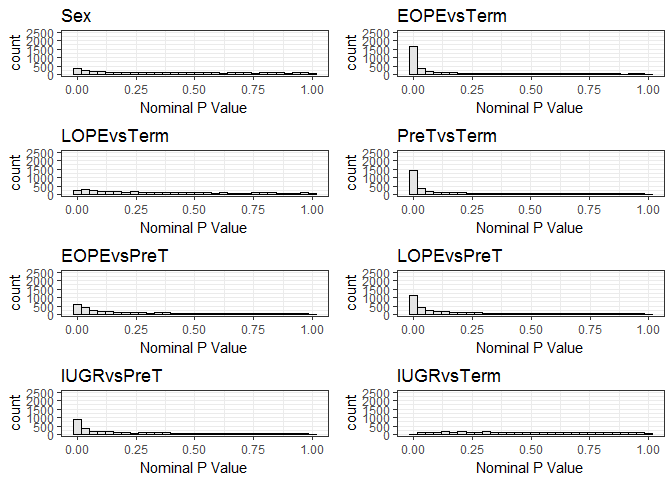
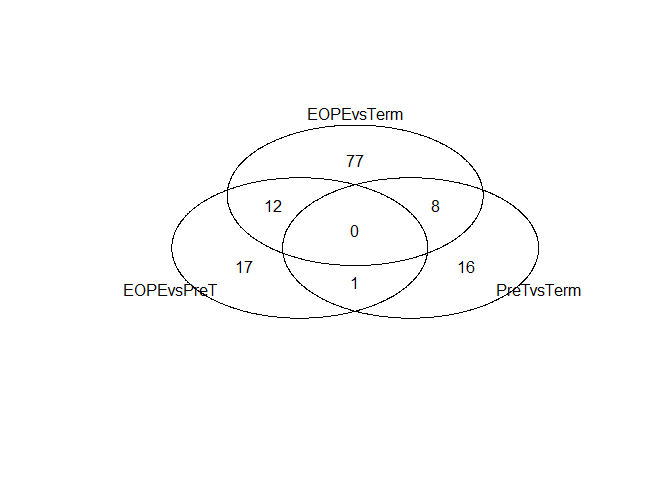
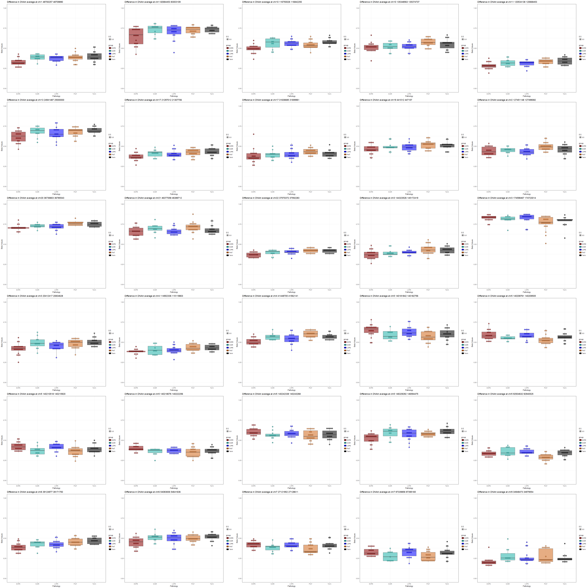
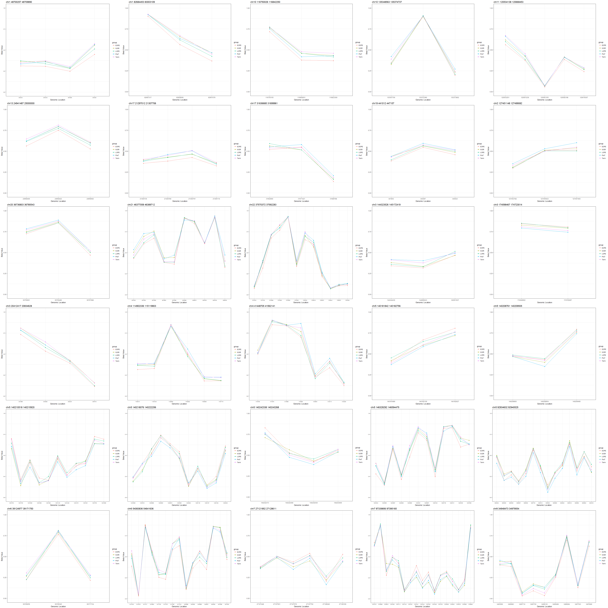

# PMD_DifferentialDNAm_Analysis_Mar2017
SLW  
March 4, 2017  


```r
memory.limit(10000000000000)
```

```
## [1] 1e+13
```

```r
setwd("Z:/ROBLAB1 coredata-databases/1 Samantha DATA Folder/PROJECTS/PE_IUGR_Array/Robinson Cohort")

##Load in DNA methylation data- this project comes from the functional normalization code previous to this analysis script.
load('PROJECT.fnorm_Jan2016.RData')
Data<-exprs(PROJECT.fun)
dim(Data)##102 samples
```

```
## [1] 441093    102
```

```r
##Reading in Phenotype data
des<-read.csv('Design_matrix_By Clusters_Sept2016.csv', header=T)
rownames(des)<-des$ParticipantID
dim(des)##94 samples
```

```
## [1] 94 21
```

```r
##Remove replicate samples as they are not needed in the analysis
rm<-c("PL21","PL21r","PL64","PL64r1","PM139","PM139r1","PM72","PM72r")
Data<-Data[,-which(colnames(Data) %in% rm)]

all(colnames(Data)==rownames(des))##TRUE
```

```
## [1] TRUE
```

```r
##Load PMD_List
PMDprobes<-read.table('Z:/ROBLAB1 coredata-databases/1 Samantha DATA Folder/PROJECTS/PMDProbes.txt',header=T)
```


```r
##Add PMD column to Data
##Fist subset Data to probes in PMDs
Data_PMDProbes<-as.data.frame(Data[which(rownames(Data) %in% rownames(PMDprobes)),])##111709
Data_PMDProbes<-merge(Data_PMDProbes,PMDprobes,by='row.names')
rownames(Data_PMDProbes)<-Data_PMDProbes$Row.names
Data_PMDProbes<-Data_PMDProbes[,c(2:95,99)]

##Remove PMDs that are only represented by 1-2
PMDProbes_byPMD<-split(PMDprobes,PMDprobes$PMD)

CpG_Numbers_InPMD<-lapply(1:4993,function(PMD){
  PMD_probes<-PMDProbes_byPMD[[PMD]]
  PMD_probes$CpG_No<-if(nrow(PMDProbes_byPMD[[PMD]])>2){PMD_probes$PMD<-paste("TRUE")}else{PMD_probes$PMD<-paste("FALSE")}
  PMD_probes
})

CpGperPMD_2<-do.call("rbind",CpG_Numbers_InPMD)

##Removing CpGs/PMD where less than 2 probes are representing the PMD on the array
Data_PMDProbes_CpGNo<-merge(Data_PMDProbes,CpGperPMD_2,by='row.names')
Data_PMDProbes_CpGNo$PMD.y<-NULL
rownames(Data_PMDProbes_CpGNo)<-Data_PMDProbes_CpGNo$Row.names
Data_PMDProbes_CpGNo$Row.names<-NULL
Data_PMDProbes_CpGNo<-Data_PMDProbes_CpGNo[order(Data_PMDProbes_CpGNo$PMD.x),]

Data_PMDProbes_clean<-Data_PMDProbes_CpGNo[-which(Data_PMDProbes_CpGNo$CpG_No=="FALSE"),]##110700 probes
sum(Data_PMDProbes_clean$CpG_No=="FALSE")##0
```

```
## [1] 0
```

```r
##Removing metadata except for PMD number
Data_PMDProbes_clean$MAPINFO<-NULL
Data_PMDProbes_clean$CHR<-NULL
Data_PMDProbes_clean$IlmnID<-NULL
Data_PMDProbes_clean$CpG_No<-NULL

##Taking the average of the PMD for remaining PMDs
library(dplyr)
PMD_AVG<-Data_PMDProbes_clean %>%
    group_by(PMD.x) %>%
    select(-PMD.x) %>%
    summarise_each(funs(mean))
```

```
## Adding missing grouping variables: `PMD.x`
```

```r
PMD_AVG<-as.data.frame(PMD_AVG)##3923 PMDs

##Cheking if any PMD is duplciated
sum(duplicated(PMD_AVG$PMD.x))
```

```
## [1] 0
```

Question: Are PMD disrupted/ differentially methylated in PE or IUGR?

```r
Data<-PMD_AVG
rownames(Data)<-Data$PMD.x
Data$PMD.x<-NULL

Des= model.matrix(~0+group +Sex, data = des)
#head(Des)
fit1 = lmFit(Data, Des)
fit1= eBayes(fit1)

cont.matrix = makeContrasts(PreTvsEOPE=groupPreT-groupEOPE,PreTvsLOPE=groupPreT-groupLOPE, TermvsEOPE=groupTerm-groupEOPE, TermvsLOPE=groupTerm-groupLOPE,TermvsPreT=groupTerm-groupPreT,TermvsIUGR=groupTerm-groupIUGR,PreTvsIUGR=groupPreT-groupIUGR,Sex=SexMALE,levels = Des)
fitCont = contrasts.fit(fit1, cont.matrix)###getting row names of contrasts don't match col names of coefficients- not sure why-look into
EbfitCont = eBayes(fitCont)

##Pulling our differentially methylated sites for pathological groups compared to controls and fetal sex (Male vs Female)
tt_sex = topTable(EbfitCont, coef = "Sex", n = Inf)
Sex_Pval<-data.frame(CpG=rownames(tt_sex), Nominal_P=tt_sex$P.Value)
Sex<-ggplot(Sex_Pval, aes(Nominal_P))+geom_histogram(fill="grey90", color="black")+theme_bw()+xlab("Nominal P Value")+ggtitle("Sex")+
  ylim(0,2500)

tt_EOPEvsTerm = topTable(EbfitCont, coef = "TermvsEOPE", n = Inf)
EOPEvsTerm_Pval<-data.frame(CpG=rownames(tt_EOPEvsTerm), Nominal_P=tt_EOPEvsTerm$P.Value)
EOPEvsTerm<-ggplot(EOPEvsTerm_Pval, aes(Nominal_P))+geom_histogram(fill="grey90", color="black")+theme_bw()+xlab("Nominal P Value")+ggtitle("EOPEvsTerm")+
 ylim(0,2500)

tt_LOPEvsTerm = topTable(EbfitCont, coef = "TermvsLOPE", n = Inf)
LOPEvsTerm_Pval<-data.frame(CpG=rownames(tt_LOPEvsTerm), Nominal_P=tt_LOPEvsTerm$P.Value)
LOPEvsTerm<-ggplot(LOPEvsTerm_Pval, aes(Nominal_P))+geom_histogram(fill="grey90", color="black")+theme_bw()+xlab("Nominal P Value")+ggtitle("LOPEvsTerm")+
  ylim(0,2500)

tt_PreTvsTerm = topTable(EbfitCont, coef = "TermvsPreT", n = Inf)
PreTvsTerm_Pval<-data.frame(CpG=rownames(tt_PreTvsTerm), Nominal_P=tt_PreTvsTerm$P.Value)
PreTvsTerm<-ggplot(PreTvsTerm_Pval, aes(Nominal_P))+geom_histogram(fill="grey90", color="black")+theme_bw()+xlab("Nominal P Value")+ggtitle("PreTvsTerm")+
  ylim(0,2500)

tt_EOPEvsPreT = topTable(EbfitCont, coef = "PreTvsEOPE", n = Inf)
EOPEvsPreT_Pval<-data.frame(CpG=rownames(tt_EOPEvsPreT), Nominal_P=tt_EOPEvsPreT$P.Value)
EOPEvsPreT<-ggplot(EOPEvsPreT_Pval, aes(Nominal_P))+geom_histogram(fill="grey90", color="black")+theme_bw()+xlab("Nominal P Value")+ggtitle("EOPEvsPreT")+
  ylim(0,2500)

tt_LOPEvsPreT = topTable(EbfitCont, coef = "PreTvsLOPE", n = Inf)
LOPEvsPreT_Pval<-data.frame(CpG=rownames(tt_LOPEvsPreT), Nominal_P=tt_LOPEvsPreT$P.Value)
LOPEvsPreT<-ggplot(LOPEvsPreT_Pval, aes(Nominal_P))+geom_histogram(fill="grey90", color="black")+theme_bw()+xlab("Nominal P Value")+ggtitle("LOPEvsPreT")+
  ylim(0,2500)

tt_IUGRvsTerm = topTable(EbfitCont, coef = "TermvsIUGR", n = Inf)
IUGRvsTerm_Pval<-data.frame(CpG=rownames(tt_IUGRvsTerm), Nominal_P=tt_IUGRvsTerm$P.Value)
IUGRvsTerm<-ggplot(IUGRvsTerm_Pval, aes(Nominal_P))+geom_histogram(fill="grey90", color="black")+theme_bw()+xlab("Nominal P Value")+ggtitle("IUGRvsTerm")+
  ylim(0,2500)

tt_IUGRvsPreT = topTable(EbfitCont, coef = "PreTvsIUGR", n = Inf)
IUGRvsPreT_Pval<-data.frame(CpG=rownames(tt_IUGRvsPreT), Nominal_P=tt_IUGRvsPreT$P.Value)
IUGRvsPreT<-ggplot(IUGRvsPreT_Pval, aes(Nominal_P))+geom_histogram(fill="grey90", color="black")+theme_bw()+xlab("Nominal P Value")+ggtitle("IUGRvsPreT")+
  ylim(0,2500)

##p-value distribution for each comparison
grid.arrange(Sex,EOPEvsTerm,LOPEvsTerm,PreTvsTerm,EOPEvsPreT,LOPEvsPreT,IUGRvsPreT,IUGRvsTerm,nrow=4)
```

```
## `stat_bin()` using `bins = 30`. Pick better value with `binwidth`.
## `stat_bin()` using `bins = 30`. Pick better value with `binwidth`.
## `stat_bin()` using `bins = 30`. Pick better value with `binwidth`.
## `stat_bin()` using `bins = 30`. Pick better value with `binwidth`.
## `stat_bin()` using `bins = 30`. Pick better value with `binwidth`.
## `stat_bin()` using `bins = 30`. Pick better value with `binwidth`.
## `stat_bin()` using `bins = 30`. Pick better value with `binwidth`.
## `stat_bin()` using `bins = 30`. Pick better value with `binwidth`.
```

<!-- -->


```r
cutoff.p = 0.05  # FDR threshold

##EOPE vs PreT hits
hits_EOPEvsPreT = as.data.frame(rownames(tt_EOPEvsPreT)[tt_EOPEvsPreT$adj.P.Val < cutoff.p])
rownames(hits_EOPEvsPreT)<-hits_EOPEvsPreT$`rownames(tt_EOPEvsPreT)[tt_EOPEvsPreT$adj.P.Val < cutoff.p]`
#str(hits_EOPEvsPreT)##285

##EOPEvsTerm
hits_EOPEvsTerm = as.data.frame(rownames(tt_EOPEvsTerm)[tt_EOPEvsTerm$adj.P.Val < cutoff.p])
rownames(hits_EOPEvsTerm)<-hits_EOPEvsTerm$`rownames(tt_EOPEvsTerm)[tt_EOPEvsTerm$adj.P.Val < cutoff.p]`
#str(hits_EOPEvsTerm)##1744

##LOPEvsTerm hits
hits_LOPEvsTerm = as.data.frame(rownames(tt_LOPEvsTerm)[tt_LOPEvsTerm$adj.P.Val < cutoff.p])
rownames(hits_LOPEvsTerm)<-hits_LOPEvsTerm$`rownames(tt_LOPEvsTerm)[tt_LOPEvsTerm$adj.P.Val < cutoff.p]`
#str(hits_LOPEvsTerm)##0

##IUGRvsTerm hits
hits_IUGRvsTerm = as.data.frame(rownames(tt_IUGRvsTerm)[tt_IUGRvsTerm$adj.P.Val < cutoff.p])
rownames(hits_IUGRvsTerm)<-hits_IUGRvsTerm$`rownames(tt_IUGRvsTerm)[tt_IUGRvsTerm$adj.P.Val < cutoff.p]`
#str(hits_IUGRvsTerm)##0

##PreTvsTerm
hits_PreTvsTerm = as.data.frame(rownames(tt_PreTvsTerm)[tt_PreTvsTerm$adj.P.Val < cutoff.p])
rownames(hits_PreTvsTerm)<-hits_PreTvsTerm$`rownames(tt_PreTvsTerm)[tt_PreTvsTerm$adj.P.Val < cutoff.p]`
##hits_PreTvsTerm ##1460
```


```r
Data_beta<-m2beta(Data)
##head(Data_beta)

fit_beta = lmFit(Data_beta, Des)
Ebfit_beta = eBayes(fit_beta)

cont.matrix = makeContrasts(PreTvsEOPE=groupPreT-groupEOPE,PreTvsLOPE=groupPreT-groupLOPE, TermvsEOPE=groupTerm-groupEOPE, TermvsLOPE=groupTerm-groupLOPE,TermvsPreT=groupTerm-groupPreT,TermvsIUGR=groupTerm-groupIUGR,PreTvsIUGR=groupPreT-groupIUGR,Sex=SexMALE,levels = Des)
fitCont_beta = contrasts.fit(Ebfit_beta, cont.matrix)
EbfitCont_beta = eBayes(fitCont_beta)
ttbeta_all = topTable(EbfitCont_beta, n = Inf)

##Setting change and DNAm magnitude change
thresh = 0.05  # delta beta threshold
delta_EOPE.0.05 = rownames(ttbeta_all)[abs(ttbeta_all$PreTvsEOPE) > thresh]##50
delta_EOPE.0.05<-as.data.frame(delta_EOPE.0.05)
delta_PreT.0.05 = rownames(ttbeta_all)[abs(ttbeta_all$TermvsPreT) > thresh]##31
delta_PreT.0.05<-as.data.frame(delta_PreT.0.05)
delta_EOPEvsTerm.0.05 = rownames(ttbeta_all)[abs(ttbeta_all$TermvsEOPE) > thresh]##101
delta_EOPEvsTerm.0.05<-as.data.frame(delta_EOPEvsTerm.0.05)

##Which hits meet both FDR<0.05 and change in DNAm>0.1
hit2_EOPE.0.05= intersect(rownames(hits_EOPEvsPreT), delta_EOPE.0.05$delta_EOPE.0.05)##30
hit2_PreT.0.05= intersect(rownames(hits_PreTvsTerm), delta_PreT.0.05$delta_PreT.0.05)##25
hit2_EOPEvsTerm.0.05= intersect(rownames(hits_EOPEvsTerm), delta_EOPEvsTerm.0.05$delta_EOPEvsTerm.0.05)##97

##Do these sites overlap?
overlap_EOPEvsPreT_PreTvsTerm<-intersect(hit2_EOPE.0.05,hit2_PreT.0.05)##1
overlap_EOPEvsPreT_EOPEvsTerm<-intersect(hit2_EOPE.0.05,hit2_EOPEvsTerm.0.05)##12
overlap_PreTvsTerm_EOPEvsTerm<-intersect(hit2_PreT.0.05,hit2_EOPEvsTerm.0.05)##8

venn(list(EOPEvsPreT=hit2_EOPE.0.05,PreTvsTerm=hit2_PreT.0.05,EOPEvsTerm=hit2_EOPEvsTerm.0.05))
```

<!-- -->

```r
##30 PMD meet FDR<0.05 and DB>0.05 in EOPE, and 25 PMD meet FDR<0.05 and DB>0.05 between PreT and Term
##Although there were also hits between
```


```r
(v.grp.col<-as.vector(des$group))
```

```
##  [1] "PreT" "PreT" "PreT" "PreT" "PreT" "EOPE" "EOPE" "LOPE" "LOPE" "IUGR"
## [11] "PreT" "PreT" "PreT" "PreT" "PreT" "PreT" "PreT" "PreT" "PreT" "PreT"
## [21] "PreT" "PreT" "IUGR" "PreT" "IUGR" "PreT" "Term" "Term" "LOPE" "EOPE"
## [31] "LOPE" "EOPE" "Term" "Term" "IUGR" "EOPE" "IUGR" "Term" "EOPE" "IUGR"
## [41] "Term" "EOPE" "Term" "Term" "PreT" "Term" "PreT" "PreT" "Term" "EOPE"
## [51] "Term" "PreT" "Term" "Term" "LOPE" "IUGR" "Term" "Term" "IUGR" "Term"
## [61] "IUGR" "LOPE" "EOPE" "LOPE" "Term" "EOPE" "EOPE" "LOPE" "EOPE" "IUGR"
## [71] "EOPE" "LOPE" "LOPE" "IUGR" "EOPE" "EOPE" "LOPE" "LOPE" "LOPE" "LOPE"
## [81] "LOPE" "EOPE" "EOPE" "LOPE" "EOPE" "LOPE" "Term" "PreT" "EOPE" "EOPE"
## [91] "Term" "EOPE" "LOPE" "EOPE"
```

```r
(v.grp.col<-gsub("Term","black",v.grp.col))
```

```
##  [1] "PreT"  "PreT"  "PreT"  "PreT"  "PreT"  "EOPE"  "EOPE"  "LOPE" 
##  [9] "LOPE"  "IUGR"  "PreT"  "PreT"  "PreT"  "PreT"  "PreT"  "PreT" 
## [17] "PreT"  "PreT"  "PreT"  "PreT"  "PreT"  "PreT"  "IUGR"  "PreT" 
## [25] "IUGR"  "PreT"  "black" "black" "LOPE"  "EOPE"  "LOPE"  "EOPE" 
## [33] "black" "black" "IUGR"  "EOPE"  "IUGR"  "black" "EOPE"  "IUGR" 
## [41] "black" "EOPE"  "black" "black" "PreT"  "black" "PreT"  "PreT" 
## [49] "black" "EOPE"  "black" "PreT"  "black" "black" "LOPE"  "IUGR" 
## [57] "black" "black" "IUGR"  "black" "IUGR"  "LOPE"  "EOPE"  "LOPE" 
## [65] "black" "EOPE"  "EOPE"  "LOPE"  "EOPE"  "IUGR"  "EOPE"  "LOPE" 
## [73] "LOPE"  "IUGR"  "EOPE"  "EOPE"  "LOPE"  "LOPE"  "LOPE"  "LOPE" 
## [81] "LOPE"  "EOPE"  "EOPE"  "LOPE"  "EOPE"  "LOPE"  "black" "PreT" 
## [89] "EOPE"  "EOPE"  "black" "EOPE"  "LOPE"  "EOPE"
```

```r
(v.grp.col<-gsub("PreT","darkred",v.grp.col))
```

```
##  [1] "darkred" "darkred" "darkred" "darkred" "darkred" "EOPE"    "EOPE"   
##  [8] "LOPE"    "LOPE"    "IUGR"    "darkred" "darkred" "darkred" "darkred"
## [15] "darkred" "darkred" "darkred" "darkred" "darkred" "darkred" "darkred"
## [22] "darkred" "IUGR"    "darkred" "IUGR"    "darkred" "black"   "black"  
## [29] "LOPE"    "EOPE"    "LOPE"    "EOPE"    "black"   "black"   "IUGR"   
## [36] "EOPE"    "IUGR"    "black"   "EOPE"    "IUGR"    "black"   "EOPE"   
## [43] "black"   "black"   "darkred" "black"   "darkred" "darkred" "black"  
## [50] "EOPE"    "black"   "darkred" "black"   "black"   "LOPE"    "IUGR"   
## [57] "black"   "black"   "IUGR"    "black"   "IUGR"    "LOPE"    "EOPE"   
## [64] "LOPE"    "black"   "EOPE"    "EOPE"    "LOPE"    "EOPE"    "IUGR"   
## [71] "EOPE"    "LOPE"    "LOPE"    "IUGR"    "EOPE"    "EOPE"    "LOPE"   
## [78] "LOPE"    "LOPE"    "LOPE"    "LOPE"    "EOPE"    "EOPE"    "LOPE"   
## [85] "EOPE"    "LOPE"    "black"   "darkred" "EOPE"    "EOPE"    "black"  
## [92] "EOPE"    "LOPE"    "EOPE"
```

```r
(v.grp.col<-gsub("LOPE","blue",v.grp.col))
```

```
##  [1] "darkred" "darkred" "darkred" "darkred" "darkred" "EOPE"    "EOPE"   
##  [8] "blue"    "blue"    "IUGR"    "darkred" "darkred" "darkred" "darkred"
## [15] "darkred" "darkred" "darkred" "darkred" "darkred" "darkred" "darkred"
## [22] "darkred" "IUGR"    "darkred" "IUGR"    "darkred" "black"   "black"  
## [29] "blue"    "EOPE"    "blue"    "EOPE"    "black"   "black"   "IUGR"   
## [36] "EOPE"    "IUGR"    "black"   "EOPE"    "IUGR"    "black"   "EOPE"   
## [43] "black"   "black"   "darkred" "black"   "darkred" "darkred" "black"  
## [50] "EOPE"    "black"   "darkred" "black"   "black"   "blue"    "IUGR"   
## [57] "black"   "black"   "IUGR"    "black"   "IUGR"    "blue"    "EOPE"   
## [64] "blue"    "black"   "EOPE"    "EOPE"    "blue"    "EOPE"    "IUGR"   
## [71] "EOPE"    "blue"    "blue"    "IUGR"    "EOPE"    "EOPE"    "blue"   
## [78] "blue"    "blue"    "blue"    "blue"    "EOPE"    "EOPE"    "blue"   
## [85] "EOPE"    "blue"    "black"   "darkred" "EOPE"    "EOPE"    "black"  
## [92] "EOPE"    "blue"    "EOPE"
```

```r
(v.grp.col<-gsub("IUGR","chocolate",v.grp.col))
```

```
##  [1] "darkred"   "darkred"   "darkred"   "darkred"   "darkred"  
##  [6] "EOPE"      "EOPE"      "blue"      "blue"      "chocolate"
## [11] "darkred"   "darkred"   "darkred"   "darkred"   "darkred"  
## [16] "darkred"   "darkred"   "darkred"   "darkred"   "darkred"  
## [21] "darkred"   "darkred"   "chocolate" "darkred"   "chocolate"
## [26] "darkred"   "black"     "black"     "blue"      "EOPE"     
## [31] "blue"      "EOPE"      "black"     "black"     "chocolate"
## [36] "EOPE"      "chocolate" "black"     "EOPE"      "chocolate"
## [41] "black"     "EOPE"      "black"     "black"     "darkred"  
## [46] "black"     "darkred"   "darkred"   "black"     "EOPE"     
## [51] "black"     "darkred"   "black"     "black"     "blue"     
## [56] "chocolate" "black"     "black"     "chocolate" "black"    
## [61] "chocolate" "blue"      "EOPE"      "blue"      "black"    
## [66] "EOPE"      "EOPE"      "blue"      "EOPE"      "chocolate"
## [71] "EOPE"      "blue"      "blue"      "chocolate" "EOPE"     
## [76] "EOPE"      "blue"      "blue"      "blue"      "blue"     
## [81] "blue"      "EOPE"      "EOPE"      "blue"      "EOPE"     
## [86] "blue"      "black"     "darkred"   "EOPE"      "EOPE"     
## [91] "black"     "EOPE"      "blue"      "EOPE"
```

```r
(v.grp.col<-gsub("EOPE","lightseagreen",v.grp.col))
```

```
##  [1] "darkred"       "darkred"       "darkred"       "darkred"      
##  [5] "darkred"       "lightseagreen" "lightseagreen" "blue"         
##  [9] "blue"          "chocolate"     "darkred"       "darkred"      
## [13] "darkred"       "darkred"       "darkred"       "darkred"      
## [17] "darkred"       "darkred"       "darkred"       "darkred"      
## [21] "darkred"       "darkred"       "chocolate"     "darkred"      
## [25] "chocolate"     "darkred"       "black"         "black"        
## [29] "blue"          "lightseagreen" "blue"          "lightseagreen"
## [33] "black"         "black"         "chocolate"     "lightseagreen"
## [37] "chocolate"     "black"         "lightseagreen" "chocolate"    
## [41] "black"         "lightseagreen" "black"         "black"        
## [45] "darkred"       "black"         "darkred"       "darkred"      
## [49] "black"         "lightseagreen" "black"         "darkred"      
## [53] "black"         "black"         "blue"          "chocolate"    
## [57] "black"         "black"         "chocolate"     "black"        
## [61] "chocolate"     "blue"          "lightseagreen" "blue"         
## [65] "black"         "lightseagreen" "lightseagreen" "blue"         
## [69] "lightseagreen" "chocolate"     "lightseagreen" "blue"         
## [73] "blue"          "chocolate"     "lightseagreen" "lightseagreen"
## [77] "blue"          "blue"          "blue"          "blue"         
## [81] "blue"          "lightseagreen" "lightseagreen" "blue"         
## [85] "lightseagreen" "blue"          "black"         "darkred"      
## [89] "lightseagreen" "lightseagreen" "black"         "lightseagreen"
## [93] "blue"          "lightseagreen"
```

```r
v.grp.col
```

```
##  [1] "darkred"       "darkred"       "darkred"       "darkred"      
##  [5] "darkred"       "lightseagreen" "lightseagreen" "blue"         
##  [9] "blue"          "chocolate"     "darkred"       "darkred"      
## [13] "darkred"       "darkred"       "darkred"       "darkred"      
## [17] "darkred"       "darkred"       "darkred"       "darkred"      
## [21] "darkred"       "darkred"       "chocolate"     "darkred"      
## [25] "chocolate"     "darkred"       "black"         "black"        
## [29] "blue"          "lightseagreen" "blue"          "lightseagreen"
## [33] "black"         "black"         "chocolate"     "lightseagreen"
## [37] "chocolate"     "black"         "lightseagreen" "chocolate"    
## [41] "black"         "lightseagreen" "black"         "black"        
## [45] "darkred"       "black"         "darkred"       "darkred"      
## [49] "black"         "lightseagreen" "black"         "darkred"      
## [53] "black"         "black"         "blue"          "chocolate"    
## [57] "black"         "black"         "chocolate"     "black"        
## [61] "chocolate"     "blue"          "lightseagreen" "blue"         
## [65] "black"         "lightseagreen" "lightseagreen" "blue"         
## [69] "lightseagreen" "chocolate"     "lightseagreen" "blue"         
## [73] "blue"          "chocolate"     "lightseagreen" "lightseagreen"
## [77] "blue"          "blue"          "blue"          "blue"         
## [81] "blue"          "lightseagreen" "lightseagreen" "blue"         
## [85] "lightseagreen" "blue"          "black"         "darkred"      
## [89] "lightseagreen" "lightseagreen" "black"         "lightseagreen"
## [93] "blue"          "lightseagreen"
```

What are these 30 differentially methylated PMDs


```r
anno<-read.table('Uber annotation.txt',header=T)

EOPE_PMD<-as.data.frame(hit2_EOPE.0.05)
rownames(EOPE_PMD)<-EOPE_PMD$`EOPE_PMD[order(EOPE_PMD$hit2_EOPE.0.05), ]`
EOPEPMD<-rownames(EOPE_PMD)
EOPE_PMD_Probes<-PMDprobes[PMDprobes$PMD %in% EOPEPMD,]##206 Probes

##Add in what genes they are annotated to
EOPE_PMD_anno<-anno[which(rownames(anno) %in% rownames(EOPE_PMD_Probes)),]
EOPE_PMD_anno<-EOPE_PMD_anno[,c("IlmnID","CHR","MAPINFO","UCSC_RefGene_Name","Closest_TSS_gene_name","Distance_closest_TSS")]

##Order the files by the IlmnID
EOPE_PMD_Probes<-EOPE_PMD_Probes[order(EOPE_PMD_Probes$IlmnID),]
EOPE_PMD_anno<-EOPE_PMD_anno[order(EOPE_PMD_anno$IlmnID),]

EOPE_PMD_GeneInfo<-cbind(EOPE_PMD_Probes,EOPE_PMD_anno)
EOPE_PMD_GeneInfo<-EOPE_PMD_GeneInfo[order(EOPE_PMD_GeneInfo$PMD),]
#write.table(EOPE_PMD_GeneInfo,file="EOPE_PMD_GeneInfo.txt")

##Pulling the p-values and Delta Betas for the PMDs
EOPE_PMD_Betas_PVals<-tt_EOPEvsPreT[which(rownames(tt_EOPEvsPreT) %in% EOPE_PMD_GeneInfo$PMD),]
EOPE_PMD_Betas_PVals<-EOPE_PMD_Betas_PVals[order(rownames(EOPE_PMD_Betas_PVals)),]

EOPE_Betas<-ttbeta_all[which(rownames(ttbeta_all) %in% EOPE_PMD_GeneInfo$PMD),]
EOPE_Betas<-EOPE_Betas[order(rownames(EOPE_Betas)),]

EOPE_PMD_Betas_PVals2<-cbind(EOPE_PMD_Betas_PVals,EOPE_Betas)
#write.table(EOPE_PMD_Betas_PVals2,file="EOPE_PMD_Betas_PVals.txt")
```

Graphing DNAm at PMDs-average boxplots

```r
EOPE_PMD<-as.data.frame(hit2_EOPE.0.05)
EOPE_PMD<-as.data.frame(EOPE_PMD[order(EOPE_PMD$hit2_EOPE.0.05),])

##Chromosome 1
##chr1 48700257 48709890

##Isolate the average for this PMD
PMD_1_PMD<-Data[which(rownames(Data)=="chr1 48700257 48709890"),]
PMD_1_PMD<-m2beta(PMD_1_PMD)
PMD_1_PMD_t<-t(PMD_1_PMD)
PMD_1_PMD_meta<-cbind(PMD_1_PMD_t,des)

PMD_1_BP<-ggplot(PMD_1_PMD_meta,aes(group,PMD_1_PMD_meta[,1],fill=group,alpha=0.5))+
  geom_boxplot()+
  geom_dotplot(binaxis='y', stackdir='center', dotsize=0.5)+
  scale_fill_manual(values=unique(v.grp.col))+
  ylim(0.0,1.0)+
   theme_bw() + 
   xlab("Pathology") + 
   ylab("Beta Values") + 
   ggtitle("Difference in DNAm average at chr1 48700257 48709890")

##Chromosome 1
##chr1 82684453 83003109
PMD_2_PMD<-Data[which(rownames(Data)=="chr1 82684453 83003109"),]
PMD_2_PMD<-m2beta(PMD_2_PMD)
PMD_2_PMD_t<-t(PMD_2_PMD)
PMD_2_PMD_meta<-cbind(PMD_2_PMD_t,des)

PMD_2_BP<-ggplot(PMD_2_PMD_meta,aes(group,PMD_2_PMD_meta[,1],fill=group,alpha=0.5))+
  geom_boxplot()+
  geom_dotplot(binaxis='y', stackdir='center', dotsize=0.5)+
  scale_fill_manual(values=unique(v.grp.col))+
  ylim(0.0,1.0)+
   theme_bw() + 
   xlab("Pathology") + 
   ylab("Beta Values") + 
   ggtitle("Difference in DNAm average at chr1 82684453 83003109")

##Chromosome 10
##chr10 116750026 116842250
PMD_3_PMD<-Data[which(rownames(Data)=="chr10 116750026 116842250"),]
PMD_3_PMD<-m2beta(PMD_3_PMD)
PMD_3_PMD_t<-t(PMD_3_PMD)
PMD_3_PMD_meta<-cbind(PMD_3_PMD_t,des)

PMD_3_BP<-ggplot(PMD_3_PMD_meta,aes(group,PMD_3_PMD_meta[,1],fill=group,alpha=0.5))+
  geom_boxplot()+
  geom_dotplot(binaxis='y', stackdir='center', dotsize=0.5)+
  scale_fill_manual(values=unique(v.grp.col))+
  ylim(0.0,1.0)+
   theme_bw() + 
   xlab("Pathology") + 
   ylab("Beta Values") + 
   ggtitle("Difference in DNAm average at chr10 116750026 116842250")

##Chromosome 10
##chr10 135348563 135374737
PMD_4_PMD<-Data[which(rownames(Data)=="chr10 135348563 135374737"),]
PMD_4_PMD<-m2beta(PMD_4_PMD)
PMD_4_PMD_t<-t(PMD_4_PMD)
PMD_4_PMD_meta<-cbind(PMD_4_PMD_t,des)

PMD_4_BP<-ggplot(PMD_4_PMD_meta,aes(group,PMD_4_PMD_meta[,1],fill=group,alpha=0.5))+
  geom_boxplot()+
  geom_dotplot(binaxis='y', stackdir='center', dotsize=0.5)+
  scale_fill_manual(values=unique(v.grp.col))+
  ylim(0.0,1.0)+
   theme_bw() + 
   xlab("Pathology") + 
   ylab("Beta Values") + 
   ggtitle("Difference in DNAm average at chr10 135348563 135374737")

##Chromosome 11
##chr11 120534138 120668453
PMD_5_PMD<-Data[which(rownames(Data)=="chr11 120534138 120668453"),]
PMD_5_PMD<-m2beta(PMD_5_PMD)
PMD_5_PMD_t<-t(PMD_5_PMD)
PMD_5_PMD_meta<-cbind(PMD_5_PMD_t,des)

PMD_5_BP<-ggplot(PMD_5_PMD_meta,aes(group,PMD_5_PMD_meta[,1],fill=group,alpha=0.5))+
  geom_boxplot()+
  geom_dotplot(binaxis='y', stackdir='center', dotsize=0.5)+
  scale_fill_manual(values=unique(v.grp.col))+
  ylim(0.0,1.0)+
   theme_bw() + 
   xlab("Pathology") + 
   ylab("Beta Values") + 
   ggtitle("Difference in DNAm average at chr11 120534138 120668453")

##Chromosome 13
##chr13 24941487 25000000
PMD_6_PMD<-Data[which(rownames(Data)=="chr13 24941487 25000000"),]
PMD_6_PMD<-m2beta(PMD_6_PMD)
PMD_6_PMD_t<-t(PMD_6_PMD)
PMD_6_PMD_meta<-cbind(PMD_6_PMD_t,des)

PMD_6_BP<-ggplot(PMD_6_PMD_meta,aes(group,PMD_6_PMD_meta[,1],fill=group,alpha=0.5))+
  geom_boxplot()+
  geom_dotplot(binaxis='y', stackdir='center', dotsize=0.5)+
  scale_fill_manual(values=unique(v.grp.col))+
  ylim(0.0,1.0)+
   theme_bw() + 
   xlab("Pathology") + 
   ylab("Beta Values") + 
   ggtitle("Difference in DNAm average at chr13 24941487 25000000")

##Chromosome 17
##chr17 21297012 21307706
PMD_7_PMD<-Data[which(rownames(Data)=="chr17 21297012 21307706"),]
PMD_7_PMD<-m2beta(PMD_7_PMD)
PMD_7_PMD_t<-t(PMD_7_PMD)
PMD_7_PMD_meta<-cbind(PMD_7_PMD_t,des)

PMD_7_BP<-ggplot(PMD_7_PMD_meta,aes(group,PMD_7_PMD_meta[,1],fill=group,alpha=0.5))+
  geom_boxplot()+
  geom_dotplot(binaxis='y', stackdir='center', dotsize=0.5)+
  scale_fill_manual(values=unique(v.grp.col))+
  ylim(0.0,1.0)+
   theme_bw() + 
   xlab("Pathology") + 
   ylab("Beta Values") + 
   ggtitle("Difference in DNAm average at chr17 21297012 21307706")

##Chromosome 17
##chr17 31636685 31699961
PMD_8_PMD<-Data[which(rownames(Data)=="chr17 31636685 31699961"),]
PMD_8_PMD<-m2beta(PMD_8_PMD)
PMD_8_PMD_t<-t(PMD_8_PMD)
PMD_8_PMD_meta<-cbind(PMD_8_PMD_t,des)

PMD_8_BP<-ggplot(PMD_8_PMD_meta,aes(group,PMD_8_PMD_meta[,1],fill=group,alpha=0.5))+
  geom_boxplot()+
  geom_dotplot(binaxis='y', stackdir='center', dotsize=0.5)+
  scale_fill_manual(values=unique(v.grp.col))+
  ylim(0.0,1.0)+
   theme_bw() + 
   xlab("Pathology") + 
   ylab("Beta Values") + 
   ggtitle("Difference in DNAm average at chr17 31636685 31699961")

##Chromosome 19
##chr19 441012 447157
PMD_9_PMD<-Data[which(rownames(Data)=="chr19 441012 447157"),]
PMD_9_PMD<-m2beta(PMD_9_PMD)
PMD_9_PMD_t<-t(PMD_9_PMD)
PMD_9_PMD_meta<-cbind(PMD_9_PMD_t,des)

PMD_9_BP<-ggplot(PMD_9_PMD_meta,aes(group,PMD_9_PMD_meta[,1],fill=group,alpha=0.5))+
  geom_boxplot()+
  geom_dotplot(binaxis='y', stackdir='center', dotsize=0.5)+
  scale_fill_manual(values=unique(v.grp.col))+
  ylim(0.0,1.0)+
   theme_bw() + 
   xlab("Pathology") + 
   ylab("Beta Values") + 
   ggtitle("Difference in DNAm average at chr19 441012 447157")

##Chromosome 2
##chr2 127451148 127499082
PMD_10_PMD<-Data[which(rownames(Data)=="chr2 127451148 127499082"),]
PMD_10_PMD<-m2beta(PMD_10_PMD)
PMD_10_PMD_t<-t(PMD_10_PMD)
PMD_10_PMD_meta<-cbind(PMD_10_PMD_t,des)

PMD_10_BP<-ggplot(PMD_10_PMD_meta,aes(group,PMD_10_PMD_meta[,1],fill=group,alpha=0.5))+
  geom_boxplot()+
  geom_dotplot(binaxis='y', stackdir='center', dotsize=0.5)+
  scale_fill_manual(values=unique(v.grp.col))+
  ylim(0.0,1.0)+
   theme_bw() + 
   xlab("Pathology") + 
   ylab("Beta Values") + 
   ggtitle("Difference in DNAm average at chr2 127451148 127499082")

##Chromosome 20
##chr20 36736803 36785543
PMD_11_PMD<-Data[which(rownames(Data)=="chr20 36736803 36785543"),]
PMD_11_PMD<-m2beta(PMD_11_PMD)
PMD_11_PMD_t<-t(PMD_11_PMD)
PMD_11_PMD_meta<-cbind(PMD_11_PMD_t,des)

PMD_11_BP<-ggplot(PMD_11_PMD_meta,aes(group,PMD_11_PMD_meta[,1],fill=group,alpha=0.5))+
  geom_boxplot()+
  geom_dotplot(binaxis='y', stackdir='center', dotsize=0.5)+
  scale_fill_manual(values=unique(v.grp.col))+
  ylim(0.0,1.0)+
   theme_bw() + 
   xlab("Pathology") + 
   ylab("Beta Values") + 
   ggtitle("Difference in DNAm average at chr20 36736803 36785543")

##Chromosome 21
##chr21 46377058 46389712
PMD_12_PMD<-Data[which(rownames(Data)=="chr21 46377058 46389712"),]
PMD_12_PMD<-m2beta(PMD_12_PMD)
PMD_12_PMD_t<-t(PMD_12_PMD)
PMD_12_PMD_meta<-cbind(PMD_12_PMD_t,des)

PMD_12_BP<-ggplot(PMD_12_PMD_meta,aes(group,PMD_12_PMD_meta[,1],fill=group,alpha=0.5))+
  geom_boxplot()+
  geom_dotplot(binaxis='y', stackdir='center', dotsize=0.5)+
  scale_fill_manual(values=unique(v.grp.col))+
  ylim(0.0,1.0)+
   theme_bw() + 
   xlab("Pathology") + 
   ylab("Beta Values") + 
   ggtitle("Difference in DNAm average at chr21 46377058 46389712")

##Chromosome 22
##chr22 37570372 37592283
PMD_13_PMD<-Data[which(rownames(Data)=="chr22 37570372 37592283"),]
PMD_13_PMD<-m2beta(PMD_13_PMD)
PMD_13_PMD_t<-t(PMD_13_PMD)
PMD_13_PMD_meta<-cbind(PMD_13_PMD_t,des)

PMD_13_BP<-ggplot(PMD_13_PMD_meta,aes(group,PMD_13_PMD_meta[,1],fill=group,alpha=0.5))+
  geom_boxplot()+
  geom_dotplot(binaxis='y', stackdir='center', dotsize=0.5)+
  scale_fill_manual(values=unique(v.grp.col))+
  ylim(0.0,1.0)+
   theme_bw() + 
   xlab("Pathology") + 
   ylab("Beta Values") + 
   ggtitle("Difference in DNAm average at chr22 37570372 37592283")

##Chromosome 3
##chr3 144323526 145172419
PMD_14_PMD<-Data[which(rownames(Data)=="chr3 144323526 145172419"),]
PMD_14_PMD<-m2beta(PMD_14_PMD)
PMD_14_PMD_t<-t(PMD_14_PMD)
PMD_14_PMD_meta<-cbind(PMD_14_PMD_t,des)

PMD_14_BP<-ggplot(PMD_14_PMD_meta,aes(group,PMD_14_PMD_meta[,1],fill=group,alpha=0.5))+
  geom_boxplot()+
  geom_dotplot(binaxis='y', stackdir='center', dotsize=0.5)+
  scale_fill_manual(values=unique(v.grp.col))+
  ylim(0.0,1.0)+
   theme_bw() + 
   xlab("Pathology") + 
   ylab("Beta Values") + 
   ggtitle("Difference in DNAm average at chr3 144323526 145172419")

##Chromosome 3
##chr3 174598467 174723014
PMD_15_PMD<-Data[which(rownames(Data)=="chr3 174598467 174723014"),]
PMD_15_PMD<-m2beta(PMD_15_PMD)
PMD_15_PMD_t<-t(PMD_15_PMD)
PMD_15_PMD_meta<-cbind(PMD_15_PMD_t,des)

PMD_15_BP<-ggplot(PMD_15_PMD_meta,aes(group,PMD_15_PMD_meta[,1],fill=group,alpha=0.5))+
  geom_boxplot()+
  geom_dotplot(binaxis='y', stackdir='center', dotsize=0.5)+
  scale_fill_manual(values=unique(v.grp.col))+
  ylim(0.0,1.0)+
   theme_bw() + 
   xlab("Pathology") + 
   ylab("Beta Values") + 
   ggtitle("Difference in DNAm average at chr3 174598467 174723014")

##Chromosome 3
##chr3 20412417 20834628
PMD_16_PMD<-Data[which(rownames(Data)=="chr3 20412417 20834628"),]
PMD_16_PMD<-m2beta(PMD_16_PMD)
PMD_16_PMD_t<-t(PMD_16_PMD)
PMD_16_PMD_meta<-cbind(PMD_16_PMD_t,des)

PMD_16_BP<-ggplot(PMD_16_PMD_meta,aes(group,PMD_16_PMD_meta[,1],fill=group,alpha=0.5))+
  geom_boxplot()+
  geom_dotplot(binaxis='y', stackdir='center', dotsize=0.5)+
  scale_fill_manual(values=unique(v.grp.col))+
  ylim(0.0,1.0)+
   theme_bw() + 
   xlab("Pathology") + 
   ylab("Beta Values") + 
   ggtitle("Difference in DNAm average at chr3 20412417 20834628")

##Chromosome 4
##chr4 114902336 115119803
PMD_17_PMD<-Data[which(rownames(Data)=="chr4 114902336 115119803"),]
PMD_17_PMD<-m2beta(PMD_17_PMD)
PMD_17_PMD_t<-t(PMD_17_PMD)
PMD_17_PMD_meta<-cbind(PMD_17_PMD_t,des)

PMD_17_BP<-ggplot(PMD_17_PMD_meta,aes(group,PMD_17_PMD_meta[,1],fill=group,alpha=0.5))+
  geom_boxplot()+
  geom_dotplot(binaxis='y', stackdir='center', dotsize=0.5)+
  scale_fill_manual(values=unique(v.grp.col))+
  ylim(0.0,1.0)+
   theme_bw() + 
   xlab("Pathology") + 
   ylab("Beta Values") + 
   ggtitle("Difference in DNAm average at chr4 114902336 115119803")


##Chromosome 4
##chr4 41448705 41562141
PMD_18_PMD<-Data[which(rownames(Data)=="chr4 41448705 41562141"),]
PMD_18_PMD<-m2beta(PMD_18_PMD)
PMD_18_PMD_t<-t(PMD_18_PMD)
PMD_18_PMD_meta<-cbind(PMD_18_PMD_t,des)

PMD_18_BP<-ggplot(PMD_18_PMD_meta,aes(group,PMD_18_PMD_meta[,1],fill=group,alpha=0.5))+
  geom_boxplot()+
  geom_dotplot(binaxis='y', stackdir='center', dotsize=0.5)+
  scale_fill_manual(values=unique(v.grp.col))+
  ylim(0.0,1.0)+
   theme_bw() + 
   xlab("Pathology") + 
   ylab("Beta Values") + 
   ggtitle("Difference in DNAm average at chr4 41448705 41562141")

##Chromosome 5
##chr5 140181842 140182756
PMD_19_PMD<-Data[which(rownames(Data)=="chr5 140181842 140182756"),]
PMD_19_PMD<-m2beta(PMD_19_PMD)
PMD_19_PMD_t<-t(PMD_19_PMD)
PMD_19_PMD_meta<-cbind(PMD_19_PMD_t,des)

PMD_19_BP<-ggplot(PMD_19_PMD_meta,aes(group,PMD_19_PMD_meta[,1],fill=group,alpha=0.5))+
  geom_boxplot()+
  geom_dotplot(binaxis='y', stackdir='center', dotsize=0.5)+
  scale_fill_manual(values=unique(v.grp.col))+
  ylim(0.0,1.0)+
   theme_bw() + 
   xlab("Pathology") + 
   ylab("Beta Values") + 
   ggtitle("Difference in DNAm average at chr5 140181842 140182756")

##Chromosome 5
##chr5 140208761 140209505
PMD_20_PMD<-Data[which(rownames(Data)=="chr5 140208761 140209505"),]
PMD_20_PMD<-m2beta(PMD_20_PMD)
PMD_20_PMD_t<-t(PMD_20_PMD)
PMD_20_PMD_meta<-cbind(PMD_20_PMD_t,des)

PMD_20_BP<-ggplot(PMD_20_PMD_meta,aes(group,PMD_20_PMD_meta[,1],fill=group,alpha=0.5))+
  geom_boxplot()+
  geom_dotplot(binaxis='y', stackdir='center', dotsize=0.5)+
  scale_fill_manual(values=unique(v.grp.col))+
  ylim(0.0,1.0)+
   theme_bw() + 
   xlab("Pathology") + 
   ylab("Beta Values") + 
   ggtitle("Difference in DNAm average at chr5 140208761 140209505")

##Chromosome 5
##chr5 140210518 140215920
PMD_21_PMD<-Data[which(rownames(Data)=="chr5 140210518 140215920"),]
PMD_21_PMD<-m2beta(PMD_21_PMD)
PMD_21_PMD_t<-t(PMD_21_PMD)
PMD_21_PMD_meta<-cbind(PMD_21_PMD_t,des)

PMD_21_BP<-ggplot(PMD_21_PMD_meta,aes(group,PMD_21_PMD_meta[,1],fill=group,alpha=0.5))+
  geom_boxplot()+
  geom_dotplot(binaxis='y', stackdir='center', dotsize=0.5)+
  scale_fill_manual(values=unique(v.grp.col))+
  ylim(0.0,1.0)+
   theme_bw() + 
   xlab("Pathology") + 
   ylab("Beta Values") + 
   ggtitle("Difference in DNAm average at chr5 140210518 140215920")

##Chromosome 5
##chr5 140218076 140222256
PMD_22_PMD<-Data[which(rownames(Data)=="chr5 140218076 140222256"),]
PMD_22_PMD<-m2beta(PMD_22_PMD)
PMD_22_PMD_t<-t(PMD_22_PMD)
PMD_22_PMD_meta<-cbind(PMD_22_PMD_t,des)

PMD_22_BP<-ggplot(PMD_22_PMD_meta,aes(group,PMD_22_PMD_meta[,1],fill=group,alpha=0.5))+
  geom_boxplot()+
  geom_dotplot(binaxis='y', stackdir='center', dotsize=0.5)+
  scale_fill_manual(values=unique(v.grp.col))+
  ylim(0.0,1.0)+
   theme_bw() + 
   xlab("Pathology") + 
   ylab("Beta Values") + 
   ggtitle("Difference in DNAm average at chr5 140218076 140222256")

##Chromosome 5
##chr5 140242338 140243268
PMD_23_PMD<-Data[which(rownames(Data)=="chr5 140242338 140243268"),]
PMD_23_PMD<-m2beta(PMD_23_PMD)
PMD_23_PMD_t<-t(PMD_23_PMD)
PMD_23_PMD_meta<-cbind(PMD_23_PMD_t,des)

PMD_23_BP<-ggplot(PMD_23_PMD_meta,aes(group,PMD_23_PMD_meta[,1],fill=group,alpha=0.5))+
  geom_boxplot()+
  geom_dotplot(binaxis='y', stackdir='center', dotsize=0.5)+
  scale_fill_manual(values=unique(v.grp.col))+
  ylim(0.0,1.0)+
   theme_bw() + 
   xlab("Pathology") + 
   ylab("Beta Values") + 
   ggtitle("Difference in DNAm average at chr5 140242338 140243268")

##Chromosome 5
##chr5 146329292 146594475
PMD_24_PMD<-Data[which(rownames(Data)=="chr5 146329292 146594475"),]
PMD_24_PMD<-m2beta(PMD_24_PMD)
PMD_24_PMD_t<-t(PMD_24_PMD)
PMD_24_PMD_meta<-cbind(PMD_24_PMD_t,des)

PMD_24_BP<-ggplot(PMD_24_PMD_meta,aes(group,PMD_24_PMD_meta[,1],fill=group,alpha=0.5))+
  geom_boxplot()+
  geom_dotplot(binaxis='y', stackdir='center', dotsize=0.5)+
  scale_fill_manual(values=unique(v.grp.col))+
  ylim(0.0,1.0)+
   theme_bw() + 
   xlab("Pathology") + 
   ylab("Beta Values") + 
   ggtitle("Difference in DNAm average at chr5 146329292 146594475")

##Chromosome 5
##chr5 92934632 92940525
PMD_25_PMD<-Data[which(rownames(Data)=="chr5 92934632 92940525"),]
PMD_25_PMD<-m2beta(PMD_25_PMD)
PMD_25_PMD_t<-t(PMD_25_PMD)
PMD_25_PMD_meta<-cbind(PMD_25_PMD_t,des)

PMD_25_BP<-ggplot(PMD_25_PMD_meta,aes(group,PMD_25_PMD_meta[,1],fill=group,alpha=0.5))+
  geom_boxplot()+
  geom_dotplot(binaxis='y', stackdir='center', dotsize=0.5)+
  scale_fill_manual(values=unique(v.grp.col))+
  ylim(0.0,1.0)+
   theme_bw() + 
   xlab("Pathology") + 
   ylab("Beta Values") + 
   ggtitle("Difference in DNAm average at chr5 92934632 92940525")

##Chromosome 6
##chr6 39124977 39171750
PMD_26_PMD<-Data[which(rownames(Data)=="chr6 39124977 39171750"),]
PMD_26_PMD<-m2beta(PMD_26_PMD)
PMD_26_PMD_t<-t(PMD_26_PMD)
PMD_26_PMD_meta<-cbind(PMD_26_PMD_t,des)

PMD_26_BP<-ggplot(PMD_26_PMD_meta,aes(group,PMD_26_PMD_meta[,1],fill=group,alpha=0.5))+
  geom_boxplot()+
  geom_dotplot(binaxis='y', stackdir='center', dotsize=0.5)+
  scale_fill_manual(values=unique(v.grp.col))+
  ylim(0.0,1.0)+
   theme_bw() + 
   xlab("Pathology") + 
   ylab("Beta Values") + 
   ggtitle("Difference in DNAm average at chr6 39124977 39171750")

##Chromosome 6
##chr6 54083836 54641636
PMD_27_PMD<-Data[which(rownames(Data)=="chr6 54083836 54641636"),]
PMD_27_PMD<-m2beta(PMD_27_PMD)
PMD_27_PMD_t<-t(PMD_27_PMD)
PMD_27_PMD_meta<-cbind(PMD_27_PMD_t,des)

PMD_27_BP<-ggplot(PMD_27_PMD_meta,aes(group,PMD_27_PMD_meta[,1],fill=group,alpha=0.5))+
  geom_boxplot()+
  geom_dotplot(binaxis='y', stackdir='center', dotsize=0.5)+
  scale_fill_manual(values=unique(v.grp.col))+
  ylim(0.0,1.0)+
   theme_bw() + 
   xlab("Pathology") + 
   ylab("Beta Values") + 
   ggtitle("Difference in DNAm average at chr6 54083836 54641636")

##Chromosome 7
##chr7 27121952 27128611
PMD_28_PMD<-Data[which(rownames(Data)=="chr7 27121952 27128611"),]
PMD_28_PMD<-m2beta(PMD_28_PMD)
PMD_28_PMD_t<-t(PMD_28_PMD)
PMD_28_PMD_meta<-cbind(PMD_28_PMD_t,des)

PMD_28_BP<-ggplot(PMD_28_PMD_meta,aes(group,PMD_28_PMD_meta[,1],fill=group,alpha=0.5))+
  geom_boxplot()+
  geom_dotplot(binaxis='y', stackdir='center', dotsize=0.5)+
  scale_fill_manual(values=unique(v.grp.col))+
  ylim(0.0,1.0)+
   theme_bw() + 
   xlab("Pathology") + 
   ylab("Beta Values") + 
   ggtitle("Difference in DNAm average at chr7 27121952 27128611")

##Chromosome 7
##chr7 97339856 97395165
PMD_29_PMD<-Data[which(rownames(Data)=="chr7 97339856 97395165"),]
PMD_29_PMD<-m2beta(PMD_29_PMD)
PMD_29_PMD_t<-t(PMD_29_PMD)
PMD_29_PMD_meta<-cbind(PMD_29_PMD_t,des)

PMD_29_BP<-ggplot(PMD_29_PMD_meta,aes(group,PMD_29_PMD_meta[,1],fill=group,alpha=0.5))+
  geom_boxplot()+
  geom_dotplot(binaxis='y', stackdir='center', dotsize=0.5)+
  scale_fill_manual(values=unique(v.grp.col))+
  ylim(0.0,1.0)+
   theme_bw() + 
   xlab("Pathology") + 
   ylab("Beta Values") + 
   ggtitle("Difference in DNAm average at chr7 97339856 97395165")

##Chromosome 9
##chr9 34948473 34979554
PMD_30_PMD<-Data[which(rownames(Data)=="chr9 34948473 34979554"),]
PMD_30_PMD<-m2beta(PMD_30_PMD)
PMD_30_PMD_t<-t(PMD_30_PMD)
PMD_30_PMD_meta<-cbind(PMD_30_PMD_t,des)

PMD_30_BP<-ggplot(PMD_30_PMD_meta,aes(group,PMD_30_PMD_meta[,1],fill=group,alpha=0.5))+
  geom_boxplot()+
  geom_dotplot(binaxis='y', stackdir='center', dotsize=0.5)+
  scale_fill_manual(values=unique(v.grp.col))+
  ylim(0.0,1.0)+
   theme_bw() + 
   xlab("Pathology") + 
   ylab("Beta Values") + 
   ggtitle("Difference in DNAm average at chr9 34948473 34979554")

grid.arrange(PMD_1_BP,PMD_2_BP,PMD_3_BP,PMD_4_BP,PMD_5_BP,PMD_6_BP,PMD_7_BP,PMD_8_BP,PMD_9_BP,PMD_10_BP,PMD_11_BP,PMD_12_BP,PMD_13_BP,PMD_14_BP,PMD_15_BP,PMD_16_BP,PMD_17_BP,PMD_18_BP,PMD_19_BP,PMD_20_BP,PMD_21_BP,PMD_22_BP,PMD_23_BP,PMD_24_BP,PMD_25_BP,PMD_26_BP,PMD_27_BP,PMD_28_BP,PMD_29_BP,PMD_30_BP,nrow=6)
```

```
## `stat_bindot()` using `bins = 30`. Pick better value with `binwidth`.
## `stat_bindot()` using `bins = 30`. Pick better value with `binwidth`.
## `stat_bindot()` using `bins = 30`. Pick better value with `binwidth`.
## `stat_bindot()` using `bins = 30`. Pick better value with `binwidth`.
## `stat_bindot()` using `bins = 30`. Pick better value with `binwidth`.
## `stat_bindot()` using `bins = 30`. Pick better value with `binwidth`.
## `stat_bindot()` using `bins = 30`. Pick better value with `binwidth`.
## `stat_bindot()` using `bins = 30`. Pick better value with `binwidth`.
## `stat_bindot()` using `bins = 30`. Pick better value with `binwidth`.
## `stat_bindot()` using `bins = 30`. Pick better value with `binwidth`.
## `stat_bindot()` using `bins = 30`. Pick better value with `binwidth`.
## `stat_bindot()` using `bins = 30`. Pick better value with `binwidth`.
## `stat_bindot()` using `bins = 30`. Pick better value with `binwidth`.
## `stat_bindot()` using `bins = 30`. Pick better value with `binwidth`.
## `stat_bindot()` using `bins = 30`. Pick better value with `binwidth`.
## `stat_bindot()` using `bins = 30`. Pick better value with `binwidth`.
## `stat_bindot()` using `bins = 30`. Pick better value with `binwidth`.
## `stat_bindot()` using `bins = 30`. Pick better value with `binwidth`.
## `stat_bindot()` using `bins = 30`. Pick better value with `binwidth`.
## `stat_bindot()` using `bins = 30`. Pick better value with `binwidth`.
## `stat_bindot()` using `bins = 30`. Pick better value with `binwidth`.
## `stat_bindot()` using `bins = 30`. Pick better value with `binwidth`.
## `stat_bindot()` using `bins = 30`. Pick better value with `binwidth`.
## `stat_bindot()` using `bins = 30`. Pick better value with `binwidth`.
## `stat_bindot()` using `bins = 30`. Pick better value with `binwidth`.
## `stat_bindot()` using `bins = 30`. Pick better value with `binwidth`.
## `stat_bindot()` using `bins = 30`. Pick better value with `binwidth`.
## `stat_bindot()` using `bins = 30`. Pick better value with `binwidth`.
## `stat_bindot()` using `bins = 30`. Pick better value with `binwidth`.
## `stat_bindot()` using `bins = 30`. Pick better value with `binwidth`.
```

<!-- -->

Plotting Differentially methylated PMD with each individual CpG within the graph.
On the X axis will be the CpG sites in the PMD, in map order, and the y axis will be the beta value

```r
##Order Data_PMDProbes by PMD
Data_PMDProbes_ordered<-Data_PMDProbes_clean[order(Data_PMDProbes_clean$PMD.x),]##110700

##Add CpG site mapinfo into the data frame
#anno<-read.table('Uber annotation.txt',header=T)
anno_MAPinfo<-as.data.frame(anno[,c("MAPINFO")])
rownames(anno_MAPinfo)<-rownames(anno)

Data_PMDProbes_CpGMAP<-merge(Data_PMDProbes_ordered,anno_MAPinfo,by='row.names')##110700
rownames(Data_PMDProbes_CpGMAP)<-Data_PMDProbes_CpGMAP$Row.names
Data_PMDProbes_CpGMAP$Row.names<-NULL
Data_PMDProbes_CpGMAP_ordered<-Data_PMDProbes_CpGMAP[order(Data_PMDProbes_CpGMAP$PMD,Data_PMDProbes_CpGMAP$`anno[, c("MAPINFO")]`),]

##Isolate only the EOPE differentially methylated PMD
EOPE_PMD_Data<-Data_PMDProbes_CpGMAP_ordered[which(Data_PMDProbes_CpGMAP_ordered$PMD.x %in% hit2_EOPE.0.05),]##189
EOPE_PMD_Data$PMD<-EOPE_PMD_Data$PMD.x
EOPE_PMD_Data$PMD.x<-NULL
EOPE_PMD_Data$PMD<-droplevels(EOPE_PMD_Data$PMD)
EOPE_PMD_Data$MAPINFO<-EOPE_PMD_Data$`anno[, c("MAPINFO")]`
EOPE_PMD_Data$`anno[, c("MAPINFO")]`<-NULL

##Plotting each of the 30PMDs
##Chromosome 1
##chr1 48700257 48709890
PMD_1_Sample<-Data_PMDProbes_CpGMAP_ordered[which(Data_PMDProbes_CpGMAP_ordered$PMD=="chr1 48700257 48709890"),]
PMD_1_Sample$PMD.x<-NULL
rownames(PMD_1_Sample)<-PMD_1_Sample$`anno[, c("MAPINFO")]`
PMD_1_Sample$`anno[, c("MAPINFO")]`<-NULL

##Change to betas
PMD_1_Sample<-m2beta(PMD_1_Sample)

PMD_1_Sample_t<-t(PMD_1_Sample)
PMD_1_Sample_melt<-melt(PMD_1_Sample_t,by='row.names')
PMD_1_Sample_melt_meta<-cbind(PMD_1_Sample_melt,des$group)
colnames(PMD_1_Sample_melt_meta)[4]<-c("group")
PMD_1_Sample_melt_meta$X2<-as.factor(PMD_1_Sample_melt_meta$X2)

PMD_1<-ggplot(PMD_1_Sample_melt_meta,aes(X2,value,colour=group,group=group))+
    geom_point(stat='summary', fun.y='mean')+
  geom_line(stat='summary', fun.y='mean') + 
  scale_fill_manual(values=unique(v.grp.col))+
  theme_bw()+
  xlab("Genomic Location")+
  ylab("Beta Value")+
  ggtitle("chr1 48700257 48709890")+
  ylim(c(0,1))+theme(axis.text = element_text(size=6.0))

##Chromosome 1
##chr1 82684453 83003109
PMD_2_Sample<-Data_PMDProbes_CpGMAP_ordered[which(Data_PMDProbes_CpGMAP_ordered$PMD=="chr1 82684453 83003109"),]
PMD_2_Sample$PMD.x<-NULL
rownames(PMD_2_Sample)<-PMD_2_Sample$`anno[, c("MAPINFO")]`
PMD_2_Sample$`anno[, c("MAPINFO")]`<-NULL

##Change to betas
PMD_2_Sample<-m2beta(PMD_2_Sample)

PMD_2_Sample_t<-t(PMD_2_Sample)
PMD_2_Sample_melt<-melt(PMD_2_Sample_t,by='row.names')
PMD_2_Sample_melt_meta<-cbind(PMD_2_Sample_melt,des$group)
colnames(PMD_2_Sample_melt_meta)[4]<-c("group")
PMD_2_Sample_melt_meta$X2<-as.factor(PMD_2_Sample_melt_meta$X2)

PMD_2<-ggplot(PMD_2_Sample_melt_meta,aes(X2,value,colour=group,group=group))+
    geom_point(stat='summary', fun.y='mean')+
  geom_line(stat='summary', fun.y='mean') + 
  scale_fill_manual(values=unique(v.grp.col))+
  theme_bw()+
  xlab("Genomic Location")+
  ylab("Beta Value")+
  ggtitle("chr1 82684453 83003109")+
  ylim(c(0,1))

##Chromosome 10
##chr10 116750026 116842250
PMD_3_Sample<-Data_PMDProbes_CpGMAP_ordered[which(Data_PMDProbes_CpGMAP_ordered$PMD=="chr10 116750026 116842250"),]
PMD_3_Sample$PMD.x<-NULL
rownames(PMD_3_Sample)<-PMD_3_Sample$`anno[, c("MAPINFO")]`
PMD_3_Sample$`anno[, c("MAPINFO")]`<-NULL

##Change to betas
PMD_3_Sample<-m2beta(PMD_3_Sample)

PMD_3_Sample_t<-t(PMD_3_Sample)
PMD_3_Sample_melt<-melt(PMD_3_Sample_t,by='row.names')
PMD_3_Sample_melt_meta<-cbind(PMD_3_Sample_melt,des$group)
colnames(PMD_3_Sample_melt_meta)[4]<-c("group")
PMD_3_Sample_melt_meta$X2<-as.factor(PMD_3_Sample_melt_meta$X2)

PMD_3<-ggplot(PMD_3_Sample_melt_meta,aes(X2,value,colour=group,group=group))+
    geom_point(stat='summary', fun.y='mean')+
  geom_line(stat='summary', fun.y='mean') + 
  scale_fill_manual(values=unique(v.grp.col))+
  theme_bw()+
  xlab("Genomic Location")+
  ylab("Beta Value")+
  ggtitle("chr10 116750026 116842250")+
  ylim(c(0,1))

##Chromosome 10 
##chr10 135348563 135374737
PMD_4_Sample<-Data_PMDProbes_CpGMAP_ordered[which(Data_PMDProbes_CpGMAP_ordered$PMD=="chr10 135348563 135374737"),]
PMD_4_Sample$PMD.x<-NULL
rownames(PMD_4_Sample)<-PMD_4_Sample$`anno[, c("MAPINFO")]`
PMD_4_Sample$`anno[, c("MAPINFO")]`<-NULL

##Change to betas
PMD_4_Sample<-m2beta(PMD_4_Sample)

PMD_4_Sample_t<-t(PMD_4_Sample)
PMD_4_Sample_melt<-melt(PMD_4_Sample_t,by='row.names')
PMD_4_Sample_melt_meta<-cbind(PMD_4_Sample_melt,des$group)
colnames(PMD_4_Sample_melt_meta)[4]<-c("group")
PMD_4_Sample_melt_meta$X2<-as.factor(PMD_4_Sample_melt_meta$X2)

PMD_4<-ggplot(PMD_4_Sample_melt_meta,aes(X2,value,colour=group,group=group))+
    geom_point(stat='summary', fun.y='mean')+
  geom_line(stat='summary', fun.y='mean') + 
  scale_fill_manual(values=unique(v.grp.col))+
  theme_bw()+
  xlab("Genomic Location")+
  ylab("Beta Value")+
  ggtitle("chr10 135348563 135374737")+
  ylim(c(0,1))

##Chromosome 11
##chr11 120534138 120668453
PMD_5_Sample<-Data_PMDProbes_CpGMAP_ordered[which(Data_PMDProbes_CpGMAP_ordered$PMD=="chr11 120534138 120668453"),]
PMD_5_Sample$PMD.x<-NULL
rownames(PMD_5_Sample)<-PMD_5_Sample$`anno[, c("MAPINFO")]`
PMD_5_Sample$`anno[, c("MAPINFO")]`<-NULL

##Change to betas
PMD_5_Sample<-m2beta(PMD_5_Sample)

PMD_5_Sample_t<-t(PMD_5_Sample)
PMD_5_Sample_melt<-melt(PMD_5_Sample_t,by='row.names')
PMD_5_Sample_melt_meta<-cbind(PMD_5_Sample_melt,des$group)
colnames(PMD_5_Sample_melt_meta)[4]<-c("group")
PMD_5_Sample_melt_meta$X2<-as.factor(PMD_5_Sample_melt_meta$X2)

PMD_5<-ggplot(PMD_5_Sample_melt_meta,aes(X2,value,colour=group,group=group))+
    geom_point(stat='summary', fun.y='mean')+
  geom_line(stat='summary', fun.y='mean') + 
  scale_fill_manual(values=unique(v.grp.col))+
  theme_bw()+
  xlab("Genomic Location")+
  ylab("Beta Value")+
  ggtitle("chr11 120534138 120668453")+
  ylim(c(0,1))

##Chromosome 13
##chr13 24941487 25000000
PMD_6_Sample<-Data_PMDProbes_CpGMAP_ordered[which(Data_PMDProbes_CpGMAP_ordered$PMD=="chr13 24941487 25000000"),]
PMD_6_Sample$PMD.x<-NULL
rownames(PMD_6_Sample)<-PMD_6_Sample$`anno[, c("MAPINFO")]`
PMD_6_Sample$`anno[, c("MAPINFO")]`<-NULL

##Change to betas
PMD_6_Sample<-m2beta(PMD_6_Sample)

PMD_6_Sample_t<-t(PMD_6_Sample)
PMD_6_Sample_melt<-melt(PMD_6_Sample_t,by='row.names')
PMD_6_Sample_melt_meta<-cbind(PMD_6_Sample_melt,des$group)
colnames(PMD_6_Sample_melt_meta)[4]<-c("group")
PMD_6_Sample_melt_meta$X2<-as.factor(PMD_6_Sample_melt_meta$X2)

PMD_6<-ggplot(PMD_6_Sample_melt_meta,aes(X2,value,colour=group,group=group))+
    geom_point(stat='summary', fun.y='mean')+
  geom_line(stat='summary', fun.y='mean') + 
  scale_fill_manual(values=unique(v.grp.col))+
  theme_bw()+
  xlab("Genomic Location")+
  ylab("Beta Value")+
  ggtitle("chr13 24941487 25000000")+
  ylim(c(0,1))

##Chromosome 17
##chr17 21297012 21307706
PMD_7_Sample<-Data_PMDProbes_CpGMAP_ordered[which(Data_PMDProbes_CpGMAP_ordered$PMD=="chr17 21297012 21307706"),]
PMD_7_Sample$PMD.x<-NULL
rownames(PMD_7_Sample)<-PMD_7_Sample$`anno[, c("MAPINFO")]`
PMD_7_Sample$`anno[, c("MAPINFO")]`<-NULL

##Change to betas
PMD_7_Sample<-m2beta(PMD_7_Sample)

PMD_7_Sample_t<-t(PMD_7_Sample)
PMD_7_Sample_melt<-melt(PMD_7_Sample_t,by='row.names')
PMD_7_Sample_melt_meta<-cbind(PMD_7_Sample_melt,des$group)
colnames(PMD_7_Sample_melt_meta)[4]<-c("group")
PMD_7_Sample_melt_meta$X2<-as.factor(PMD_7_Sample_melt_meta$X2)

PMD_7<-ggplot(PMD_7_Sample_melt_meta,aes(X2,value,colour=group,group=group))+
    geom_point(stat='summary', fun.y='mean')+
  geom_line(stat='summary', fun.y='mean') + 
  scale_fill_manual(values=unique(v.grp.col))+
  theme_bw()+
  xlab("Genomic Location")+
  ylab("Beta Value")+
  ggtitle("chr17 21297012 21307706")+
  ylim(c(0,1))

##Chromosome 17
##chr17 31636685 31699961
PMD_8_Sample<-Data_PMDProbes_CpGMAP_ordered[which(Data_PMDProbes_CpGMAP_ordered$PMD=="chr17 31636685 31699961"),]
PMD_8_Sample$PMD.x<-NULL
rownames(PMD_8_Sample)<-PMD_8_Sample$`anno[, c("MAPINFO")]`
PMD_8_Sample$`anno[, c("MAPINFO")]`<-NULL

##Change to betas
PMD_8_Sample<-m2beta(PMD_8_Sample)

PMD_8_Sample_t<-t(PMD_8_Sample)
PMD_8_Sample_melt<-melt(PMD_8_Sample_t,by='row.names')
PMD_8_Sample_melt_meta<-cbind(PMD_8_Sample_melt,des$group)
colnames(PMD_8_Sample_melt_meta)[4]<-c("group")
PMD_8_Sample_melt_meta$X2<-as.factor(PMD_8_Sample_melt_meta$X2)

PMD_8<-ggplot(PMD_8_Sample_melt_meta,aes(X2,value,colour=group,group=group))+
    geom_point(stat='summary', fun.y='mean')+
  geom_line(stat='summary', fun.y='mean') + 
  scale_fill_manual(values=unique(v.grp.col))+
  theme_bw()+
  xlab("Genomic Location")+
  ylab("Beta Value")+
  ggtitle("chr17 31636685 31699961")+
  ylim(c(0,1))

##Chromosome 19
##chr19 441012 447157
PMD_9_Sample<-Data_PMDProbes_CpGMAP_ordered[which(Data_PMDProbes_CpGMAP_ordered$PMD=="chr19 441012 447157"),]
PMD_9_Sample$PMD.x<-NULL
rownames(PMD_9_Sample)<-PMD_9_Sample$`anno[, c("MAPINFO")]`
PMD_9_Sample$`anno[, c("MAPINFO")]`<-NULL

##Change to betas
PMD_9_Sample<-m2beta(PMD_9_Sample)

PMD_9_Sample_t<-t(PMD_9_Sample)
PMD_9_Sample_melt<-melt(PMD_9_Sample_t,by='row.names')
PMD_9_Sample_melt_meta<-cbind(PMD_9_Sample_melt,des$group)
colnames(PMD_9_Sample_melt_meta)[4]<-c("group")
PMD_9_Sample_melt_meta$X2<-as.factor(PMD_9_Sample_melt_meta$X2)

PMD_9<-ggplot(PMD_9_Sample_melt_meta,aes(X2,value,colour=group,group=group))+
    geom_point(stat='summary', fun.y='mean')+
  geom_line(stat='summary', fun.y='mean') + 
  scale_fill_manual(values=unique(v.grp.col))+
  theme_bw()+
  xlab("Genomic Location")+
  ylab("Beta Value")+
  ggtitle("chr19 441012 447157")+
  ylim(c(0,1))

##Chromosome 2
##chr2 127451148 127499082
PMD_10_Sample<-Data_PMDProbes_CpGMAP_ordered[which(Data_PMDProbes_CpGMAP_ordered$PMD=="chr2 127451148 127499082"),]
PMD_10_Sample$PMD.x<-NULL
rownames(PMD_10_Sample)<-PMD_10_Sample$`anno[, c("MAPINFO")]`
PMD_10_Sample$`anno[, c("MAPINFO")]`<-NULL

##Change to betas
PMD_10_Sample<-m2beta(PMD_10_Sample)

PMD_10_Sample_t<-t(PMD_10_Sample)
PMD_10_Sample_melt<-melt(PMD_10_Sample_t,by='row.names')
PMD_10_Sample_melt_meta<-cbind(PMD_10_Sample_melt,des$group)
colnames(PMD_10_Sample_melt_meta)[4]<-c("group")
PMD_10_Sample_melt_meta$X2<-as.factor(PMD_10_Sample_melt_meta$X2)

PMD_10<-ggplot(PMD_10_Sample_melt_meta,aes(X2,value,colour=group,group=group))+
    geom_point(stat='summary', fun.y='mean')+
  geom_line(stat='summary', fun.y='mean') + 
  scale_fill_manual(values=unique(v.grp.col))+
  theme_bw()+
  xlab("Genomic Location")+
  ylab("Beta Value")+
  ggtitle("chr2 127451148 127499082")+
  ylim(c(0,1))

##Chromosome 20
##chr20 36736803 36785543
PMD_11_Sample<-Data_PMDProbes_CpGMAP_ordered[which(Data_PMDProbes_CpGMAP_ordered$PMD=="chr20 36736803 36785543"),]
PMD_11_Sample$PMD.x<-NULL
rownames(PMD_11_Sample)<-PMD_11_Sample$`anno[, c("MAPINFO")]`
PMD_11_Sample$`anno[, c("MAPINFO")]`<-NULL

##Change to betas
PMD_11_Sample<-m2beta(PMD_11_Sample)

PMD_11_Sample_t<-t(PMD_11_Sample)
PMD_11_Sample_melt<-melt(PMD_11_Sample_t,by='row.names')
PMD_11_Sample_melt_meta<-cbind(PMD_11_Sample_melt,des$group)
colnames(PMD_11_Sample_melt_meta)[4]<-c("group")
PMD_11_Sample_melt_meta$X2<-as.factor(PMD_11_Sample_melt_meta$X2)

PMD_11<-ggplot(PMD_11_Sample_melt_meta,aes(X2,value,colour=group,group=group))+
    geom_point(stat='summary', fun.y='mean')+
  geom_line(stat='summary', fun.y='mean') + 
  scale_fill_manual(values=unique(v.grp.col))+
  theme_bw()+
  xlab("Genomic Location")+
  ylab("Beta Value")+
  ggtitle("chr20 36736803 36785543")+
  ylim(c(0,1))

##Chromosome 21
##chr21 46377058 46389712
PMD_12_Sample<-Data_PMDProbes_CpGMAP_ordered[which(Data_PMDProbes_CpGMAP_ordered$PMD=="chr21 46377058 46389712"),]
PMD_12_Sample$PMD.x<-NULL
rownames(PMD_12_Sample)<-PMD_12_Sample$`anno[, c("MAPINFO")]`
PMD_12_Sample$`anno[, c("MAPINFO")]`<-NULL

##Change to betas
PMD_12_Sample<-m2beta(PMD_12_Sample)

PMD_12_Sample_t<-t(PMD_12_Sample)
PMD_12_Sample_melt<-melt(PMD_12_Sample_t,by='row.names')
PMD_12_Sample_melt_meta<-cbind(PMD_12_Sample_melt,des$group)
colnames(PMD_12_Sample_melt_meta)[4]<-c("group")
PMD_12_Sample_melt_meta$X2<-as.factor(PMD_12_Sample_melt_meta$X2)

PMD_12<-ggplot(PMD_12_Sample_melt_meta,aes(X2,value,colour=group,group=group))+
    geom_point(stat='summary', fun.y='mean')+
  geom_line(stat='summary', fun.y='mean') + 
  scale_fill_manual(values=unique(v.grp.col))+
  theme_bw()+
  xlab("Genomic Location")+
  ylab("Beta Value")+
  ggtitle("chr21 46377058 46389712")+
  ylim(c(0,1))+theme(axis.text = element_text(size=6.0))

##Chromosome 22
##chr22 37570372 37592283
PMD_13_Sample<-Data_PMDProbes_CpGMAP_ordered[which(Data_PMDProbes_CpGMAP_ordered$PMD=="chr22 37570372 37592283"),]
PMD_13_Sample$PMD.x<-NULL
rownames(PMD_13_Sample)<-PMD_13_Sample$`anno[, c("MAPINFO")]`
PMD_13_Sample$`anno[, c("MAPINFO")]`<-NULL

##Change to betas
PMD_13_Sample<-m2beta(PMD_13_Sample)

PMD_13_Sample_t<-t(PMD_13_Sample)
PMD_13_Sample_melt<-melt(PMD_13_Sample_t,by='row.names')
PMD_13_Sample_melt_meta<-cbind(PMD_13_Sample_melt,des$group)
colnames(PMD_13_Sample_melt_meta)[4]<-c("group")
PMD_13_Sample_melt_meta$X2<-as.factor(PMD_13_Sample_melt_meta$X2)

PMD_13<-ggplot(PMD_13_Sample_melt_meta,aes(X2,value,colour=group,group=group))+
    geom_point(stat='summary', fun.y='mean')+
  geom_line(stat='summary', fun.y='mean') + 
  scale_fill_manual(values=unique(v.grp.col))+
  theme_bw()+
  xlab("Genomic Location")+
  ylab("Beta Value")+
  ggtitle("chr22 37570372 37592283")+
  ylim(c(0,1))+theme(axis.text = element_text(size=6.0))

##Chromosome 3
##chr3 144323526 145172419
PMD_14_Sample<-Data_PMDProbes_CpGMAP_ordered[which(Data_PMDProbes_CpGMAP_ordered$PMD=="chr3 144323526 145172419"),]
PMD_14_Sample$PMD.x<-NULL
rownames(PMD_14_Sample)<-PMD_14_Sample$`anno[, c("MAPINFO")]`
PMD_14_Sample$`anno[, c("MAPINFO")]`<-NULL

##Change to betas
PMD_14_Sample<-m2beta(PMD_14_Sample)

PMD_14_Sample_t<-t(PMD_14_Sample)
PMD_14_Sample_melt<-melt(PMD_14_Sample_t,by='row.names')
PMD_14_Sample_melt_meta<-cbind(PMD_14_Sample_melt,des$group)
colnames(PMD_14_Sample_melt_meta)[4]<-c("group")
PMD_14_Sample_melt_meta$X2<-as.factor(PMD_14_Sample_melt_meta$X2)

PMD_14<-ggplot(PMD_14_Sample_melt_meta,aes(X2,value,colour=group,group=group))+
    geom_point(stat='summary', fun.y='mean')+
  geom_line(stat='summary', fun.y='mean') + 
  scale_fill_manual(values=unique(v.grp.col))+
  theme_bw()+
  xlab("Genomic Location")+
  ylab("Beta Value")+
  ggtitle("chr3 144323526 145172419")+
  ylim(c(0,1))

##Chromosome 3
##chr3 174598467 174723014
PMD_15_Sample<-Data_PMDProbes_CpGMAP_ordered[which(Data_PMDProbes_CpGMAP_ordered$PMD=="chr3 174598467 174723014"),]
PMD_15_Sample$PMD.x<-NULL
rownames(PMD_15_Sample)<-PMD_15_Sample$`anno[, c("MAPINFO")]`
PMD_15_Sample$`anno[, c("MAPINFO")]`<-NULL

##Change to betas
PMD_15_Sample<-m2beta(PMD_15_Sample)

PMD_15_Sample_t<-t(PMD_15_Sample)
PMD_15_Sample_melt<-melt(PMD_15_Sample_t,by='row.names')
PMD_15_Sample_melt_meta<-cbind(PMD_15_Sample_melt,des$group)
colnames(PMD_15_Sample_melt_meta)[4]<-c("group")
PMD_15_Sample_melt_meta$X2<-as.factor(PMD_15_Sample_melt_meta$X2)

PMD_15<-ggplot(PMD_15_Sample_melt_meta,aes(X2,value,colour=group,group=group))+
    geom_point(stat='summary', fun.y='mean')+
  geom_line(stat='summary', fun.y='mean') + 
  scale_fill_manual(values=unique(v.grp.col))+
  theme_bw()+
  xlab("Genomic Location")+
  ylab("Beta Value")+
  ggtitle("chr3 174598467 174723014")+
  ylim(c(0,1))

##Chromosome 3
##chr3 20412417 20834628
PMD_16_Sample<-Data_PMDProbes_CpGMAP_ordered[which(Data_PMDProbes_CpGMAP_ordered$PMD=="chr3 20412417 20834628"),]
PMD_16_Sample$PMD.x<-NULL
rownames(PMD_16_Sample)<-PMD_16_Sample$`anno[, c("MAPINFO")]`
PMD_16_Sample$`anno[, c("MAPINFO")]`<-NULL

##Change to betas
PMD_16_Sample<-m2beta(PMD_16_Sample)

PMD_16_Sample_t<-t(PMD_16_Sample)
PMD_16_Sample_melt<-melt(PMD_16_Sample_t,by='row.names')
PMD_16_Sample_melt_meta<-cbind(PMD_16_Sample_melt,des$group)
colnames(PMD_16_Sample_melt_meta)[4]<-c("group")
PMD_16_Sample_melt_meta$X2<-as.factor(PMD_16_Sample_melt_meta$X2)

PMD_16<-ggplot(PMD_16_Sample_melt_meta,aes(X2,value,colour=group,group=group))+
    geom_point(stat='summary', fun.y='mean')+
  geom_line(stat='summary', fun.y='mean') + 
  scale_fill_manual(values=unique(v.grp.col))+
  theme_bw()+
  xlab("Genomic Location")+
  ylab("Beta Value")+
  ggtitle("chr3 20412417 20834628")+
  ylim(c(0,1))+theme(axis.text = element_text(size=6.0))

##Chromosome 4
##chr4 114902336 115119803
PMD_17_Sample<-Data_PMDProbes_CpGMAP_ordered[which(Data_PMDProbes_CpGMAP_ordered$PMD=="chr4 114902336 115119803"),]
PMD_17_Sample$PMD.x<-NULL
rownames(PMD_17_Sample)<-PMD_17_Sample$`anno[, c("MAPINFO")]`
PMD_17_Sample$`anno[, c("MAPINFO")]`<-NULL

##Change to betas
PMD_17_Sample<-m2beta(PMD_17_Sample)

PMD_17_Sample_t<-t(PMD_17_Sample)
PMD_17_Sample_melt<-melt(PMD_17_Sample_t,by='row.names')
PMD_17_Sample_melt_meta<-cbind(PMD_17_Sample_melt,des$group)
colnames(PMD_17_Sample_melt_meta)[4]<-c("group")
PMD_17_Sample_melt_meta$X2<-as.factor(PMD_17_Sample_melt_meta$X2)

PMD_17<-ggplot(PMD_17_Sample_melt_meta,aes(X2,value,colour=group,group=group))+
    geom_point(stat='summary', fun.y='mean')+
  geom_line(stat='summary', fun.y='mean') + 
  scale_fill_manual(values=unique(v.grp.col))+
  theme_bw()+
  xlab("Genomic Location")+
  ylab("Beta Value")+
  ggtitle("chr4 114902336 115119803")+
  ylim(c(0,1))+theme(axis.text = element_text(size=6.0))

##Chromosome 4
##chr4 41448705 41562141
PMD_18_Sample<-Data_PMDProbes_CpGMAP_ordered[which(Data_PMDProbes_CpGMAP_ordered$PMD=="chr4 41448705 41562141"),]
PMD_18_Sample$PMD.x<-NULL
rownames(PMD_18_Sample)<-PMD_18_Sample$`anno[, c("MAPINFO")]`
PMD_18_Sample$`anno[, c("MAPINFO")]`<-NULL

##Change to betas
PMD_18_Sample<-m2beta(PMD_18_Sample)

PMD_18_Sample_t<-t(PMD_18_Sample)
PMD_18_Sample_melt<-melt(PMD_18_Sample_t,by='row.names')
PMD_18_Sample_melt_meta<-cbind(PMD_18_Sample_melt,des$group)
colnames(PMD_18_Sample_melt_meta)[4]<-c("group")
PMD_18_Sample_melt_meta$X2<-as.factor(PMD_18_Sample_melt_meta$X2)

PMD_18<-ggplot(PMD_18_Sample_melt_meta,aes(X2,value,colour=group,group=group))+
    geom_point(stat='summary', fun.y='mean')+
  geom_line(stat='summary', fun.y='mean') + 
  scale_fill_manual(values=unique(v.grp.col))+
  theme_bw()+
  xlab("Genomic Location")+
  ylab("Beta Value")+
  ggtitle("chr4 41448705 41562141")+
  ylim(c(0,1))+theme(axis.text = element_text(size=6.0))

##Chromosome 5
##chr5 140181842 140182756
PMD_19_Sample<-Data_PMDProbes_CpGMAP_ordered[which(Data_PMDProbes_CpGMAP_ordered$PMD=="chr5 140181842 140182756"),]
PMD_19_Sample$PMD.x<-NULL
rownames(PMD_19_Sample)<-PMD_19_Sample$`anno[, c("MAPINFO")]`
PMD_19_Sample$`anno[, c("MAPINFO")]`<-NULL

##Change to betas
PMD_19_Sample<-m2beta(PMD_19_Sample)

PMD_19_Sample_t<-t(PMD_19_Sample)
PMD_19_Sample_melt<-melt(PMD_19_Sample_t,by='row.names')
PMD_19_Sample_melt_meta<-cbind(PMD_19_Sample_melt,des$group)
colnames(PMD_19_Sample_melt_meta)[4]<-c("group")
PMD_19_Sample_melt_meta$X2<-as.factor(PMD_19_Sample_melt_meta$X2)

PMD_19<-ggplot(PMD_19_Sample_melt_meta,aes(X2,value,colour=group,group=group))+
    geom_point(stat='summary', fun.y='mean')+
  geom_line(stat='summary', fun.y='mean') + 
  scale_fill_manual(values=unique(v.grp.col))+
  theme_bw()+
  xlab("Genomic Location")+
  ylab("Beta Value")+
  ggtitle("chr5 140181842 140182756")+
  ylim(c(0,1))

##Chromosome 5
##chr5 140208761 140209505
PMD_20_Sample<-Data_PMDProbes_CpGMAP_ordered[which(Data_PMDProbes_CpGMAP_ordered$PMD=="chr5 140208761 140209505"),]
PMD_20_Sample$PMD.x<-NULL
rownames(PMD_20_Sample)<-PMD_20_Sample$`anno[, c("MAPINFO")]`
PMD_20_Sample$`anno[, c("MAPINFO")]`<-NULL

##Change to betas
PMD_20_Sample<-m2beta(PMD_20_Sample)

PMD_20_Sample_t<-t(PMD_20_Sample)
PMD_20_Sample_melt<-melt(PMD_20_Sample_t,by='row.names')
PMD_20_Sample_melt_meta<-cbind(PMD_20_Sample_melt,des$group)
colnames(PMD_20_Sample_melt_meta)[4]<-c("group")
PMD_20_Sample_melt_meta$X2<-as.factor(PMD_20_Sample_melt_meta$X2)

PMD_20<-ggplot(PMD_20_Sample_melt_meta,aes(X2,value,colour=group,group=group))+
    geom_point(stat='summary', fun.y='mean')+
  geom_line(stat='summary', fun.y='mean') + 
  scale_fill_manual(values=unique(v.grp.col))+
  theme_bw()+
  xlab("Genomic Location")+
  ylab("Beta Value")+
  ggtitle("chr5 140208761 140209505")+
  ylim(c(0,1))

##Chromosome 5
##chr5 140210518 140215920
PMD_21_Sample<-Data_PMDProbes_CpGMAP_ordered[which(Data_PMDProbes_CpGMAP_ordered$PMD=="chr5 140210518 140215920"),]
PMD_21_Sample$PMD.x<-NULL
rownames(PMD_21_Sample)<-PMD_21_Sample$`anno[, c("MAPINFO")]`
PMD_21_Sample$`anno[, c("MAPINFO")]`<-NULL

##Change to betas
PMD_21_Sample<-m2beta(PMD_21_Sample)

PMD_21_Sample_t<-t(PMD_21_Sample)
PMD_21_Sample_melt<-melt(PMD_21_Sample_t,by='row.names')
PMD_21_Sample_melt_meta<-cbind(PMD_21_Sample_melt,des$group)
colnames(PMD_21_Sample_melt_meta)[4]<-c("group")
PMD_21_Sample_melt_meta$X2<-as.factor(PMD_21_Sample_melt_meta$X2)

PMD_21<-ggplot(PMD_21_Sample_melt_meta,aes(X2,value,colour=group,group=group))+
    geom_point(stat='summary', fun.y='mean')+
  geom_line(stat='summary', fun.y='mean') + 
  scale_fill_manual(values=unique(v.grp.col))+
  theme_bw()+
  xlab("Genomic Location")+
  ylab("Beta Value")+
  ggtitle("chr5 140210518 140215920")+
  ylim(c(0,1))+theme(axis.text = element_text(size=6.0))

##Chromosome 5
##chr5 140218076 140222256
PMD_22_Sample<-Data_PMDProbes_CpGMAP_ordered[which(Data_PMDProbes_CpGMAP_ordered$PMD=="chr5 140218076 140222256"),]
PMD_22_Sample$PMD.x<-NULL
rownames(PMD_22_Sample)<-PMD_22_Sample$`anno[, c("MAPINFO")]`
PMD_22_Sample$`anno[, c("MAPINFO")]`<-NULL

##Change to betas
PMD_22_Sample<-m2beta(PMD_22_Sample)

PMD_22_Sample_t<-t(PMD_22_Sample)
PMD_22_Sample_melt<-melt(PMD_22_Sample_t,by='row.names')
PMD_22_Sample_melt_meta<-cbind(PMD_22_Sample_melt,des$group)
colnames(PMD_22_Sample_melt_meta)[4]<-c("group")
PMD_22_Sample_melt_meta$X2<-as.factor(PMD_22_Sample_melt_meta$X2)

PMD_22<-ggplot(PMD_22_Sample_melt_meta,aes(X2,value,colour=group,group=group))+
    geom_point(stat='summary', fun.y='mean')+
  geom_line(stat='summary', fun.y='mean') + 
  scale_fill_manual(values=unique(v.grp.col))+
  theme_bw()+
  xlab("Genomic Location")+
  ylab("Beta Value")+
  ggtitle("chr5 140218076 140222256")+
  ylim(c(0,1))+theme(axis.text = element_text(size=6.0))

##Chromosome 5
##chr5 140242338 140243268
PMD_23_Sample<-Data_PMDProbes_CpGMAP_ordered[which(Data_PMDProbes_CpGMAP_ordered$PMD=="chr5 140242338 140243268"),]
PMD_23_Sample$PMD.x<-NULL
rownames(PMD_23_Sample)<-PMD_23_Sample$`anno[, c("MAPINFO")]`
PMD_23_Sample$`anno[, c("MAPINFO")]`<-NULL

##Change to betas
PMD_23_Sample<-m2beta(PMD_23_Sample)

PMD_23_Sample_t<-t(PMD_23_Sample)
PMD_23_Sample_melt<-melt(PMD_23_Sample_t,by='row.names')
PMD_23_Sample_melt_meta<-cbind(PMD_23_Sample_melt,des$group)
colnames(PMD_23_Sample_melt_meta)[4]<-c("group")
PMD_23_Sample_melt_meta$X2<-as.factor(PMD_23_Sample_melt_meta$X2)

PMD_23<-ggplot(PMD_23_Sample_melt_meta,aes(X2,value,colour=group,group=group))+
    geom_point(stat='summary', fun.y='mean')+
  geom_line(stat='summary', fun.y='mean') + 
  scale_fill_manual(values=unique(v.grp.col))+
  theme_bw()+
  xlab("Genomic Location")+
  ylab("Beta Value")+
  ggtitle("chr5 140242338 140243268")+
  ylim(c(0,1))

##Chromosome 5
##chr5 146329292 146594475
PMD_24_Sample<-Data_PMDProbes_CpGMAP_ordered[which(Data_PMDProbes_CpGMAP_ordered$PMD=="chr5 146329292 146594475"),]
PMD_24_Sample$PMD.x<-NULL
rownames(PMD_24_Sample)<-PMD_24_Sample$`anno[, c("MAPINFO")]`
PMD_24_Sample$`anno[, c("MAPINFO")]`<-NULL

##Change to betas
PMD_24_Sample<-m2beta(PMD_24_Sample)

PMD_24_Sample_t<-t(PMD_24_Sample)
PMD_24_Sample_melt<-melt(PMD_24_Sample_t,by='row.names')
PMD_24_Sample_melt_meta<-cbind(PMD_24_Sample_melt,des$group)
colnames(PMD_24_Sample_melt_meta)[4]<-c("group")
PMD_24_Sample_melt_meta$X2<-as.factor(PMD_24_Sample_melt_meta$X2)

PMD_24<-ggplot(PMD_24_Sample_melt_meta,aes(X2,value,colour=group,group=group))+
    geom_point(stat='summary', fun.y='mean')+
  geom_line(stat='summary', fun.y='mean') + 
  scale_fill_manual(values=unique(v.grp.col))+
  theme_bw()+
  xlab("Genomic Location")+
  ylab("Beta Value")+
  ggtitle("chr5 146329292 146594475")+
  ylim(c(0,1))+theme(axis.text = element_text(size=6.0))

##Chromosome 5
##chr5 92934632 92940525
PMD_25_Sample<-Data_PMDProbes_CpGMAP_ordered[which(Data_PMDProbes_CpGMAP_ordered$PMD=="chr5 92934632 92940525"),]
PMD_25_Sample$PMD.x<-NULL
rownames(PMD_25_Sample)<-PMD_25_Sample$`anno[, c("MAPINFO")]`
PMD_25_Sample$`anno[, c("MAPINFO")]`<-NULL

##Change to betas
PMD_25_Sample<-m2beta(PMD_25_Sample)

PMD_25_Sample_t<-t(PMD_25_Sample)
PMD_25_Sample_melt<-melt(PMD_25_Sample_t,by='row.names')
PMD_25_Sample_melt_meta<-cbind(PMD_25_Sample_melt,des$group)
colnames(PMD_25_Sample_melt_meta)[4]<-c("group")
PMD_25_Sample_melt_meta$X2<-as.factor(PMD_25_Sample_melt_meta$X2)

PMD_25<-ggplot(PMD_25_Sample_melt_meta,aes(X2,value,colour=group,group=group))+
    geom_point(stat='summary', fun.y='mean')+
  geom_line(stat='summary', fun.y='mean') + 
  scale_fill_manual(values=unique(v.grp.col))+
  theme_bw()+
  xlab("Genomic Location")+
  ylab("Beta Value")+
  ggtitle("chr5 92934632 92940525")+
  ylim(c(0,1))+theme(axis.text = element_text(size=6.0))

##Chromosome 6
##chr6 39124977 39171750
PMD_26_Sample<-Data_PMDProbes_CpGMAP_ordered[which(Data_PMDProbes_CpGMAP_ordered$PMD=="chr6 39124977 39171750"),]
PMD_26_Sample$PMD.x<-NULL
rownames(PMD_26_Sample)<-PMD_26_Sample$`anno[, c("MAPINFO")]`
PMD_26_Sample$`anno[, c("MAPINFO")]`<-NULL

##Change to betas
PMD_26_Sample<-m2beta(PMD_26_Sample)

PMD_26_Sample_t<-t(PMD_26_Sample)
PMD_26_Sample_melt<-melt(PMD_26_Sample_t,by='row.names')
PMD_26_Sample_melt_meta<-cbind(PMD_26_Sample_melt,des$group)
colnames(PMD_26_Sample_melt_meta)[4]<-c("group")
PMD_26_Sample_melt_meta$X2<-as.factor(PMD_26_Sample_melt_meta$X2)

PMD_26<-ggplot(PMD_26_Sample_melt_meta,aes(X2,value,colour=group,group=group))+
    geom_point(stat='summary', fun.y='mean')+
  geom_line(stat='summary', fun.y='mean') + 
  scale_fill_manual(values=unique(v.grp.col))+
  theme_bw()+
  xlab("Genomic Location")+
  ylab("Beta Value")+
  ggtitle("chr6 39124977 39171750")+
  ylim(c(0,1))

##Chromosome 6
##chr6 54083836 54641636
PMD_27_Sample<-Data_PMDProbes_CpGMAP_ordered[which(Data_PMDProbes_CpGMAP_ordered$PMD=="chr6 54083836 54641636"),]
PMD_27_Sample$PMD.x<-NULL
rownames(PMD_27_Sample)<-PMD_27_Sample$`anno[, c("MAPINFO")]`
PMD_27_Sample$`anno[, c("MAPINFO")]`<-NULL

##Change to betas
PMD_27_Sample<-m2beta(PMD_27_Sample)

PMD_27_Sample_t<-t(PMD_27_Sample)
PMD_27_Sample_melt<-melt(PMD_27_Sample_t,by='row.names')
PMD_27_Sample_melt_meta<-cbind(PMD_27_Sample_melt,des$group)
colnames(PMD_27_Sample_melt_meta)[4]<-c("group")
PMD_27_Sample_melt_meta$X2<-as.factor(PMD_27_Sample_melt_meta$X2)

PMD_27<-ggplot(PMD_27_Sample_melt_meta,aes(X2,value,colour=group,group=group))+
    geom_point(stat='summary', fun.y='mean')+
  geom_line(stat='summary', fun.y='mean') + 
  scale_fill_manual(values=unique(v.grp.col))+
  theme_bw()+
  xlab("Genomic Location")+
  ylab("Beta Value")+
  ggtitle("chr6 54083836 54641636")+
  ylim(c(0,1))+theme(axis.text = element_text(size=6.0))

##Chromosome 7
##chr7 27121952 27128611
PMD_28_Sample<-Data_PMDProbes_CpGMAP_ordered[which(Data_PMDProbes_CpGMAP_ordered$PMD=="chr7 27121952 27128611"),]
PMD_28_Sample$PMD.x<-NULL
rownames(PMD_28_Sample)<-PMD_28_Sample$`anno[, c("MAPINFO")]`
PMD_28_Sample$`anno[, c("MAPINFO")]`<-NULL

##Change to betas
PMD_28_Sample<-m2beta(PMD_28_Sample)

PMD_28_Sample_t<-t(PMD_28_Sample)
PMD_28_Sample_melt<-melt(PMD_28_Sample_t,by='row.names')
PMD_28_Sample_melt_meta<-cbind(PMD_28_Sample_melt,des$group)
colnames(PMD_28_Sample_melt_meta)[4]<-c("group")
PMD_28_Sample_melt_meta$X2<-as.factor(PMD_28_Sample_melt_meta$X2)

PMD_28<-ggplot(PMD_28_Sample_melt_meta,aes(X2,value,colour=group,group=group))+
    geom_point(stat='summary', fun.y='mean')+
  geom_line(stat='summary', fun.y='mean') + 
  scale_fill_manual(values=unique(v.grp.col))+
  theme_bw()+
  xlab("Genomic Location")+
  ylab("Beta Value")+
  ggtitle("chr7 27121952 27128611")+
  ylim(c(0,1))

##Chromosome 7
##chr7 97339856 97395165
PMD_29_Sample<-Data_PMDProbes_CpGMAP_ordered[which(Data_PMDProbes_CpGMAP_ordered$PMD=="chr7 97339856 97395165"),]
PMD_29_Sample$PMD.x<-NULL
rownames(PMD_29_Sample)<-PMD_29_Sample$`anno[, c("MAPINFO")]`
PMD_29_Sample$`anno[, c("MAPINFO")]`<-NULL

##Change to betas
PMD_29_Sample<-m2beta(PMD_29_Sample)

PMD_29_Sample_t<-t(PMD_29_Sample)
PMD_29_Sample_melt<-melt(PMD_29_Sample_t,by='row.names')
PMD_29_Sample_melt_meta<-cbind(PMD_29_Sample_melt,des$group)
colnames(PMD_29_Sample_melt_meta)[4]<-c("group")
PMD_29_Sample_melt_meta$X2<-as.factor(PMD_29_Sample_melt_meta$X2)

PMD_29<-ggplot(PMD_29_Sample_melt_meta,aes(X2,value,colour=group,group=group))+
    geom_point(stat='summary', fun.y='mean')+
  geom_line(stat='summary', fun.y='mean') + 
  scale_fill_manual(values=unique(v.grp.col))+
  theme_bw()+
  xlab("Genomic Location")+
  ylab("Beta Value")+
  ggtitle("chr7 97339856 97395165")+
  ylim(c(0,1))+theme(axis.text = element_text(size=6.0))

##Chromosome 9
##chr9 34948473 34979554
PMD_30_Sample<-Data_PMDProbes_CpGMAP_ordered[which(Data_PMDProbes_CpGMAP_ordered$PMD=="chr9 34948473 34979554"),]
PMD_30_Sample$PMD.x<-NULL
rownames(PMD_30_Sample)<-PMD_30_Sample$`anno[, c("MAPINFO")]`
PMD_30_Sample$`anno[, c("MAPINFO")]`<-NULL

##Change to betas
PMD_30_Sample<-m2beta(PMD_30_Sample)

PMD_30_Sample_t<-t(PMD_30_Sample)
PMD_30_Sample_melt<-melt(PMD_30_Sample_t,by='row.names')
PMD_30_Sample_melt_meta<-cbind(PMD_30_Sample_melt,des$group)
colnames(PMD_30_Sample_melt_meta)[4]<-c("group")
PMD_30_Sample_melt_meta$X2<-as.factor(PMD_30_Sample_melt_meta$X2)

PMD_30<-ggplot(PMD_30_Sample_melt_meta,aes(X2,value,colour=group,group=group))+
    geom_point(stat='summary', fun.y='mean')+
  geom_line(stat='summary', fun.y='mean') + 
  scale_fill_manual(values=unique(v.grp.col))+
  theme_bw()+
  xlab("Genomic Location")+
  ylab("Beta Value")+
  ggtitle("chr9 34948473 34979554")+
  ylim(c(0,1))+theme(axis.text = element_text(size=8.0))

grid.arrange(PMD_1,PMD_2,PMD_3,PMD_4,PMD_5,PMD_6,PMD_7,PMD_8,PMD_9,PMD_10,PMD_11,PMD_12,PMD_13,PMD_14,PMD_15,PMD_16,PMD_17,PMD_18,PMD_19,PMD_20,PMD_21,PMD_22,PMD_23,PMD_24,PMD_25,PMD_26,PMD_27,PMD_28,PMD_29,PMD_30,nrow=6)
```

<!-- -->
In some of these PMD, Term DNAm levels are between the pre-term and EOPE DNAm levels. The question then becomes whether DNAm at PMDs is altered in EOPE or is it Pre-term birth, or both?
